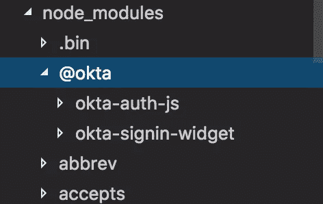
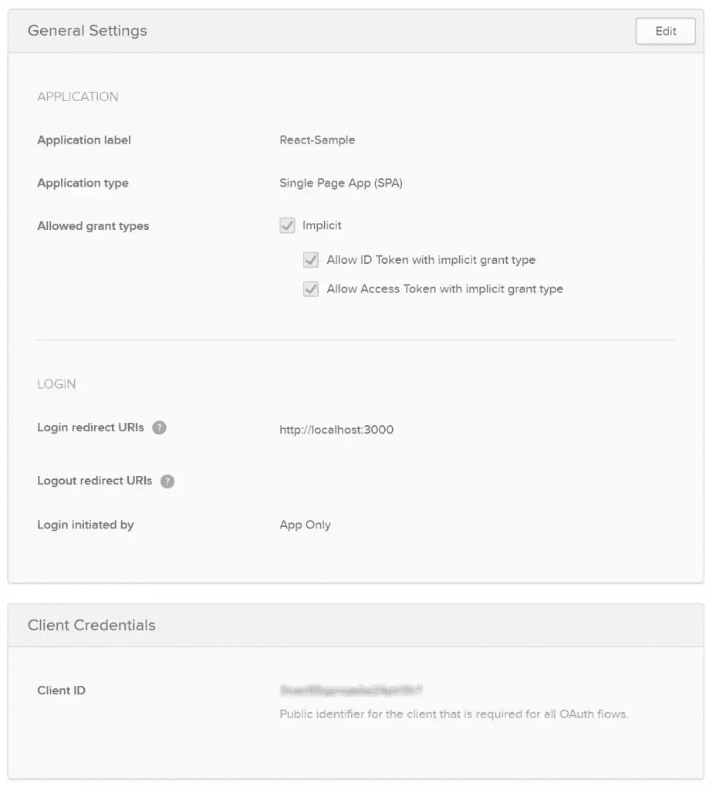
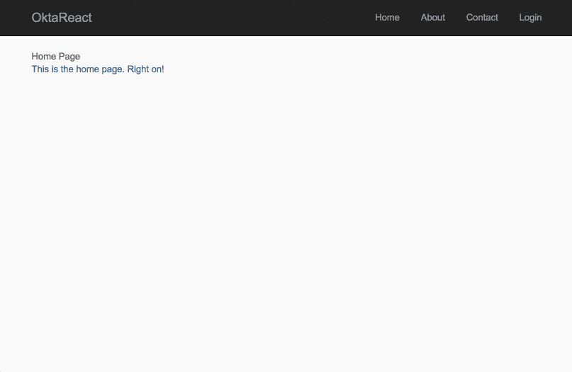

# 在 15 分钟内构建一个带用户身份验证的 React 应用程序

> 原文：<https://www.sitepoint.com/build-react-app-user-authentication-15-minutes/>

*这篇文章最初出现在[OKTA 博客](https://developer.okta.com/blog/2017/03/30/react-okta-sign-in-widget)。感谢您对使 SitePoint 成为可能的合作伙伴的支持。*

React 已经迅速成为最受欢迎的前端 web 框架之一，根据 JAXenter 的说法，它仅次于普通的老式 html 5[。所以毫不奇怪，](https://jaxenter.com/technology-trends-2017-top-frameworks-131993.html)[的开发者正在学习它](https://www.lynda.com/React-js-training-tutorials/7049-0.html)，而[的雇主正在要求它](https://stackoverflow.com/jobs?sort=i&q=ReactJS)。

在本教程中，您将从一个非常简单的 React 应用程序开始，它有几个页面和一些内置的路由，并使用 [Okta 的登录小部件](https://developer.okta.com/code/javascript/okta_sign-in_widget)添加身份验证。Sign-In 小部件是一个可嵌入的 Javascript 小部件，允许开发人员在 React 应用程序中以最少的工作量使用 Okta 的安全、可伸缩的架构。我们开始吧！

## 获取简单的 React 种子项目

从克隆简单的 React 种子项目开始。

```
git clone https://github.com/leebrandt/simple-react-seed.git okta-react-widget-sample
cd okta-react-widget-sample 
```

## 添加 Okta 登录小部件

使用 npm 安装 [Okta 登录小工具](https://github.com/okta/okta-signin-widget)。

```
npm install @okta/okta-signin-widget@2.3.0 --save 
```

这将把 Okta 登录小部件代码添加到您的`node_modules`文件夹中。我们将使用登录小部件的 2.3.0 版本。



然后在 Okta CDN 的`index.html`文件中添加小部件的样式。在`<head>`标签中添加以下几行:

```
 <link
     href="https://ok1static.oktacdn.com/assets/js/sdk/okta-signin-widget/2.3.0/css/okta-sign-in.min.css"
      type="text/css"
      rel="stylesheet"/>

    <!-- Theme file: Customize or replace this file if you want to override our default styles -->
    <link
      href="https://ok1static.oktacdn.com/assets/js/sdk/okta-signin-widget/2.3.0/css/okta-theme.css"
      type="text/css"
      rel="stylesheet"/> 
```

## 登录页面组件

首先，在`./src/components`文件夹中创建一个名为`auth`的文件夹，然后创建一个名为`LoginPage.js`的文件，这个文件将存放`LoginPage`组件。

从最基本的组件开始:

```
import React from 'react';

export default class LoginPage extends React.Component{
  render(){
    return(
      <div>Login Page</div>
    );
  }
} 
```

这个小组件*没有做*太多，但至少你现在有了一个句柄来将`LoginPage`添加到你的路由中。因此，在您的`./src/app.js`文件中，您将在顶部导入组件:

```
import LoginPage from './components/auth/LoginPage'; 
```

然后将该路由添加到主路由中(带有“/”路径的路由)

```
<Route path="/login" component={LoginPage}/> 
```

## 在 Okta 中添加 OpenID Connect 应用程序

为了使用 Okta 作为您的 OpenID 连接提供者进行身份验证，您需要在 [Okta 开发者控制台](https://developer.okta.com)中设置一个应用程序。

如果你没有 Okta 开发者帐号，[去创建一个](https://developer.okta.com/signup/)！登录后，点击顶部导航栏中的**应用**，然后点击**添加应用**。选择 SPA 作为平台，然后单击下一步。将重定向 URI 更改为`http://localhost:3000`，并点击完成。将使用以下设置创建应用程序:



现在您已经在 Okta 中创建了一个应用程序，您可以设置小部件来与您的新应用程序对话！

## 将小部件添加到组件中

```
import React from 'react';
import OktaSignIn from '@okta/okta-signin-widget';

export default class LoginPage extends React.Component{
  constructor(){
    super();
    this.widget = new OktaSignIn({
      baseUrl: 'https://{oktaOrgUrl}',
      clientId: '{clientId}',
      redirectUri: 'http://localhost:3000',
      authParams: {
        responseType: 'id_token'
      }
    });
  }

  render(){
    return(
      <div>Login Page</div>
    );
  }
} 
```

复制从应用程序的设置页面生成的客户端 ID，并将其粘贴到`{clientId}`上。确保您还用 Okta 组织的 URL 替换了`{oktaOrgUrl}`,您可以通过返回到开发人员控制台的主仪表板页面找到它。通常它会看起来像:`https://dev-12345.oktapreview.com`。

到目前为止，您已经从之前安装的 [Okta 登录小部件](https://github.com/okta/okta-signin-widget) `npm`模块中导入了`OktaSignIn`函数。接下来，在组件的构造函数中，您用应用程序的配置初始化了一个`OktaSignIn`的实例。这样，应用程序代码将能够与 Okta 对话，Okta 将识别出这是您刚刚创建的应用程序。

## 显示登录小部件

接下来，您将创建代码来将登录小部件实际呈现到页面上！您需要更改渲染方法来创建一个 HTML 元素，以便将小部件渲染到其中。确保获得一个对将要呈现的元素的[引用。然后，添加一个`componentDidMount`函数，以确保在 HTML 元素出现在页面上之前不要试图呈现小部件。](https://facebook.github.io/react/docs/refs-and-the-dom.html)

```
import React from 'react';
import OktaSignIn from '@okta/okta-signin-widget';

export default class LoginPage extends React.Component{
  constructor(){
    super();
    this.state = {user:null};
    this.widget = new OktaSignIn({
      baseUrl: 'https://{oktaOrgUrl}',
      clientId: '{clientId}',
      redirectUri: 'http://localhost:3000',
      authParams: {
        responseType: 'id_token'
      }
    });
  }

  componentDidMount(){
    this.widget.renderEl({el:this.loginContainer},
      (response) => {
        this.setState({user: response.claims.email});
      },
      (err) => {
        console.log(err);
      }
    );
  }

  render(){
    return(
     <div ref={(div) => {this.loginContainer = div; }} />
    );
  }
} 
```

您还向组件添加了状态。如果您使用 flux 实现，这自然会来自应用程序状态。但是为了使本教程简单，让您的`LoginPage`跟踪它自己的状态。

## 检查用户是否登录

我们就快成功了，但是您不一定想要立即呈现小部件。您需要添加一个检查来确保用户还没有登录，并将您的`renderEl`移至一个名为`showLogin`的函数。

```
 // ...other stuff removed for brevity's sake
 componentDidMount(){
    this.widget.session.get((response) => {
      if(response.status !== 'INACTIVE'){
        this.setState({user:response.login});
      }else{
        this.showLogin();
      }
    });
  }

  showLogin(){
    Backbone.history.stop();
    this.widget.renderEl({el:this.loginContainer},
      (response) => {
        this.setState({user: response.claims.email});
      },
      (err) => {
        console.log(err);
      }
    );
  } 
```

您可能已经注意到了那个`showLogin`方法中一段奇怪的代码。那第一行:`Backbone.history.stop()`。小工具本身使用 [Backbone.js](http://backbonejs.org/) 在它自己的屏幕之间导航(登录，忘记密码，等等。)，当它渲染时，它启动`Backbone.history`。因为现在您已经将它移到了一个`showLogin`函数中，所以每当调用该函数时，小部件都会重新呈现。所以这只是告诉 Backbone 停止历史的一个小技巧，因为当小部件被渲染时，它将重新开始。

## 最终登录页面 react 组件

让我们结束这一切。确保将类的`this`上下文绑定到每个方法。添加一个`logout`方法，并更改您的`render`方法，根据是否有当前登录的用户来决定呈现什么。

所以`LoginPage.js`的最终版本应该是这样的:

```
import React from 'react';
import OktaSignIn from '@okta/okta-signin-widget';

export default class LoginPage extends React.Component{
  constructor(){
    super();
    this.state = { user: null };
    this.widget = new OktaSignIn({
      baseUrl: 'https://{oktaOrgUrl}',
      clientId: '{clientId}',
      redirectUri: 'http://localhost:3000',
      authParams: {
        responseType: 'id_token'
      }
    });

    this.showLogin = this.showLogin.bind(this);
    this.logout = this.logout.bind(this);
  }

  componentDidMount(){
    this.widget.session.get((response) => {
      if(response.status !== 'INACTIVE'){
        this.setState({user:response.login});
      }else{
        this.showLogin();
      }
    });
  }

  showLogin(){
    Backbone.history.stop();
    this.widget.renderEl({el:this.loginContainer},
      (response) => {
        this.setState({user: response.claims.email});
      },
      (err) => {
        console.log(err);
      }
    );
  }

  logout(){
    this.widget.signOut(() => {
      this.setState({user: null});
      this.showLogin();
    });
  }

  render(){
    return(
      <div>
        {this.state.user ? (
          <div className="container">
            <div>Welcome, {this.state.user}!</div>
            <button onClick={this.logout}>Logout</button>
          </div>
        ) : null}
        {this.state.user ? null : (
          <div ref={(div) => {this.loginContainer = div; }} />
        )}
      </div>
    );
  }
} 
```

## 添加登录链接

React 现在可以处理`/login`路线，并显示 Okta 登录小部件来提示用户登录。

通过编辑`./src/components/common/Navigation.js`并在现有联系人链接下添加新链接，将登录链接添加到顶部导航栏:

```
<li><Link to="login">Login</Link></li> 
```

## 仔细讨论

现在安装 npm 软件包:

```
npm install 
```

当你现在运行这个应用程序(用`npm start`)时，你应该会看到这样的内容:



如果应用程序有任何问题，尝试删除`node_modules`文件夹**和**文件`package-lock.json`，并重新运行`npm install`命令。这应该可以修复包依赖管理的任何问题。

如果成功了:恭喜你！如果没有，请用 [okta 标签](http://stackoverflow.com/questions/tagged/okta)向 Stack Overflow 发帖提问，或者在 Twitter [@leebrandt](https://twitter.com/leebrandt) 上联系我。

## React + Okta

你可以在 GitHub 上找到这篇博文[中创建的应用程序的完整版本。](https://github.com/leebrandt/okta-react-widget-sample)

在应用程序中建立身份验证很难。在你构建的每个应用中一遍又一遍的构建就更没意思了。Okta 为您完成了最难的部分，并使开发变得更加有趣！[注册一个永远免费的开发者账户](https://developer.okta.com/signup/)，今天就来试试 Okta 吧！

我希望您喜欢我们 React 支持的快速浏览。如果你对 Okta 的功能有任何疑问，或者我们下一步要做什么，请在 Twitter [@leebrandt](https://twitter.com/leebrandt) 联系我，在下面留下评论，或者在 GitHub 上发表一个问题。

## 分享这篇文章