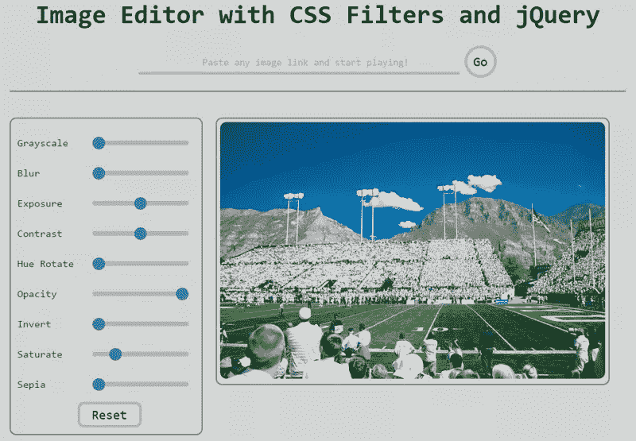

# 用 CSS 过滤器和 jQuery 构建一个简单的图像编辑器

> 原文：<https://www.sitepoint.com/build-simple-image-editor-with-css-filters-jquery/>

CSS 滤镜是一个强大的工具，可以只用 CSS 来处理图像。一旦在所有浏览器中实现，你将能够在不需要任何外部软件的情况下对图像应用效果。

CSS 过滤器本身就是一个巨大的话题，我不打算在这里讨论所有可用的过滤器。我要讲的是如何使用多种滤镜来产生一种复杂的效果——并制作你自己的图像编辑器。

如果你想更深入地挖掘，请随意查看 MDN 上的[过滤器](https://developer.mozilla.org/en-US/docs/Web/CSS/filter)或 HTML5 Rocks 上的[了解 CSS 过滤器效果](http://www.html5rocks.com/en/tutorials/filters/understanding-css/)，这两篇文章都更详细地讨论了过滤器的一般主题。

## CSS 过滤器语法

要在你的 CSS 中写一个滤镜效果，只需使用`filter:`和滤镜名称(如`grayscale`、`blur`等)。).

```
.example {
  filter: <filter-function> [<filter-function>];
}
```

以下是如何将 90% `grayscale`滤镜应用到元素的方法:

```
.example {
  filter: grayscale(90%);
}
```

对于 webkit 浏览器，您需要一个前缀:

```
.example {
  -webkit-filter: grayscale(90%);
}
```

筛选器属性的值通常介于 0 和 1 之间，但也有一些例外。例如，`blur`属性使用像素单位，可以是任何整数。另外，`hue-rotate`过滤器值是一个以“deg”为单位的整数。

```
.example {
  filter: blur(10px);
}

.example-2 {
  filter: hue-rotate(90deg);
}
```

## 组合多个过滤器

您可以组合任意数量的函数来操纵渲染。但是，如果您想要应用多个滤镜效果，可以通过在单个声明中用空格分隔它们来实现。下面是如何组合`grayscale`和`blur`:

```
.example {
  filter: grayscale(0.5) blur(10px);
}
```

## 构建图像编辑器

我们的图像编辑器将有两个部分:

1.  URL 字段和图像容器，允许通过外部 URL 加载图像。
2.  控件，它们是滑块，可以对加载的图像应用不同的效果。

### URL 字段和图像容器

我们将使用两个表单元素来请求图像 URL:一个文本输入和一个按钮。然后，我们将在我们的`imageContainer` div 中加载出现在 URL 上的图像。

这是 HTML:

```
<!-- Form for collecting image URL -->
<form id="urlBox" class="center">
    <input class="url-box" type="url" id="imgUrl">
    <input id="go" type="button" value="Go">
</form>

<!-- container where image will be loaded-->
<div id="imageContainer" class="center">
    
</div>
```

下面是 jQuery:

```
// adding an image via url box
function addImage(e) {
    var imgUrl = $('#imgUrl').val();
    if (imgUrl.length) {
        $('#imageContainer img').attr('src', imgUrl);
    }
    e.preventDefault(); 
}

// on click of go(submit) button, addImage() will be called
$('#go').click(addImage);

// on pressing return(enter), addImage() will be called
$('#urlBox').submit(addImage);
```

### 控制

这是我们应用程序的核心，我们将在这里对原始图像进行操作，将其转换为不同的图像。

为了获取不同过滤器的值，我们将使用范围选择器。这将允许我们立即看到我们的变化的效果。下面是添加两个范围选择器的代码——一个用于`grayscale`，另一个用于`blur`(为了简单起见，这里只有两个例子，但原始代码有 9 个选项):

这是 HTML:

```
<!--Controls for CSS filters via range input-->
<form id="imageEditor">
    <p>
        <label for="gs">Grayscale</label>
        <input id="gs" name="gs" type="range" min="0" max="100" value="0">
    </p>

    <p>
        <label for="blur">Blur</label>
        <input id="blur" name="blur" type="range" min="0" max="10" value="0">
    </p> 
</form>
```

每当滑块值改变时，要将改变的效果应用于 CSS 过滤器，下面是 jQuery:

```
// Editing image via css properties
function editImage() {
    var gs = $('#gs').val(); // grayscale
    var blur = $('#blur').val(); // blur

  $('#imageContainer img').css('-webkit-filter', 
                               'grayscale(' + gs + '%) blur(' + blur + 'px');
}

// When sliders change, image will be
// updated via the editImage() function 
$('input[type=range]').change(editImage).mousemove(editImage);
```

每当调整滑块时，就会调用`editImage()`功能。`editImage()`首先将滑块的值存储在各自的变量(`gs`和`blur`)中，然后将它们应用到图像中。

这里需要记住的重要一点是你所应用的具体`filter`的单位。正如你在上面的代码中看到的，对于`grayscale()`滤镜是“%”，对于`blur()`滤镜是“px”。

现在你可以在上面的代码基础上添加所有的过滤器，并拥有自己的小图片编辑器。

## 演示和完整代码

您可以在此查看所有 9 个滤镜正在运行的[最终图像编辑器。或者在 GitHub](http://codepen.io/SitePoint/full/KwmeJZ/) 上下载演示[的完整代码。](https://github.com/lalwanivikas/image-editor)

[](http://codepen.io/SitePoint/full/KwmeJZ/)

既然您已经意识到 CSS 为您提供的操纵图像的所有能力，那么您肯定应该在下一个项目中尝试一下`filter`属性。如果您有兴趣，您可以继续尝试将以下功能添加到[当前应用](https://github.com/lalwanivikas/image-editor)中，使其更加有用:

*   从桌面上传图像的选项。
*   选项下载修改后的图像。

随意[分叉并发送拉取请求](https://github.com/lalwanivikas/image-editor)。乐于合作！

## 分享这篇文章