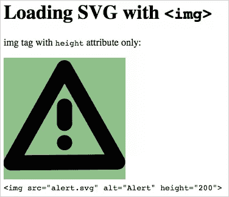
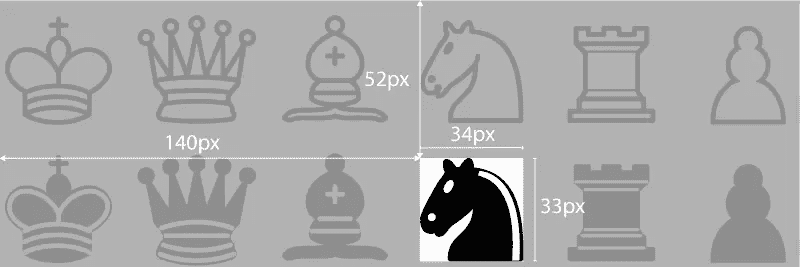

# 构建您自己的 SVG 图标

> 原文：<https://www.sitepoint.com/build-svg-icons/>

Web 字体是将灵活的图标系统集成到 web 项目中的一种简单方法，而不会牺牲与传统浏览器的兼容性。自从在线工具如 Icomoon 或 T2 Fontello 出现后，构建网络字体的技术过程也变得简单多了。

但是 HTML5 给我们带来了在网页上使用图标的更多样的方式:SVG——可缩放矢量图形。

SVG 的基本特性现在被几乎所有的浏览器广泛支持(看看[caniuse.com](https://caniuse.com/#search=svg))，所以现在不使用它的理由少了很多。

如果你需要支持 Explorer 8，你可以使用一些非常简单的方法。

## 绘图图标

这一步和你可以在[我的关于网络字体的文章](https://www.sitepoint.com/create-an-icon-font-illustrator-icomoon/)中读到的完全一样，看一看关于准备你的图标的更多细节。


当您的 SVG 文件准备就绪时，您将需要一个方法来将它们包含在您的项目中。

让我们看看我们现有的选择。

## 使用``标签

这是一个非常基本的解决方案，尽管它并不真正适合我们的范围，但它给我们带来了一些有趣的考虑。

它只需要一个简单的`img`标签，你可能已经用了一千个 jpg、gif 和 png。



这是使用 SVG 文件的一种非常简单的方法；您可以使用`width`和/或`height`属性根据需要控制图像大小，但不能控制颜色。

这项技术[与所有现代浏览器](https://caniuse.com/#feat=svg-img)完全兼容，除了 IE8(和更老的 IE)和早期型号的 Android 手机。在某些情况下，正确显示需要`width`和`height`。

### IE8 回落

如果您需要，有许多方法可以提供传统浏览器的兼容性。在每种情况下，您都需要提供 PNG 文件来替换您的 SVG。

就个人而言，我更喜欢一种优雅的降级技术，它要求所有文件使用相同的名称并共享相同的路径。它也需要现代化。

几行 javascript 就能搞定:

```
if(!Modernizr.svg) {
	var imgs = document.getElementsByTagName('img');
	for(var i = 0; i < imgs.length; i++) {
		var  this_src = imgs[i].src;	
		if(this_src.match(/(\.svg)$/)) {
			imgs[i].src = this_src.replace(/(\.svg)$/, '.png');
		}
	}
}
```

这种技术——以及一些变体——在本文中都有介绍: [SVG 回退 PNG 图像](https://callmenick.com/2014/04/02/svg-fallback-with-png/)。

Alexey Ten 描述了另一个非常聪明的解决方案，Chris Coyier 在他的 [SVG Fallbacks](https://css-tricks.com/svg-fallbacks/) 文章中也提到了这个方案。

您还可以使用`object`或`iframe`标签加载 SVG 图像。每一种都提供了加载回退图像的仅标记方式:

```
<object data="svg_image.svg" type="image/svg+xml">
	<!-- the following image is displayed if browser can't load svg image -->
	
</object>
```

看看我的 [embedding SVG codepen](https://codepen.io/massimo-cassandro/pen/raWYRw) 对当前所有嵌入方法的概述。

### 使用 SVG 链接增强`img`标签

SVG 文件的基本用法`img`可以通过使用**片段标识符**来增强。

片段标识符是一个内置的 SVG 属性:我们可以使用一个 *SVG 视图规范*或者通过它的`<view>` ID 寻址一个 SVG 元素来引用一个 SVG 部分。

第一种方法是在加载 SVG 文件时指定一个[视图框](https://www.w3.org/TR/SVG/coords.html#ViewBoxAttribute)。

```

```

其中`x,y,w,h`表示从文件原点( *x* 和 *y* )的片段坐标，以及片段宽度和高度( *w* 和 *h* )。

例如，为了只显示这个棋子精灵(来自[维基共享资源](https://commons.wikimedia.org/wiki/File:Chess_Pieces_Sprite.svg))中的*黑马*，你必须检测值，就像下面的方案一样:



它可能会让你想起一些网站用于用户界面元素的“CSS 图像精灵”技术。

您可以在这里看到结果:

参见 [CodePen](https://codepen.io) 上马西莫·卡珊德拉([@马西莫-卡珊德拉](https://codepen.io/massimo-cassandro))的 Pen [svg img +片段标识符](https://codepen.io/massimo-cassandro/pen/OPbzRV/)。