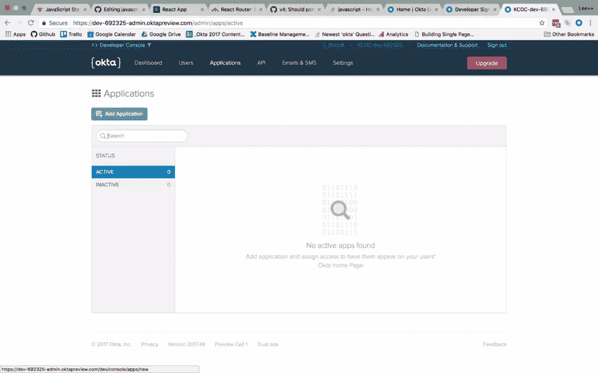
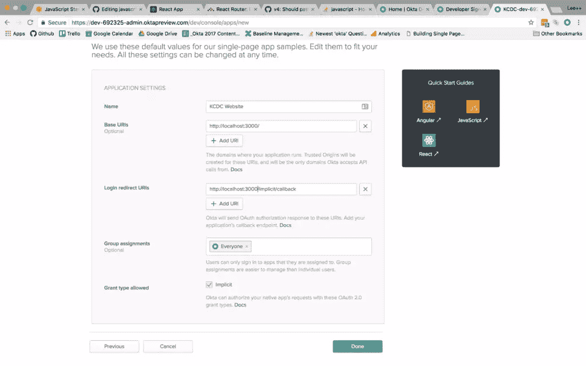
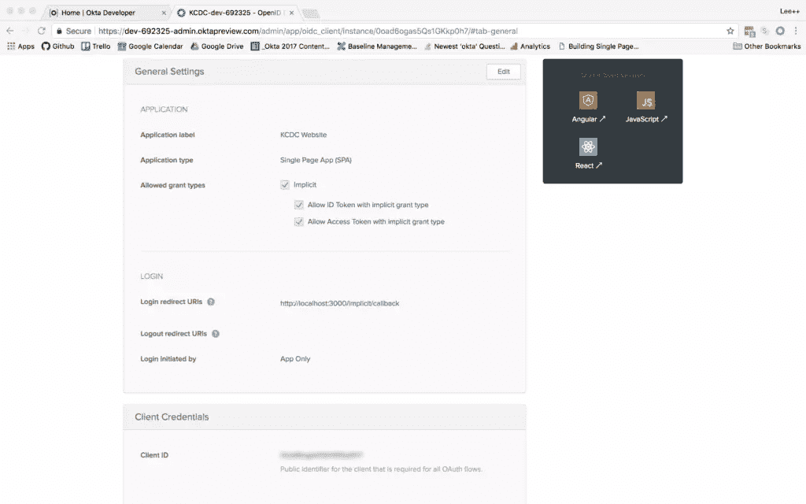
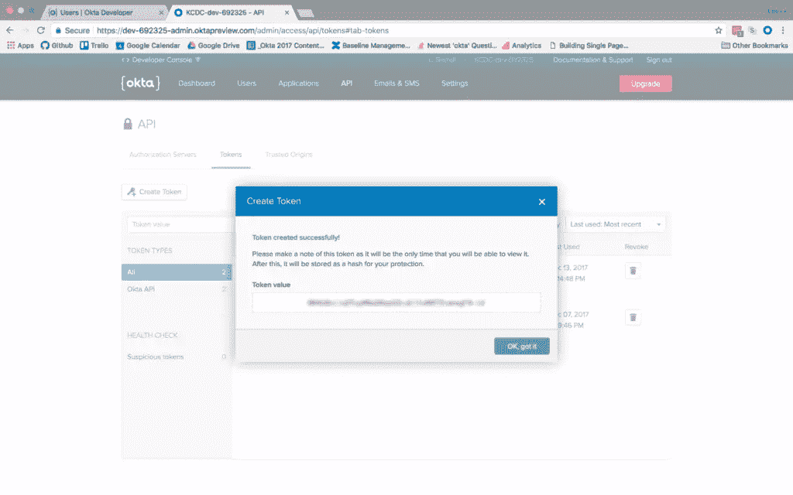
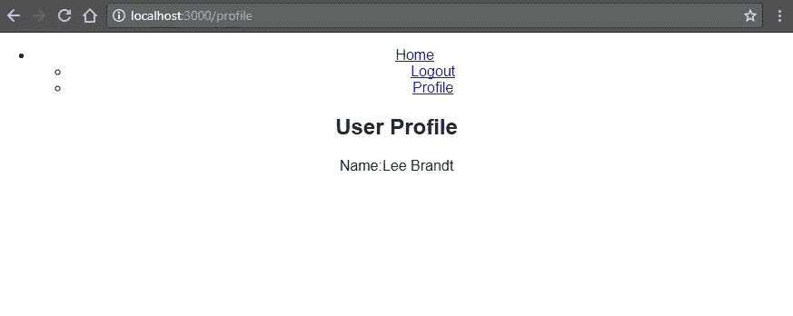

# 用 Node、React 和 Okta 构建用户注册

> 原文：<https://www.sitepoint.com/build-user-registration-with-node-react-and-okta/>

*这篇文章最初发表在[Okta 开发者博客](https://developer.okta.com/blog/2018/02/06/build-user-registration-with-node-react-and-okta)上。感谢您对使 SitePoint 成为可能的合作伙伴的支持。*

今天的互联网用户期望个性化的体验。开发者必须学会开发提供个性化体验的网站，同时保持用户信息的私密性。现代 web 应用程序也倾向于具有服务器端 API 和客户端用户界面。让两端都知道当前登录的用户是一个挑战。在本教程中，我将带您建立一个为 React UI 提供信息的节点 API，并构建一个用户注册来保存用户的私有信息。

在本教程中，我不会使用任何像 Redux 或 ReduxThunk 这样的状态管理库。在一个更健壮的应用程序中，您可能希望这样做，但是将 Redux 和 ReduxThunk 连接起来，然后添加这里使用的`fetch`语句作为您的 Thunk，这将是很容易的。为了简单起见，也为了让本文专注于添加用户管理，我将把 fetch 语句添加到`componentDidMount`函数中。

## 安装节点和反应先决条件

要设置基本应用程序，请确保安装了以下基本工具:

*   节点(8+)
*   国家预防机制(5+)
*   创建-反应-应用程序(npm 包)
*   快速发电机(npm 包)

你还需要一个 Okta 开发者账户。

要安装 Node 和 npm，您可以按照位于[https://nodejs.org/en/](https://nodejs.org/en/)的操作系统的说明进行操作。

然后用 npm 命令行安装这两个 npm 包:

```
npm i -g create-react-app express-generator 
```

现在，您已经准备好设置基本的应用程序结构了。

## 搭建基础应用程序

转到您希望应用程序所在的文件夹，并为其创建一个新文件夹:

```
mkdir MembershipSample
cd MembershipSample
express api
create-react-app client 
```

这将在`MembershipSample`文件夹中创建两个名为`api`和`client`的文件夹，在`api`文件夹中有一个 NodeJS 和 Express 应用程序，在`client`文件夹中有一个 base React 应用程序。因此，您的文件夹结构将如下所示:

*   成员样本
    *   美国石油学会(American Petroleum Institute)
    *   客户

为了使下一部分更容易，打开两个端子或端子接头；一个到 express 应用程序文件夹`api`，另一个到 React 应用程序文件夹`client`。

默认情况下，React 应用程序和 Node 应用程序在开发过程中都将在端口 3000 上运行，因此您需要让 API 在不同的端口上运行，然后在客户端应用程序中代理它。

在`api`文件夹中，打开`/bin/www`文件，并将 API 将要运行的端口更改为`3001`。

```
/**
 * Get port from environment and store in Express.
 */

var port = normalizePort(process.env.PORT || '3001');
app.set('port', port); 
```

然后在客户机应用程序中为 API 设置代理，这样您仍然可以调用`/api/{resource}`并将其从端口 3000 代理到端口 3001。在`client/package.json`文件中，在`name`下面添加`proxy`设置:

```
"name": "client",
"proxy": "http://localhost:3001" 
```

最后，不要忘记为每个子文件夹(`api`和`client`)运行`npm install`或`yarn install`，以确保安装了依赖项。

现在，您可以通过在 API 和客户端应用程序的适当文件夹中运行`npm start`或`yarn start`来运行这两个应用程序。

## 添加 Okta 应用程序

如果你还没有这样做，在[https://developer.okta.com/signup/](https://developer.okta.com/signup/)创建一个免费的永久开发者账户。

注册完成后，点击顶部菜单中的**应用程序**。然后点击**添加应用**按钮。



然后，您将被带到应用程序创建向导。选择**单页 App** 按钮，点击底部的**下一步**。


在下一个屏幕上，您将看到单页应用程序模板提供的默认设置。将应用程序的名称改为更具描述性的名称，如“成员资格应用程序”。此外，将基本 URIs 和登录重定向 URIs 设置更改为使用端口 3000，因为这是您的应用程序将运行的地方。其余的默认设置都没问题。



然后点击底部的 **Done** 按钮。

创建应用程序后，从应用程序列表中选择它，并点击**常规**选项卡查看应用程序的常规设置。



在底部，你会看到一个**客户端 ID** 设置(显然你的不会被模糊掉)。将它复制到 React 应用程序中使用。您还需要 Okta 组织的 URL，可以在仪表板页面的左上方找到。它可能看起来像“https://dev-XXXXXX . oktapreview . com”。

## 向 ReactJS 应用程序添加身份验证

现在已经创建了应用程序，通过添加几个 npm 依赖项，使用 Okta 添加身份验证。从`client`文件夹运行:

```
npm install @okta/okta-react react-router-dom --save 
```

或者，如果您正在使用[纱线](https://yarnpkg.com)包装管理器:

```
yarn add @okta/okta-react react-router-dom 
```

将名为`app.config.js`的文件添加到`client/src`文件夹中。该文件的内容是:

```
export default {
  url: '{yourOktaDomain}',
  issuer: '{yourOktaOrgUrl}/oauth2/default',
  redirect_uri: window.location.origin + '/implicit/callback',
  client_id: '{yourClientID}'
} 
```

然后设置`index.js`文件使用 React 路由器和 Okta 的 React SDK。当`index.js`文件完成时，它看起来像这样:

```
import React from 'react';
import ReactDOM from 'react-dom';
import { BrowserRouter as Router } from 'react-router-dom';
import { Security } from '@okta/okta-react';

import './index.css';
import config from './app.config';
import App from './App';
import registerServiceWorker from './registerServiceWorker';

function onAuthRequired({ history }) {
  history.push('/login');
}

ReactDOM.render(
  <Router>
    <Security issuer={config.issuer}
      client_id={config.client_id}
      redirect_uri={config.redirect_uri}
      onAuthRequired={onAuthRequired}>
      <App />
    </Security>
  </Router>,
  document.getElementById('root')
);
registerServiceWorker(); 
```

完成后，您将添加 React 路由器中的`BrowserRouter`组件(别名为“Router”)和 Okta React SDK 中的`Security`组件。另外，`app.config.js`文件被导入为“config ”,这样您就可以使用`Security`组件所需的属性中的配置值。

您还可以用`Router`和`Security`组件包围`App`组件，并传入指定的值。`onAuthRequired`方法，简单地告诉 Okta 的 React SDK，当有人试图访问一个安全的路由并且他们没有登录时，将他们重定向到登录页面。

其他的一切都来自您之前运行的`create-react-app`命令。

## 向 ReactJS 应用程序添加页面

在向 React 应用程序添加任何路由之前，创建一些组件来处理您想要添加的路由。

向`client/src`文件夹添加一个`components`文件夹。这是您所有组件的所在位置，也是组织它们的最简单方式。然后为你的主页组件创建一个`home`文件夹。目前只有一个，但以后可能会有更多的组件只用于主页。在文件夹中添加一个`HomePage.js`文件，内容如下:

```
import React from 'react';

export default class HomePage extends React.Component{
  render(){
    return(
      <h1>Home Page</h1>
    );
  }
} 
```

这是你目前真正需要的主页。最重要的一点是让 HomePage 组件成为一个类类型。尽管现在它只包含一个标签`h1`,但这意味着它是一个“页面”,这意味着它可能包含其他组件，所以它是一个容器组件是很重要的。

接下来，在`components`中创建一个`auth`文件夹。这是所有与身份验证有关的组件将存在的地方。在那个文件夹中，创建一个`LoginForm.js`文件。

首先要注意的是，您将使用 Okta 的 React SDK 中的`withAuth`高阶组件来包装整个登录表单。这为名为`auth`的组件添加了一个道具，使得在那个更高阶的组件上访问像`isAuthenticated`和`redirect`函数这样的东西成为可能。

`LoginForm`组件的代码如下:

```
import React from 'react';
import OktaAuth from '@okta/okta-auth-js';
import { withAuth } from '@okta/okta-react';

export default withAuth(class LoginForm extends React.Component {
  constructor(props) {
    super(props);
    this.state = {
      sessionToken: null,
      error: null,
      username: '',
      password: ''
    }

    this.oktaAuth = new OktaAuth({ url: props.baseUrl });

    this.handleSubmit = this.handleSubmit.bind(this);
    this.handleUsernameChange = this.handleUsernameChange.bind(this);
    this.handlePasswordChange = this.handlePasswordChange.bind(this);
  }

  handleSubmit(e) {
    e.preventDefault();
    this.oktaAuth.signIn({
      username: this.state.username,
      password: this.state.password
    })
      .then(res => this.setState({
        sessionToken: res.sessionToken
      }))
      .catch(err => {
        this.setState({error: err.message});
        console.log(err.statusCode + ' error', err)
      });
  }

  handleUsernameChange(e) {
    this.setState({ username: e.target.value });
  }

  handlePasswordChange(e) {
    this.setState({ password: e.target.value });
  }

  render() {
    if (this.state.sessionToken) {
      this.props.auth.redirect({ sessionToken: this.state.sessionToken });
      return null;
    }

    const errorMessage = this.state.error ? 
    <span className="error-message">{this.state.error}</span> : 
    null;

    return (
      <form onSubmit={this.handleSubmit}>
        {errorMessage}
        <div className="form-element">
          <label>Username:</label>
          <input
            id="username" type="text"
            value={this.state.username}
            onChange={this.handleUsernameChange} />
        </div>

        <div className="form-element">
          <label>Password:</label>
          <input
            id="password" type="password"
            value={this.state.password}
            onChange={this.handlePasswordChange} />
        </div>
        <input id="submit" type="submit" value="Submit" />
      </form>
    );
  }
}); 
```

这里需要注意的另一件事是正在导入的`OktaAuth`库。这是一个基本库，用于使用您之前创建的 Okta 应用程序进行登录等操作。您会注意到在构造函数中创建了一个`OktaAuth`对象，该对象传递了一个`baseUrl`属性。这是您的`app.config.js`文件中发行者的 URL。`LoginForm`组件应该包含在另一个组件中，所以您必须创建一个`LoginPage.js`文件来包含这个组件。您将再次使用`withAuth`高阶组件来访问`isAuthenticated`函数。`LoginPage.js`的内容将是:

```
import React, { Component } from 'react';
import { Redirect } from 'react-router-dom';
import LoginForm from './LoginForm';
import { withAuth } from '@okta/okta-react';

export default withAuth(class Login extends Component {
  constructor(props) {
    super(props);
    this.state = { authenticated: null };
    this.checkAuthentication = this.checkAuthentication.bind(this);
    this.checkAuthentication();
  }

  async checkAuthentication() {
    const authenticated = await this.props.auth.isAuthenticated();
    if (authenticated !== this.state.authenticated) {
      this.setState({ authenticated });
    }
  }

  componentDidUpdate() {
    this.checkAuthentication();
  }

  render() {
    if (this.state.authenticated === null) return null;
    return this.state.authenticated ?

      <Redirect to={{ pathname: '/profile' }} /> :
      <LoginForm baseUrl={this.props.baseUrl} />;

  }
}); 
```

虽然它比登录表单组件中的要少一些，但是这里仍然有一些重要的部分需要指出。

同样，您使用的是`withAuth`高阶组件。对于每个需要使用 Okta 的认证或授权过程的组件来说，这将是一个反复出现的主题。在这种情况下，它主要用于获取`isAuthenticated`函数。在构造函数和`componentDidUpdate`生命周期方法中执行`checkAuthentication()`方法，以确保在创建组件时对其进行检查，并对组件的每个后续更改进行再次检查。

当`isAuthenticated`返回 true 时，那么它被设置在组件的状态中。然后在 render 方法中检查它，以决定是显示`LoginForm`组件，还是重定向到用户的个人资料页面，这是您接下来要创建的组件。

现在在`auth`文件夹中创建`ProfilePage.js`组件。该组件的内容包括:

```
import React from 'react';
import { withAuth } from '@okta/okta-react';

export default withAuth(class ProfilePage extends React.Component {
  constructor(props){
    super(props);
    this.state = { user: null };
    this.getCurrentUser = this.getCurrentUser.bind(this);
  }

  async getCurrentUser(){
    this.props.auth.getUser()
      .then(user => this.setState({user}));
  }

  componentDidMount(){
    this.getCurrentUser();
  }

  render() {
    if(!this.state.user) return null;
    return (
      <section className="user-profile">
        <h1>User Profile</h1>
        <div>
          <label>Name:</label>
          <span>{this.state.user.name}</span>
        </div>
      </section>

    )
  }
}); 
```

这里的`withAuth`组件让您可以访问`getUser`函数。这里，它是从`componentDidMount`调用的，这是一个用于提取将在`render`方法中使用的数据的公共位置。您可能会看到的唯一奇怪的事情是`render`方法的第一行，在真正有一个用户从`getUser`异步调用返回之前，它什么也不呈现。一旦状态中有一个用户，它就会呈现配置文件内容，在本例中，它只显示当前登录的用户名。

接下来，您将添加一个注册组件。这可以像登录表单一样完成，其中有一个包含在`LoginPage`组件中的`LoginForm`组件。为了演示另一种显示方式，您只需创建一个`RegistrationForm`组件，它将成为主容器组件。在`auth`文件夹下创建一个`RegistrationForm.js`文件，内容如下:

```
import React from 'react'; 
import OktaAuth from '@okta/okta-auth-js';
import { withAuth } from '@okta/okta-react';

import config from '../../app.config';

export default withAuth(class RegistrationForm extends React.Component{
  constructor(props){
    super(props);
    this.state = {
      firstName: '',
      lastName: '',
      email: '',
      password: '',
      sessionToken: null
    };
    this.oktaAuth = new OktaAuth({ url: config.url });
    this.checkAuthentication = this.checkAuthentication.bind(this);
    this.checkAuthentication();

    this.handleSubmit = this.handleSubmit.bind(this);
    this.handleFirstNameChange = this.handleFirstNameChange.bind(this);
    this.handleLastNameChange = this.handleLastNameChange.bind(this);
    this.handleEmailChange = this.handleEmailChange.bind(this);
    this.handlePasswordChange = this.handlePasswordChange.bind(this);    
  }

  async checkAuthentication() {
    const sessionToken = await this.props.auth.getIdToken();
    if (sessionToken) {
      this.setState({ sessionToken });
    }
  }

  componentDidUpdate() {
    this.checkAuthentication();
  }

  handleFirstNameChange(e){
    this.setState({firstName:e.target.value});
  }
  handleLastNameChange(e) {
    this.setState({ lastName: e.target.value });
  }
  handleEmailChange(e) {
    this.setState({ email: e.target.value });
  }
  handlePasswordChange(e) {
    this.setState({ password: e.target.value });
  }

  handleSubmit(e){
    e.preventDefault();
    fetch('/api/users', { 
      method: 'POST', 
      headers: {
        'Accept': 'application/json',
        'Content-Type': 'application/json',
      },
      body: JSON.stringify(this.state)
    }).then(user => {
      this.oktaAuth.signIn({
        username: this.state.email,
        password: this.state.password
      })
      .then(res => this.setState({
        sessionToken: res.sessionToken
      }));
    })
    .catch(err => console.log);
  }

  render(){
    if (this.state.sessionToken) {
      this.props.auth.redirect({ sessionToken: this.state.sessionToken });
      return null;
    }

    return(
      <form onSubmit={this.handleSubmit}>
        <div className="form-element">
          <label>Email:</label>
          <input type="email" id="email" value={this.state.email} 
          onChange={this.handleEmailChange}/>
        </div>
        <div className="form-element">
          <label>First Name:</label>
          <input type="text" id="firstName" value={this.state.firstName} 
          onChange={this.handleFirstNameChange} />
        </div>
        <div className="form-element">
          <label>Last Name:</label>
          <input type="text" id="lastName" value={this.state.lastName} 
          onChange={this.handleLastNameChange} />
        </div>
        <div className="form-element">
          <label>Password:</label>
          <input type="password" id="password" value={this.state.password} 
          onChange={this.handlePasswordChange} />
        </div>
        <input type="submit" id="submit" value="Register"/>
      </form>
    );
  }

}); 
```

这个组件看起来很像`LoginForm`组件，除了它调用节点 API(稍后将构建)来处理注册。节点 API 完成注册后，组件将新创建的用户登录，render 方法(当它看到状态中的会话标记时)将用户重定向到应用程序的主页。

您可能还会注意到组件状态的`sessionToken`属性。这是由`handleSubmit()`函数设置的，用于在注册成功时处理登录。然后，一旦登录完成，并且收到一个令牌，`render()`方法也会使用它来进行重定向。

## 向 React 应用程序添加路线

首先，为将要添加的路线添加一个导航组件。在`client/src/components`文件夹中，添加一个名为`shared`的文件夹。这将是应用程序中几个地方使用的所有组件的位置。在这个新文件夹中，添加一个名为`Navigation.js`的文件。该文件包含一个基本组件，其中包含应用程序中所有页面的链接。

您需要将导航组件包装在`withAuth`高阶组件中。这样，您可以检查是否有经过身份验证的用户，并根据需要显示登录或注销按钮。

```
import React from 'react';
import { Link } from 'react-router-dom';
import { withAuth } from '@okta/okta-react';

export default withAuth(class Navigation extends React.Component {
  constructor(props) {
    super(props);
    this.state = { authenticated: null };
    this.checkAuthentication = this.checkAuthentication.bind(this);
    this.checkAuthentication();
  }

  async checkAuthentication() {
    const authenticated = await this.props.auth.isAuthenticated();
    if (authenticated !== this.state.authenticated) {
      this.setState({ authenticated });
    }
  }

  componentDidUpdate() {
    this.checkAuthentication();
  }

  render() {
    if (this.state.authenticated === null) return null;
    const authNav = this.state.authenticated ?
      <ul className="auth-nav">
        <li><a href="javascript:void(0)" onClick={this.props.auth.logout}>Logout</a></li>
        <li><Link to="/profile">Profile</Link></li>
      </ul> :
      <ul className="auth-nav">
        <li><a href="javascript:void(0)" onClick={this.props.auth.login}>Login</a></li>
        <li><Link to="/register">Register</Link></li>
      </ul>;
    return (
      <nav>
        <ul>
          <li><Link to="/">Home</Link></li>
          {authNav}
        </ul>
      </nav>
    )
  }
}); 
```

现在，您已经有了可以处理所有路由的组件，可以创建路由了。更新`App.js`文件，使最终版本如下所示:

```
import React, { Component } from 'react';
import { Route } from 'react-router-dom';
import { SecureRoute, ImplicitCallback } from '@okta/okta-react';

import Navigation from './components/shared/Navigation';
import HomePage from './components/home/HomePage';
import RegistrationForm from './components/auth/RegistrationForm';
import config from './app.config';
import LoginPage from './components/auth/LoginPage';
import ProfilePage from './components/auth/ProfilePage';
import './App.css';

export default class App extends Component {
  render() {
    return (
      <div className="App">
        <Navigation />
        <main>
          <Route path="/" exact component={HomePage} />
          <Route path="/login" render={() => <LoginPage baseUrl={config.url} />} />
          <Route path="/implicit/callback" component={ImplicitCallback} />
          <Route path="/register" component={RegistrationForm} />
          <SecureRoute path="/profile" component={ProfilePage} />
        </main>
      </div>
    );
  }
} 
```

这里有几件值得注意的事情。从 Okta 的 React SDK 导入`SecureRoute`和`ImplicitCallback`组件。`ImplicitCallback`组件处理来自认证流的回调，以确保 React 应用程序中有一个端点来捕捉来自 Okta 的返回调用。`SecureRoute`组件允许您保护任何路由并将未经验证的用户重定向到登录页面。

React Router 的`Route`组件做的正是您所期望的:它获取用户导航到的路径，并设置一个组件来处理该路径。`SecureRoute`组件进行额外的检查，以确保用户在允许访问该路线之前已经登录。如果不是，那么将调用`index.js`中的`onAuthRequired`函数，强制用户进入登录页面。

这里唯一奇怪的是登录路径的路由。它不是简单地设置一个组件来处理路径，而是运行一个`render`方法来呈现`LoginPage`组件并从配置中设置 baseUrl。

## 向节点应用程序添加 API 端点

您可能还记得节点 API 正在进行注册，因此您需要将端点添加到节点应用程序来处理该调用。为此，您需要添加 Okta 的 Node SDK。从“api”文件夹运行:

```
npm install @okta/okta-sdk-nodejs --save 
```

然后，您将更改`api/routes`中的`users.js`文件。该文件将类似于:

```
const express = require('express');
const router = express.Router();
const oktaClient = require('../lib/oktaClient');

/* Create a new User (register). */
router.post('/', (req, res, next) => {
  if (!req.body) return res.sendStatus(400);
  const newUser = {
    profile: {
      firstName: req.body.firstName,
      lastName: req.body.lastName,
      email: req.body.email,
      login: req.body.email
    },
    credentials: {
      password: {
        value: req.body.password
      }
    }
  };
  oktaClient.createUser(newUser)
    .then(user => {
      res.status(201);
      res.send(user);
    })
    .catch(err => {
      res.status(400);
      res.send(err);
    })
});

module.exports = router; 
```

这里最值得注意的是`lib/oktaClient`的导入(稍后将添加)、对`oktaClient`上的`createUser`函数的调用以及`newUser`对象的形状。Okta 的 API 文档中记录了`newUser`物体的形状[。](https://developer.okta.com/docs/api/resources/users)

为了让节点应用程序调用 Okta 应用程序，它需要一个 API 令牌。要创建一个令牌，请进入 Okta 开发者仪表板，将鼠标悬停在 API 菜单选项上，然后单击令牌。


在那里，单击创建令牌。为令牌命名，如“Membership ”,然后单击“Create Token”。



将令牌复制到一个安全的位置供以后使用。

在节点应用程序中名为`lib`的新文件夹中创建一个名为`oktaClient.js`的文件。该文件将使用您刚刚创建的 API 令牌从 Okta 的节点 SDK 配置一个`Client`对象，如下所示:

```
const okta = require('@okta/okta-sdk-nodejs');

const client = new okta.Client({
  orgUrl: '{yourOktaDomain}',
  token: '{yourApiToken}'
});

module.exports = client; 
```

在 Node 应用程序根目录下的`app.js`文件中，更新文件以将所有呼叫路由到`/api/<something>`。您会在`app.use`语句块下面看到一个部分。更改路线设置，使其看起来像这样:

```
app.use('/api', index);
app.use('/api/users', users); 
```

如果您的节点应用程序仍在运行，您将需要停止应用程序(用 CTRL+C)并重新运行它(用`npm start`)以使更新生效。

尽管该网站仍然需要一些严肃的风格，你现在可以注册用户，用新创建的用户登录，并在个人资料页面上显示登录用户的个人资料！



## 了解更多信息

如果您想进一步了解本文中使用的技术，可以查看以下文档:

*   Okta 的[节点 SDK](https://developer.okta.com/okta-sdk-nodejs/jsdocs/index.html)
*   Okta 的 [React SDK](https://developer.okta.com/code/react/) 。

此外，查看使用 Okta 进行身份验证的其他文章:

*   Randall Degges 在一个简单节点网站上关于 Okta 的文章
*   我的文章使用了 React 中的 [Okta 登录小部件](https://developer.okta.com/blog/2017/03/30/react-okta-sign-in-widget)
*   Matt Raible 关于[渐进式网络应用](https://developer.okta.com/blog/2017/07/20/the-ultimate-guide-to-progressive-web-applications)的文章

和往常一样，如果你对这篇文章有任何问题、评论或担忧，你可以发电子邮件给我，地址是[lee.brandt@okta.com](mailto:lee.brandt@okta.com)，或者把你的问题发到[开发者论坛](https://devforum.okta.com)。更多文章和教程，请关注我们的 Twitter [@OktaDev](https://twitter.com/oktadev) 。

## 分享这篇文章