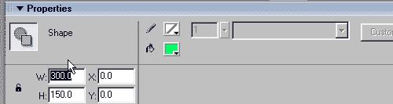
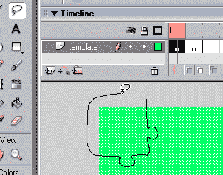
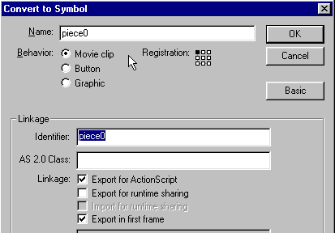
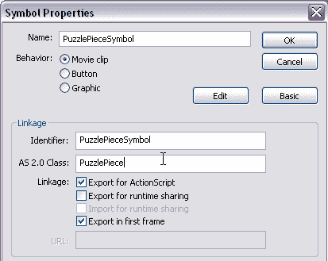
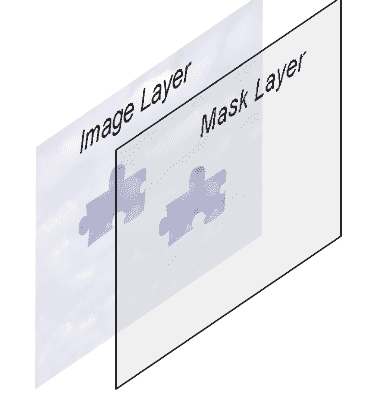

# 在 Flash 中构建视频拼图

> 原文：<https://www.sitepoint.com/build-video-jigsaw-puzzle-flash/>

假设你能说服你的访问者在一到两分钟内全神贯注于你公司的标志和信息。然后看你的广告。然后给你他们的电子邮件地址。听起来好得难以置信？嗯，有一个问题:你必须愿意把你的信息分割成小块。

在本教程中，我们将基于静态图像或视频来完成拼图游戏的构建过程。在这个过程中，我们将介绍一些有用的 Flash 技术，用于加载和屏蔽图像，以及响应用户操作。

为了预览我们正在构建的东西，解压[下载文件](https://www.sitepoint.com/examples/flashpuzzle/flashpuzzle.zip)并启动 sitePointPuzzle.swf。fla，您会发现这里没有描述的几个功能:`randomize`将拼图块分散到整个舞台上，`displayTime`显示一个正在运行的计时器。我们将关注拼图游戏应用程序的关键特性:切割加载的。jpg 或者。将 swf 分成拼图块，然后将这些拼图块重新拼在一起。

##### 制作一个可重复使用的拼图模板

首先，你需要决定你的拼图的尺寸，以便制作拼图模板——在完整的拼图中组合在一起的形状的集合。我在这里使用的示例模板是 550 x 230 像素。如果你走得比这大得多，或者如果你使用了超过 20 个零件，你就有陷入更慢的机器的风险。提供可视内容的实际 JPG 或 SWF 将在运行时加载，因此我们可以从单个模板中获益匪浅，在许多不同的图像中重用它。

在新 Flash 文档的第 1 帧中，使用矩形工具绘制一个没有边框的矩形，使用任何填充颜色。颜色在最终产品中看不到。在属性检查器中，设置矩形的宽度和高度，并将其 x 和 y 位置设置为 0。在时间轴的第 2 帧插入一个空的关键帧。



现在选择套索工具，用它从矩形的一角剪出一块拼图。



选择“修改”>“形状”>“优化”,然后找到一个看起来不错的设置。优化形状会加快最终电影的性能，但过度优化会扭曲拼图的形状。按 F8 打开“转换为符号”对话框。将该片段命名为`piece0`，选择电影剪辑，在左上角设置注册点，并检查 Actionscript 的导出。按确定关闭窗口。



你新做的拼图被选中了。使用属性检查器为该形状指定实例名称`a0`。剪切它(Control-X)，并就地粘贴(Control-Shift-V)到时间轴的第 2 帧。这个实例用来记录这个棋子在最终拼图中的位置。当 Flash 电影发布时，脚本将使用此信息制作一个真正的带有图片的拼图块，然后将删除此实例。

重复剪切过程，直到将整个矩形分割成影片剪辑，剪辑名称为 piece0 到 piece17，实例名称为 a0 到 a17。当然，把 17 换成适合你自己拼图的数字。最后，删除现在为空的帧 1。这就完成了这个项目中的大部分图形交互，剩下的是用 Actionscript 代码完成的。如果您不耐烦，现在可以跳过这个阶段，使用 puzzleTemplate300x150.fla 文件中的难题模板。

##### 预加载图像

我们需要每个拼图块的图像副本。如果我们在开始时为每个拼图块发出一个`loadMovie`调用，Flash player 将启动多个进程从服务器检索电影。相反，我们将使用 Flash 的`MovieClipLoader`类加载一次可见内容。一旦第一次加载完成，我们将创建单独的拼图块。因为我们等待加载完成，Flash player 将使用所有拼图块的图像的缓存副本。

`MovieClipLoader`类将几个事件分派给任何注册的侦听器。在这个应用程序中，我们创建了一个名为 loadListener 的对象，并为它提供了 onLoadProgress 和 onLoadComplete 事件处理程序。这些用于更新预加载器显示，并在加载完成时调用 makePuzzle 函数。preloader 是一个电影剪辑，其中包含另一个名为 preloader.bar 的剪辑，我们只需更改栏的宽度即可显示进度。

```
var p : MovieClip = _root.createEmptyMovieClip("picture", 1); 

var h = p.createEmptyMovieClip("holder", 1); 

var loadListener : Object = new Object(); 

loadListener.onLoadProgress = function(target, loaded, total) { 

  preloader.bar._width = 100 * loaded / total; 

} 

loadListener.onLoadComplete = function() { 

  preloader._visible = false; 

  makePuzzle(); 

  randomizeInt = setInterval(randomize, 3000); 

} 

var loader:MovieClipLoader = new MovieClipLoader(); 

loader.addListener(loadListener); 

loader.loadClip(puzzleContent, h);
```

##### 根据拼图模板剪切图像

这一步的代码在名副其实的 makePuzzle 函数中。下面是这个函数的代码。(我们稍后将更详细地检查它。)

```
function makePuzzle() : Void { 

  // initialize the class array "pieces," that holds references to all puzzle pieces 

  PuzzlePiece.pieces = new Array(); 

  PuzzlePiece.puzzleContent = puzzleContent; 

  var piece : MovieClip; 

  for(var i : Number = 0; i < numPieces; i++){ 

    piece = _root.attachMovie("PuzzlePieceSymbol", "piece" + i, 100 + i); 

    piece.init(_root["a" + i], i); 

  }   

  // Now that we have all the puzzle pieces, we dim the original image 

  p._alpha = 10; 

  /* We start loading the main content, which will be displayed after  

    the puzzle is completed.  This can be a much larger 

    file, but since it loads while the user is solving the puzzle, 

    it won't slow things down. */ 

  loadListener.onLoadComplete = null; 

  loadListener.onLoadProgress = null; 

  loader.loadClip(mainContent, h); 

}
```

首先，我们初始化类数组`PuzzlePiece.pieces`，它将保存对所有拼图块的引用。我们还存储。主权财富基金或。jpg 作为类属性加载。

```
 PuzzlePiece.pieces = new Array(); 

  PuzzlePiece.puzzleContent = puzzleContent;
```

这是关键的一步:我们通过一个循环来创建单独的拼图块。因为 PuzzlePiece 类是`MovieClip`类的扩展，所以我们不使用 new 运算符；相反，我们使用`attachMovie`将`PuzzlePieceSymbol`的一个实例放到舞台上。这个影片剪辑没有可见的内容，但它链接到自定义类 PuzzlePiece，正如我们在“属性”窗口中看到的。



当`PuzzlePieceSymbol`的实例被创建时，PuzzlePiece 类的构造函数被自动调用。这创建了 PuzzlePiece 的一个实例，但是有一个问题:因为我们不是直接从 Actionscript 代码中调用构造函数，所以我们没有办法向构造函数传递任何参数。

解决方案是给 PuzzlePiece 一个公共初始化函数，我们可以用需要的参数显式调用它。因此，创建拼图块的循环也调用每块拼图块的`init()`函数，将舞台上原始拼图块的引用和索引号作为参数传递:

```
 for(var i : Number = 0; i < numPieces; i++){ 

    piece = _root.attachMovie("PuzzlePieceSymbol", "piece" + i, 100 + i); 

    piece.init(_root["a" + i], i); 

  }	在完成了`makePuzzle`函数之后，我们将马上检查这个`init()`函数。`makePuzzle`做的最后一件事是开始将`mainContent` swf 加载到我们用来预加载`puzzleContent`的同一个电影剪辑中。这可以是一个大得多的文件(在这个例子中，它包含音乐和声音效果)而不会导致任何延迟:它将在用户组装拼图块时预加载，并且在拼图完成之前不需要显示。

```
 loadListener.onLoadComplete = null; 

  loadListener.onLoadProgress = null; 

  loader.loadClip(mainContent, h);
```

创建拼图块
神奇的事情就发生在这里！我们需要创建一个`puzzleContent`的副本，但是屏蔽它，这样只有对应于给定拼图块的部分是可见的。这是通过函数`PuzzlePiece.init()`完成的:

```
 function init(templatePiece : MovieClip, index : Number) : Void { 

    _index = index;
```

我们保存索引(它也将作为深度)，然后将`puzzleContent`加载到一个 holder 子 clip 中。这通常是一个明智的做法，因为`loadMovie()`消除了各种 movieclip 属性，包括遮罩和事件处理程序。通过将内容加载到子剪辑中，我们避免了破坏主要拼图块剪辑的属性。

```
 holder = this.createEmptyMovieClip("holder", 1); 

    holder.loadMovie(puzzleContent);
```

现在，对于最重要的面具。

Flash 允许我们使用一个电影剪辑作为另一个的蒙版。被遮罩的片段仅在遮罩片段有一些可见内容的地方可见。在这个应用程序中，我们使用一个空的电影剪辑作为遮罩，然后在遮罩上附加一个拼图块。当电影发布时，只有与拼图块重叠的图像部分可见。



请注意，我们不使用拼图块本身作为遮罩，而是将拼图块的副本附加到最初为空的遮罩上。我们马上就会看到，这种方法将为我们提供一种便捷的方式来将拼图拼在一起。

```
 //create a mask, and attach the puzzle piece to the mask  

  createEmptyMovieClip("mask", 2);  

  mask.attachMovie("piece" + index, "piece" + index,  index);  

  maskPiece = mask["piece" + index];  // reference to the mask piece  

  maskPiece.number = index;    // the piece knows its own number  

  setMask(mask);
```

现在，我们需要将掩蔽拼图块放在适当的位置。为此，我们参考舞台上的原始拼图。我们将蒙版设置为与原蒙版具有相同的 x 和 y 值，然后移除原蒙版。

```
 this.maskPiece._x = templatePiece._x;  

  this.maskPiece._y = templatePiece._y;  

  templatePiece.swapDepths(99);  

  templatePiece.removeMovieClip();
```

在创作工具中创建的电影剪辑，就像我们最初的拼图一样，被放置在负深度。方法`removeMovieClip()`只能用于正深度的电影剪辑。因此，我们需要在移除之前，使用`swapDepths()`将每个拼图块发送到一个正深度。

最后，我们将新的拼图块添加到拼图块的主列表中，更新`maxDepth`变量，并分配当拼图块被按下或释放时触发的函数。

```
 pieces.push(this);  

    maxDepth = Math.max(maxDepth, this.getDepth());  

    this.onPress = pressFunction;   

    this.onRelease = this.onReleaseOutside = releaseFunction;  

  }	使棋子可以移动

拥有一堆拼图当然很好，但是如果没有某种方法来移动它们，那就没什么意思了！

这是当拼图被按下时触发的函数。这个函数做四件事。首先，它将我们选择的拼图块移动到高于所有其他电影剪辑的深度，以防止该块在移动时滑到其他块的下面。然后，通过调用声音对象`downClick`的`start()`方法，它发出一个卡嗒声。然后，它调用拼图块的`startDrag()`方法，使其跟随鼠标。最后取消`onEnterFrame`功能。这将取消棋子移动到舞台上随机点的愿望，以防用户在随机化过程中点击它。

```
 private function pressFunction() {  

  if(!draggable) return;    // do nothing if puzzle not yet active  

  this.swapDepths(++maxDepth);   // bring piece above other pieces  

  downClick.start();      // emit click sound  

  this.startDrag();      // start dragging the piece  

  delete this.onEnterFrame;    // cancel randomization  

    }
```

当一个产品发布时采取行动
当一个拼图被发布时，我们必须做几件事情。当然，我们需要停止拖动，发出咔哒声，这样用户就可以知道发生了什么。

```
 private function releaseFunction() {  

  if(!draggable) return;  

  upClick.start();    // emit a lower-pitched click  

  this.stopDrag();    // stop dragging
```

但是我们还需要检查这个棋子是否与它的相邻棋子相邻。如果是这样的话，这些部分将咬合在一起，实际上成为一个整体。
因为我们已经用相同的参考点设置了所有的部件，所以很容易检查两个部件是否在正确的相对位置。我们只需要检查它们的 _x 和 _y 坐标之间的差是否足够接近于零。
我们需要设置一些公差，以确定它们与正确校准片的接近程度，这样才能被认为是正确校准的。我在这个例子中使用了一个相对较大的值 16 像素，但是更大或更小的值可能对其他谜题更有效。
同样，我们使用一个循环来遍历 pieces 数组的所有元素。

```
 for(var j in pieces) {  

    otherPiece = pieces[j];
```

遵循将较短的动作放在第一位的编程原则，如果出现以下任何一种情况，我们将跳过一段:
我们不会把一个棋子连到它自己身上…

```
 if(otherPiece == this) continue;
```

如果拼图块不接触，我们不会加入它们:

```
 if( !this.mask.hitTest(otherPiece .mask) ) continue;
```

如果零件在 x 或 y 方向上的不对齐程度超过公差，我们将不会连接它们:

```
 if( Math.abs(this._x - otherPiece._x) > tol ||   

Math.abs(this._y - otherPiece._y) > tol ) continue;
```

如果我们通过了所有这些测试，我们知道我们刚刚发布的部分与另一个部分是一致的，并且应该被连接到它。事实上，我们从对齐的电影剪辑中取出拼图块(或多个拼图块，如果一个拼图块已经是先前接合的结果),并将其添加到发布的剪辑的遮罩层。

```
 for(var m in otherPiece.mask) {  

      maskPiece = otherPiece.mask[m];  

      var n = this.mask.attachMovie("piece" + maskPiece.number,  

         "piece" + maskPiece.number, maskPiece.number);  

      n.number = maskPiece.number;  

      n._x = maskPiece._x;  

      n._y = maskPiece._y;  

    }
```

然后我们从拼图块阵列中删除另一块，并将其移出舞台:

```
 pieces.splice(parseInt(j), 1);  

    otherPiece.removeMovieClip();  

  }
```

最后，我们检查拼图是否已经完成。这是完整的释放功能:

```
 private function releaseFunction() {  

  if(!draggable) return;  

  upClick.start();        // emit a lower-pitched click  

  this.stopDrag();        // stop dragging  

  // check for connection to neighboring pieces  

  var otherPiece : MovieClip;  

  var maskPiece : MovieClip;  

  for(var j in pieces) {  

    otherPiece = pieces[j];  

    if(otherPiece == this) continue;      

    if( !this.mask.hitTest(otherPiece.mask) ) continue;     

    if( Math.abs(this._x - otherPiece._x) > tol ||   

      Math.abs(this._y - otherPiece._y) > tol ) continue;  

    for(var m in otherPiece.mask) {  

      maskPiece = otherPiece.mask[m];  

      var n = this.mask.attachMovie("piece" + maskPiece.number,   

        "piece" + maskPiece.number, maskPiece.number);  

      n.number = maskPiece.number;  

      n._x = maskPiece._x;  

      n._y = maskPiece._y;  

    }  

    pieces.splice(parseInt(j), 1);  

    otherPiece.removeMovieClip();  

  }  

  _root.checkForCompletion();  

    }
```

谜题完成后请回答
因为我们将任何对齐的拼图块合并成一个单独的块，所以检查拼图是否完成是非常容易的:我们只需检查块的数组是否已经被简化为单个元素！如果还有一个以上的元素，我们将继续拼图。否则，我们将奖励成功完成拼图的用户。在本例中，我们移除了剩下的一个拼图，并展示了包含声音的电影版本。
电影的声音增强版本在第 1 帧上有一个`stop()`命令，这样我们可以在用户处理拼图时预加载它，而不必在加载后立即启动它。所以当谜题完成后，我们发出一个`gotoAndPlay(2)`命令来开始播放电影。

```
function checkForCompletion() {  

  if(pieces.length > 1) return;  

  clearInterval(timerInt);  // stop the timer  

  // show the movie with sound  

  p._alpha = 100;  

  p.holder.gotoAndPlay(2);  

  pieces[0].removeMovieClip();  

}
```

进一步发展
完成后，我们停止计时器，记录用户花了多长时间完成拼图。在商业网站上，人们可以为完成谜题的用户提供各种奖励。例如，可以向那些在一分钟内完成谜题的人提供免费样品或抽奖机会。完成一项需要付出努力的任务后，你的访客可能会觉得他们赢得了你提供的任何奖励，并且比免费提供更愿意提供他们的联系信息。错过截止时间的用户可能会回到你的网站再试一次。
视频拼图可以是一种诱人的甚至令人上瘾的娱乐。看看你能用它做什么！

```

## 分享这篇文章

```