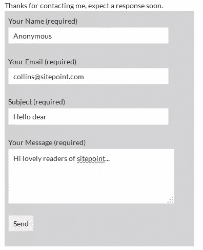

# 在 5 分钟内建立你自己的 WordPress 联系表单插件

> 原文：<https://www.sitepoint.com/build-your-own-wordpress-contact-form-plugin-in-5-minutes/>

大多数网站通常被设计成符合标准的 web 实践，包括一个专门的页面，在该页面上有一个联系表单。这为访问者提供了一种联系网站所有者的简单方式。

简单来说，联系表单有一组问题和字段，由访问者填写。这些信息通常会通过电子邮件自动发送到网站管理员或另一个指定的电子邮件帐户。值得注意的是，该电子邮件地址不会向访问者显示，因此使用联系表单通常会减少来自在互联网上收集裸露电子邮件地址的机器人的垃圾电子邮件。联系方式在网站上起着非常重要的作用，它们被用来收集用户的反馈、询问和其他数据。

如果你的网站是由 WordPress 驱动的，有许多插件可以无缝集成你网站上的联系人表单。

在这篇文章中，我将提供一些免费的 WordPress 联系表单插件列表。我还将讨论为什么你应该考虑滚动自己的联系方式。然后，我将为你提供一个简短的教程，向你展示如何构建你自己的 WordPress 联系人表单插件。

## WordPress 联系人表单插件

在我们开始之前，我们将回顾一下 [WordPress 插件目录](https://wordpress.org/plugins/)中的一些流行的免费联系表单插件。这些都很好用，但是当你开始构建你自己的插件时，学习它们会更好。

以下是 WordPress 的一些评价最高的免费联系表单插件:

1.  联系方式 7——这是第二个[最受欢迎的插件](http://wordpress.org/plugins/browse/popular/)，下载量超过 1800 万次，几乎可以认为是 WordPress 网站事实上的联系方式插件。Contact Form 7 可以管理多个联系人表单，您可以使用简单的标记来自定义表单和电子邮件内容。表单功能包括 Ajax 支持的提交、验证码、Akismet 垃圾邮件过滤等等。

2.  [电子邮件联系表单](https://wordpress.org/plugins/contact-form-to-email/)–该插件不仅创建联系表单并将数据发送到指定的电子邮件地址，还将联系表单数据保存到数据库中，提供可打印的报告以及将所选数据导出到 CSV/Excel 文件的选项。

3.  [Form get Contact Form](http://wordpress.org/plugins/formget-contact-form/)-一个简单的在线拖放联系人表单构建工具。你所要做的就是点击表格中你想要的字段，几秒钟后你的联系表格就准备好了。

4.  [Bestwebsoft Contact Form](http://wordpress.org/plugins/contact-form-plugin/)–允许您毫不费力地在网页或帖子中添加反馈表格。这是非常容易的，你不需要任何额外的设置，即使有一些可以玩。

## 为什么要推出自己的联系人表单插件？

### 成为更好的开发者

开发你自己的 WordPress 插件可以帮助你更好地理解 WordPress 是如何“在幕后”工作的，这可以帮助你成为一个更有经验的 web 开发者。虽然 WordPress 插件目录中有成千上万的插件可供使用，但是能够修改和扩展其他插件是一项非常有用的技能。

### 构建更好的表单

很多 WordPress 联系人表单插件都很臃肿。它们包括许多您可能永远不会使用的功能。大量使用 JavaScript 和 CSS 文件在一些标准联系人表单插件中也很常见。这增加了 HTTP 请求的数量，对 WordPress 的性能有负面影响。

根据[雅虎的业绩规则](http://developer.yahoo.com/performance/rules.html#num_http):

> 80%的最终用户响应时间花费在前端。大部分时间被用于下载页面中的所有组件:图像、样式表、脚本、Flash 等。减少组件的数量反过来也减少了呈现页面所需的 HTTP 请求的数量。这是加快页面速度的关键。

如果你和我一样，想要一个简单的联系方式插件，请继续读下去。我将指导你完成开发你自己的插件的简单过程，这样你就可以告别臃肿的插件了。在这个例子中，不需要额外的 CSS 和 JavaScript 文件，使用 HTML5 完成了[验证。](https://www.sitepoint.com/client-side-form-validation-html5/)

## 联系人表单插件开发

在五分钟内，你将学会如何开发一个简单的 WordPress 联系方式，这是一个承诺！

准备好了吗？设置？走吧。

所有的 WordPress pluigns 都是 PHP 文件，位于`/wp-content/plugins/ directory`中。在我们的例子中，这个文件将被称为`sp-form-example.php`。我假设您已经习惯了使用 FTP/SFTP/SCP 或 SSH 连接到您的服务器。

如果您想继续学习，只需创建一个名为`sp-form-example.php`的文件(最终的完整示例将在本文末尾提供):

```
<?php
/*
Plugin Name: Example Contact Form Plugin
Plugin URI: http://example.com
Description: Simple non-bloated WordPress Contact Form
Version: 1.0
Author: Agbonghama Collins
Author URI: http://w3guy.com
*/
    //
    // the plugin code will go here..
    //
?>
```

接下来，我们添加包含联系人表单 HTML 的函数`html_form_code()`:

```
function html_form_code() {
    echo '<form action="' . esc_url( $_SERVER['REQUEST_URI'] ) . '" method="post">';
    echo '<p>';
    echo 'Your Name (required) <br />';
    echo '<input type="text" name="cf-name" pattern="[a-zA-Z0-9 ]+" value="' . ( isset( $_POST["cf-name"] ) ? esc_attr( $_POST["cf-name"] ) : '' ) . '" size="40" />';
    echo '</p>';
    echo '<p>';
    echo 'Your Email (required) <br />';
    echo '<input type="email" name="cf-email" value="' . ( isset( $_POST["cf-email"] ) ? esc_attr( $_POST["cf-email"] ) : '' ) . '" size="40" />';
    echo '</p>';
    echo '<p>';
    echo 'Subject (required) <br />';
    echo '<input type="text" name="cf-subject" pattern="[a-zA-Z ]+" value="' . ( isset( $_POST["cf-subject"] ) ? esc_attr( $_POST["cf-subject"] ) : '' ) . '" size="40" />';
    echo '</p>';
    echo '<p>';
    echo 'Your Message (required) <br />';
    echo '<textarea rows="10" cols="35" name="cf-message">' . ( isset( $_POST["cf-message"] ) ? esc_attr( $_POST["cf-message"] ) : '' ) . '</textarea>';
    echo '</p>';
    echo '<p><input type="submit" name="cf-submitted" value="Send"/></p>';
    echo '</form>';
}
```

通过`pattern`输入属性将基本验证添加到表单中。

联系人表单中的正则表达式执行以下字段验证:

*   **【a-zA-Z0-9】**:名称字段只允许字母、空格和数字；特殊符号被视为无效。

*   **【a-zA-Z】**:主题字段只允许字母和空格。

*   `email`表单控件验证电子邮件字段，因此不需要模式属性。

关于如何工作的更多信息，请阅读我的关于使用 HTML5 进行客户端表单验证的文章，了解模式属性如何帮助表单验证。

### 快一点！

好吧，我们还剩多少分钟？四分钟！我们还有时间结束这一切。

函数`deliver_mail()`清理表单数据并将邮件发送到 WordPress 管理员的电子邮件地址。

```
function deliver_mail() {

    // if the submit button is clicked, send the email
    if ( isset( $_POST['cf-submitted'] ) ) {

        // sanitize form values
        $name    = sanitize_text_field( $_POST["cf-name"] );
        $email   = sanitize_email( $_POST["cf-email"] );
        $subject = sanitize_text_field( $_POST["cf-subject"] );
        $message = esc_textarea( $_POST["cf-message"] );

        // get the blog administrator's email address
        $to = get_option( 'admin_email' );

        $headers = "From: $name <$email>" . "\r\n";

        // If email has been process for sending, display a success message
        if ( wp_mail( $to, $subject, $message, $headers ) ) {
            echo '<div>';
            echo '<p>Thanks for contacting me, expect a response soon.</p>';
            echo '</div>';
        } else {
            echo 'An unexpected error occurred';
        }
    }
}
```

表格数据的清理由以下 WordPress 内部函数完成:

*   `sanitize_text_field()`:整理来自用户输入的数据。

*   `sanitize_email()`:删除电子邮件中不允许的所有字符。

*   `esc_textarea()`:转义*消息*文本区值。

代码`get_option( 'admin_email' )`以编程方式从数据库中检索 WordPress 管理员的电子邮件地址，电子邮件将被发送到该数据库。

不希望联系人表单将邮件发送给管理员？只需将变量`$to`设置为所需的电子邮件地址。

如果功能`wp_mail()`已成功处理该邮件，并且没有任何错误，将显示文本*感谢联系我，期待尽快回复*，否则显示*出现意外错误*。

### 还剩 1 分 30 秒

函数`cf_shortcode()`是当联系人表单短代码`[sitepoint_contact_form]`激活时调用的回调函数。

```
function cf_shortcode() {
    ob_start();
    deliver_mail();
    html_form_code();

    return ob_get_clean();
}
```

以上函数调用`html_form_code()`和`deliver_mail()`函数分别显示联系人表单 HTML 表单和验证表单数据。

最后，短代码`[sitepoint_contact_form]`被注册到 WordPress。所以简单补充一下:

```
add_shortcode( 'sitepoint_contact_form', 'cf_shortcode' );
```

### 三，二，一…时间到了！

祝贺你，我们已经成功开发了我们自己的 WordPress 联系表单插件，我已经实现了我之前的承诺。

现在，要在你的网站上使用这个插件，只需在你的 WordPress 仪表盘的“插件”部分激活它，然后创建一个帖子或页面，然后只需在你希望表单出现的地方添加简短代码`[sitepoint_contact_form]`。

如果您随后预览该页面，您应该会看到如下所示的联系人表单。



## 结论

为了进一步理解插件是如何构建的，以及如何在你的 WordPress 站点上实现它，复制下面的代码，粘贴到一个文件中，并上传到你的`/wp-content/plugins/ directory`。

下面是完整的插件示例:

```
<?php
/*
Plugin Name: Example Contact Form Plugin
Plugin URI: http://example.com
Description: Simple non-bloated WordPress Contact Form
Version: 1.0
Author: Agbonghama Collins
Author URI: http://w3guy.com
*/

function html_form_code() {
	echo '<form action="' . esc_url( $_SERVER['REQUEST_URI'] ) . '" method="post">';
	echo '<p>';
	echo 'Your Name (required) <br/>';
	echo '<input type="text" name="cf-name" pattern="[a-zA-Z0-9 ]+" value="' . ( isset( $_POST["cf-name"] ) ? esc_attr( $_POST["cf-name"] ) : '' ) . '" size="40" />';
	echo '</p>';
	echo '<p>';
	echo 'Your Email (required) <br/>';
	echo '<input type="email" name="cf-email" value="' . ( isset( $_POST["cf-email"] ) ? esc_attr( $_POST["cf-email"] ) : '' ) . '" size="40" />';
	echo '</p>';
	echo '<p>';
	echo 'Subject (required) <br/>';
	echo '<input type="text" name="cf-subject" pattern="[a-zA-Z ]+" value="' . ( isset( $_POST["cf-subject"] ) ? esc_attr( $_POST["cf-subject"] ) : '' ) . '" size="40" />';
	echo '</p>';
	echo '<p>';
	echo 'Your Message (required) <br/>';
	echo '<textarea rows="10" cols="35" name="cf-message">' . ( isset( $_POST["cf-message"] ) ? esc_attr( $_POST["cf-message"] ) : '' ) . '</textarea>';
	echo '</p>';
	echo '<p><input type="submit" name="cf-submitted" value="Send"></p>';
	echo '</form>';
}

function deliver_mail() {

	// if the submit button is clicked, send the email
	if ( isset( $_POST['cf-submitted'] ) ) {

		// sanitize form values
		$name    = sanitize_text_field( $_POST["cf-name"] );
		$email   = sanitize_email( $_POST["cf-email"] );
		$subject = sanitize_text_field( $_POST["cf-subject"] );
		$message = esc_textarea( $_POST["cf-message"] );

		// get the blog administrator's email address
		$to = get_option( 'admin_email' );

		$headers = "From: $name <$email>" . "\r\n";

		// If email has been process for sending, display a success message
		if ( wp_mail( $to, $subject, $message, $headers ) ) {
			echo '<div>';
			echo '<p>Thanks for contacting me, expect a response soon.</p>';
			echo '</div>';
		} else {
			echo 'An unexpected error occurred';
		}
	}
}

function cf_shortcode() {
	ob_start();
	deliver_mail();
	html_form_code();

	return ob_get_clean();
}

add_shortcode( 'sitepoint_contact_form', 'cf_shortcode' );

?>
```

这只是一个简单的例子。如果你有兴趣学习更多关于插件开发的知识，这里有一些进一步推荐的读物:

*   一个简单的 WordPress 管理插件(教程)
*   [一个 WordPress Widget 插件(教程)](https://www.sitepoint.com/wordpress-plugin-development/)
*   [官方 WordPress Codex 插件开发者文档](http://codex.wordpress.org/Writing_a_Plugin)
*   [SitePoint PHP 通道](https://www.sitepoint.com/php/)

请在评论中告诉我你的想法和问题。

## 分享这篇文章