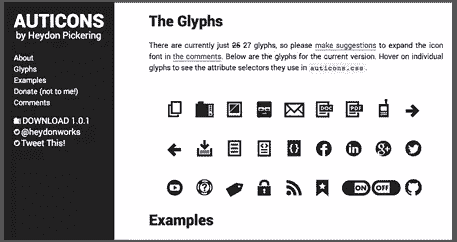
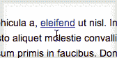
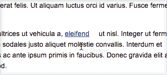

# 反思链接:寻找一个更好的 HREF

> 原文：<https://www.sitepoint.com/building-a-better-href/>

链接一直都是链接。网页上的蓝色文本会将您带到其他地方。或许最令人惊讶的是，自 1965 年诞生以来，links 几乎没有什么变化。

这很可能是因为他们不需要这么做。它们只是在两个地方之间导航的一种方式。

然而，在这个奇妙的新网络技术和平台的时代，链接也发生了变化。在 2014 年，他们可以指向你希望他们指出的任何东西——外部或内部页面、pdf 或 SVG、图像或档案，甚至触发 JavaScript 中的事件。

问题是，查看一段(最常见的)蓝色文本完全没有给出它可能会做什么的指示！当然，你可以使用有用的标题属性和信息链接文本，但最终，这可能不是你的链接需要的可见性。

那么，怎样才能让链接更有信息量呢？



拍卖是一个很好的 css 实现

我最近看到的一个伟大的实现是海登·皮克林的 [Auticons](http://heydonworks.com/auticons-icon-font/) 。

Heydon 使用 CSS3 选择器来直观地改变链接的外观，而不需要任何额外的标记——这一点非常有效。

但是，如果你有一个满是链接的页面，那就有问题了:你最终会得到一个混乱的页面，塞满了图标，还有蓝色的链接文本！

这同样适用于马克·博尔顿的[火花图标](http://www.markboulton.co.uk/journal/sparkicons)——尽管那篇文章读起来非常有趣。

* * *



将图标放置在链接上方。

## 一些代码

我最初的想法是在链接上使用 rel 属性来决定我们的样式，因为在 CSS3 中你可以轻松地使用[属性选择器](https://reference.sitepoint.com/css/css3attributeselectors)。

注意，我使用*=作为选择器，因为属性可能有多个值( [demo](https://jsfiddle.net/ahallicks/5MWFW/) ):

**HTML**

```
<a href="http://google.com" rel="external" title="An External Link">To Google</a> 
```

**CSS**

```
a[rel*='external'] {
    position: relative;
}
a[rel*='external']:after {
    content: " \f08e";
    font-family: "FontAwesome";
    font-size: 12px;
    left: 50%;
    margin-left: -6px;
    opacity: 0;
    position: absolute;
    top: -22px;
    -webkit-transition: all .25s linear;
       -moz-transition: all .25s linear;
        -ms-transition: all .25s linear;
         -o-transition: all .25s linear;
            transition: all .25s linear;
}
a[rel*='external']:hover:after {
    opacity: 1;
    top: -18px;
} 
```

我的第一个例子是当鼠标悬停在链接上方时，让图标淡入(使用[字体牛逼](http://fontawesome.io))。

这是一个非常快速和肮脏的方式来显示链接有一些功能，而不仅仅是带你去某个地方。你知道它会引导你离开网站，然后采取相应的行动。

* * *



当用户与链接交互时，图标滑动到视图中

## 将图标内联

但是，对于文本流中的链接，您可能不希望图标从顶部出现。

我尝试过几种这样做的方法。

到目前为止，我发现的在响应鼠标悬停时不会导致内容跳跃的最好方法是为图标留出一些负空间。

代码如下:

```
a[href^='http'] {
    padding-right: 15px;
    position: relative;
}
a[href^='http']:after {
    content: "\f08e";
    font-family: "FontAwesome";
    font-size: 12px;
    right: -15px;
    opacity: 0;
    position: absolute;

    -webkit-transition: all .25s linear;
       -moz-transition: all .25s linear;
        -ms-transition: all .25s linear;
         -o-transition: all .25s linear;
            transition: all .25s linear;
}
a[href^='http']:hover:after {
    opacity: 1;
    right: 0;
} 
```

[https://jsfiddle.net/ahallicks/pHtqA/embedded/result,html,css/](https://jsfiddle.net/ahallicks/pHtqA/embedded/result,html,css/)

正如你在[演示](https://jsfiddle.net/ahallicks/pHtqA/)中看到的，我们在链接的右边保留了一些空白，在悬停状态下，这些空白会被图标填充。我不认为这会导致很大的显示问题，尤其是当你意识到链接的悬停状态下空间确实有一些内容。

但它并不完美。

另一种不用预留空间的方法是让图标出现在文本的顶部。为此，你可以给图标一个背景颜色，并改变不透明度下降一点，如[这个例子](https://jsfiddle.net/ahallicks/Z4THh/1/)。

就我个人而言，我确实喜欢这个实现，但不喜欢这个事实:一旦鼠标悬停，你就无法阅读链接中的文本。

* * *

## 文本输出，图标输入

最后一种方法是完全隐藏文本并用图标代替它。我认为这比把图标放在文本上面要干净得多。这里有一个这样的例子。

[https://jsfiddle.net/ahallicks/X3yRa/embedded/result,html,css/](https://jsfiddle.net/ahallicks/X3yRa/embedded/result,html,css/)

我还添加了一点额外的天赋，并改变了图标，因为你失去了悬停。显然，这是没有帮助或信息，但只是演示了一些额外的事情，你可以用它来做。

这个例子中唯一需要注意的是，链接需要一个固定的行高才能正常工作。我确实创建了一个不支持的版本，但是这需要在链接中添加一段额外的标记才能正常工作。

不过我确实更喜欢这个动画，所以如果你不介意一个额外的跨度[试试看](https://jsfiddle.net/ahallicks/4wvmr/) ( **请注意**:在 Chrome 的一些版本中，当内容属性改变时，CSS3 中的过渡属性会有问题。我已经[提交了一份错误报告](https://code.google.com/p/chromium/issues/detail?id=336382)，这个问题应该会在即将到来的版本中得到解决。

* * *

## 移动呢？

这是一个很大的问题:所有这些都不适用于移动设备，因为没有“悬停”状态。你看到的是链接本身，没有办法看到悬停状态，直到你真正触摸链接跟随它。

这对移动用户来说是多余的，这也是几乎可以肯定它更相关的地方。例如，如果你在移动设备上，你就不太可能想要点击 PDF。

那么，我们该如何解决这个问题呢？

那么，如果我们使用媒体查询在视窗宽度低于预设宽度时总是显示图标，会怎么样呢？

```
@media only screen and (max-width: 800px) {

    a[href^='http']:after,
    a[href^='https']:after{
        opacity: 1;
        right: 0;
    }

} 
```

(在本[演示](https://jsfiddle.net/ahallicks/3J6vk/)中调整浏览器窗口的大小，以查看图标在低于某个阈值时是否会永久显示)

另一种方法是使用 JavaScript 拦截链接上的第一次触摸，并显示指定的图标。

您已经在一些 JavaScript 工具提示实现中看到了这种方法。在手机上，他们会在第一次点击时显示工具提示，然后在第二次点击时跟随活动链接。

然而，我不认为这是一个受欢迎的方法，因为仅仅为了跟随一个链接就必须点击两次会激怒很多人。

* * *

## 易接近

这也存在一些可访问性问题。卡尔·格罗夫斯在这里做了很好的介绍。<abbr title="Too Long; Didn't Read">TL；由 CSS 属性添加的内容对屏幕阅读器来说是不可见的，所以这些信息对那些用屏幕阅读器浏览网页的人没有任何帮助。</abbr>

然而，你会希望链接的 title 属性足以描述它的目的(另外，我相信链接的 href 属性是在屏幕阅读器上读出的。)

另外，对于喜欢用键盘浏览的人来说，当链接处于活动状态时，上面的例子不会显示变化。为了纠正这一点，你只需要在任何有悬停样式的地方添加`a[href^='http://']:focus`。

容易解决的问题。

* * *

## 最后…

与 Auticons 一样，您可以让在整个项目中广泛部署这种方法。如果你有很多指向不同内容类型的链接，你可以使用 CSS3 中的`$=`选择器来定位特定文件类型的不同链接。

例如，如果您只想在 PDF 文档中添加一个图标，您可以使用以下内容作为选择器:

```
a[href$='.pdf'] 
```

在你的 CSS 中添加一个 pdf 图标，你就给了人们一个方便的提示，告诉他们正在点击什么！欢迎在下面的评论中发表你的想法。

记住，你不必为你的图标使用字体。你可以创建自己的自定义图像，或者在 CSS 中使用带有背景图像的图标集。

## 分享这篇文章