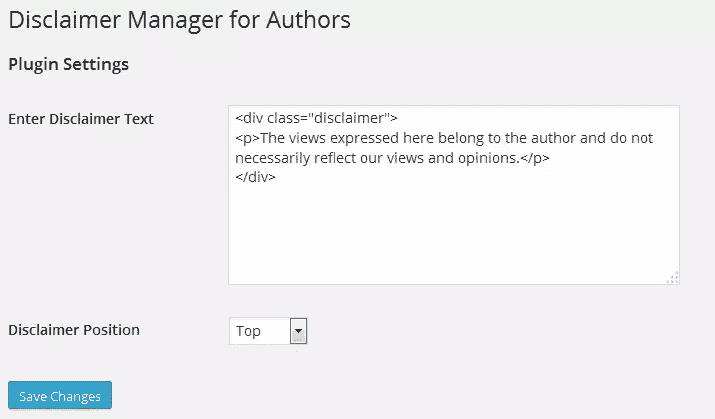
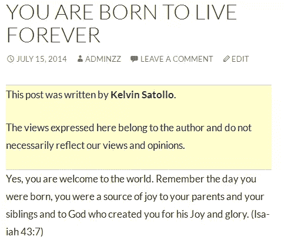

# 为多作者博客构建免责声明插件

> 原文：<https://www.sitepoint.com/building-a-disclaimer-notice-plugin/>

我的一个朋友经营着一个由 WordPress 支持的多作者博客。

为了避免任何法律麻烦，他经常在客座作者发表的每篇文章中添加一个“免责声明”，他在发表前编辑并包含免责声明文本。

我相信你会同意，在客座作者的每个帖子中编辑和添加免责声明似乎是一项艰巨的任务。

在本文中，我们将构建一个简单的免责声明插件，它将有一个选项页，站点管理员可以在其中添加`disclaimer text`，它会自动追加到文章内容的前后。

## 插件开发

为了开始插件开发，我们需要在插件 PHP 文件中包含插件头。

如果没有标题，WordPress 将无法识别插件。

```
<?php
/*
Plugin Name: Disclaimer Manager
Plugin URI: https://www.sitepoint.com
Description: Easy Disclaimer Manager for Multi-author blogs.
Version: 1.0
Author: Agbonghama Collins
Author URI: http://w3guy.com
License: GPL2
*/
```

开始构建插件的设置页面；首先，我们将使用函数 [add_options_page](https://codex.wordpress.org/Function_Reference/add_options_page) 将子菜单页面添加到“设置”菜单，该函数位于用`admin_menu`注册的函数中。

```
// Add the admin options page
add_action( 'admin_menu', 'dm_settings_page' );

function dm_settings_page() {
	add_options_page( 'Disclaimer Manager', 'Disclaimer Manager', 'manage_options', 'disclaimer-manager', 'dm_options_page' );
}
```

传递给`add_options_page()`的参数如下:

*   `Disclaimer Manager`:选择菜单时，页面标题标签中显示的文本。
*   `Disclaimer Manager`:用于菜单的文本。
*   `manage_options`:向用户显示该菜单所需的[能力](https://codex.wordpress.org/Roles_and_Capabilities#Capabilities)。
*   `disclaimer-manager`:参考该菜单的[段名](http://en.wikipedia.org/wiki/Semantic_URL#Slug)。
*   `dm_options_page`:输出插件设置页面要调用的函数。

下面是显示设置页面的回调函数`dm_options_page`的代码。

```
// Draw the options page
function dm_options_page() {
	?>
	<div class="wrap">
		<?php screen_icon(); ?>
		<h2> Disclaimer Manager for Authors </h2>

		<form action="options.php" method="post">
			<?php settings_fields( 'disclaimer_manager_options' ); ?>
			<?php do_settings_sections( 'disclaimer-manager' ); ?>
			<?php submit_button(); ?>
		</form>
	</div>
<?php
}
```

设置 API 被用来建立和管理设置表单。

上面`dm_options_page()`中的 [settings_fields](http://codex.wordpress.org/Function_Reference/settings_fields) 函数输出设置页面的随机数、动作和表单字段，而`do_settings_sections()`打印出添加到特定设置页面的所有设置部分。

下面是设置页面的完整设置 API 代码。

```
// Register and define the settings
add_action( 'admin_init', 'dm_admin_init' );
function dm_admin_init() {
	register_setting( 'disclaimer_manager_options', 'disclaimer_manager_options',
		'' );

	add_settings_section( 'dm_main', 'Plugin Settings',
		'', 'disclaimer-manager' );

	add_settings_field( 'dm_textarea-id', 'Enter Disclaimer Text',
		'disclaimer_text_textarea', 'disclaimer-manager', 'dm_main' );

	add_settings_field( 'dm_select-id', 'Disclaimer Position',
		'disclaimer_text_position', 'disclaimer-manager', 'dm_main' );
}

	// Display and fill the form field
function disclaimer_text_textarea() {
	// get option 'disclaimer_text' value from the database
	$options         = get_option( 'disclaimer_manager_options' );
	$disclaimer_text = $options['disclaimer_text'];

	// echo the field
	echo "<textarea rows='8' cols='50' id='disclaimer_text' name='disclaimer_manager_options[disclaimer_text]' >$disclaimer_text</textarea>";
}

function disclaimer_text_position() {
	// get option 'disclaimer_position' value from the database
	$options             = get_option( 'disclaimer_manager_options' );
	$disclaimer_position = $options['disclaimer_position'];

	echo '<select name="disclaimer_manager_options[disclaimer_position]">';
	echo '<option value="top"' . selected( $disclaimer_position, 'top' ) . '>Top</option>';
	echo '<option value="bottom"' . selected( $disclaimer_position, 'bottom' ) . '>Bottom</option>';
	echo '</select>';
}
```

**注意:**`register setting()`记录设置。

`add_settings_section()`创建*设置部分*——你在 WordPress 设置页面上看到的带有共享标题的设置组。

`add_settings_field()`将设置字段注册到设置页面和部分。

`get_option()`从数据库中检索设置表单的值，`update_option()`将表单值保存到数据库中。

我们已经完成了插件设置页面的构建。

下面是插件设置页面的截图。



函数`add_disclaimer_to_post`顾名思义，按照插件设置页面的定义，在每篇文章的顶部或底部添加“免责声明”文本。

```
function add_disclaimer_to_post( $content ) {

	$options = get_option( 'disclaimer_manager_options' );

	// get disclaimer text form DB
	$disclaimer_text = $options['disclaimer_text'];

	// get disclaimer position from DB
	$disclaimer_position = $options['disclaimer_position'];

	// ensure we are in a post and not a page
	if ( is_single() ) : // if disclaimer position is set to top
	{
		if ( $disclaimer_position == 'top' ) {
			$content = $disclaimer_text . $content;
		}

		// if disclaimer position is set to bottom
		if ( $disclaimer_position == 'bottom' ) {
			$content .= $disclaimer_text;
		}
	}

	endif;

	return $content;
}
```

请允许我解释一下上面的代码是做什么的。

从数据库中检索“免责声明文本”及其位置，并保存到变量`$disclaimer_text`和`$disclaimer_position`中。

接下来，我们使用布尔 WordPress 函数`is_single()`来确保我们处理的是一篇文章，而不是一个附件或页面。

接下来的两个`if`条件语句根据`$disclaimer_position`的结果将免责声明附加到帖子内容的顶部或底部。

为了让这个函数发挥作用，我们需要将它与`the content` filter 挂钩(用于在从数据库中检索到文章内容之后、将其打印到屏幕之前对其进行过滤)。

```
add_filter( 'the_content', 'add_disclaimer_to_post' );
```

瞧啊。我们已经完成了“免责声明插件”的编码。

下面是运行中的插件的截图:



## 结论

为了进一步理解插件是如何构建的，以及如何在你的 WordPress 站点中实现它，[下载插件](https://github.com/Collizo4sky/disclaimer-manager/archive/master.zip)。

如果您正在寻找一个高级免责声明插件，其功能如下:

*   能够选择作者将有一个免责声明或通知显示在他们的职位。
*   内置编辑器，用于为“免责声明”文本/通知等添加 CSS 样式。

从 [WordPress 插件目录](http://wordpress.org/plugins/disclaimer-and-notification-manager-for-authors/)中抓取改进版。

请在评论中告诉我你的想法。

## 分享这篇文章