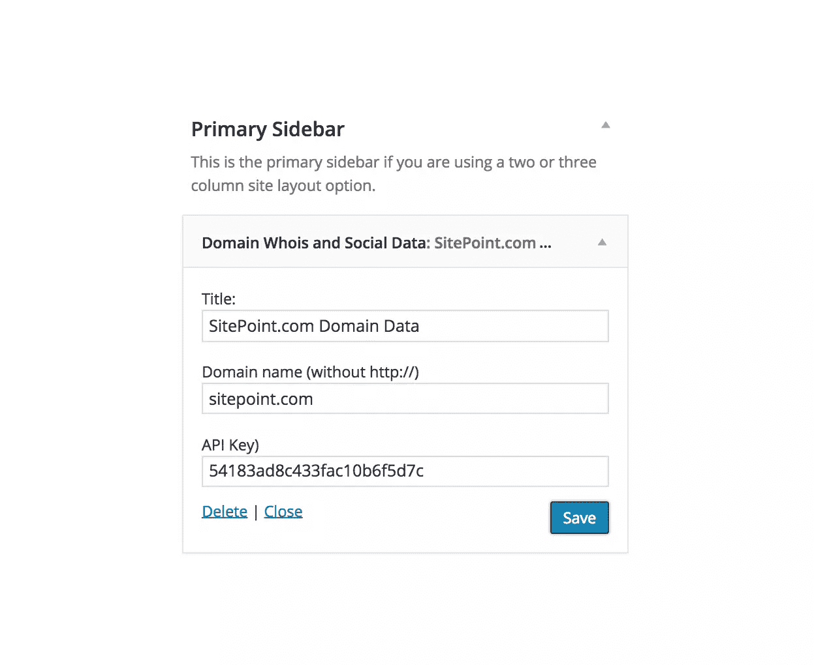
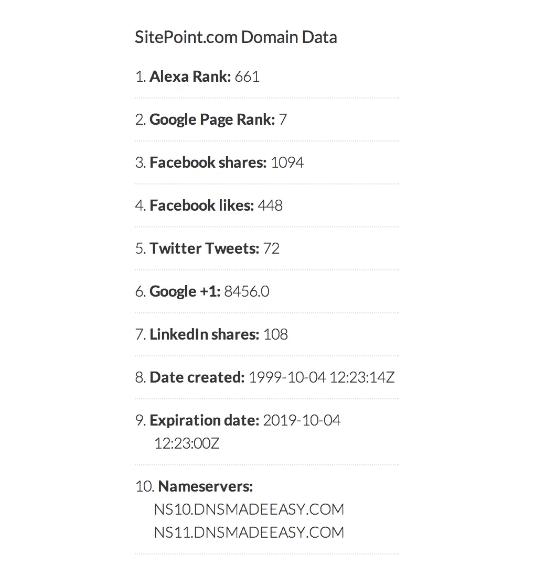

# 构建域名 WHOIS 和社交数据

> 原文：<https://www.sitepoint.com/building-a-domain-whois-and-social-data-wordpress-widget/>

在之前的教程中，我们深入研究了 [WordPress HTTP API](https://www.sitepoint.com/the-wordpress-http-api/) ，我们了解了什么是`APIs`以及如何使用`HTTP API`来消费 web 服务。

我承诺展示一些如何使用`HTTP API`在 WordPress 中使用 API 的真实例子，这是一系列后续文章中的第一篇。

在本教程中，我们将开发一个 WordPress 小部件，显示域名的 [WHOIS](http://en.wikipedia.org/wiki/Whois) 和社交信息，如 Google 的 PageRank 和+1 计数、Alexa rank、域名创建日期、域名到期时间、DNS 域名服务器、脸书分享和喜欢计数、Twitter tweets 和 LinkedIn 分享。

上面列出的域信息将从 [JsonWhois](https://jsonwhois.com/) API 中获得。

为了获得这些数据，将向端点`http://jsonwhois.com/api/whois`发送一个`GET`请求，将 API 密钥和域名作为请求参数。

在您的浏览器中输入以下 URL，以显示关于域`sitepoint.com`的可用信息(JSON 格式):

```
http://jsonwhois.com/api/whois/?apiKey=54183ad8c433fac10b6f5d7c&domain=sitepoint.com 
```

我们开发的小部件将从 JSON 对象获取数据。

如果你想在本教程中向前跳，你可以观看小部件的[演示，并下载](http://fifa-wc.tech4sky.com/)[小部件插件](https://github.com/Collizo4sky/domain-whois-social-data/archive/master.zip)。

## 编写小部件代码

首先，包括插件头。

```
<?php

/*
Plugin Name: Domain Whois and Social Data
Plugin URI: https://www.sitepoint.com
Description: Display whois and social data of a Domain.
Version: 1.0
Author: Agbonghama Collins
Author URI: http://w3guy.com
License: GPL2
*/
```

创建一个 WordPress 小部件；首先扩展标准的`WP_Widget`类，包括必要的类函数或方法，最后注册小部件。

创建一个子类来扩展`WP_Widget`类。

```
class Domain_Whois_Social_Data extends WP_Widget {
// ...
```

使用下面的`__construct()`魔术方法给小部件一个名称和描述。

```
function __construct() {
		parent::__construct(
			'whois_social_widget', // Base ID
			__( 'Domain Whois and Social Data', 'dwsd' ), // Name
			array( 'description' => __( 'Display whois and social data of a Domain.', 'dwsd' ), ) // Description
		);
	}
```

我们将创建一个名为`json_whois_api`的方法，它将接受两个参数:要查询的域和 API 键，API 键的职责是向 [JsonWhois](https://jsonwhois.com/) API 发送“GET”请求，检索响应体，然后使用 [json_decode()](http://php.net/manual/en/function.json-decode.php) 函数将响应转换为对象。

```
/**
	 * Retrieve the response body of the API GET request and convert it to an object
	 * 
	 * @param $domain
	 * @param $api_key
	 *
	 * @return object|mixed
	 */
	public function json_whois_api( $domain, $api_key ) {

		$url = 'http://jsonwhois.com/api/whois/?apiKey=' . $api_key . '&domain=' . $domain;

		$request = wp_remote_get( $url );

		$response_body = wp_remote_retrieve_body( $request );

		$decode_json_to_object = json_decode( $response_body );

		return $decode_json_to_object;

	}
```

对于小部件将要显示的每条域信息，还将创建一个返回单独数据的方法。也就是会创建一个返回 Alexa Rank，PageRank 等等的方法。

### 显著的

对于那些刚接触 PHP 编程和 WordPress 插件开发的人来说，你可能会觉得有些奇怪:

```
return $response_data->social->facebook->data[0]->share_count;
```

`->`用于访问对象属性，`[]`用于访问数组。

原因是 **JsonWhois** 在被解码成对象后返回的响应是一个*多维对象*，其某些属性包含数组作为值。

下面的代码解释了这一点`$object->facebook->data[0]->share_count;`

```
[facebook] => stdClass Object
                (
                    [data] => Array
                        (
                            [0] => stdClass Object
                                (
                                    https%3A%2F%2Feditor.sitepoint.com => https://www.sitepoint.com
                                    [normalized_url] => https://www.sitepoint.com/
                                    [share_count] => 1094
                                    [like_count] => 448
                                    [comment_count] => 161
                                    [total_count] => 1703
                                    [commentsbox_count] => 0
                                    [comments_fbid] => 501562723433
                                    [click_count] => 138
                                )

                        )

                )
```

以下是返回 WordPress 小部件将显示的各种域信息的类方法或函数，没有特定的顺序。

```
/**
	 * Get the domain Alexa Rank
	 *
	 * @param object $response_data JSON decoded response body
	 *
	 * @return integer
	 */
	public function alexa_rank( $response_data ) {

		return $response_data->alexa->rank;

	}
```

```
/**
	 * Number of times domain have been tweeted
	 *
	 * @param object $response_data JSON decoded response body
	 *
	 * @return integer
	 */
	public function twitter_tweets( $response_data ) {

		return $response_data->social->twitter->count;

	}
```

```
/**
	 * Number of times domain have been shared on Facebook
	 *
	 * @param object $response_data JSON decoded response body
	 *
	 * @return integer
	 */
	public function facebook_share_count( $response_data ) {

		return $response_data->social->facebook->data[0]->share_count;

	}
```

```
/**
	 * Number of times domain have been liked on Facebook
	 *
	 * @param object $response_data JSON decoded response body
	 *
	 * @return mixed
	 */
	public function facebook_like_count( $response_data ) {

		return $response_data->social->facebook->data[0]->like_count;

	}
```

```
/**
	 * Number of times domain have been shared to LinkedIn
	 *
	 * @param object $response_data JSON decoded response body
	 *
	 * @return integer
	 */
	public function linkedin_share( $response_data ) {

		return $response_data->social->linkedIn;

	}
```

```
/**
	 * Number of times domain have been shared on Google+
	 *
	 * @param object $response_data JSON decoded response body
	 *
	 * @return integer
	 */
	public function google_share( $response_data ) {

		return $response_data->social->google;

	}
```

```
/**
	 * Google PageRank of Domain
	 *
	 * @param object $response_data JSON decoded response body
	 *
	 * @return integer
	 */
	public function google_page_rank( $response_data ) {

		return $response_data->google->rank;

	}
```

```
/**
	 *Domain name servers
	 *
	 * @param object $response_data JSON decoded response body
	 *
	 * @return string
	 */
	public function domain_nameservers( $response_data ) {

		$name_servers = $response_data->whois->domain->nserver;

		return $name_servers->{0} . ' ' . $name_servers->{1};

	}
```

```
/**
	 * Date domain was created
	 *
	 * @param object $response_data JSON decoded response body
	 *
	 * @return mixed
	 */
	public function date_created( $response_data ) {

		return $response_data->whois->domain->created;
	}
```

```
/**
	 * Domain expiration date
	 *
	 * @param object $response_data JSON decoded response body
	 *
	 * @return mixed
	 */
	public function expiration_date( $response_data ) {

		return $response_data->whois->domain->expires;
	}
```

后端小部件设置表单由`form()`方法创建，包含三个表单字段，包含小部件标题、域和 API 密钥。

```
/**
	 * Back-end widget form.
	 *
	 * @see WP_Widget::form()
	 *
	 * @param array $instance Previously saved values from database.
	 *
	 * @return string
	 */
	public function form( $instance ) {
		if ( isset( $instance['title'] ) ) {
			$title = $instance['title'];
		} else {
			$title = __( 'Domain Whois & Social Data', 'dwsd' );
		}

		$domain_name = isset( $instance['domain_name'] ) ? $instance['domain_name'] : '';

		$api_key = isset( $instance['api_key'] ) ? $instance['api_key'] : '54183ad8c433fac10b6f5d7c';

		?>
		<p>
			<label for="<?php echo $this->get_field_id( 'title' ); ?>"><?php _e( 'Title:' ); ?></label>
			<input class="widefat" id="<?php echo $this->get_field_id( 'title' ); ?>"
			       name="<?php echo $this->get_field_name( 'title' ); ?>" type="text"
			       value="<?php echo esc_attr( $title ); ?>">
		</p>

		<p>
			<label
				for="<?php echo $this->get_field_id( 'domain_name' ); ?>"><?php _e( 'Domain name (without http://)' ); ?></label>
			<input class="widefat" id="<?php echo $this->get_field_id( 'domain_name' ); ?>"
			       name="<?php echo $this->get_field_name( 'domain_name' ); ?>" type="text"
			       value="<?php echo esc_attr( $domain_name ); ?>">
		</p>

		<p>
			<label for="<?php echo $this->get_field_id( 'api_key' ); ?>"><?php _e( 'API Key)' ); ?></label>
			<input class="widefat" id="<?php echo $this->get_field_id( 'api_key' ); ?>"
			       name="<?php echo $this->get_field_name( 'api_key' ); ?>" type="text"
			       value="<?php echo esc_attr( $api_key ); ?>">
		</p>
	<?php
	}
```



当小部件表单被填充时，`update()`方法将输入的值整理并保存到数据库中以供重用。

```
/**
	 * Sanitize widget form values as they are saved.
	 *
	 * @see WP_Widget::update()
	 *
	 * @param array $new_instance Values just sent to be saved.
	 * @param array $old_instance Previously saved values from database.
	 *
	 * @return array Updated safe values to be saved.
	 */
	public function update( $new_instance, $old_instance ) {
		$instance                = array();
		$instance['title']       = ( ! empty( $new_instance['title'] ) ) ? strip_tags( $new_instance['title'] ) : '';
		$instance['domain_name'] = ( ! empty( $new_instance['domain_name'] ) ) ? strip_tags( $new_instance['domain_name'] ) : '';

		return $instance;
	}
```

`widget()`方法在 WordPress 前端显示小部件。

```
/**
	 * Front-end display of widget.
	 *
	 * @see WP_Widget::widget()
	 *
	 * @param array $args Widget arguments.
	 * @param array $instance Saved values from database.
	 */
	public function widget( $args, $instance ) {

		// Retrieve the saved widget API key
		$api_key = ! empty( $instance['api_key'] ) ? $instance['api_key'] : '54183ad8c433fac10b6f5d7c';

		// Get the Domain name saved in the widget
		$domain_name = ! empty( $instance['domain_name'] ) ? $instance['domain_name'] : '';

		// JsonWhois API response
		$api_response = $this->json_whois_api( $domain_name, $api_key );

		// Display the widget Title
		echo $args['before_widget'];
		if ( ! empty( $instance['title'] ) ) {
			echo $args['before_title'] . apply_filters( 'widget_title', $instance['title'] ) . $args['after_title'];
		}

		echo '<ol>';
		echo '<li> <strong>Alexa Rank:</strong> ', $this->alexa_rank( $api_response ), '</li>';
		echo '<li> <strong>Google Page Rank:</strong> ', $this->google_page_rank( $api_response ), '</li>';
		echo '<li> <strong>Facebook shares:</strong> ', $this->facebook_share_count( $api_response ), '</li>';
		echo '<li> <strong>Facebook likes:</strong> ', $this->facebook_like_count( $api_response ), '</li>';
		echo '<li> <strong>Twitter Tweets:</strong> ', $this->twitter_tweets( $api_response ), '</li>';
		echo '<li> <strong>Google +1:</strong> ', $this->google_share( $api_response ), '</li>';
		echo '<li> <strong>LinkedIn shares:</strong> ', $this->linkedin_share( $api_response ), '</li>';
		echo '<li> <strong>Date created:</strong> ', $this->date_created( $api_response ), '</li>';
		echo '<li> <strong>Expiration date:</strong> ', $this->expiration_date( $api_response ), '</li>';
		echo '<li> <strong>Name servers:</strong> ', $this->domain_nameservers( $api_response ), '</li>';

		echo '</ol>';

		echo $args['after_widget'];
	}
```

**代码解释:**首先从数据库中检索保存的 widget 表单值(title、domain 和 API key)并保存到一个变量中。

域和 API 键被传递给`json_whois_api`方法，结果响应体被保存到`$api_response`。

对返回域数据的各种方法的调用使用响应体(`$api_response`)作为参数。

最后，我们关闭小部件类。

```
} // class Domain_Whois_Social_Data
```

widget 类需要通过挂接到`widgets_init` [动作](https://codex.wordpress.org/Plugin_API/Action_Reference/)来注册，这样它就能被 WordPress 内部所识别。

```
// register Domain_Whois_Social_Data widget
function register_whois_social_widget() {
	register_widget( 'Domain_Whois_Social_Data' );
}

add_action( 'widgets_init', 'register_whois_social_widget' );
```

下面是小部件的屏幕截图。



[查看小工具的演示。](http://fifa-wc.tech4sky.com/)

### 相关资源

如果你有兴趣了解更多关于 WordPress 小部件是如何工作的，你可能会对下面的文章感兴趣:

*   [WordPress Widget API](http://codex.wordpress.org/Widgets_API)
*   [构建一个标签式的 WordPress 登录和注册窗口部件](https://www.sitepoint.com/build-a-tabbed-wordpress-login-and-registration-widget/)
*   [通过 Widgets API 在 WordPress 中创建 Widgets](http://w3guy.com/wordpress-widgets-api/)
*   [创建 2014 世界杯 WordPress 小工具](https://www.sitepoint.com/world-cup-2014-wordpress-widget/)

## 包裹

为了进一步理解这个小部件是如何构建的，以及如何在你的 WordPress 站点上实现它，[从 GitHub 下载这个小部件插件。](https://github.com/Collizo4sky/domain-whois-social-data/archive/master.zip)

正如我提到的，这篇文章是展示如何在插件中使用 [WordPress HTTP API](https://www.sitepoint.com/the-wordpress-http-api/) 的系列文章的第一篇。

一定要关注 [WordPress 频道](https://www.sitepoint.com/wordpress/)的类似教程。

直到我们再次相见，编码快乐！

## 分享这篇文章