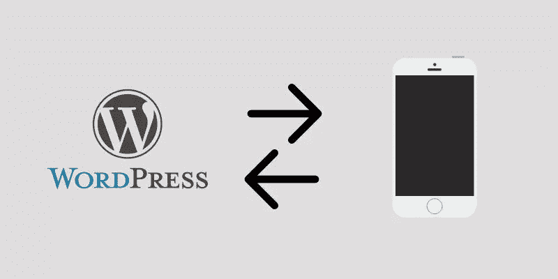
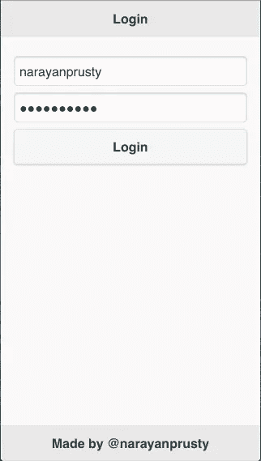
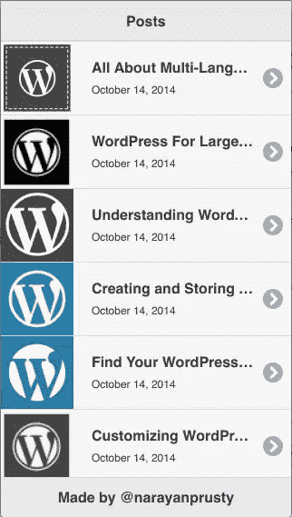
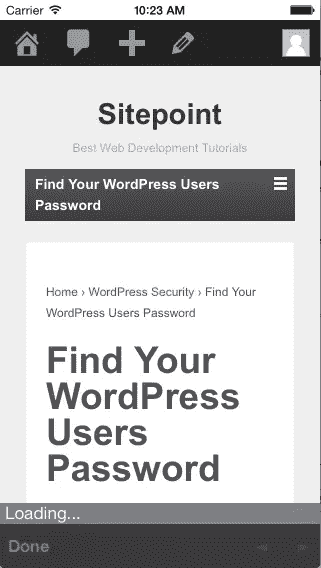

# 用 WordPress 后端构建 PhoneGap 应用程序

> 原文：<https://www.sitepoint.com/building-a-phonegap-app-with-a-wordpress-backend/>

在本教程中，我们将介绍如何使用 WordPress 作为 PhoneGap 移动应用的后端。然后，我们将看看如何为 WordPress 创建 REST APIs，以便 PhoneGap 应用程序可以使用这些 API 与 WordPress 进行通信。我们还将**构建一个简单的 PhoneGap 应用**，它允许用户登录，然后显示 WordPress 博客文章列表。



像 AppPresser、Mobicloud 和 IdeaPress 这样的移动应用开发解决方案仅限于创建博客风格的应用。了解如何将 WordPress 和 PhoneGap 集成在一起，将有助于你使用 WordPress 作为后台构建任何类型的应用。

## 创建 WordPress REST APIs

让我们从设置 WordPress REST APIs 开始。WordPress 为您提供了创建 REST APIs 的必要操作，任何 HTTP 客户端都可以使用这些 API。REST APIs 可以通过 WordPress 插件或主题来安装。

WordPress 动作`wp_ajax_`和`wp_ajax_nopriv_`可以用来创建 GET 或 POST REST APIs。

如果发出请求的 HTTP 客户端登录到 WordPress，就会执行一个附加到`wp_ajax_`的回调。类似地，如果发出请求的 HTTP 客户端没有登录到 WordPress，就会执行一个附加到`wp_ajax_nopriv_`的回调。

让我们创建一个允许用户登录 WordPress 的 REST API。

```
function already_logged_in()
{
	echo "User is already Logged In";
	die();
}

function login()
{
	$creds = array();
	$creds['user_login'] = $_GET["username"];
	$creds['user_password'] = $_GET["password"];

	$user = wp_signon($creds, false);
	if (is_wp_error($user))
	{
		echo "FALSE";
		die();
	}

	echo "TRUE";
	die();
}

add_action("wp_ajax_login", "already_logged_in");
add_action("wp_ajax_nopriv_login", "login");
```

让我们看看上面的代码是如何工作的:

*   如果用户在使用 PhoneGap 发出 AJAX 请求时已经登录，则用户会话 cookie 会自动发送到服务器。在这种情况下，执行`already_logged_in`功能。
*   如果没有用户会话 cookie 发送到服务器，即用户没有登录，则执行`login`功能。
*   我们需要向`http://[your_domain_name]//wp-admin/admin-ajax.php?action=login&username=your_name&password=your_password`发出 HTTP 请求。这里的动作是 REST API 名称，即跟在`wp_ajax_`和`wp_ajax_nopriv_`后面的字符串名称。
*   您可以向这个 URL 发出 GET 或 POST 请求，但是必须提供 REST API 名称。
*   wp_signon 用于创建用户会话 cookie，即用于用户登录 WordPress。

让我们创建另一个 REST API，它以 JSON 格式返回十篇最新的博客文章。

```
function posts()
{
	header("Content-Type: application/json");

	$posts_array = array();

	$args = array("post_type" => "post", "orderby" => "date", "order" => "DESC", "post_status" => "publish", "posts_per_page" => "10");

	$posts = new WP_Query($args);

	if($posts->have_posts()):
		while($posts->have_posts()): 
			$posts->the_post();

            $post_array = array(get_the_title(), get_the_permalink(), get_the_date(), wp_get_attachment_url(get_post_thumbnail_id()));
            array_push($posts_array, $post_array);

		endwhile;
		else:
        	echo "{'posts' = []}";
        	die();
	endif;

	echo json_encode($posts_array);

	die();
}

function no_posts()
{
	echo "Please login";
	die();
}

add_action("wp_ajax_posts", "posts");
add_action("wp_ajax_nopriv_posts", "no_posts");
```

让我们看看上面的代码是如何工作的:

*   这里我们注册了一个名为“posts”的 HTTP API。
*   如果用户未登录，它会返回一条消息要求登录。如果用户登录了，那么它会发送一个包含十篇最新文章的 JavaScripts 数组。
*   这里我们使用 [WP_Query](http://codex.wordpress.org/Class_Reference/WP_Query) 对象来检索博客文章。

## 创建 PhoneGap 应用程序

现在让我们来看看如何使用 WordPress 作为后端来创建 PhoneGap 应用程序。

在继续学习本教程之前，有几点需要注意:

*   有两种方法可以构建 PhoneGap 应用程序。你可以使用 [PhoneGap 在线构建器](https://build.PhoneGap.com/)或者你可以使用 [PhoneGap 桌面构建器](http://PhoneGap.com/install/)自己构建。在本教程中，我将假设您使用桌面生成器。
*   PhoneGap app 不遵守 [AJAX 和 Cookie 同源策略](http://qnimate.com/same-origin-policy-in-nutshell/)。因此，您可以使用 PhoneGap 应用程序中运行的 JavaScript 向任何网站发出 AJAX 请求。此外，在 HTTP 请求期间，所有 cookie 都被发送到服务器，任何域都可以在应用程序中存储 cookie。

我们将在本教程中构建的 PhoneGap 应用程序将具有以下目录结构和文件。

```
--www
    --cordova.js
	--js
	    --index.js
	    --index.html

```

`www`目录将出现在您新创建的项目中。

这里的`cordova.js`文件需要与默认提供的相同。

删除`index.js`和`index.html`文件中的所有内容。

将这段代码放入您的`index.html`文件中。

```
<!DOCTYPE html>
<html>
    <head>
        <meta charset="utf-8" />
        <meta name="viewport" content="user-scalable=no, initial-scale=1, maximum-scale=1, minimum-scale=1, width=device-width, height=device-height" />
        <title>Sitepoint - PhoneGap App using WordPress</title>
        <link rel="stylesheet" href="https://code.jquery.com/mobile/1.4.4/jquery.mobile-1.4.4.min.css">
    </head>
    <body>
        <div data-role="page">
            <div data-role="header" data-position="fixed">
                <h1>Login</h1>
            </div>

            <div data-role="main" class="ui-content">
                <input id="username" type="text" placeholder="Enter Username">
                <input id="password" type="password" placeholder="Enter Password">
                <button onclick="login();">Login</button>
                <a href="#pagetwo" id="page_two_link"></a>
            </div>

            <div data-role="footer" data-position="fixed">
                <h1>Made by @narayanprusty</h1>
            </div>
        </div> 

        <div data-role="page" id="pagetwo">
            <div data-role="header" data-position="fixed">
                <h1>Posts</h1>
            </div>

            <div data-role="main" class="ui-content">
                <ul data-role="listview" id="posts">                 
                </ul>
            </div>

            <div data-role="footer" data-position="fixed">
                <h1>Made by @narayanprusty</h1>
            </div>
        </div> 

        <script type="text/javascript" src="cordova.js"></script>
        <script src="https://code.jquery.com/jquery-1.11.1.min.js"></script>
        <script src="https://code.jquery.com/mobile/1.4.4/jquery.mobile-1.4.4.min.js"></script>
        <script type="text/javascript" src="js/index.js"></script>
    </body>
</html>
```

让我们看看上面的代码是如何工作的:

*   这里我们使用 jQuery mobile 来创建应用程序的 UI。jQuery mobile 是从 CDN 加载的。
*   我们有两页纸。第一个是一个登录页面，如果凭证是正确的，然后用户被转移到第二页，在那里显示的职位列表。
*   当点击登录按钮时，会调用一个 JavaScript 函数`login`。

现在我们完成了应用程序的用户界面，让我们编码前端功能。将该代码放在`index.js`文件中。

```
function fetch_and_display_posts()
{
    var xhr = new XMLHttpRequest();
    xhr.open("GET", "http://localhost/wp-admin/admin-ajax.php?action=posts");
    xhr.onload = function(){
        var posts_array = JSON.parse(xhr.responseText);

        var html = "";

        for(var count = 0; count < posts_array.length; count++)
        {
            var title = posts_array[count][0];
            var link = posts_array[count][1];
            var date = posts_array[count][2];
            var image = posts_array[count][3];

            html = html + "<li>" + "<a href='javascript:open_browser(\"" + link + "\")'>" + "" + "<h2>" + title + "</h2>" + "<p>" + date + "</p></a></li>";
        }

        document.getElementById("posts").innerHTML = html;
        $("#posts").listview("refresh");
    }
    xhr.send();
}

function login()
{
    var username = document.getElementById("username").value;
    var password = document.getElementById("password").value;

    if(username == "")
    {
        navigator.notification.alert("Please enter username", null, "Username Missing", "OK");
        return;
    }

    if(password == "")
    {
        navigator.notification.alert("Please enter password", null, "Password Missing", "OK");  
        return;
    }

    var xhr = new XMLHttpRequest();
    xhr.open("GET", "http://localhost/wp-admin/admin-ajax.php?action=login&username=" + encodeURIComponent(username) + "&password=" + encodeURIComponent(password));
    xhr.onload = function(){
        if(xhr.responseText == "FALSE")
        {
            navigator.notification.alert("Wrong Username and Password", null, "Wrong Creds", "Try Again");
        }
        else if(xhr.responseText == "TRUE")
        {
            fetch_and_display_posts();
            $("#page_two_link").click();
        }
    }   
    xhr.send();
}

function open_browser(link)
{
    window.open(link, '_blank', 'location=yes');
}
```

让我们看看上面的代码是如何工作的:

*   这里我们有三个函数。函数从表单中检索用户名和密码，并将其发送到 WordPress。如果凭证是正确的，那么 WordPress 会发回一个会话 cookie，表明用户已经登录。然后我们调用`fetch_and_display_posts`函数，该函数实际上检索最新的十篇文章，并将其显示在第二页中。当有人点击一篇文章时，我们调用`open_browser`功能，在一个新的浏览器窗口中显示完整的文章，即在应用浏览器中使用 PhoneGap。
*   这里，在 AJAX 请求期间，我使用域名作为`localhost`。确保你用你自己的域名替换它。

以下是使用 WordPress 的 PhoneGap 应用程序的截图。







## 进一步的信息

现在你知道如何使用 WordPress 作为后台创建一个简单的 PhoneGap 应用程序了。如果您想了解更多信息，这里列出了一些对 PhoneGap 新开发人员非常有用的资源:

*   [使用 PhoneGap 开发移动应用](http://qscutter.com/course/building-mobile-apps-using-phonegap/)
*   [使用网络技术构建移动应用](http://www.smashingmagazine.com/2014/02/11/four-ways-to-build-a-mobile-app-part3-phonegap/)
*   [启动并运行 PhoneGap](http://www.lynda.com/Creative-Cloud-tutorials/Up-Running-PhoneGap-Build/134924-2.html)

## 分享这篇文章