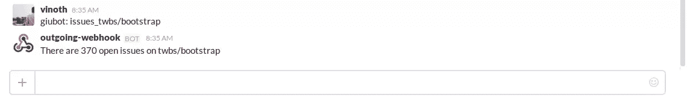

# 用 Ruby 和 Sinatra 制作一个懒人机器人

> 原文：<https://www.sitepoint.com/building-a-slackbot-with-ruby-and-sinatra/>


*这篇文章由[汤姆·帕金](https://www.sitepoint.com/author/tparkin)进行了同行评审。感谢 SitePoint 的所有同行评审员使 SitePoint 的内容尽可能做到最好！*

这几天似乎到处都是懈怠。它正在享受其他服务只能梦想的那种成功和采用。其成功的部分原因是 Slack 与其他服务的集成非常容易。有大量现成的集成，以及 web 挂钩和其他集成方法，使得使用 Slack 和您最喜欢的服务变得轻而易举。

Slack 提供可扩展性的另一种方式是“Slackbots”。Slack 机器人是可以配置为基于 Slack 中键入的关键字来触发的项目。

今天我们将看到如何构建一个定制的 Slackbot，它触发一个关键字，执行一些动作，并对 Slack 做出响应。我们将使用 Ruby 和 [Sinatra](http://www.sinatrarb.com) web 框架来构建它。本教程中没有涉及数据库，但是如果您愿意，您可以扩展它并添加一个。这是一个基础教程，让你体验构建一个 Slack 扩展。我们在这里做一块砖，你可以用它来建造其他东西。

让我们开始吧。

我们的 bot，姑且称之为`giubot`，将提供一组从 GitHub 获取细节的命令。我们将触发字设为`giubot:`,例如，

```
Message:-
    giubot: issues _ twbs/bootstrap

Response:-
    There are currently 433 open issues on twbs/bootstrap. 
```

我们将使用官方的 GitHub API。API 的文档可以从[这里](https://developer.github.com/v3/)获得。

让我们首先设置项目文件。

## 项目设置

为项目创建一个文件夹，并将下面的文件创建成如下所示:

```
giubot
|
|---- app.rb
|---- Gemfile 
```

就是这样。这是一个简单的应用程序，所有的功能都在 **app.rb** 中。 **Gemfile** 是我们指定项目依赖关系的地方。让我们在 git 中初始化和提交更改之前添加 gem 依赖项。将以下内容添加到**gem 文件**:

```
source 'https://rubygems.org'

gem 'sinatra'
gem 'httparty' 
```

然后跑

```
bundle install 
```

在项目目录中创建一个新的 **Gemfile.lock** 文件。关于我们的依赖，我们所需要的就是这两个宝石:[辛纳特拉](http://sinatrarb.com/)和[http 党](https://github.com/jnunemaker/httparty)。httpparty 是一个 gem，可以让我们轻松处理 HTTP 请求。

一旦创建了文件，就该将更改提交到 git 中了。本教程中关于 git 的所有步骤都是可选的，但是我们鼓励这样做。如果你想在 Heroku 上托管应用程序，Git 也是必需的。让我们初始化我们的存储库并提交所有的更改。在项目目录中键入以下命令:

```
git init
git add -A
git commit -m "Add project files and gem dependencies" 
```

当我们这样做的时候，让我们也把我们的库推到 GitHub。它对公共存储库是免费的，但对私人存储库是收费的。让我们使用[这个链接](https://github.com/new)快速创建我们的存储库。一旦创建了存储库，Github 将提供 URL，该 URL 可以在存储库页面上找到。复制 URL 并将其添加为远程:

```
git add remote origin https://github.com/avinoth/giubot.git 
```

我们正在添加远程 URL，并将其别名为 origin。完成后，将更改推送到 GitHub:

```
git push origin master 
```

在它成功推送之后，你应该会在 GitHub 上看到你的代码。我们已经完成了引导，让我们继续写一些代码。

## 创建 API 端点

Slack 和我们的 web 应用程序之间的通信是这样工作的:每当消息中提到单词`giubot:`时，Slack 就会将消息的详细信息，以及关于 Slack 帐户的一些详细信息发送到扩展配置时提供的 URL(稍后将详细介绍)。请求方法是一个主体中有数据的`POST`。

我们将获取完整的消息，获取消息中请求的存储库名称和命令，然后用必要的数据进行响应。对于这个应用程序来说，我们所需要的只是一个 API 端点，如果提到了触发词，Slack 将调用这个端点，生成我们希望发送回 Slack 的响应。让我们将下面几行添加到我们的 **app.rb** 文件中:

```
require 'sinatra'
require 'httparty'`
require 'json'

post '/gateway' do
  message = params[:text].gsub(params[:trigger_word], '').strip

  action, repo = message.split('_').map {|c| c.strip.downcase }
  repo_url = "https://api.github.com/repos/#{repo}"

  case action
    when 'issues'
      resp = HTTParty.get(repo_url)
      resp = JSON.parse resp.body
      respond_message "There are #{resp['open_issues_count']} open issues on #{repo}"
  end
end

def respond_message message
  content_type :json
  {:text => message}.to_json
end 
```

让我们看看这里发生了什么。我们只需要应用程序所需的三个模块。有一个名为`/gateway`的`POST`请求处理程序，它将为来自 Slack 的所有请求提供服务。然后获取信息，去掉触发词。正如你所看到的，我们正在使触发词独立于应用程序，并利用随请求而来的一个，所以不仅`giubot`而且任何关键字都将工作。

之后，取 text 参数，用`_`拆分，它是拆分消息各个组成部分的分隔符。当您希望拥有多个命令时，拥有一个标准分隔符会很有帮助，这可能需要更多的关键字。

有一个`case`语句根据传入的命令执行必要的动作。目前它只支持一个`issues`命令，该命令获取存储库中当前打开的问题数。编写另一个命令只是一个`case`语句，这很好。在`case`语句中，对 GitHub 进行 API 调用，GitHub 返回开放的问题计数，我们可以构建回发到 Slack 的响应。

此外，如果您注意到我们没有验证 Slack 中的令牌，而是完全忽略了参数。这是不推荐的，但由于这是帐户特定的，我们保持开放。如果需要，您可以将此作为处理程序操作的第一行来验证令牌:

```
return if params[:token] != ENV['SLACK_TOKEN'] 
```

就是这样。我们的应用程序的功能已经完成，是时候提交和推动这些变化了:

```
git add -A
git commit -m "Add app logic"
git push origin master 
```

## 部署应用程序

我们将不得不部署应用程序来配置它，并开始使用它。让我们将其部署到 Heroku[https://heroku.com]上，这是一个托管 web 应用程序的 PaaS 提供商。在项目目录中创建一个名为 **config.ru** 的文件，并在其中添加以下代码行:

```
require './app'
run Sinatra::Application 
```

Heroku 需要此文件来识别和启动应用程序。将文件添加到 git 并提交它:

```
git add config.ru
git commit -m "Add config.ru" 
```

如果您还没有在本地系统中安装 heroku gem:

```
gem install heroku 
```

并在项目目录中键入以下命令:

```
heroku create <APP-NAME>
heroku deploy 
```

可以是你喜欢的任何东西，或者你可以不要它，Heroku 会给这个应用程序指定一个名字。当系统要求时，请使用您的 Heroku 凭据登录。Heroku 将通过我们创建的配置文件识别出这是一个框架应用程序，并构建代码。我们现在已经将我们的应用程序部署到 Heroku。

## 配置时差

我们已经从应用程序端设置好了，让我们用刚刚创建的应用程序的 URL 来配置 Slack。转到 Slack 网站上的 [Outgoing Webhook](https://slack.com/services/new/outgoing-webhook) 网址，点击`Add Outgoing Webhooks Integration`。在添加新页面，给出你想要的所有细节，包括应用名称和触发词。在 URL 框中添加以下 URL:

```
http://<APP-NAME>.herokuapp.com/gateway 
```

其中`<APP-NAME>`是您部署的应用程序的 Heroku 名称。保存集成。

我们已经成功地创建并配置了扩展。通过在信道中键入带有我们在配置扩展时配置的触发字的消息来测试它，并查看它的运行情况。



请注意，该消息是一条普通消息，因此频道中的每个人都可以看到它，就像回复一样。

## 结论

因此，您现在已经有了用 Ruby 编写 Slackbot 的经验。我希望这能让你想到其他 Slackbots 和 extensiosn。本教程中使用的代码托管在 [GitHub](https://github.com/avinoth/giubot) 中。随意叉和戳周围。如果你已经创建了自己的 Slack 扩展，请在下面的评论中告诉我。

## 分享这篇文章