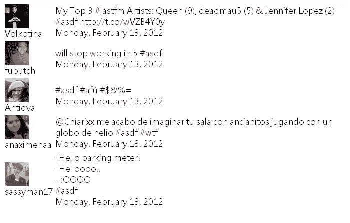
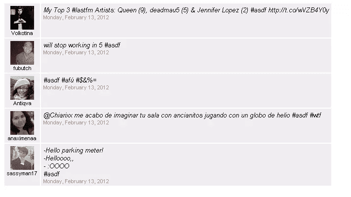

# 使用远端构建 Twitter 小部件

> 原文：<https://www.sitepoint.com/building-a-twitter-widget-using-distal/>

我将向您展示如何为您的网站构建一个 twitter 小部件，使用 Twitter 的搜索 API 从您的 Twitter 帐户下载最新的 tweets，并在一个表格中显示它们。

为了下载推文，我们将使用 Twitter 的搜索 API。我们将使用 HTML 来构建用户界面，然后[](http://code.google.com/p/distal/)将数据动态添加到界面中。

首先，让我们熟悉一下 Twitter API。Twitter 使用 REST API，这意味着我们需要加载包含搜索查询的 URL，Twitter 将返回包含搜索结果的格式化文本。我们需要在我们的小部件中加载这个 URL:

```
http://search.twitter.com/search.json?q={keywords}&callback={function}
```

Twitter 会返回这样的信息:

```
callback({
  "page": 1,
  "query": "{keywords}",
  "results": [{
    "created_at": "Mon, 13 Feb 2012 01:23:45 +0000",
    "from_user": "ladiesman217"
    "from_user_id": 123456789,
    "profile_image_url": "http://www..jpg",
    "text": "I'm eating food!"
  }]
})
```

请求 URL 非常简单，所以让我们分析一下响应。响应采用常规 JavaScript 对象的格式。该对象有一个名为“results”的属性，这是一个对象数组，每个对象代表一条 tweet。每条 tweet 都有一个属性，可以显示发送者的姓名、tweet 消息和发布日期。

要进行调用，我们不能使用浏览器的本机 XMLHttpRequest，因为这是一个跨域调用，出于安全原因，浏览器不允许这样做。

相反，我们将使用 JSON-P 技术，这意味着我们将向我们的文档动态添加一个指向 Twitter 页面的脚本标签。Twitter 服务器将返回一个 JSON 对象，该对象由一个函数调用包围，称为回调，将由浏览器执行。为了能够获取 JSON 对象，我们需要定义回调函数。

下面是我们进行 JSON-P 调用的代码:

```
function searchTwitter() {
  var node = document.getElementsByTagName("script")[0];
  var script = document.createElement("script");
  node.parentNode.insertBefore(script, node);
  script.src = "http://search.twitter.com/search.json?q=from:dalmaer&callback=searchTwitterCallback";
}
```

当 Twitter 服务器响应时，它会将一个 JSON 对象传递给我们的回调函数，我们可以用它来提取数据:

```
function searchTwitterCallback(response) {
  //do something
}
```

同时，让我们设计 Twitter 小部件界面。我们希望显示所有重要信息，如发送者的姓名、头像、tweet 消息和日期。

将有几个推文，所以它需要在列表视图中。我们可以在一个表格中显示它，每个字段有一列，但这太过时了。我们将在左边显示头像和用户名，在右边以较小的尺寸显示消息，日期在下面。

我们将从两列表格开始。让我们继续将它添加到我们的网页中我们希望放置 Twitter 框的位置:

```
<table id="twitter_box">
  <tr>
    <td>
      <div class="name"></div>
    </td>
    <td>
      <div class="txt"></div>
      <div class="date"></div>
    </td>
  </tr>
<table>
```

这是一条推文的模板。我们需要为 Twitter 上的每条推文重复这个模板。

现在让我们用来自 Twitter 的数据填充该表，这些数据存储在前面提到的 JSON 对象中。要使用远端，我们需要将 JSON 对象中的属性与 HTML 中的单个节点进行映射。

让我们回到 HTML，并标记什么数据去哪里。首先，我们将标记表格行，这需要根据我们有多少条 tweets 来重复。我们将使用`data-qrepeat`属性告诉远端哪一行需要重复:

```
<table id="twitter_box">
  <tr data-qrepeat="twt results">
    (truncated)
  </tr>
</table>
```

这里，我们告诉 remote 根据 JSON 对象中名为“results”的数组重复 row 元素。对于数组中的每一项，它将由变量“twt”表示(tweet)。

接下来，我们告诉远端将 tweet 消息、日期和用户名放在哪里。我们将在“results”数组中的 JSON 对象上使用`data-qtext`属性和属性名称(“from_user”、“text”和“created_at”):

```
<table id="twitter_box">
  <tr data-qrepeat="twt results">
    <td>
      <div class="name" data-qtext="twt.from_user"></div>
    </td>
    <td>
      <div class="txt" data-qtext="twt.text"></div>
      <div class="date" data-qtext="twt.created_at"></div>
    </td>
  </tr>
</table>
```

当远端运行时，它会将这些属性的值放在 HTML 节点中。

接下来，我们告诉远端将图像源属性设置为由 JSON 对象的属性名“profile_image_url”表示的头像 URL。我们使用`data-qattr`属性来做这件事:

```
<td>
  
</td>
```

注意我们需要提供两个参数。第一个是要修改的属性名，第二个是可以找到数据的位置。

现在我们需要将我们的 Twitter 回调函数连接到远端。我们通过定义 Twitter 调用的回调函数来实现这一点，在回调函数中，我们将 JSON 数据传递给远端。

要调用远端，我们需要提供两个参数。第一个是放置数据的节点，第二个是 twitter 数据:

```
function searchTwitterCallback(response) {
  var node = document.getElementById("twitter_box");
  distal(node, response);
}
```

我们现在有一个调用 Twitter 的函数，一个供 Twitter 调用的回调函数，我们正在将数据推送到 HTML 模板。我们现在需要一种方法在网页加载时调用 Twitter 函数。在网页底部附近，但在结束标记`body`之前，添加以下代码:

```
<script>searchTwitter();</script>
```

现在在浏览器中加载网页，看看它是什么样子。

它工作正常，但外观有点乏味，因为我们还没有用 CSS 修饰它。我们可以把它作为以后的练习，但同时我会加入一点 CSS 样式来保护我的眼睛。

```
<style type="text/css">
  #twitter_box {font: normal 10pt Arial; text-align: center}
  #twitter_box td {vertical-align: top; padding: 0.4em 0.4em 0.2em 0.4em;   background: #eee}
  #twitter_box .name {font-size: 8pt}
  #twitter_box .txt {text-align: left; font-style: italic}
  #twitter_box .date {text-align: left; font-size: 8pt; color: #999}
</style>
```

日期字段看起来也相当冗长。让我们通过保留日期和删除时间来缩短它。我们将更改回调函数并遍历 JSON 对象，并将 date 属性更改得更短。

```
function searchTwitterCallback(response) {
  var list = response.results;
  for(var i = 0; i < list.length; i++) {
    list[i].created_at = new Date(list[i].created_at).toLocaleDateString();
  }
  var node = document.getElementById("twitter_box");
  distal(node, response);
}
```

现在，再次在浏览器中加载网页，看看它是什么样子。

我们现在有了一个漂亮的 Twitter 小部件，只用了几行代码。

有关远端和模板属性语言的更多信息:

*   [FAQ–用模板属性语言简化的动态界面](http://code.google.com/p/distal/wiki/FAQ)
*   [模板属性语言](http://wiki.zope.org/ZPT/TAL)
*   [Zope 页面模板–Grok](http://grok.zope.org/documentation/tutorial/grok-poller-tutorial/zope-page-templates)
*   [Zope 页面模板简单教程](http://wiki.zope.org/ZPT/SimpleTutorial)

## 分享这篇文章