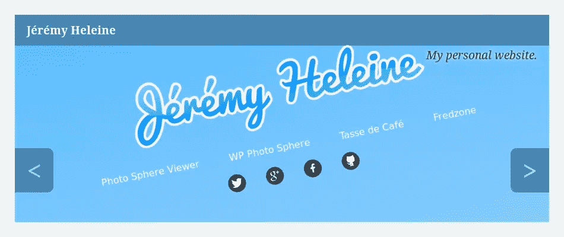

# 构建一个 WordPress Carousel 插件:第 1 部分

> 原文：<https://www.sitepoint.com/building-a-wordpress-carousel-plugin-part-1/>

在这个 3 部分系列中，我们将看看如何使用 WordPress 链接管理器 API 构建一个 WordPress carousel 插件。

正如我们在介绍它时看到的，[链接管理器](https://www.sitepoint.com/wordpress-links-manager/ "Mastering the WordPress Links Manager")是管理 WordPress 中链接列表的最佳方式。[它的 API](https://www.sitepoint.com/mastering-wordpress-links-manager-api/ "Mastering the WordPress Links Manager API") 包含的功能不多，但已经足够能够开发一些有用的应用了。

我们将不使用`wp_list_bookmarks()`，我们将使用我们在[上一篇文章](https://www.sitepoint.com/further-master-the-wordpress-links-manager-api/ "How to Further Master the WordPress Links Manager API")中看到的其他函数。

如果你还不熟悉 WordPress 链接管理器及其 API，那么在继续构建你的 carousel 之前，你可能需要先看看上面提到的这两篇文章。

旋转木马在网络上并不罕见，这也是为什么我认为如何建造一个旋转木马很有趣的原因。这也是测试我们的 WordPress 链接管理器 API 知识的好方法，为什么不呢？

## 我们要做什么？

我们可以在网络上找到许多不同的传送带，所以在开始之前，我们需要确切地定义我们想要建立什么。

### 游客会看到什么？

我们的旋转木马将展示一系列“物品”,每个物品由一个背景图像组成(大或小，由你选择！)并且每一个都将被链接到一个自定义的 URL。图像的名称将显示在顶部，而它的描述将在下面。下图是一个可能出现在我们的旋转木马项目的例子。



你应该注意这个图像上的箭头。由于我们正在建立一个旋转木马，我们想展示一系列项目。由于这些箭头，我们的访问者将能够显示下一个/上一个。

请注意，这个图像只是一个例子，你将能够自定义我们将要做的事情的风格。

### 我们需要什么？

现在我们知道了要构建什么，是时候看看我们需要什么工具来实现我们的目标了。

因为我们的转盘只不过是一个链接列表，我们将使用 WordPress 链接管理器来存储它们。从链接管理器 API 中，我们将只使用函数`get_bookmarks()`来获取我们在转盘中显示为“项目”的链接。

为了制作这个旋转木马的动画，我们将使用 JavaScript 和 jQuery。这样的话，我们就不用担心浏览器的兼容性了。

为了编写可读和易于编辑的代码，我们将创建一个插件来定义显示转盘的函数。然后，我们可以在任何想要显示转盘的地方使用这个函数。

## 向我们的传送带添加项目

在显示项目之前，我们需要添加它们及其相关信息。我们必须尊重一些规则，以获得相同的结果为每个项目(图像，名称，描述和链接网址)我们添加到传送带。

您可以选择您喜欢的链接的名称、URL 和描述。但是，您在“高级”部分使用的图像必须具有正确的尺寸，因为我们不会调整它的大小。您可以选择想要的大小，但请务必始终选择相同大小(或至少更大)的图像。

我们需要为我们的旋转木马创建一个类别。这样，我们将知道在哪里搜索，并且我们可以继续使用链接管理器，而不用在转盘中添加新的链接。我选择创建一个名为“Carousel”的类别，但是，在这里，你可以随意使用。

最后，关于`target`和`rel`属性，如果您愿意，可以使用它们，因为我们的代码会显示它们。

## 让我们创建我们的插件！

我们的插件将使用几个文件，所以我们需要创建一个文件夹来包含这些文件。你可以给这个文件夹起任何你想要的名字，但是你必须把它放到`wp-content/plugins`文件夹中，除非你想把它变成一个 [mu 插件](https://www.sitepoint.com/wordpress-mu-plugins/ "What are WordPress MU-Plugins?")。

插件的主文件有两个重要的作用:指示我们插件的名称和 WordPress 使用的其他信息，以及定义显示 carousel 的函数。我把它叫做`carousel.php`，但是你可以选择任何你想要的名字。将其放入您刚刚创建的文件夹中。

正如我们在关于[如何在 WordPress.org](https://www.sitepoint.com/create-awesome-wordpress-org-page-plugin/ "How To Create an Awesome WordPress.org Page for Your Plugin")上创建一个令人敬畏的插件页面的文章中看到的，这个文件必须以一个特殊的注释开始，如下所示。

```
/*
Plugin Name: Carousel
Plugin URI:
Description: Creates a simple carousel
Version: 0
Author: Jérémy Heleine
Author URI: http://jeremyheleine.me
License: MIT
*/
```

同样，您可以随意填写这些字段。尤其是，我很确定你的名字不是我的！

## 展示我们的旋转木马

在同一个文件中，我们定义了一个新函数。我选择叫它`display_carousel()`。如果可能的话，它必须是唯一的(我们不可能知道世界上所有开发人员使用的所有函数名)，但它也应该是简单的，因为每当我们想要显示 carousel 时，我们都会调用这个函数。

```
function display_carousel() {
}
```

### 检索正确的项目

我们在这个函数中做的第一件事是检索要显示的项目。因为我们想要创建一个比列表更复杂的显示，`wp_list_bookmarks()`不合适，所以我们将使用`get_bookmarks()`。

我们不想检索链接管理器中的所有链接，所以我们必须向该函数传递一个参数。我们将使用以下阵列中列出的四个选项。

```
$args = array(
	'category_name' => 'carousel',
	'orderby' => 'link_id',
	'order' => 'DESC',
	'limit' => 5
);
```

第一个选项选择我们想要显示的类别。我们只想要一个类别，我们知道它的名字，所以选择它的最简单的方法是使用选项`category_name`。

然后我们点菜。使用我们传递给`orderby`和`order`的值，在我们的转盘中显示的第一个项目将是用户添加的最后一个项目。这样，最老的项目将会出现在传送带的末端，或者由于`limit`这个选项，甚至根本不会出现。我选择不显示超过五个项目。您可以选择不同的限制，甚至可以选择总是显示所有项目，但使用限制的好处是，我们不必删除旧项目来隐藏它们。

现在我们有了自己的选项，我们将它们传递给`get_bookmarks()`来检索我们的项目。然后，我们计算检索到的链接的数量，如果我们存储的条目少于我们指定的限制(我们稍后将使用这个数字)，那么这个数量可能与上面设置的`limit`不同。

```
$links = get_bookmarks($args);
$n = count($links);
```

### 轮播只不过是一个列表

然后我们显示我们的转盘，有一个条件:如果没有什么要显示，我们不想显示任何东西，所以我们必须测试我们的`$links`数组是否为空。

```
if (!empty($links)) {
	// Here's the code to display the carousel
}
```

我们从现在开始写的所有代码都必须在这种情况下。

我们将 carousel 封装到一个`div`中，因此，首先，我们打开它。您可以使用`echo`或者使用`?>`退出 PHP 代码。我个人更喜欢第二个选项，所以这是我在这里使用的一个。

```
if (!empty($links)) {
	?>
	<div id="carousel">
		<ul>
		</ul>
	</div>
	<?php
}
```

注意`ul`标签。如果我们仔细想想，我们的 carousel 只不过是一个具有奇特风格和特性的链接列表，所以在列表中显示我们的链接(条目)是一个好主意。

对于包含在`$links`数组中的每一项，我们在上面打开的列表中显示一个`li`标签。为此，我们在这个标签中打开了一个`foreach`循环。

```
<ul>
	<?php
	foreach ($links as $i => $link) {
	}
	?>
</ul>
```

注意`$i`变量。我们需要这个迭代器来知道我们在列表中的位置。这样，我们就知道是否必须显示“上一个”和“下一个”箭头(感谢我们上面定义的`$n`变量)。

### 准备未来属性

在显示`li`标签之前，我们将创建一些变量。事实上，我们所有的商品都不会展示相同的东西。对于它们中的每一个，我们都有不同的图像要显示，并且对于`target`和`rel`属性有不同的值。这里我选择通过创建这些变量来开始循环。如果您愿意，您可以稍后定义它们，就在它们使用之前。

```
// We are here in the loop
// Background image
if (!empty($link->link_image))
	$background = 'url(' . $link->link_image . ')';
else
	$background = 'rgb(' . rand(0, 255) . ', ' . rand(0, 255) . ', ' . rand(0, 255) . ')';
```

首先，我们确定背景变量的值。我们将在 CSS 属性`background`中显示`$background`的值。我们做了一个测试，以确保我们有一个图像显示:如果存在，我们在背景中显示它。如果当前链接没有图像，我们在背景中显示一个随机的颜色。正如你所想象的，这不是最好的解决方案，所以你可以选择创建一些不同的东西，比如一个固定的颜色，一个在预定义列表中选择的随机颜色，或者一个默认图像。在这里，我们惩罚一个项目的创建者，他忘记了通过显示一个随机的颜色来包含一个图像，这个颜色很有可能是丑陋的。

```
// Target attribute
if (!empty($link->link_target))
	$target = ' target="' . $link->link_target . '"';
else
	$target = '';
```

在定义了背景之后，我们定义了`target`属性。如果为链接的`target`指定了一个值`link_target`不为空，那么我们显示该属性，否则它将被忽略，并且不使用目标属性，以保持代码尽可能的干净。

下面你会发现我们在循环开始时定义的最后一个变量。为了管理`rel`属性，我们使用了与管理`target`相同的过程。

```
// Rel attribute
if (!empty($link->link_rel))
	$rel = ' rel="' . $link->link_rel . '"';
else
	$rel = '';
```

注意，我们在这里写了`if… else`语句，但是我们也可以使用三元运算符。

### 显示主链接

然后我们创建带有背景的`li`标签。

```
foreach ($links as $i => $link) {
	// …
	// Creation of the background, target and rel variables
	// …
	?>
	<li style="background: <?php echo $background; ?>;">
	</li>
	<?php
}
```

我们将在这个`li`标签中找到三个`a`标签:主标签包含有人点击图像时使用的目标 URL，以及两个箭头(如果我们需要的话)。它们中的每一个都有自己的 CSS 类，因此它们可以相应地进行样式化。

首先，我们找到主`a`标签，它将是一个指向我们想要的 URL 的“真实”链接(另外两个`a`标签只是按钮)。在之前创建的`li`标签中，我们插入了具有正确属性的`a`标签。

```
<a
	class="carousel-link"
	href="<?php echo $link->link_url; ?>"
	title="<?php echo $link->link_name; ?>"
	<?php echo $target . $rel; ?>
	>
</a>
```

第一个属性是 CSS 类。您可以选择您想要的任何名称作为类名，但是您必须为另外两个`a`标签选择不同的名称。然后我们找到了`href`属性。我们还包含了显示链接名称的`title`属性。这是可选的，但为什么不呢？

最后，我们找到了`target`和`rel`属性，它们只有在有值的情况下才会显示。

在下面的`a`元素中，我们将显示链接的名称及其描述作为内容。我选择在一个`strong`标签中显示名字，在一个`em`标签中显示描述，但是你可以随意选择。

```
<a href="<?php echo $link->link_url; ?>">
	<strong><?php echo $link->link_name; ?></strong>
	<?php
	if (!empty($link->link_description)) {
		?>
		<em><?php echo $link->link_description; ?></em>
		<?php
	}
	?>
</a>
```

注意，这里我删除了除`href`之外的所有属性，以使代码更具可读性。

我还添加了一个显示描述的测试。该条件测试描述字段是否为空。如果它是空的，我们什么也不显示，因此如果你没有输入描述，我们不会在转盘中找到空的`em`标签。

### 显示箭头

旋转木马的显示几乎完成，现在唯一缺少的细节是箭头。我们将它们显示在`li`标签中，就在我们刚刚创建的链接之后，但不是每次都显示。我们不想在第一个项目上显示“上一个”箭头，或者在最后一个项目上显示“下一个”箭头。

如果需要，让我们显示“上一个”箭头。为了确定当前链接是否是第一个，我们可以测试迭代器`$i`。如果它等于零，那么它指的是第一个链接，我们不显示任何内容。

```
<li>
	<!-- Here is the link created above -->

	<?php
	// Previous link
	if ($i > 0) {
		?>
		<a href="#prev" class="carousel-prev">&lt;</a>
		<?php
	}
	?>
</li>
```

在上面的代码中，再次删除了`li`标签中的属性，以使示例更加清晰。

关于`a`标签就不多说了。属性的值可以是您想要的任何值，类名也是如此。内容是用户将会看到的，所以很重要。这里我选择显示一个`<`符号。

显示“下一步”箭头的代码类似。我们改变测试来检测我们是否在最后一项上。为此，我们使用之前创建的`$n`变量。如果当前链接是最后一个，那么`$i`等于`$n - 1`(因为`$i`以值`0`而不是`1`开始)。

```
<?php
// Next link
if ($i < $n - 1) {
	?>
	<a href="#next" class="carousel-next">&gt;</a>
	<?php
}
?>
```

我们完成了，我们的旋转木马的所有元素都显示出来了。

## 下一步是什么？

我们刚刚创建了我们的插件，看到了如何添加一个与我们的 carousel 兼容的项目，以及如何显示这些项目。目前，结果不是很好，这就是为什么我们必须加强它。

在本教程的下一部分中，我们将看到如何使用外部样式表用一点 CSS 来样式化我们的元素，在第 3 部分中，我们将使用 JavaScript 来启用项目的动画以创建功能滑块。

## 分享这篇文章