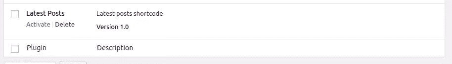
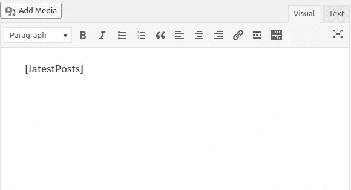
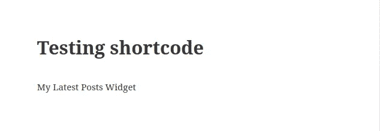
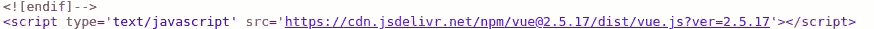
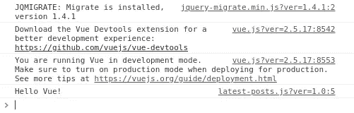
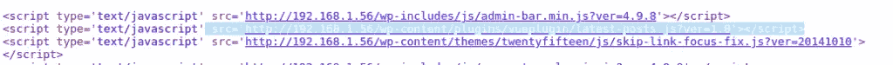
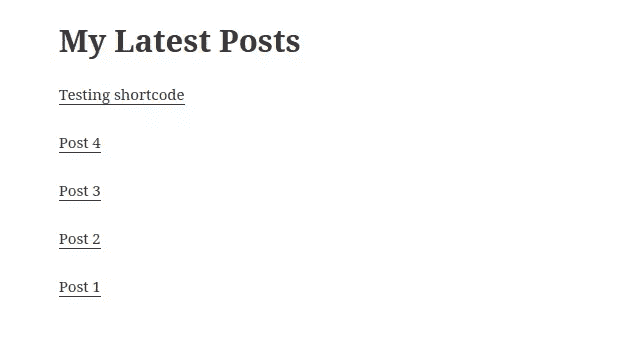

# 用 Vue 构建一个 WordPress 插件

> 原文：<https://www.sitepoint.com/building-a-wordpress-plugin-with-vue/>

在本教程中，我们将学习如何将 [Vue.js](https://vuejs.org/v2/guide/index.html#What-is-Vue-js) 与 WordPress 插件相结合，为我们的 WordPress 用户提供现代的用户界面体验。

Vue.js 是一个非常流行的渐进式 JavaScript 库，用于构建现代化的丰富用户界面，在流行度、性能和基于组件的架构方面类似于 Angular 和 React。我们将深入构建一个非常简单的带有 Vue 接口的 WordPress 插件的整个过程，该插件通过 JavaScript Fetch API 与 WordPress REST API 交互。

我们将创建一个短代码，允许我们在 WordPress 网站中添加一个*最新发布的帖子*小部件。小部件的 UI 是一个 Vue 应用程序，它通过`/wp-json/wp/v2/posts?filter[orderby]=date` WP-API 端点获取最新发布的帖子。

本教程假设你对 Vue.js 有所了解。我们将看到如何创建一个 Vue 实例，使用像`mounted()`这样的生命周期钩子，以及 JavaScript Fetch API 来与 WordPress REST API 交互。

## 创建一个 WordPress 插件

在这一节中，我们将看到如何创建一个 WordPress 插件，通过几个步骤注册一个短代码。

### 在`wp-content/plugins`中创建一个文件夹

让我们从创建插件的后端部分开始。插件位于`wp-content/plugins`文件夹中。导航到 WordPress 安装文件夹中的这个文件夹，为你的插件创建一个子文件夹。姑且称之为`vueplugin`:

```
cd /var/www/html/wp-content/plugins
mkdir vueplugin 
```

在您的插件文件夹中，创建一个`vueplugin.php`文件并添加初始内容:

```
<?php
/*
Plugin Name: Latest Posts
Description: Latest posts shortcode
Version: 1.0
*/ 
```

这些注释被用作插件的元信息。在我们的例子中，我们只需提供插件名称、描述和版本。

如果您访问管理界面中的插件页面，您应该能够看到您的插件列表:



### 创建短代码

短代码通过 WordPress 插件使用，使用户能够向帖子和页面添加内容。要注册一个短代码，您需要在插件文件中添加以下最少的代码:

```
function handle_shortcode() {
    return 'My Latest Posts Widget';
}
add_shortcode('latestPosts', 'handle_shortcode'); 
```

我们正在注册一个名为*latest post*的短代码。

WordPress 提供了内置的`add_shortcode()`函数来在你的 WordPress 插件中创建短代码。该函数将一个名称作为第一个参数，将处理短代码逻辑并返回输出作为第二个参数的处理函数作为第一个参数。

在这一点上，我们只是从我们的短代码中返回一个静态字符串，但是短代码在用于插入动态内容时更有用。

现在，让我们通过点击插件名称下方的*激活*链接，从管理界面激活插件:


您可以用方括号将短代码括起来，即`[SHORTCODE_NAME]`。括号内的文本是我们作为第一个参数传递给`add_shortcode()`函数的名称。它被作为第二个参数传递的 PHP 函数返回的输出所替代。

为了测试我们的短代码是否成功注册，我们可以创建一个新帖子，并在帖子内容中添加`[latestPosts]`:



您应该会看到*我的最新帖子窗口小部件*呈现的句子:



现在，让我们使用 Vue.js 显示最新的帖子，而不是显示静态的 *My Latest Posts 小部件*字符串。

## 用 WordPress 插件集成 Vue.js

[Vue 文档](https://vuejs.org/v2/guide/)列出了使用 Vue.js 的不同方法。最简单的方法是使用`<script>`标签来包含库脚本，这也是将 Vue.js 与 WordPress 集成的最直接的方法。

你可以通过几个简单的步骤将 Vue 应用与 WordPress 集成:

*   首先，你需要在 WordPress 中添加一个 DOM 元素(比如通过一个 shortcode ),在那里你可以挂载 Vue 应用。
*   接下来，您需要将 Vue 库脚本入队。
*   最后，您需要在一个单独的 JavaScript 文件中创建一个 Vue 应用程序，并对其进行排队。

与使用 WordPress 的传统方法不同，使用 Vue.js 将允许你添加更好的交互性和用户体验。用户可以与页面交互并动态更新界面，而不需要不断地重新加载当前页面。用 Vue.js 创建的应用程序被称为 spa，或单页应用程序。但是在我们的例子中，我们没有创建一个完整的 SPA，而是只使用 Vue.js 创建一个简单的小部件，它可以用来在页面的一小部分(比如侧边栏)中呈现信息。把用 Vue.js 创建的小部件想象成一个小 SPA。

让我们从在 WordPress 中排队 Vue 库开始。我们需要在插件中添加另一个函数来处理 Vue 库的排队:

```
function enqueue_scripts(){
   global $post;
   if(has_shortcode($post->post_content, "latestPosts")){
                wp_enqueue_script('vue', 'https://cdn.jsdelivr.net/npm/vue@2.5.17/dist/vue.js', [], '2.5.17');
   }           
} 
```

我们首先检查我们显示的帖子是否包含我们的*latest post*short code，然后我们使用`wp_enqueue_script()`函数将 Vue 脚本排队。

您可以通过访问您的帖子源代码来检查该脚本是否包含在内:



接下来，返回到`handle_shortcode()`函数，并将其更改为包含一个`<div>`，我们可以在其中呈现一个 Vue 应用程序:

```
<div id="mount"></div> 
```

接下来，在插件文件夹中创建一个`latestposts.js`文件，并添加以下代码来创建一个 Vue 实例:

```
( function() {
  var vm = new Vue({
    el: document.querySelector('#mount'),
    mounted: function(){
      console.log("Hello Vue!");
    }
  });
})(); 
```

我们用`Vue()`函数创建一个新的 Vue 实例，这是启动 Vue 应用程序的第一步。

在创建 Vue 实例时，您还需要提供一个 *options* 对象，它允许您为构建您的 Vue 应用程序提供不同的选项。

在我们的例子中，我们使用`el`属性为 Vue 实例提供一个现有的 DOM 元素来挂载。这可以是 CSS 选择器，也可以是实际的`HTMLElement`。在我们的例子中，我们使用`document.querySelector('#mount')`来获取 ID 为`#mount`的`<div>`的 HTML 元素。

我们还使用`mounted`属性来提供一个函数，该函数将在实例挂载后被调用。至此，我们只记录一个 *Hello Vue！*控制台上的弦。

您还可以在 [API 参考](https://vuejs.org/v2/api/#Options-Data)中浏览可用选项的完整列表。

接下来，就像 Vue 库一样，您需要将这个文件入队。在`enqueue_scripts()`函数中添加以下代码:

```
wp_enqueue_script('latest-posts', plugin_dir_url( __FILE__ ) . 'latest-posts.js', [], '1.0', true); 
```

`plugin_dir_url()`内置函数用于获取文件的绝对 URL。`__FILE__`是一个常量，给出当前 PHP 文件的文件系统路径。这将允许我们获得`latest-posts.js`文件的绝对路径，而无需使用任何硬编码的 URL，这些 URL 可能会在不同的系统上被更改。

此时，您应该会看到 *Hello Vue！*浏览器控制台上的字符串:



您还应该看到包含 shortcode 的帖子的源代码中包含的`latest-posts.js`脚本。



接下来让我们修改插件来呈现之前的*我的最新帖子小部件*字符串，但是这次是来自 Vue。在您的 Vue 实例中，将 template 属性包含在您想要呈现的任何 HTML 代码中:

```
 var vm = new Vue({
   el: document.querySelector('#mount'),
   template: "<h1>My Latest Posts Widget</h1>",
   mounted: function(){
   console.log("Hello Vue!");
 }
}); 
```

现在，让我们使用 fetch API 获取并呈现最新的帖子。

在 Vue 实例中，添加一个带有 posts 数组的`data`属性，该数组将保存获取的帖子:

```
 var vm = new Vue({
   el: document.querySelector('#mount'),
   data: {
    posts: []
   }, 
```

接下来，让我们包含代码来获取在组件装载到 DOM 上时触发的*装载的*生命周期事件中的最新帖子:

```
 var url = '/wp-json/wp/v2/posts?filter[orderby]=date';
 fetch(url).then((response)=>{
    return response.json()
  }).then((data)=>{
    this.posts = data;
  }) 
```

我们调用返回承诺的 JavaScript `fetch()`方法。成功解析承诺后，我们将数据分配给`posts`数组。

最后，添加*模板*属性:

```
template: `<div><h1>My Latest Posts</h1>
  <div>
    <p v-for="post in posts">
      <a v-bind:href="post.link">{{post.title.rendered}}</span></a>
    </p>
  </div>
</div>`, 
```

我们使用 Vue `v-for`指令遍历帖子，并显示每个帖子的`title.rendered`和`link`属性。

这是给我的结果截图。



在你的情况下，它可能看起来不同，取决于你的活动主题和你在 WordPress 网站上的文章。

如果你点击文章标题，你会被带到文章页面。

我们可以向小部件添加更多功能，比如实时数据获取，这样用户就不需要重新加载页面来检索最新发布的帖子。我们可以通过使用 JavaScript `setInterval()`方法持续轮询 WP-API 端点来实现这一点。

首先，将获取文章的代码移动到它自己的方法中:

```
 var vm = new Vue({
  /*...*/

 methods:{

  fetchPosts: function(){
    var url = '/wp-json/wp/v2/posts?filter[orderby]=date';
    fetch(url).then((response)=>{
      return response.json()
      }).then((data)=>{
        this.posts = data;
        console.log(this.posts);
      });
  }
 }, 
```

我们使用 Vue 实例的`methods`属性在我们的 Vue 实例中添加定制方法。然后，您可以通过`this`在实例上直接访问这些方法。

接下来，在`mounted()`函数中，添加以下代码以每五秒获取一次帖子:

```
 var vm = new Vue({
  /*...*/
 mounted: function() {
   console.log("Component is mounted");

   this.fetchPosts();
   setInterval(function () {
    this.fetchPosts();
   }.bind(this), 5000);
 } 
```

你可以通过在另一个浏览器的标签中打开 WordPress 管理界面并添加一篇新文章来测试这一点。您应该看到您的 Vue 小部件更新了一篇新文章，而无需手动刷新页面。

## 结论

在本教程中，我们看到了如何创建一个利用 Vue.js 库的 WordPress 插件。我们已经创建了一个短代码，可用于在您的帖子和页面中显示 Vue 组件，该组件每五秒钟获取并显示最新的帖子。这是通过使用`setInterval()`方法轮询 WordPress REST API 实现的。

## 分享这篇文章