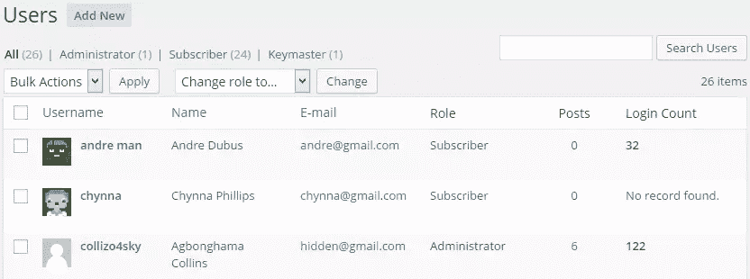

# 构建一个 WordPress 用户登录计数器插件

> 原文：<https://www.sitepoint.com/building-a-wordpress-user-login-counter-plugin/>

WordPress 可以说是网络上最受欢迎的内容管理系统。

据《福布斯》报道，全球有超过 6000 万个网站采用了这种技术。这样的数字表明，WordPress 无疑是内容管理系统(CMS)的主要竞争者。

WordPress 的一个主要吸引力是它的大量插件。想建立一个电子商务商店？有 **WooCommerce** 。求职门户怎么样？有 **WP 作业管理器**。

在本教程中，我们将学习如何构建一个插件来计算用户登录 WordPress 支持的网站的次数，登录统计显示在用户列表页面的自定义栏中。



## 插件开发

WordPress 插件中的大部分文件由 PHP 文件组成，位于`/wp-content/plugins/`目录中。在我们的例子中，这个文件将被称为`wordpress-login-count.php`。我假设您已经习惯了使用 FTP/SFTP/SCP 或 SSH 连接到您的服务器。

如果您想继续，创建插件 PHP 文件`wordpress-login-count.php`。完整的插件将在本教程的末尾提供下载。

首先，包括插件头。如果没有标题，WordPress 将无法识别插件。

```
<?php

/*
Plugin Name: WordPress User Login Counter
Plugin URI: http://sitepoint.com
Description: Count the number of times users log in to their WordPress account.
Version: 1.0
Author: Agbonghama Collins
Author URI: http://w3guy.com
License: GPL2
*/
```

然后，我们添加一个 PHP 名称空间并创建插件类，如下所示。

```
namespace Sitepoint\WordPressPlugin;

class Login_Counter {
// ...
```

插件所需的所有动作和过滤器挂钩都将进入`init()`方法。

```
public function init() {
        add_action( 'wp_login', array( $this, 'count_user_login' ), 10, 2 );

        add_filter( 'manage_users_columns', array( $this, 'add_stats_columns' ) );

        add_action( 'manage_users_custom_column', array( $this, 'fill_stats_columns' ), 10, 3 );
    }
```

当用户登录时，WordPress 会触发`wp_login`动作钩子，因此这是我们用来计算用户登录次数的合适钩子。

下面的函数`count_user_login()`进行计数。

```
 /**
     * Save user login count to Database.
     *
     * @param string $user_login username
     * @param object $user WP_User object
     */
    public function count_user_login( $user_login, $user ) {

        if ( ! empty( get_user_meta( $user->ID, 'sp_login_count', true ) ) ) {
            $login_count = get_user_meta( $user->ID, 'sp_login_count', true );
            update_user_meta( $user->ID, 'sp_login_count', ( (int) $login_count + 1 ) );
        } else {
            update_user_meta( $user->ID, 'sp_login_count', 1 );
        }
    }
```

**代码解释:**首先我们检查用户是否有空的`sp_login_count`元字段。
如果为假，我们得到先前保存的登录计数并加 1，如果为真，这意味着用户第一次登录。因此，将根据用户元字段保存值`1`。

用于向 WordPress 用户列表页面添加额外一列的`manage_users_custom_column`过滤器用于添加一个**登录计数**列，该列将输出用户登录的次数(见上面的截图)。

挂钩到`manage_users_custom_column`的函数`fill_stats_columns()`添加新列。

```
 /**
     * Fill the stat column with values.
     *
     * @param string $empty
     * @param string $column_name
     * @param int $user_id
     *
     * @return string|void
     */
    public function fill_stats_columns( $empty, $column_name, $user_id ) {

        if ( 'login_stat' == $column_name ) {
            if ( get_user_meta( $user_id, 'sp_login_count', true ) !== '' ) {
                $login_count = get_user_meta( $user_id, 'sp_login_count', true );

                return "<strong>$login_count</strong>";
            } else {
                return __( 'No record found.' );
            }
        }

        return $empty;
    }
```

**代码解释:**第一个`if`条件确保我们确实在`login_stat`列中。
下一个`if`条件检查用户的登录计数是否存在。如果为真，则返回登录计数，或者返回文本`No record found`。

`get_instance()`方法创建该类的单例实例，然后调用`init()`方法注册各种动作和过滤器挂钩。

最后，我们将调用`get_instance()`方法让 PHP 类工作。

```
Login_Counter::get_instance();
```

瞧啊。我们已经完成了登录计数器插件的编码。

## 包裹

要进一步了解插件是如何构建的，并在你的 WordPress powered 网站上实现它，请从 GitHub 下载它[。](https://github.com/Collizo4sky/WordPress-User-Login-Counter/archive/master.zip)

我希望这对你学习如何开发 WordPress 插件有所帮助。

请在评论中告诉我们你的想法。

## 分享这篇文章