# 在 Photoshop 中构建和控制大量输入的设计

> 原文：<https://www.sitepoint.com/building-and-controlling-type-within-photoshop-cs6/>

过去，设计师常常将排版项目留给夸克和 InDesign。您总是可以在 Photoshop 中调整文字，但是要进行严肃的排版工作，您需要将您的工作放入 Quark 或 InDesign 中，那里有段落和字符样式。现在不再是这种情况了。Photoshop CS6 的开发让设计人员能够快速轻松地控制最大的文本。你不再需要将文字留给 InDesign 或其他“文字友好”的软件。

在 Photoshop 中控制文字的第一个地方是字符面板。

[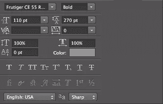](https://www.sitepoint.com/wp-content/uploads/2012/07/Screen-shot-2012-07-25-at-9.16.56-PM.png)

这是我们可以控制字体的面板:它的粗细、字体大小、字体、行距、字距和字距。第二组控件决定文字的垂直比例:水平比例、基线偏移和文字的实际颜色。在那些下面，你有假的设置，如果那个重量不可用，Photoshop 会为你伪造设置。这些包括仿粗体、斜体、全部大写、小型大写等。远离假粗体和斜体，因为伪造真的会扭曲你的字体。适当的粗体和斜体版本是精心制作的，以保持平衡，而假粗体和假斜体只是倾斜，增加字体的质量。

### 选择你的类型

使用字符面板可以轻松调整文字大小，但如果不方便，您可以选择文本，按住 Alt/Option + Command/Ctrl+Shift 并使用尖括号键(“ **>** ”和“ **<** ”)来快速控制文本的大小。

[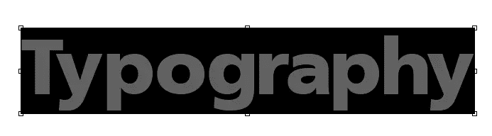](https://www.sitepoint.com/wp-content/uploads/2012/07/Screen-shot-2012-07-25-at-11.19.31-PM.png)

### 选择字体

您可以随时在“字符”面板中选取一种字样。很难预测它将会是什么样子。您也可以在屏幕顶部的选项栏中选择一种字体。在画布上选择您想要预览的文本，通过连按它来高亮显示选项栏中的字体名称，并使用上下箭头键在不同的字体之间循环。

这里有一个给文字添加效果的好技巧。如果你想保持你的文字可编辑，只需在图层面板中右键点击文字图层，然后选择“转换为智能对象”这将允许您添加过滤器和效果到您的类型，同时保持它完全可编辑。要更改文本中的措辞，请双击“图层”面板中的智能对象图标，您的文字将在一个单独的临时文档中打开。

[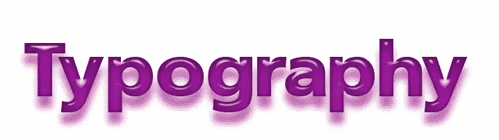](https://www.sitepoint.com/wp-content/uploads/2012/07/Screen-shot-2012-07-26-at-2.47.36-AM.png)

[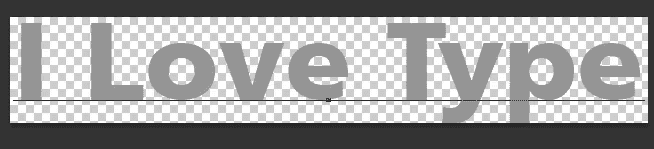](https://www.sitepoint.com/wp-content/uploads/2012/07/Screen-shot-2012-07-26-at-2.48.07-AM.png)

选择文本工具，更改文本，保存临时文档，并返回到原始文件以查看更新的更改。

### 字体粗细

字体有不同的粗细，这意味着它们或粗或细，是为不同的场合而设计的。如果你跟着我，我会用 Frutiger CE 55 Roman Bold 作为标题。您可以从截图中看到，这种字体有许多不同的粗细，从非常细的浅色到粗体和黑色。

[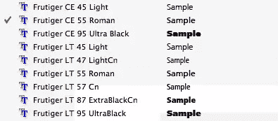](https://www.sitepoint.com/wp-content/uploads/2012/07/Screen-shot-2012-07-25-at-8.16.15-PM.png)

### 主要的

行距用于控制正文中每行文本之间的间距。要画出正文的限定部分，您只需选择文本工具，然后单击并拖动您想要的文本区域。如果它不是完美的，你将有手柄，允许你点击和拖动来调整你的文本边框的大小。这样你就不必在每一行的末尾按回车键，因为这可能会在文本中造成难以解决的换行问题。

[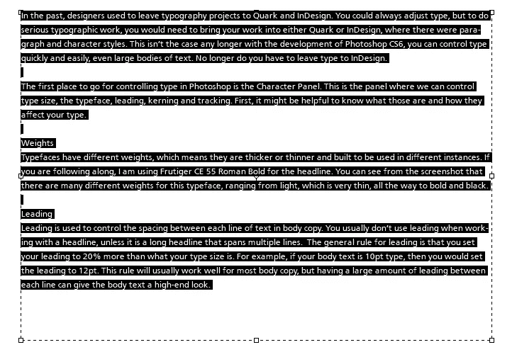](https://www.sitepoint.com/wp-content/uploads/2012/07/Screen-shot-2012-07-25-at-11.23.30-PM.png)

处理标题时通常不使用前导，除非它是一个跨越多行的长标题。行距的一般规则是，无论字体大小如何，都要将行距设置为 20%以上。例如，如果正文字体为 10pt，那么可以将行距设置为 12pt。这个规则通常适用于大多数正文，但是在每行之间有大量的前导可以给正文一个高端的外观。在下面的示例中，第一个被设定为 16 磅行距，但第二个被设定为 20 磅行距。你可以看到仅仅几个额外的引导点的区别，它使文本更容易阅读。排版问题通常源于行距太近。当我们的目光从当前行的末尾移到下一行时，如果开头太拥挤，我们可能会意外地重读第一行，这可能会让读者感到沮丧。你给读者的引导越多(在合理的范围内)，他们就越容易阅读。

本示例使用 16 磅的行距。

[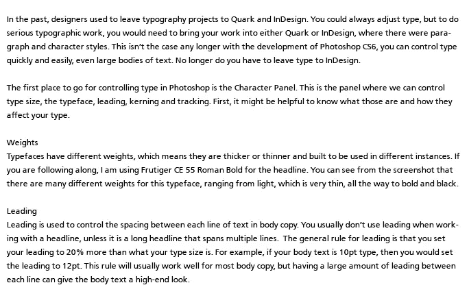](https://www.sitepoint.com/wp-content/uploads/2012/07/Screen-shot-2012-07-25-at-8.31.03-PM.png)

本例使用 20 磅的行距。

### 跟踪

跟踪是指与字母组甚至整个段落的间距。许多设计者将此设置保留为默认设置，因为跟踪通常不是问题，但是知道这一点是有好处的，尤其是当您需要将类型限制在某个区域时。您通常会最小程度地调整字距，以使文本适合设定的区域。

### 字距调整

字距是指两个字母之间的间距。这一点很重要，尤其是对于粗体标题，因为当设置为默认设置时，有时某些字母不能很好地相互配合。字距调整允许你调整某些字母之间的间距。我们关注字母的字距调整的原因是，某些字体——某些字母组合——最终会在它们之间增加过多的空间。这使得单词在视觉上被分解，观众最终会将文本阅读成两个或更多的单词，而不是一个，误解了我们的信息并造成混乱。您可以在下面的示例中看到，没有发生任何重大问题，但仍有几个字母存在一些问题。这很大程度上是主观的，但总体目标是每个字母之间有一致的间距。

[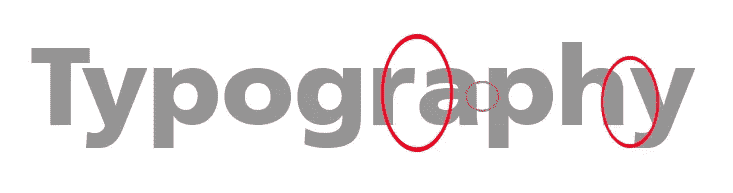](https://www.sitepoint.com/wp-content/uploads/2012/07/Screen-shot-2012-07-25-at-8.50.10-PM.png)

在 Photoshop 中调整字母间距的快速方法是在要调整间距的字母之间单击。在下面的例子中，我们将把光标放在“排版”中的“R”和“A”之间然后，您可以使用键盘快速进行调整。为此，按住 Alt/Option 并使用左箭头键减少字距调整量，使用右箭头键增加两个字母之间的间距。下面是调整每个字母之间的字距后的标题。

### 段落面板

“段落”面板是您可以控制文本对齐、边距和断字等内容的面板。典型的对齐方式有左对齐、右对齐、居中对齐和两端对齐。Photoshop 甚至包括两端对齐选项，强制最后一行左对齐、右对齐或居中对齐。还可以确定段落前后是否有空格。

[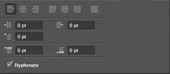](https://www.sitepoint.com/wp-content/uploads/2012/07/Screen-shot-2012-07-26-at-12.23.45-AM.png)

你也有字符和段落样式。这非常方便，因为它们的工作方式与 InDesign 和 Quark 中的字符和段落样式相同。如果你想用某种方式来设计一个单词或一个标题，字符样式通常是一个很好的选择。字符样式不是为每个标题设置样式，而是允许您在可以选择要格式化的文本的位置进行设置，并且您可以点按样式以立即实施您之前确定的设置。“字符样式”面板的工作方式与“图层”面板非常相似。新建图层图标实际上创建了一个新的样式，垃圾桶删除了它。圆形图标实际上是不同的；它清除当前选定字符样式的样式。

[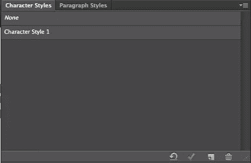](https://www.sitepoint.com/wp-content/uploads/2012/07/Screen-shot-2012-07-26-at-1.37.59-AM.png)

点击新样式图标，你会看到一个未命名的字符样式。双击字符样式层打开它，并查看不同的可用选项。以下是您可以使用的第一组选项。这是你命名你的风格和选择你的字体，它的大小，大小写，如果它是上标或下标，或者如果它是下划线，等等。你也可以选择颜色。

[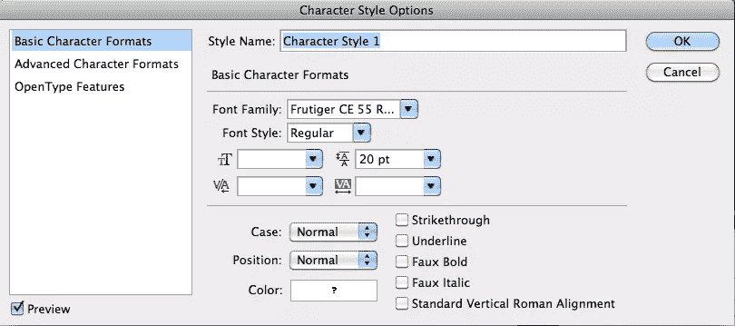](https://www.sitepoint.com/wp-content/uploads/2012/07/Screen-shot-2012-07-26-at-1.38.51-AM.png)

下一部分决定了垂直和水平缩放比例(如果由于某种原因你正在拉伸你的字体，这是不推荐的)，它也决定了你的基线移动。这是文本的底线向上移动的地方，以给出首字下沉的外观。

[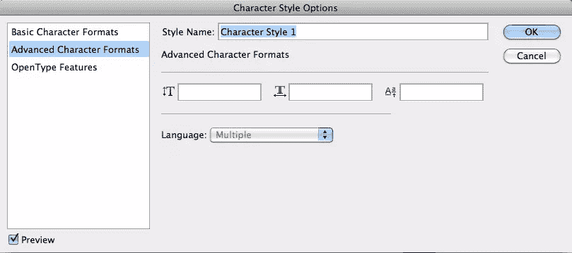](https://www.sitepoint.com/wp-content/uploads/2012/07/Screen-shot-2012-07-26-at-1.39.10-AM.png)

第三个选项是 OpenType 字体。这些将包括额外的选项，如连字，其中并排字母的横条组合在一起，或者“f”的横条与小写“I”上的点组合在一起。

[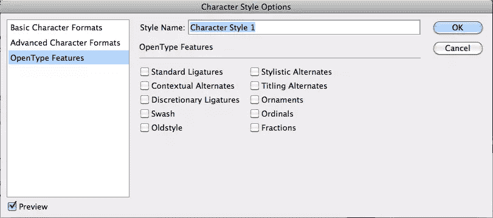](https://www.sitepoint.com/wp-content/uploads/2012/07/Screen-shot-2012-07-26-at-1.39.20-AM.png)

“段落样式”面板与前三个面板完全相同，但实际上还有四组选项适合您的类型。第一个是缩进和间距。正是在这里，您可以决定如何缩进文本，以及在每个段落之间放置多少空间。

[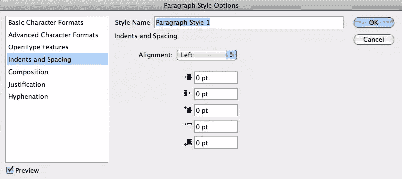](https://www.sitepoint.com/wp-content/uploads/2012/07/Screen-shot-2012-07-26-at-2.17.15-AM.png)

下一个选项是构图。您可以选择单行或多行排版。在单行中，它会单独处理每一行，但在多行排版中，它会一起处理，给你一个更紧凑、更干净、更一致的段落。应该检查罗马悬挂标点符号，因为它将您的引号设置在您的文本块之外，以便每行文本都对齐，而不是将您的引号包含在行内。这使得你所有的文字在视觉上排成一行，看起来更专业。

[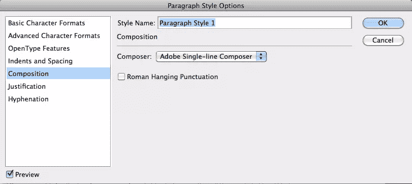](https://www.sitepoint.com/wp-content/uploads/2012/07/Screen-shot-2012-07-26-at-2.25.23-AM.png)

对齐使您能够最大限度地控制对齐的文本。您可以确定每个单词、每个字母之间的间距以及字形缩放。对于间距选项，您可以确定单词和单个字母之间的最小和最大间距。这是让你的对齐段落看起来最好的一个极好的方法。

[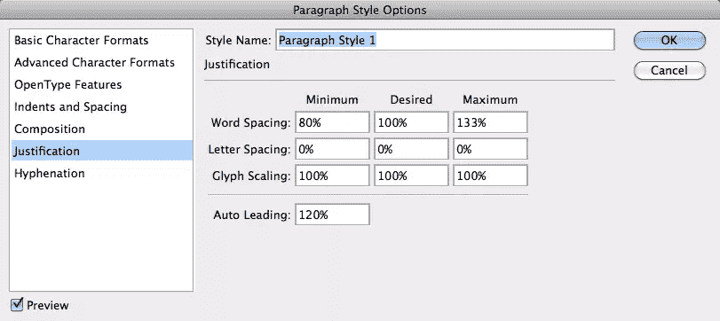](https://www.sitepoint.com/wp-content/uploads/2012/07/Screen-shot-2012-07-26-at-2.31.34-AM.png)

最后一个选项，断字，允许您设置自定义规则，以确定何时对段落中的单词进行断字。您可以确定单词的字符长度以及在单词中放置连字符的位置。这对于自定义段落中的断字非常有用。

[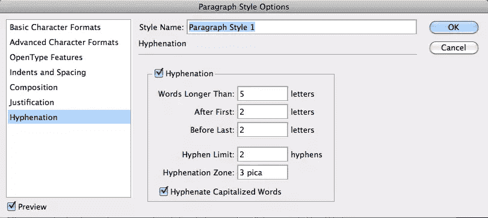](https://www.sitepoint.com/wp-content/uploads/2012/07/Screen-shot-2012-07-26-at-2.34.38-AM.png)

### 结论

Photoshop CS6 实现了很多很棒的处理文字的新功能，让你的作品看起来既专业又美观。您可以自定每个字母之间的间距，设置文字样式，甚至确定在较大的文本正文中使用的预设样式。您可以控制单词之间的间距、字母之间的间距，甚至可以决定它们对断字的反应。Photoshop CS6 为文本添加的控制级别使得在 Photoshop 中处理排版更加容易，并且看起来更加专业和精致。

你使用 Photoshop 来处理大量打字的设计吗，还是更喜欢 Indesign 或 Quark 等其他软件？

## 分享这篇文章