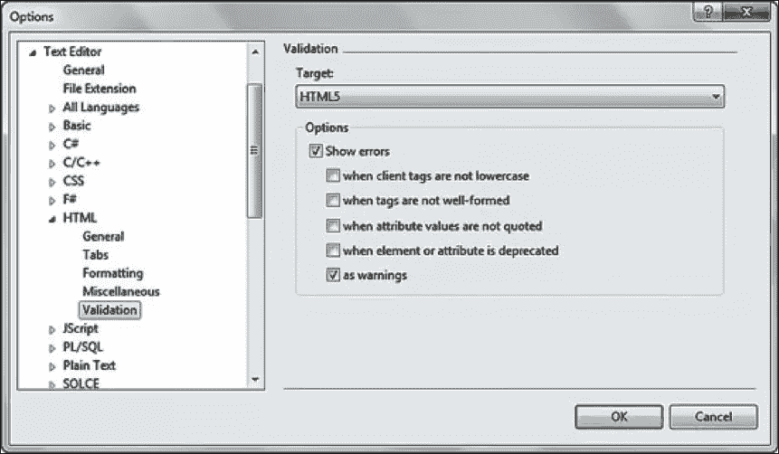
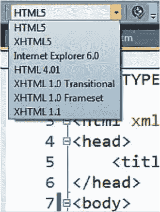
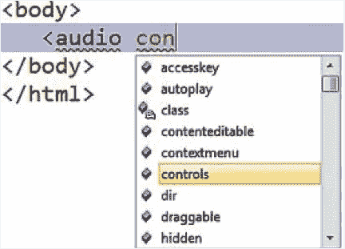

# 使用 HTML5 构建应用程序

> 原文：<https://www.sitepoint.com/building-apps-with-html5/>

HTML5 来了，Web 再也不会一样了。

你以前肯定听说过，或者类似的东西。我猜当你这么做的时候，你会很兴奋，翻白眼，或者用口型说出“为什么？”皱起了你的眉头。也许你的反应是三者的混合。

这些我都不会怪你。HTML5 是令人兴奋的，正如我们所知，它确实有改变网络的潜力，但它也被夸大了。更重要的是，它的真正含义是难以捉摸的。在用 HTML5 构建应用程序时，我亲身经历了这些反应。这是一个广泛的话题，所以很难理解 HTML5，更不用说知道从哪里开始使用这些令人兴奋的新技术了。

如果你对 HTML5 感到兴奋，我想帮助你将这种兴奋转化为可以立即付诸实践的想法。如果你持怀疑态度，我想帮助你理解 HTML5 为什么重要。如果你对 HTML5 的含义感到困惑，不要担心:这是我们这个系列的第一站。

## 什么是 HTML5

现在你可能已经发现 HTML5 对不同的人有不同的含义。对某些人来说，这只是意味着像

和这样的新标签以及标记中的一些新属性。对其他人来说，它意味着网络上所有新的和有趣的东西，包括在单一浏览器中实现的技术或其他不是 HTML5 正式部分的规范。可以肯定的是，理解 HTML5 的真正含义往往是我们许多人面临的第一个路障。

老实说，不同定义的数量也是有一定道理的。HTML5 巨大！HTML5 由一个名为万维网联盟(W3C)的国际标准团体正式定义，由 100 多个与下一代 Web 技术相关的规范组成。将所有 100 多种规范放在 HTML5 这个名字下，你可能会认为 W3C 把事情简单化了。虽然很难对 HTML5 这样宽泛的东西做出明确的定义，但我相信 W3C 正试图通过引入 HTML5 作为这种变化的统一概念来解决 Web 上正在发生变化的范围。

事实上，HTML5 是一个总括术语，描述了一组 HTML、CSS 和 JavaScript 规范，旨在使开发人员能够构建下一代网站和应用程序。这个定义中值得注意的是它的三个部分:HTML、CSS 和 JavaScript。它们定义了开发人员如何使用改进的标记、更丰富的样式功能和新的 JavaScript APIs 来充分利用新的 Web 开发功能。简单来说，HTML5 = HTML + CSS + JavaScript。

仅此而已。HTML5 是关于 HTML，CSS 和 JavaScript 的改变。这三个术语描述了 HTML5 的广度和范围，而不是担心所有 100 多个规范。还觉得这有点简单化吗？可能是这样，但是您很快就会看到，HTML5 的全面定义并不重要，重要的是您选择的技术是否值得您花费时间和精力去采用。

有了定义之后，让我们花点时间讨论一下微软在 HTML5 领域的位置。

## HTML5 和 Internet Explorer

正如我提到的，构成 HTML5 的规范集是由 W3C 管理的。W3C 由致力于推动和定义网络未来的员工、组织和个人组成。WC3 是一个基于共识的组织，通常通过成立委员会(称为工作组)来划分相关规范的大块工作。任何成员都可以提出规范，W3C 拥有的所有规范——比 HTML5 保护伞下的规范更多——从初稿到正式推荐都要经过五个阶段的过程。

微软是 W3C 的成员，在许多 HTML5 标准和工作组的规范过程中扮演着非常积极的角色。就像所有主要的浏览器供应商一样，微软在 HTML5 上进行了大量投资，并与 W3C 和其他供应商合作，以确保开发人员可以依靠 HTML5 技术在所有主要浏览器上以可互操作的方式可靠地实现。
在浏览器供应商微软的背景下，这种方法有四个方面:

*   通过 Internet Explorer 9 提供最佳的站点就绪 HTML5
*   通过 Internet Explorer 平台预览向开发人员展示即将推出的功能
*   通过提交给 W3C 的测试投资互操作性
*   通过 HTML5 实验室原型不稳定的标准

“站点就绪 HTML5”是微软用来描述你今天可以使用的 HTML5 技术的术语，因为它们在所有主流浏览器上都有广泛的支持。像新的 HTML 标签、画布、可扩展矢量图形、音频和视频、地理定位、网络存储和许多新的 CSS3 模块等技术都属于这一领域，它们在 Internet Explorer 9 和其他主流浏览器中实现。在本系列中，我们将花相当多的时间来讨论这些技术，以及如何在今天采用它们。

除了目前可用的，微软正在使用公共平台预览来通知开发者下一版本浏览器的到来，以及收集反馈。对于 Internet Explorer 9，微软每六到八周发布一次平台预览，每次都宣布新的 HTML5 增强功能、功能和性能改进，供开发者试用和评估。Internet Explorer 9 于 3 月发布，截至 7 月初，微软已经发布了 Internet Explorer 10 的两个平台预览版，这表明微软将继续定期发布 Internet Explorer 预览版。作为一名开发者，你会想利用最新的预览来学习、测试和影响浏览器的发展。你可以在 IETestDrive.com 下载最新的 Internet Explorer 平台预览版。

为了确保 HTML5 在所有浏览器上的一致性，微软在互操作性方面投入了大量资金，创建并向 W3C 提交了与 HTML5 相关的最大的测试用例套件。W3C 将首次使用这套测试用例作为每个浏览器中 HTML5“就绪性”的权威来源。对于作为开发人员的你我来说，最终的结果是我们可以一次性采用并实现 HTML5 技术，并相信它们会在所有浏览器上一致地工作。有关微软在互操作性方面工作的更多信息，请访问 bit.ly/dxB12S.

虽然一些 HTML5 技术已经存在于 Internet Explorer 9 中，并且其他技术正在通过 Internet Explorer 平台预览版为 Internet Explorer 10 发布，但一些流行的和有新闻价值的规范需要 W3C 和浏览器供应商做更多的工作，才能在我们的应用程序中实现。一个这样的例子是 Web Sockets，这是一个令人兴奋的规范，它允许开发人员打开与后端服务器的双向通信通道，从而实现 Web 应用程序中以前没有的“实时”连接级别。作为一名开发人员，您无疑可以想象 Web 套接字在您正在构建的应用程序中的无数用途。但是 Web Sockets 规范仍在快速变化，一些关键方面仍在不断变化，并且正在 W3C 内部进行讨论。在这种情况下，现在很难在所有浏览器上一致可靠地提供这种特性。

对于不稳定或不断发展的规范，如 Web Sockets(我们将在未来的文章中深入讨论)，微软创建了 HTML5 Labs，这是一个供开发人员试验这些技术的草案实现的站点。该网站提供了原型，您可以下载并在本地试用，还提供了一些规范的演示。我们的目标是给你一个地方来亲自试验这些规范，并且当这些规范在浏览器中稳定并接近实现时，给微软和 W3C 反馈。想了解更多关于 HTML5 实验室的信息，请访问 html5labs.com。

## HTML5 和微软开发工具

除了微软参与浏览器中支持的 W3C 和 HTML5 技术之外，微软对 HTML5 的方法还有一个对开发人员很重要的方面:它对 HTML5 工具的方法。

2011 年初，微软用服务包更新了两个开发工具:Visual Studio 2010 和 Expression Web 4。这两个工具的服务包都提供了用于验证的 HTML5 文档类型，以及用于新 HTML5 标记和属性的智能感知。如果您使用的是 Visual Studio 2010 SP1，您可以通过单击工具选项文本编辑器 HTML 验证，然后在目标下拉列表中选择 HTML5 选项来启用 HTML5 模式，如图 1 所示。您还可以从任何 HTML 文件中的 HTML 源代码编辑工具栏将 HTML5 设置为默认模式，如图 2 所示。

[](https://www.sitepoint.com/wp-content/uploads/2011/09/fig1.png)

通过选项对话框启用 HTML5 模式

[](https://www.sitepoint.com/wp-content/uploads/2011/09/fig2.png)

在 HTML 源代码编辑工具栏上设置 HTML5 架构

一旦设置了默认模式，您将在 Visual Studio 中获得对 HTML 中 28 个新语义标记的智能感知支持，以及新的特定标记和全局属性，如图 3 所示。

[](https://www.sitepoint.com/wp-content/uploads/2011/09/fig3.png)

Visual Studio 2010 SP1 版中的 HTML5 智能感知

微软在 2011 年 6 月发布了微软 Visual Studio 2010 SP1 版的 Web 标准更新，进一步更新了对 HTML5 的支持。该扩展适用于 Visual Studio 2010 的所有版本，为 Visual Studio 添加了进一步的 HTML5 智能感知和验证，包括针对地理定位和 DOM 存储等新浏览器功能的 JavaScript 智能感知，并提供了全面的 CSS3 智能感知和验证。您可以从 bit.ly/m7OB13.下载这个扩展，它会定期更新，为 HTML5 开发提供增强的工具

对于 Expression Web 4 SP1，在工具|页面选项下设置 HTML5 架构提供了相同的智能感知，该工具还为几个草案 CSS3 模块提供了 CSS3 智能感知，如边框半径、框阴影、变换等。

如果你正在使用 WebMatrix(见 web.ms/WebMatrix)，你可能已经注意到所有新的。html，。cshtml 或者。您创建的 vbhtml 文档包含类似于图 4 所示的默认标记。正如我将在本系列的下一篇文章中讨论的，这是一个基本的、有效的 HTML5 文档。最值得注意的是，doctype 和 meta charset 标签丢失了很多 cruft。使用这个简单的 doctype 在所有现代浏览器中触发 HTML5 模式，WebMatrix 通过默认提供一个 HTML5 文档使它变得更容易。

WebMatrix 中的默认 HTML 文档

```
 < !DOCTYPE html>
 <html lang="en"> <head> </head>
 <body></body>
 </html> 
```

如果这对你来说还不够的话，新的 HTML5 工具——自 2011 年 1 月以来，way—ASP.NET MVC 最近在 4 月的 MIX11 上宣布了 ASP.NET MVC 3 工具更新。除了许多其他伟大的新工具特性，ASP.NET MVC 3 工具更新提供了在新项目中使用 HTML5 doctype 的选项，并在新应用程序的脚本文件夹中提供了 Modernizr 1.7。Modernizr 是一个大大简化 HTML5 开发的 JavaScript 库；我将在以后的文章中深入讨论它。

这里的要点是，尽管 HTML5 刚刚出现在我们的浏览器中，但官方工具支持正在迅速增加，微软甚至正在增加对社区库(如 Modernizr)的支持。现在，您可以在 Microsoft tools 的帮助下开发 HTML5，并期待 HTML5 支持会随着时间的推移不断发展和完善。

## 在您的应用中采用“HTML5”

到目前为止，您应该意识到 HTML5 不是一个单一的实体，您可以一下子采用或迁移到它。采用 HTML5，而不是作为一个大规模的选择，是关于逐个技术进行评估，并确定哪些技术适合您的应用程序。对于您评估的每项 HTML5 技术，在决定该技术是否适合您采用时，请(至少)考虑以下因素:

*   该技术在所有主流浏览器中的实施范围有多广？
*   对于不支持给定特性的浏览器，您将如何采用这种技术和“多填充”支持？

第一个因素是最重要的，当结合对网站访问者常用的浏览器的理解时，您应该可以清楚地了解 100 多个规范中哪个子集值得进一步评估。该子集应该由一组稳定的规范组成，您现在可以为您的用户可靠地采用这些规范。

然而，即使有了这些稳定的 HTML5 技术，你也不应该忽视那些还没有迁移到新浏览器的用户。如果您大量参与网站的日常开发，您无疑对使用给定浏览器访问您网站的用户百分比有一些粗略的概念。对于我们大多数人来说，很容易看到使用旧浏览器访问的用户比例，并得出结论，采用任何 HTML5 技术都会对这些用户产生负面影响。幸运的是，有了“多填充”技术，我们就不用等到将来某个模糊的日子才采用 HTML5。

Paul Irish(jQuery 和 Modernizr 项目的开发人员)将 polyfill 定义为“…一个模拟未来 API 的垫片，为旧浏览器提供后备功能。”聚合填充就像是网站的灰泥；这是一种确定给定的 HTML5 特性对当前浏览您的站点的用户是否可用的方法，并提供一个“填充”该支持的垫片或一个优雅的降级过程，使您的站点仍然能够完全运行。与多填充相关的最流行的库是 Modernizr，我前面提到过的 JavaScript 库。Modernizr 为语义标记提供了一些基本的 polyfills，为主要的 HTML5 技术提供了特性检测，并支持基于受支持特性的条件 CSS。如前所述，Modernizr 将是下一篇文章的主题；在整个系列中，它也是一个突出的特色(和许多其他多填充库一起)。要了解更多信息，请在 modernizr.com 下载 Modernizr。

在选择采用哪种技术时，您的最终列表可能是广泛支持的规范和其他规范的组合，对于这些规范，您必须填充对某些浏览器的支持。只有你才知道基于你当前的需求和背景的列表的确切组成。

在接下来的几个月里，我将讨论几个值得注意的规范，从地理定位、表单和 Canvas，到 Web Workers、Web Sockets 和 IndexedDB。其中一些得到了广泛的支持，并且是“站点就绪的”，而一些，比如 Web Sockets，无论它们现在处于什么位置，都是开创性的，不容忽视。对于每个规范，我将讨论当前和已知的未来支持，关于如何在您的站点上实现规范特性的一些基础知识，以及如何填充对不支持给定特性的浏览器的支持。

如果你今天想更深入地研究 HTML5，我建议你挑选几本这方面的书。我特别推荐布鲁斯·劳森和雷米·夏普的《HTML5 入门》(New Riders，2010)和马克·皮尔格林的《HTML5 启动并运行》(O'Reilly Media，2010)。此外，请务必访问 W3C.org，了解所有规范的最新信息，并访问 BeautyoftheWeb.com 和 IETestDrive.com，分别下载 Internet Explorer 9 和 Internet Explorer 10 平台预览版，了解更多有关 Microsoft 通过浏览器提供的出色 HTML5 体验的信息。

最重要的是，今天就开始采用 HTML5。事实上，网络永远不会是一样的，你可以通过使用 HTML5 构建下一个伟大的网络应用程序来成为催化剂的一部分。

## 分享这篇文章