# 在 Photoshop 中制作漂亮的按钮，第一部分

> 原文：<https://www.sitepoint.com/building-buttons-photoshop-1/>

没有什么比一个闪亮的按钮更能说明 Web 2.0 了。当然，“闪亮的塑料”外观并不适合所有人，但是好看的导航按钮仍然是设计性感网页不可或缺的一部分。在这篇由两部分组成的文章的第一部分中，我将向您展示如何使用 Adobe Photoshop 创建各种不同的按钮。

首先，我们将看看如何创建一个基本的按钮。然后，你将适用于它的各种效果:轮廓，斜面，凿，梯度，湿磨砂效果，等等！

这篇文章摘自我的书*《Photoshop 选集:101 个网页设计技巧、窍门&技巧*，这本书在有限的时间内作为[免费 PDF 下载](https://www.sitepoint.com/premium/books/photoshop-cs6-unlocked-2nd-edition)，感谢我们的赞助商 [99designs](https://www.sitepoint.com/blog/) 。

**[没错——整本书可以免费下载](https://www.sitepoint.com/premium/books/photoshop-cs6-unlocked-2nd-edition)** 。

您将在这里学到的技术可以应用于任何“类似按钮”的对象，包括图标、项目符号、标题和导航栏，以及其他页面元素。

即使你是图形新手，这也是有趣的东西。我们开始吧！

##### 制作一个简单扁平的按钮

***解***

**矩形扁平按钮**

首先我们要画一个基本的矩形按钮。将前景色设置为自己选择的颜色，然后用矩形工具(*)绘制一个矩形。*

 *我告诉过你这是最基本的！我画了另一个浅色的矩形，让我的按钮在左边有一个粗边框，让我的按钮更有趣，如下所示。

**圆形扁平按钮**

你也可以使用圆角矩形工具(*)来创建基本的圆角矩形按钮。使用选项栏中的**半径**字段改变你的角的“圆度”，如下所示。*

 *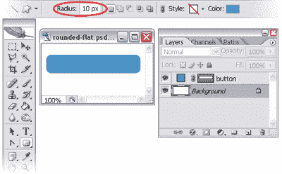

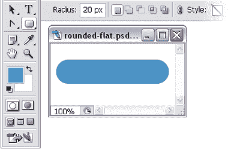

***注意:Photoshop 不会取代 CSS***
在网页上，你可能会使用 CSS 而不是图像来实现这个矩形按钮的效果。然而，当在 Photoshop 中为网页构图绘制简单按钮时，这种技术很方便。

##### 向按钮添加轮廓

在这个解决方案中，我们将为我们的基本按钮添加轮廓，使它们看起来像这里显示的那样。

***注意:添加图层样式***
在本章及以后，我们将大量使用图层样式，通过启动**图层样式**窗口来应用。有几种不同的方式来启动这个窗口，但我最常用的一种是点击图层面板底部的小 **f** 按钮，如下所示。

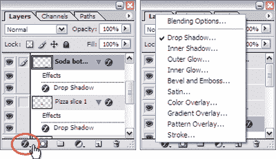

点击此按钮将显示一个对话框，列出所有可用的不同图层样式。只需选择一个你想要的，然后**图层样式**窗口就会启动，并选择特定的效果。也可以从菜单栏中选择相同的样式(**图层>图层样式**，但是使用图标可以节省你一次鼠标点击！

***解***

让我们为之前创建的基本按钮添加轮廓。选择包含按钮的层。点击**图层**面板底部的**添加图层样式**按钮，打开**图层样式**对话框，并从出现的菜单中选择**描边……**。您将看到**笔画**样式被选中并高亮显示——这将为您的按钮添加轮廓。通过调整设置来更改笔划的外观。

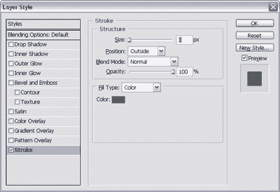

你可以从上面显示的对话框中看到，我通过点击色标并将颜色设置为黑色，给了我的一个黑色轮廓，并通过在**大小**字段中键入 ***1*** 给了它一个像素的厚度(你也可以使用滑块来调整笔画的大小)。

##### 制作一个光滑的斜面按钮

他们越来越喜欢了！让我们试着创建这里显示的斜面按钮。

***解***

现在，您应该是创建基本矩形按钮的专家了。这样也好，因为这个解决方案需要一个！创建或选择您的基本按钮。点击**图层**面板底部的**添加图层样式**按钮，并从出现的菜单中选择**斜面和浮雕…** ，打开**图层样式**对话框。您刚刚在按钮上添加了一个斜面。您可以通过增加**大小**和**柔化**级别来赋予斜面更加圆润的外观。我用 ***7px*** 表示**大小**，用 ***8px*** 表示**柔化**，如图所示。

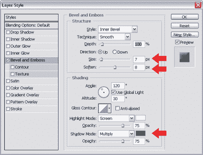

通过改变**阴影模式**颜色使效果更加微妙。因为我的按钮是蓝色的，我已经把**阴影模式**的颜色从黑色改为蓝色(比我的按钮颜色稍微暗一点)。

##### 创建一个轮廓分明的按钮效果

**斜面和浮雕**图层样式是一个多功能的工具，可以用来创建许多不同的按钮效果。在这个解决方案中，我们将使用它来创建像这里显示的硬边，轮廓分明的按钮。

***解***

创建或选择一个基本按钮。然后，点击**图层**面板底部的**添加图层样式**按钮，并从出现的菜单中选择**斜面和浮雕…** ，打开**图层样式**对话框。从**技术**下拉菜单中，选择**硬凿**并将**软化**字段设置为 ***0px*** 。增加斜面的**深度**以凿入按钮“更深”。

##### 创建嵌入式按钮效果

在这个解决方案中，我将向您展示一个按钮效果，使您的按钮看起来像是嵌入到页面中，如下所示。

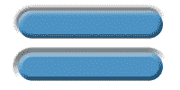

***解***

选择或创建一个基本按钮。点击**图层**面板底部的**添加图层样式**按钮，并从出现的菜单中选择**斜面和浮雕…** ，打开**图层样式**对话框。从**样式**下拉框中，选择**枕形浮雕** —这将给你的按钮一个“嵌入”效果。

尝试使用设置来更改效果的外观。上面例子中的两个按钮都是枕形浮雕，但它们看起来不同，因为我已经为顶部的按钮设置了**技术**为**平滑**，为底部的按钮设置了**凿硬**。

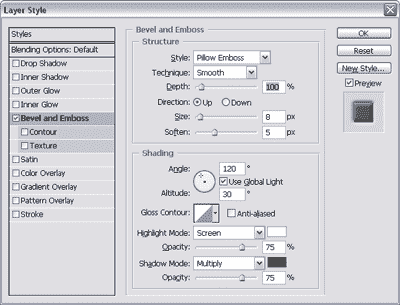

##### 制作渐变按钮

如图所示的双色渐变按钮是图形设计的新潮流。这种效果越来越受欢迎——毫无疑问，你会看到它被用在按钮、菜单行和时尚网站的标题背景上。在这个解决方案中，我将向你展示创建你自己的渐变按钮是多么容易。

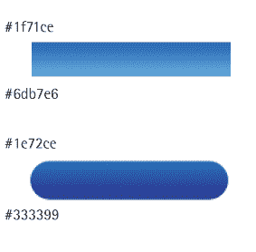

***解***

**光栅按钮**

使用选择工具，比如**选框工具** ( ***M*** )，为你的按钮创建一个矩形选择。设置前景色和背景色为你想要的两种色调，然后新建一个图层。选择**渐变工具** ( ***G*** )，选择**前景到背景**渐变选项，点击并拖动鼠标填充你的选区。(按住 ***Shift*** 会将渐变方向约束为水平线或垂直线。)

我们可以使用为图层提供的**锁定透明像素**选项来实现相同的渐变按钮效果。此选项对于圆角矩形或其他没有自动选择工具的形状很有用。

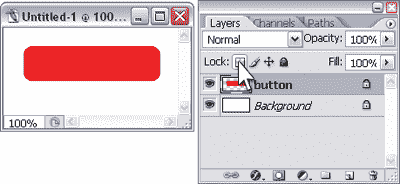

让我们用它来制作一个圆角矩形按钮。使用**圆角矩形工具** ( ***U*** )选择**填充像素**选项，在新图层上创建一个纯色光栅按钮。点击**图层**调板中的**锁定透明像素**图标，如上例所示。然后，设置前景色和背景色为你的渐变色调，并应用渐变。由于您已经锁定了透明像素，渐变将仅应用于图层中的不透明元素:在本例中是您的按钮。

***警告:有用，但不太好用！***
对于它所有的功能来说，**图层样式**对话框令人惊讶的不直观。我发现最令人困惑的是，你可以不用选择就应用一个样式！
没错——一旦你启动了**图层样式**对话框，你就可以通过勾选它的复选框来应用样式(使用 Photoshop 的默认设置)。如果您勾选了**预览**复选框，您将会看到这种风格对您的图像的影响。相当简单，对吧？但令人困惑的是，这实际上并没有选择样式，所以你不能改变它的设置！您需要突出显示样式的名称来调出这些样式-简单地选中复选框是不行的！

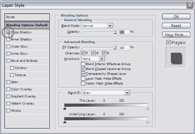

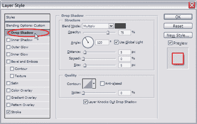

这里显示的例子演示了这一点:在顶部的图像中，我已经检查了**阴影**样式，这已经被应用，但在对话框中的设置是为层的**混合选项**。这意味着我不能对我的投影做任何改变！如果我点击图层样式的名称，我的投影将被应用并显示其设置(如第二个图像所示)。因此，你可能会认为，如果我单击我已经应用的另一个样式的名称，它将在文档中被关闭。事实并非如此，您必须取消选中该复选框！我建议你花一分钟的时间选择和应用一些不同的图层样式，直到你掌握了它的工作原理——这将使你以后不会感到困惑！

**矢量按钮**

如果你不喜欢制作光栅按钮，你可以创建矢量形状并应用渐变效果。点击**图层**面板底部的**添加图层样式**按钮，并从出现的菜单中选择**渐变叠加…** ，打开**图层样式**对话框。将显示渐变叠加选项。

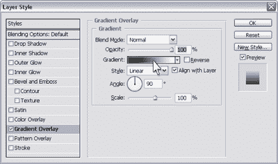

点击**图层样式**对话框中的**渐变**补丁来调整你的渐变。这将打开另一个对话框，如图所示的**渐变编辑器**，你可以用它来设置你的渐变选项。

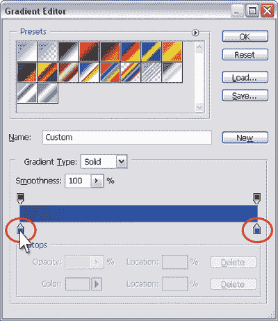

渐变的颜色用渐变条下面的小色标表示。双击它们来调出**颜色选择器**——你可以用它来改变补丁的颜色(从而改变你的渐变)。通过点按渐变栏底部的任意位置来添加更多颜色，一个新的色标将被放置在那里。

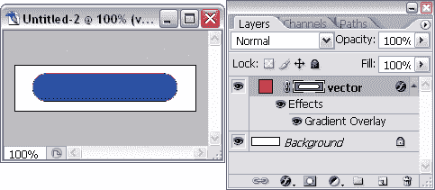

在两个对话框中点击 **OK** ，然后*瞧*！你已经有了双色调渐变按钮。因为我们已经在按钮上“覆盖”了渐变，所以按钮的原始颜色是无关紧要的！

##### 制作一个圆形按钮

在这个解决方案中，我们将调用我们在“制作渐变按钮”解决方案中学到的可靠的渐变按钮创建技巧来制作一个圆形按钮，如下所示。

***解***

1.  在新图层上创建一个圆形渐变按钮。

3.  在另一层，创建一个圆形渐变按钮，比第一个小一点。这个按钮上的渐变方向应该与第一个按钮的方向相反——在这个例子中，我的大圆圈有从白到灰的对角线渐变，我的小圆圈有从暗到亮的对角线渐变。(现在还不要太在意排列形状。)

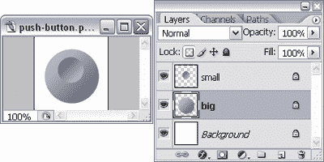

*   从**图层**调色板中选择较小圆的图层。按住***Ctrl***(Mac 上的 ***Command*** )点击较大圆圈的图层缩略图，根据该图层的像素创建选区，就像我在这里做的那样。

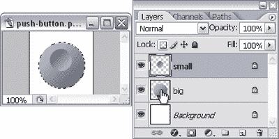

*   创建选区后，选择**图层>将图层对齐选区>垂直居中**，如下图所示。这将使小圆的中心与大圆的中心垂直对齐。

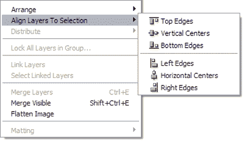

*   最后，选择**图层>对齐图层到选区>水平中心**，正如你所怀疑的，两个圆的中心会水平对齐。

你的按钮完成了！

##### 制作哑光金属纽扣

更多使用渐变的按钮！还好我们在“制作渐变按钮”中复习了渐变按钮制作技巧。我们将制作像这里展示的亚光金属按钮。

***解***

**矩形哑光金属按钮**

1.  首先，创建一个简单的光栅渐变按钮。我将使用两种不同的灰色阴影。

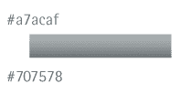

*   点击**图层**面板顶部的**锁定透明像素**图标锁定图层。选择浅灰色(我已经用了#ebeef0)，使用铅笔工具( ***B*** )在矩形按钮图层上绘制左侧和顶部边框。*   选择一个深灰色(我用的是#515a60 ),在按钮层上画底部和右边的边框，如下例所示。记得在你画线的时候按住 ***Shift*** 保持直线。

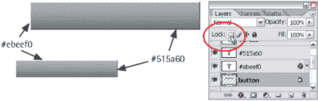

*   当然，我们可以按原样使用这个按钮，但是我想对它再做一些事情。首先，我们将对按钮应用噪声过滤器。在我们这样做之前，请确保您对按钮的大小、形状和颜色感到满意，因为在应用过滤器后，很难对这些属性进行更改。要添加哑光效果，请选择**滤镜>噪点>添加噪点**。这将给按钮一个粒状外观，并显示**添加噪声**对话框。确保选中**单色**复选框，并调整您想要引入的噪声量。我把我的设为 2%。

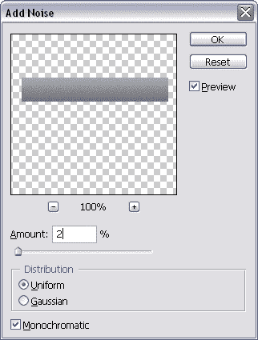

*   如果您觉得颗粒效果太明显，请选择**编辑>淡入淡出添加噪点**将其降低一点。更改淡入淡出的不透明度(在下面的例子中，我将我的设置为 50%)，然后点击**确定**。

***注意:使用即褪色！***

要在滤镜上使用“淡入淡出”命令，您需要在应用滤镜后立即执行，否则它将不可用。

*   现在让我们看看我们的按钮。这当然是我们可以使用的东西，但是当我们在滚动的时候，让我们用一些灯光效果使它更有活力一点。

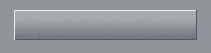

*   选择**滤镜>渲染>灯光效果**调出**灯光效果**对话框，如图所示。从**灯类型**下拉菜单中选择**聚光灯**。

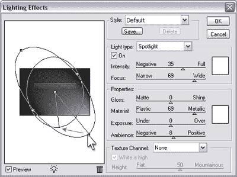

*   在预览图形中，您会看到一个椭圆，有一条线穿过它，这条线指示光线的方向。单击线末端的方向手柄，并将其拖动到预览窗口的左上角。然后，您可以单击并向外拖动椭圆上的手柄，以增大“聚光灯”区域，如下所示。

*   最后，将**光泽**属性滑块拖向其**无光**侧(显示在前一页的底部)。当你对你的按钮预览满意时，点击**确定**。

现在我们幸福了！这是我们完成的按钮。

**圆形哑光金属按钮**

创建一个圆形的磨砂按钮和创建一个矩形的按钮非常相似。主要的区别是，我们将使用一个笔画层效果来添加边框，因为我们很难用手精确地绘制边框。

1.  创建一个圆形渐变按钮。我使用了与上一个解决方案中矩形按钮相同的灰色阴影。

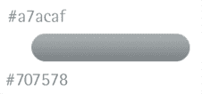

*   现在，不要像我们为矩形按钮画一个边框，打开**笔画**的**图层样式**对话框，给你的边框设置如下:

*   **尺寸:*1px***
*   **位置:*内***
*   **不透明度:*75%***

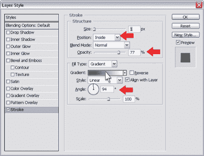

*   将**填充类型**改为**渐变**。点击**渐变**样本，设置渐变颜色为白色(#ffffff)和深灰色(#384046)。随着笔画不透明度的降低，您会希望浅色和深色之间有更大的对比度。(如果你想知道为什么你需要降低不透明度，这是为了让噪音和灯光效果显示出来。)*   调整**角度**，使大部分渐变笔画相对于按钮成一个小角度。*   点击**确定**应用笔画效果。图中显示了我们划水的结果。

*   现在，添加噪波并应用灯光效果(步骤 4-8 在“矩形，哑光金属按钮”解决方案中)，你的圆形按钮就完成了！

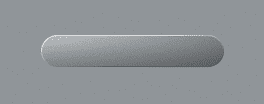

##### 制作闪亮的金属纽扣

在这里，我将向您展示如何创建像这里显示的闪亮的金属按钮。我还将向您展示如何使用不同的设置来改变它们的外观。

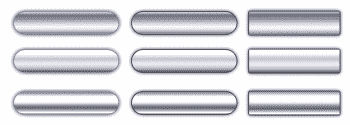

***解***

1.  创建栅格或矢量按钮。在这个例子中，我创建了一个圆形和一个矩形按钮。按钮的颜色并不重要，因为它不会影响最终结果。

*   好戏开始了！点击**图层**面板底部的**添加图层样式**按钮，打开**图层样式**对话框，并从出现的菜单中选择**外发光**。在对话框中，将**混合模式**更改为**普通**，点击色样(默认为浅黄色)并将其更改为灰色，如下图所示。

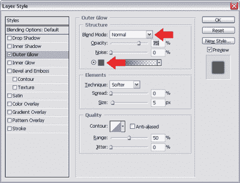

*   现在，从对话框的样式列表中选择**笔画**添加一个笔画图层效果。我用的是深灰色 1px 笔画。

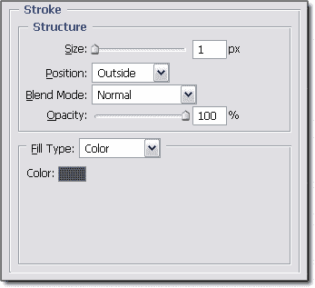

*   我们准备添加渐变叠加(又是那些渐变了！).在对话框的**样式**列表中选择**渐变叠加**，双击渐变色样打开**渐变编辑器**对话框。像我做的那样设置渐变的颜色。*   通过点按渐变条底部的任意位置，向渐变条添加更多色标。双击补丁，调出**拾色器**，编辑补丁的颜色。您也可以点按并滑动色标来调整渐变的外观。

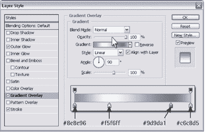

*   点击**确定**应用所有图层样式。你闪亮的金属纽扣完成了！关闭**笔画**样式以获得更微妙的效果(取消选中它的复选框)——我在这里显示的例子中为左按钮做了这个。

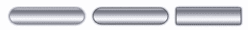

***变异***

您可以通过玩渐变编辑器设置来改变闪亮按钮的外观。下面的例子展示了当应用不同的渐变配置时，我们闪亮的按钮的外观是如何变化的。

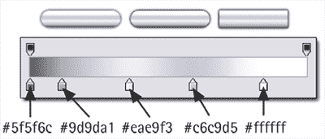

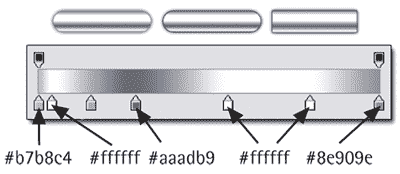

##### 摘要

有了这个悬念，我将暂时让你继续玩我向你展示的导航按钮解决方案。看好这个空间！漂亮按钮创作的更多秘密将在第二部分揭示，几周后将在本专栏中发表。同时，别忘了查看由 99designs.com[提供的](https://www.sitepoint.com/blog/)**[免费 PDF 下载](https://www.sitepoint.com/premium/books/photoshop-cs6-unlocked-2nd-edition)** 。

## 分享这篇文章**