# 在 Photoshop 中制作漂亮的按钮，第二部分

> 原文：<https://www.sitepoint.com/building-buttons-photoshop-2/>

两周前，sitepoint.com 发表了这篇教程的第一部分，主题是使用 Photoshop 制作导航按钮，给人留下深刻印象。针对 Photoshop 初学者，这里是第二部分——是时候进一步发展你的按钮创建技能了！

这一章摘自我的书
[*《Photoshop 选集:101 个网页设计技巧、窍门&技巧*](https://www.sitepoint.com/books/photoshop1/) ，这本书是作为[免费 PDF 下载](https://www.sitepoint.com/premium/books/photoshop-cs6-unlocked-2nd-edition)限时提供的，感谢[99designs.com](http://99designs.com/)。

**[没错——整本书可以免费下载。](https://www.sitepoint.com/premium/books/photoshop-cs6-unlocked-2nd-edition)**

如果您错过了本系列的第一部分，或者想重温一下，请阅读第一部分[。](https://www.sitepoint.com/building-buttons-photoshop-1/)

##### 制作浅绿色按钮

在这个解决方案中，我将向您展示如何制作色彩鲜艳的玻璃按钮，这些按钮起源于多年前的苹果 Aqua 界面，从那时起就被亲切地称为“aqua buttons”

***解***

1.  从一个圆形矢量按钮开始。我们将为它添加一个渐变覆盖，所以它的颜色并不重要——使用任何你喜欢的颜色！第一步是应用渐变叠加到我们的按钮。点击**图层**面板底部的**添加图层样式**按钮，并从出现的菜单中选择**渐变叠加**，打开**图层样式**对话框。

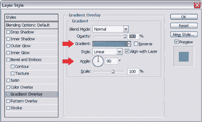

*   在对话框中，设置角度为 90 °(如上所示),点击**渐变**补丁，显示**渐变编辑器**的另一个对话框，如下图所示。

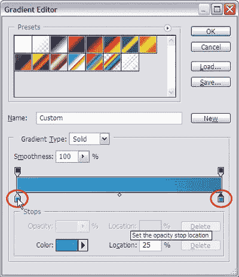

*   让我们使用**渐变编辑器**来改变我们的渐变设置。双击渐变条下面的每个小色标来改变它的颜色。通过将左侧补丁的颜色设置为水绿色(# 3cc9e2)，将右侧补丁的颜色设置为蓝色(#1160c2)，创建水绿色到蓝色的渐变。将浅绿色面片的**位置**设置为 ***25%*** ，点击**确定**应用渐变。*   回到**图层样式**对话框，点击**内发光**。将**混合模式**设置为**正常**，将**不透明度**设置为 ***50%*** ，将**大小**设置为大约 ***10px*** ，具体取决于您的按钮大小。点击色标，将颜色改为深蓝色，如下例所示——我用的是#003298。

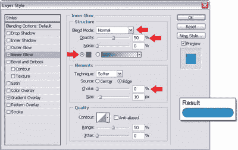

*   接下来，我们将应用一个轻微的发光效果。点击**外发光**。将**混合模式**更改为**正常**，将**不透明度**更改为 ***50%*** ，将**扩散**更改为*，将**大小**更改为 ***5px*** (您可能需要调整这些设置以适应按钮的大小)。把色标换成明亮的水绿色，如下图——我用的是#00bae8。* *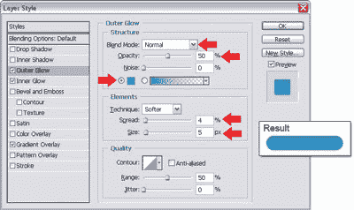

*   点击**确定**应用所有样式。*   为了创建按钮高亮，通过在**图层**调板中按下 ***Ctrl-J*** 来复制按钮图层(在 Mac 上为 ***Command-J*** )。点击相应的眼睛图标，关闭该层的**外发光**和**内发光**样式，如下图所示。

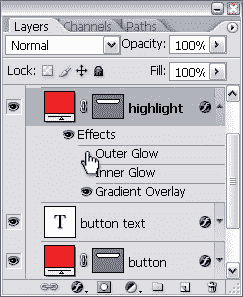

*   在**图层**调板中双击**渐变叠加**样式名称。将出现**图层样式**对话框，选择**渐变叠加**。点击**渐变**补丁，调出**渐变编辑器**。

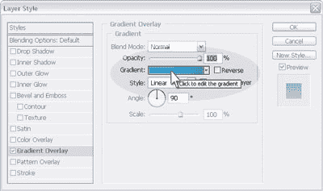

*   双击**渐变编辑器**中渐变条下面的色标，并将它们都设置为白色。*   点击上方和渐变条左侧的补丁*——这是左侧的不透明度停止点。将其**不透明度**字段设置为 ***0%*** ，如图所示。*

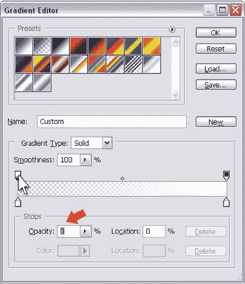

*   点击 **OK** 退出**渐变编辑器**，再次应用新样式。*   在**图层**调板中，将形状的填充改为 ***0%*** 。这将允许底层的按钮显示出来，如下图所示。

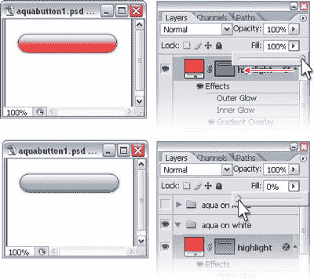

*   选中高亮图层，打开**编辑>自由变换**或者按***Ctrl-T***(Mac 上的 ***Command-T*** )。高亮周围将出现一个边界框。单击边界框的底部边缘，并向上拖动它以挤压高光一点点。*   接下来，单击边界框的左右两侧，拖动高亮显示的边缘，直到它们刚好在按钮层内。您的高光图层应该类似于下图所示。在框内双击应用变换，或者在 Mac 上按 ***回车*** ( ***回车*** )。)

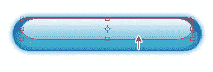

*   切换到直接选择工具(*)。单击并向上拖动高光路径的底部边缘，将其展平，如下所示。如果需要，可以使用 ***Ctrl-+*** (在 Mac 上使用 ***Command-+*** )进行放大。* *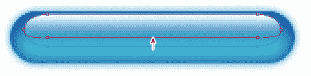

*   我们终于准备好添加文本了！在高亮层和按钮层之间创建一个文本层，然后输入文本。我用深蓝色作为我的颜色。我还在我的文本中添加了一个微妙的阴影样式，如下例所示。

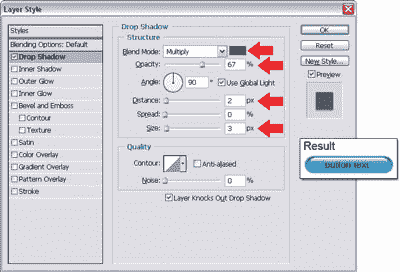

*   在这一点上，我们已经有了一个时髦的 aqua 按钮，可以在大多数网站上很好地工作，但是既然我们已经习惯了进一步采取这些步骤，为什么现在停止呢？让我们让我们的按钮看起来像是嵌入到页面中。复制按钮层，并将其拖到顶部，在其他层之上。我们姑且称这个顶层 ***浮雕***；你的**图层**调色板现在应该看起来像这里显示的图像。

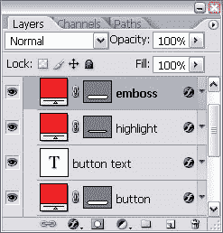

*   隐藏我们的 ***浮雕*** 图层上的所有图层样式，方法是在**图层**调色板中点击它们各自的眼睛图标。点击**图层**调色板底部的**添加图层**样式按钮，并从出现的菜单中选择**斜面和浮雕…** ，打开**图层样式**对话框。从**样式**下拉菜单中选择**枕形浮雕**并将技术更改为**硬凿**。将**尺寸**设置为 ***2px*** ，将**角度**设置为***90***。

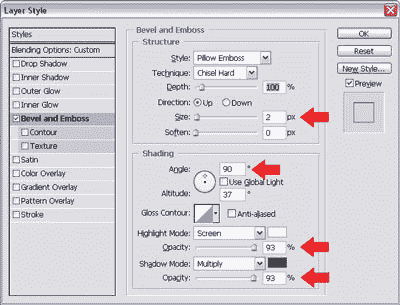

*   在对话框的底部，你会看到**高光模式**和**阴影模式**的不透明度区域。将这两个都设置为 ***93%*** 。*   最后，在按钮边缘画一笔。您现在应该对此很熟悉了！在**图层样式**对话框中选择**描边**，给你的按钮一个 ***1px*** 黑色描边 ***60%*** 不透明度，如下图对话框所示。

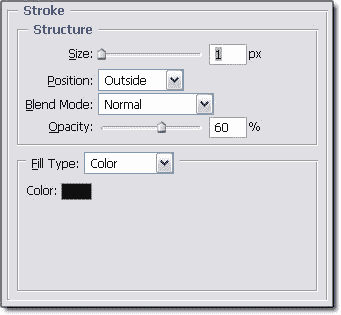

*   点击**确定**应用图层样式。*   下面我们把 ***浮雕*** 图层的**填充**改为 ***0%*** ，如图所示，这样它下面的按钮层就可以透出来了。

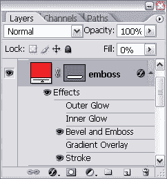

我们的嵌入式 aqua 按钮已经完成！这张图片显示了我们的正常和嵌入式浅绿色按钮。

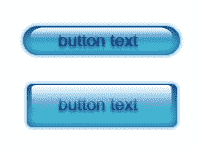

##### 讨论

因为我们使用矢量形状和图层样式创建了这个 aqua 按钮，所以我们有一个易于编辑的可缩放按钮。如果我们想改变它的颜色，我们所要做的就是改变图层样式中渐变和效果的颜色。如果我们希望我们的按钮稍微长一点，我们可以使用直接选择工具(*)来修改矢量路径。*

 *这个解决方案演示了一个关于图层的重要概念:即使当图层的填充设置为 0%，图层样式仍然会显示出来！当您创建自己的效果时，您可能会发现这很有用。

这项技术的另一个很酷的地方是，一旦你创建了你的第一个 aqua 按钮，创建其他按钮就很容易了——你只需要复制图层效果。我将快速向您展示如何通过几个简单的步骤制作一个矩形的 aqua 按钮。

1.  在**图层**调色板中，创建矩形按钮所需的图层:基本 ***按钮*** 图层、 ***高亮*** 图层，如果你打算使用嵌入效果，还有一个 ***浮雕*** 图层，如下所示。

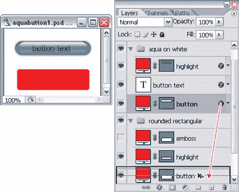

*   要将图层效果从原来的浅绿色按钮复制到矩形按钮，请按住 ***Alt*** (在 Mac 上为 ***Option*** )并将图层样式图标从原来的按钮图层拖到其对应的矩形按钮图层上，如图所示。

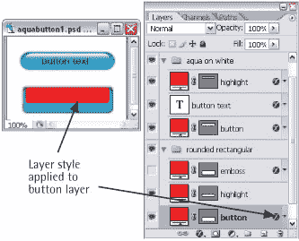

*   将 ***高光*** 图层的填充改为 ***0%*** 。

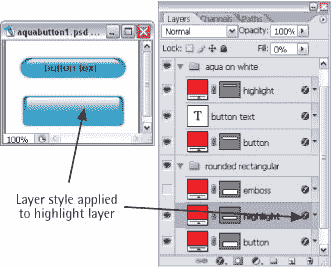

*   添加按钮文本并重复步骤 2，复制我们用于原始文本的阴影样式。

就是这样！您的矩形 aqua 按钮已经可以使用了，看起来应该和这里的一样。

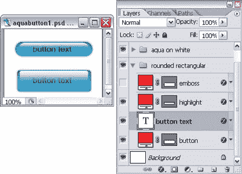

##### 制作透明的浅绿色按钮

我们也可以让我们的 aqua 按钮透明，就像这里显示的一样。

在这个解决方案中，我们将从一个基本的浅绿色按钮开始。如果你还没有一个(每个人都应该有！)，您可以按照“制作浅绿色按钮”解决方案中的步骤 1-16 制作一个按钮。

***解***

1.  将基本的浅绿色按钮放在暗淡的图案背景上，如下图所示。

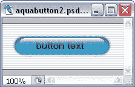

*   双击图层的 **f** 图标——这将弹出**图层样式**对话框。选择**渐变叠加**样式，点击**渐变**样本，调出**渐变编辑器**。*   在渐变条上方，在此图像所示的位置点按一次，以创建新的不透明度色标。将其不透明度更改为 ***50%*** 。

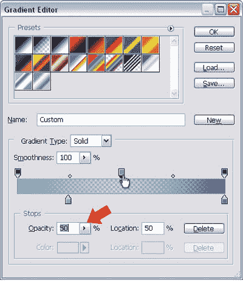

*   点击**确定**退出**渐变编辑器**，在**图层样式**对话框中再次点击**确定**应用样式。*   将按钮图层的填充设置为 ***0%*** ，如下图。背景会显现出来。

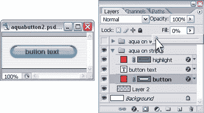

看起来不错！但是，和往常一样，我们可以做一些事情来使它看起来更加完美。

*   双击 **f** 图标打开**图层样式**对话框，选择**阴影**样式。为阴影选择明亮的浅绿色(#90c9e7)，并稍微增加**距离**和**尺寸**。将**不透明度**更改为 ***40%*** ，如下图所示。

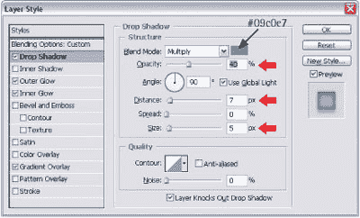

*   接下来，选择**笔画**样式。添加深蓝色(#0d487b) 1px 描边，不透明度 75%左右，如下图。

*   最后选择**内阴影**样式。改变阴影颜色为蓝色，比我们在原来的渐变按钮中使用的颜色稍微暗一点。降低**不透明度**到**T5 50%**，改变**距离**到大约 ***10px*** (或者任何适合你按钮大小的)，如下图。

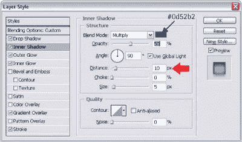

*   点击**确定**应用这些新样式。正如你在下面看到的，我们已经完成了最后一个透明的浅绿色按钮！唰，*非常*唰！

##### 制作一个塑料按钮

在这个解决方案中，我们将使用 Photoshop magic 把我们的朋友——基本渐变按钮——变成一个塑料按钮，如图所示。

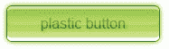

***解***

1.  从半径为 5px 的圆角矩形渐变按钮开始。您可以在圆角矩形选项栏中更改半径。在你的渐变叠加图层样式中使用这里显示的颜色停止。如果你不确定如何做，看看“制作渐变按钮”的解决方案我把我的按钮设为绿色，但是如果你喜欢，你可以用不同的颜色。只需为最右边的颜色块选择较深的颜色，为最左边的颜色块选择非常浅的颜色，为中间的颜色块选择明亮的颜色，如下所示。

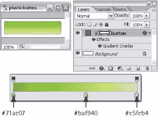

*   给你的按钮添加一个深绿色的 1px 描边图层样式，如下所示。

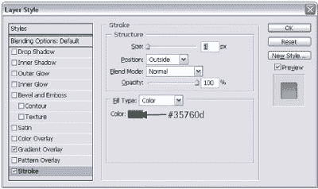

*   使用按钮颜色的明亮版本添加外部发光，如下所示。

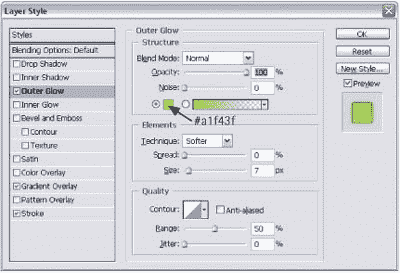

*   在**图层**调板中选择 ***按钮*** 图层，使用***Control-J***(Mac 上使用 ***Command-J*** )复制。右键点击(按住 ***控制键*** 并点击)新图层，从出现的菜单中选择**清除图层样式**，如图所示。

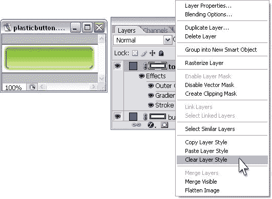

*   将该层的**不透明度**更改为 ***50%*** ，双击其色标打开**拾色器**。如图所示，将形状的颜色设置为白色。

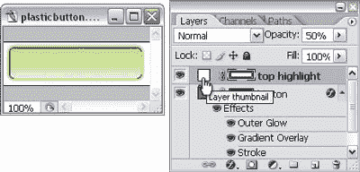

*   现在，点击**图层**面板中相同图层的矢量形状。使用直接选择工具( ***A*** )，点击圆角矩形的底线，向上拖动一点，如图所示。你可能需要放大这个。

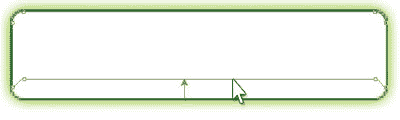

*   仍然使用直接选择工具( ***A*** )，点击左下方的锚点，这样就可以看到该点的手柄(如果需要可以放大)。点击底部车把，按住 ***Shift*** ，向上拖动手柄转弯。

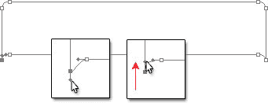

*   对右下角的点重复步骤 7。你的形状的侧面现在应该看起来像这里显示的那样。

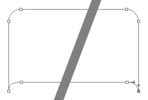

*   使用直接选择工具( ***A*** )，单击并拖动鼠标进行选择，以捕捉所有的底部点，如下图所示。

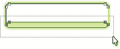

*   按住 ***Shift*** 向上拖动选中的点，做成一条细条，如下图——这是我们的亮点。如果需要，使用上下箭头键微调移动。

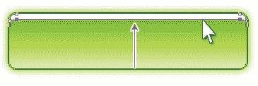

*   在**图层**调板中选择高亮图层，使用***Ctrl-J***(***Command-J***)复制。选择**编辑>变换>垂直翻转**翻转复制的图层。*   使用移动工具( ***V*** )将翻转的高亮显示移动到矩形按钮的底部，如下所示。

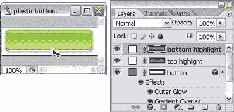

*   我们快到了！现在复制按钮形状图层，命名为*。将形状的颜色改为白色。***   选择 ***中间高亮*** 形状的底部锚点，并将它们向上移动到原始按钮形状的中心。将该图层的不透明度更改为 ***25%*** ，如下图所示。

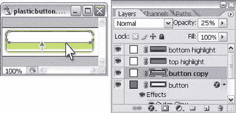

*   在原始按钮形状的顶部立即添加一个文本层(在三个高亮层的下面),然后键入文本。如果你喜欢，添加一个阴影来增加三维效果，就像我为这个完整的按钮所做的那样。

##### 制作玻璃按钮

在这个解决方案中，我们将创建一个令人瞠目的玻璃按钮，当它覆盖在照片和非实心背景上时特别有效。

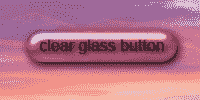

***解***

1.  从一个颜色与背景相融合的任意形状的矢量按钮开始。在这里，我使用了一个从日落图像中挑选的粉红色，我将在上面放置我的按钮。将按钮层的填充设置为 0%。点击**图层**面板底部的**添加图层**样式按钮，并从出现的菜单中选择**斜面和浮雕…** ，打开**图层样式**对话框。应用此处使用的设置，如下图所示:

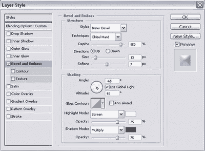

*   **样式:内斜面**
*   **手法:凿硬**
*   **深度:800%** (或更大，取决于按钮的大小)
*   **方向:向上**
*   ***尺寸:13px*** (您稍后可能需要调整这个。)
*   **软化:** ***7px***
*   **角度:** ***-65 度***
*   **海拔:** ***65 度***
*   **Gloss Contour:** Rolling slope-descending (Set this by clicking on the drop-down arrow next to the contour shape and choosing the Rolling slope-descending option, as depicted below.)

    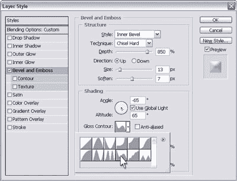

*   **高光模式:**白色，**，T3【75%】，**
*   **阴影模式:**深灰色，**，T3【75%】，**

设置光泽轮廓

您的按钮看起来应该如下所示。

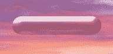

在应用斜面和浮雕效果后

*   在**图层样式**对话框中，点击**斜面和浮雕**下的**轮廓**样式将其选中。点击轮廓的缩略图，调出**轮廓**编辑器，如下所示。

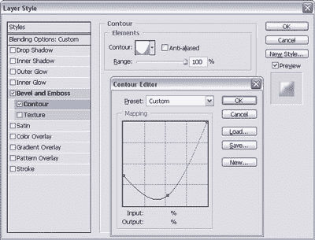

*   选择并移动轮廓的左下角点，直到它正好位于第一个水平网格标记的上方。然后，单击轮廓线添加另一个点，并拖动它形成一条曲线。

下图显示了应用轮廓效果后的按钮。

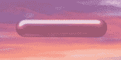

*   不错吧。现在，选择**缎面**图层样式，应用如下设置:

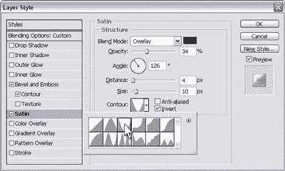

*   **混合模式:叠加**；黑色
*   **不透明度:** ***30-40%***
*   **角度:** ***126 度***
*   **距离:** ***4px*** (这个你以后可能需要调整。)
*   **尺寸:** ***10px*** (这个你以后可能需要调整。)
*   **轮廓:**倒圆锥形

*   选择**阴影**图层样式。将**距离**更改为 ***4px*** ，将**尺寸**更改为 ***10px*** ，将**不透明度**更改为 ***50%*** ，如下例所示。

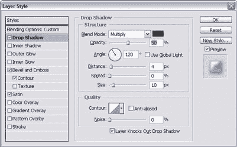

在这一阶段，我们的按钮看起来很光滑，如下图所示。

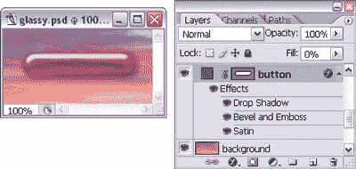

*   我们现在需要做的就是添加一个简单的文字层，加上一点阴影！完成后的按钮应该如下图所示。

您可以轻松地将此图层样式复制到其他形状图层。当你这样做，记得设置新的图层填充为 0%。尝试图层效果来改变按钮的外观。这里的图像显示了我的玻璃按钮的变化。

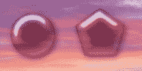

##### 制作珍珠纽扣

这里有一个使用真正魔法的解决方案…嗯，差不多！我们将把在“制作玻璃按钮”中创建的玻璃按钮变成珍珠按钮。

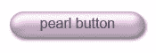

***解***

1.  从您在名为“制作玻璃按钮”的解决方案中创建的玻璃按钮开始改变按钮层的填充为 100%，如图所示，并使用一个非常轻的，珍珠色的形状。我用#fae1f9 作为我的粉色珍珠按钮。

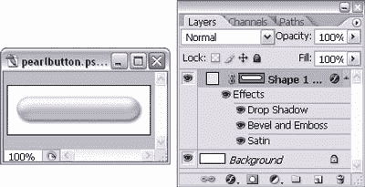

*   通过添加轻微的内部发光来增强按钮的三维效果。双击图层的 **f** 图标，调出**图层样式**对话框，如下所示。

选择**内发光**并将**混合模式**改为**正常**并将**不透明度**改为 ***10%*** 。如果需要，增加**尺寸**。

*   我们也将使阴影更加微妙。选择**投射阴影**并将阴影尺寸减小到 3px 或 4px。*   最后，添加你的文字层。这里我们看到了最后一个按钮——全部完成！

##### 制作有角度的标签按钮

在这个解决方案中，我将向你展示如何使用矢量图形工具来创建成角度的标签按钮，如下图所示。

***解***

**倾斜标签**

1.  从一个你选择颜色的矩形矢量形状开始。我在下图中使用了浅蓝色。

*   使用直接选择工具(*)，选择矩形左上角的锚点。按住 ***Shift*** 键，按一次或两次右箭头将指针向右移动。你的图像应该看起来像下面这样。* *

松开 ***Shift*** 键，使用箭头键微调该点。我们在这里用“老方法”来计算我们按下箭头键的次数，这样我们就知道当我们到达右边的点时要移动多远。

*   对顶部右侧的锚点重复步骤 2。

就是它——信不信由你，我们的带角度的标签按钮已经完成了！如果你不相信我，看看下面完成的结果。

**切角标签**

1.  这一次，我们将制作一个带有切角的选项卡按钮。再次，从一个矩形矢量形状开始。选择添加锚点工具—您会在钢笔工具的弹出菜单中找到它( ***P*** )，如下所示。

*   像我在下面的例子中做的那样，在按钮的侧面添加一个锚点(你可能需要放大)。

*   选择转换点工具，它也在钢笔工具的弹出菜单中( ***P*** )。

*   使用直接选择工具( ***A*** )，点击顶角锚点，使用箭头键移动锚点，形成一个“切角”，如下图所示。

*   如果你喜欢，在另一边重复这个效果。

##### 制作圆形标签按钮

基本的圆角矩形按钮非常通用。在这里，我们将把它转换成流行的圆形标签按钮，就像这里显示的一样。

***解***

1.  从一个圆角矩形矢量形状开始，如下所示。

*   选择钢笔工具( ***P*** )弹出菜单中的“转换点”工具。如下所示，在两个锚点上单击一次，将它们从曲线点转换为角度点。

*   使用直接选择工具( ***A*** )围绕形状上最底部的两个锚点进行选择。为了表示它们已被选中，这些点将从白色正方形变成实心正方形，如下所示。

*   通过按键盘上的 ***退格键*** 或 ***删除*** 来删除锚点。您的图像现在应该类似如下所示。

*   使用钢笔工具( ***P*** )，先点击左侧底部锚点，再点击右侧锚点，如下图所示。

这将绘制一条连接两点的线，并完成形状，如下所示。

##### 制作文件夹标签按钮

在这个解决方案中，您将学习如何创建一个漂亮的文件夹标签，形状很像文件柜中使用的真正的文件夹标签。还记得那些老掉牙的东西吗？

***解***

1.  使用钢笔工具( ***P*** )，单击一次将锚点添加到 Photoshop 文档中(上图中的步骤 1)。)

3.  将光标放在锚点上。按住 ***Shift*** 和***Alt***(Mac 上的 ***Shift*** 和 ***Option*** )，点击该点，向右拖动鼠标，创建一个单独的水平车把(上面的步骤 2)。

5.  如步骤 3 所示定位光标。单击并向右拖动鼠标，添加另一个锚点。由于我们的控制手柄的位置，连接两点的线应该显示一个漂亮的曲线。

7.  按住 ***Shift*** ，点击并拖动鼠标到我们制作的最后一个点的右侧，以创建另一个带有水平控制手柄的锚点。按 ***Shift*** 确保两点水平对齐(上述步骤 4)。

9.  将光标向右下方移动一点，使其与我们的第一个锚点水平对齐(步骤 5)。单击以添加另一个锚点，并将手柄向右拖动。

11.  将光标移回到我们最后一个点上。按住 ***Alt*** ( ***选项*** )点击移除右车把(步骤 6)。

13.  将光标移回我们的第一个点，点击它来完成形状(见步骤 7 和下图)。

如果您的对齐不完美，请不要担心，您可以使用直接选择工具(A)来选择单个点，并使用箭头键来微调它们。

##### 摘要

在这篇文章的两期中，我向你展示了如何制作各种各样的按钮！除了显而易见的导航按钮，您在这里学到的技术将允许您制作漂亮的子弹图形和花哨的标题栏。例如，您可以将塑料按钮效果应用于构成界面一部分的较长矩形，或者将其用作文本链接栏。您还可以使用闪亮的金属按钮效果来创建闪亮的金属子弹；你有无数的选择！

当你创建完整的网站构图时，你在本章中获得的图层样式和矢量形状的经验将是无价的。更、*多了*多了，关于漂亮网站设计的其他元素可以在我的书里找到，[*《Photoshop 选集:101 个网页设计技巧，窍门&技巧*](https://www.sitepoint.com/books/photoshop1/) 。在机会结束之前，请不要忘记[下载您的副本](https://www.sitepoint.com/premium/books/photoshop-cs6-unlocked-2nd-edition)，这是由 [99designs](http://99designs.com/) 提供的！

## 分享这篇文章*****