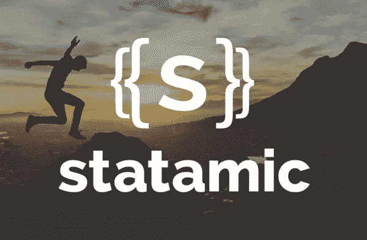
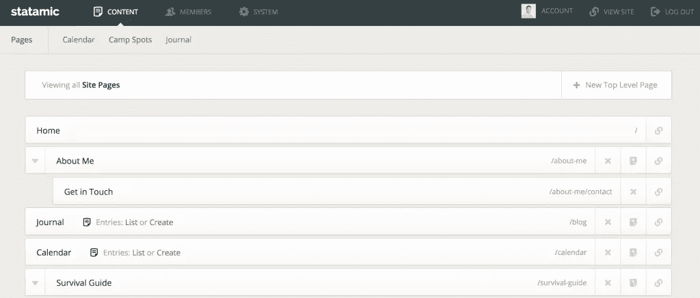
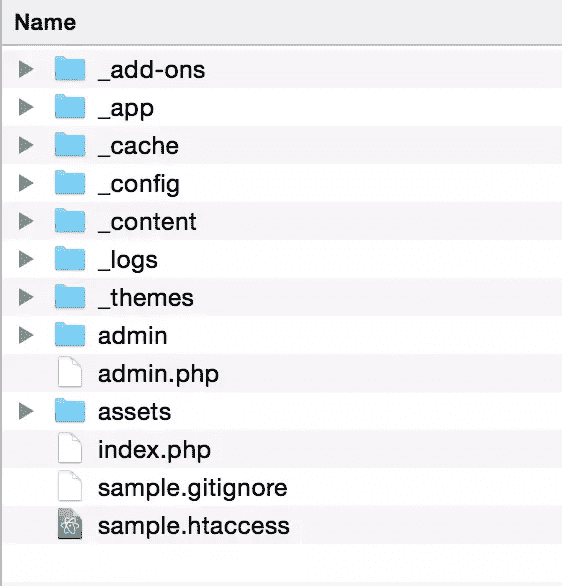
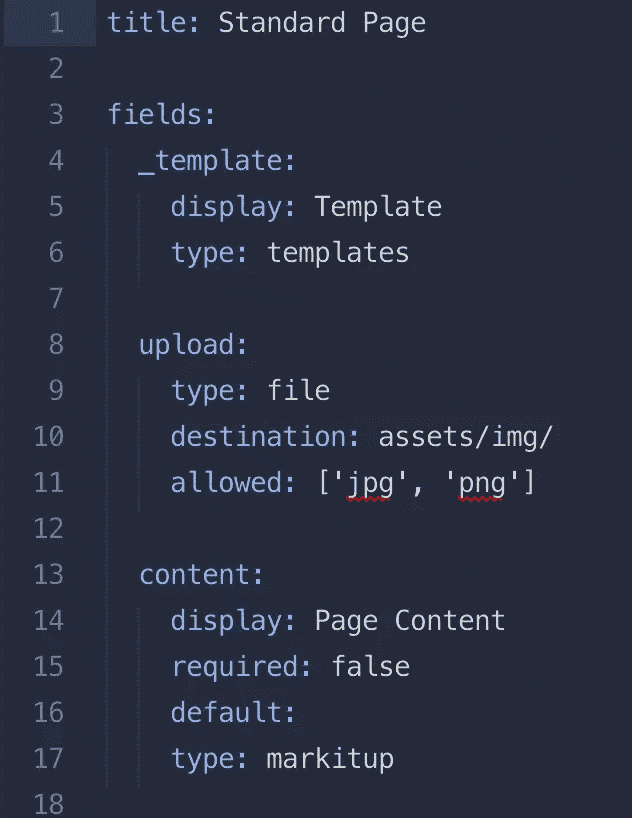
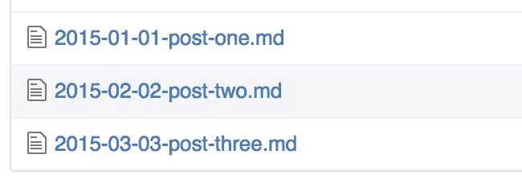

# 用 Statamic CMS 构建无数据库网站

> 原文：<https://www.sitepoint.com/building-database-free-websites-with-statamic-cms/>

内容管理系统(CMS)是一个代码包，你可以围绕它建立一个动态的网站——与硬编码的静态网站相比，它的组件可以自动改变、适应和更新。

在本文中，Gareth Redfern 展示了一种相对新型的 CMS，它正在挑战更为成熟的数据库驱动模型。

* * *



Statamic 是一款平面文件 CMS，自 2012 年开始上市。

它是用 PHP 构建的，巧妙地结合了静态和动态功能。虽然创建 Statamic 站点需要一些编码技能(HTML 和 CSS ),但是使用起来非常简单——有自己直观的模板语言，不需要任何 PHP 知识。

你只需要一个代码编辑器和一个 FTP 程序来连接你的服务器，你就可以很快建立并运行你自己的网站。

Statamic 网站上有一个方便的 38 秒视频,展示了 CMS 的运行。

Statamic 是一种商业产品——个人许可证 29 美元，专业许可证 99 美元。这可能会让习惯了 WordPress 等免费选项的人感到不快，但这种适中的价格带来了好处——尤其是来自开发团队的及时和直接的支持。

Statamic 的第 1 版没有免费演示，但第 2 版——预计将进行测试版发布，并建立在 [Laravel](http://laravel.com/) 之上——将提供这一选项。

## 术语

一个**平面文件** CMS 将你的所有内容存储在文本文件中，而不是数据库中——允许你使用 Markdown 直接在文件中写内容。(这就是 static 名称的“静态”部分的来源。)

Statamic 有时被比作静态站点生成器，如 T2、杰基尔、T3，它们通过一个转换器运行你的站点，然后生成 HTML 文件供你上传到服务器。尽管 Statamic *有一个静态的站点生成器，但它需要 PHP 在你的服务器上运行，而且比 Jekyll 之类的更动态。*

### 控制面板

因为 Statamic 是动态的，它提供了一个控制面板来添加和编辑你的内容——这意味着它是一个可行的 CMS 来交给客户，不像 Jekyll。

控制面板反应灵敏，并提供了一个非常干净，易于使用的界面，客户和开发人员都喜欢。

*Statamic 控制面板*

虽然控制面板是可用的，但您不必使用它，因为您也可以直接处理文本文件，并根据需要上传它们。

### 对整个网站进行版本控制

让你的整个网站基于简单的文本文件——包括内容——具有很大的优势，一切都可以进行版本控制，甚至可以在你最喜欢的 Git 托管服务中存储和编辑。

这消除了传统数据库驱动的网站在保持内容从暂存到生产的同步时会给你带来的许多麻烦。

### 适合 Statamic 的网站类型

Statamic 非常适合大多数网站的构建，一些流行的博客和公司网站将它作为首选的 CMS。

当然，如果你有一个非常大、内容丰富、关系复杂的网站，那么数据库驱动的网站*可能*更合适——尽管就我个人而言，我还没有遇到过 Statamic 不能处理的网站。

## 入门指南

[安装 Statamic](http://statamic.com/learn/installing-and-updating/installing) 非常简单。

你可以在本地的服务器环境上运行它，比如 MAMP 或者 T2 的 WampServer。然后，您可以根据需要将所有内容传输到您的服务器。

首先你应该运行一个快速的[服务器检查](http://statamic.com/learn/getting-ready/checking-your-server)来确保你的[主机](https://github.com/statamic/hosts)满足最低要求。

运行检查后，只需将您的文件放入您站点的根目录，在`settings.yaml`文件中输入一些基本的配置设置，通过将`sample.htaccess`重命名为`.htaccess`来启用它，您就一切就绪了。

[更新](http://statamic.com/learn/installing-and-updating/updating)更加容易:你只需要换出两个文件夹，`_app`和`admin`。

### 文件夹结构



标准安装附带了两个示例主题，以及可以用作创建您自己的主题的起点的内容。

您所有的书写内容都存储在`_content`文件夹中。在该文件夹中，您有两种“类型”:页面和条目。

**页面**用于你的静态内容，这些内容仍然可以通过控制面板进行编辑，但它们往往是像“关于”页面那样的单个页面。**条目**更加动态，定期添加或更新。博客或新闻文章就是这类内容的一个很好的例子。

每个内容页面都有一个 YAML 标题——基本上就是你的模板变量和存储在 3 个破折号之间的内容。

如果你以前没有听说过 [YAML](https://en.wikipedia.org/wiki/YAML) ，这是一种非常易于人类阅读的语言，用于存储数据。当你第一次开始时要记住的一个要点是，YAML 对缩进有很明确的要求(使用两个空格)。下面是一个 YAML 文件的示例:



## 主题

文件夹是你放置主题的地方。Statamic 在如何构建它方面非常灵活，但通过遵循一些约定，您可以创建易于逐个站点交换的主题。

我在 GitHub 上创建了一个[简单主题，供你参考，作为遵循这一惯例的范例。](https://github.com/statamicthemes/simple-theme)

### 主题的基本剖析

[文件夹结构示例](https://github.com/statamicthemes/simple-theme/tree/master/simple_theme)可以解释如下:

*   布局是你页面的主要结构。在这里，您将包括部分和模板。
*   部分代码是可重用代码的小块可重用代码。
*   模板是特定于内容的，通常包含显示页面内容的逻辑。

Statamic 自带模板语言，学习起来非常简单。作为一个例子，我将介绍你如何在页面上列出你的博客条目，链接到详细的文章。

打开`_content`文件夹，导航到 [`blog`](https://github.com/statamicthemes/simple-theme/tree/master/_content/blog) 文件夹。您应该会看到以下结构:

 *博客文件夹内容*

这些文章都是以日期开始的。，将是我们将要使用`entries`标签列出的内容。

### 列表条目

转到主题的模板文件夹中的 [`default.html`](https://github.com/statamicthemes/simple-theme/blob/master/simple_theme/templates/default.html) 模板，看看包装文章 HTML 标签的`{{ entries:listing }}`标签对。

这里我们已经告诉了`entries`标签通过使用`folder="blog"`参数从`blog`文件夹中获取列表。我们还通过使用`limit="2"`参数设置了 2 篇文章的限制。`entries`标签是一个标签对，所以你会看到必须有一个结束标签`{{ /entries:listing }}`来结束这个循环。

完整的清单代码如下所示，其中使用了两个变量— `{{ url }}`和`{{ title }}`:

```
{{ entries:listing folder="blog" limit="2" }}
<article>
  <h3><a href="{{ url }}">{{ title }}</a></h3>
</article>
{{ /entries:listing }}
```

第一个标记将呈现这篇文章的 URL，第二个标记将呈现文章的标题。这是一个简单的列表页面:我们列出了两篇文章，链接到它们的文章页面。

### 页码

pagination 标记与`{{ entries:listing }}`标记结合使用，当文章数量超过 limit 参数中设置的数量时，就可以进行分页。使用分页标签时有两个要点。

**1。匹配参数**
文件夹和限制参数必须匹配您在`{{ entries:listing }}`标签上设置的内容。例如，文件夹在两个标签上都被设置为`blog`，限制在两个标签上都被设置为`2`。

**2。设置变量**
接下来，我们需要设置分页标记对中的变量，这将根据您所在的页面呈现所需的链接。你会看到在 [`default.html`](https://github.com/statamicthemes/simple-theme/blob/master/simple_theme/templates/default.html) 模板中有几个条件语句用来设置页面链接。如果您不熟悉条件语句，不要太担心这段代码在做什么。只需知道它将为您的分页工作呈现正确的链接。

```
{{ entries:pagination folder="blog" limit="2" }}
<div class="pagination">
  {{ if previous_page }}
    <a href="{{ previous_page }}">&laquo; Previous</a>
  {{ endif }}

  {{ if next_page }}
    <a href="{{ next_page }}">Next &raquo;</a>
  {{ endif }}
</div><!-- END .pagination -->
{{ /entries:pagination }}
```

### 帖子模板

我们现在有了呈现所有博客文章的主列表页面。当你点击一个文章列表链接时，你会被带到一个文章页面，默认情况下，这个页面会使用 [`post.html`](https://github.com/statamicthemes/simple-theme/blob/master/simple_theme/templates/post.html) 模板来呈现内容。

在你的代码编辑器中打开 [`post.html`](https://github.com/statamicthemes/simple-theme/blob/master/simple_theme/templates/post.html) 模板，你会看到这个页面只有两个模板标签标题和内容。`{{ title }}`标签显示文章的标题，而`{{ content }}`标签将呈现 YAML 标题下的条目文件中的所有文本(文件顶部的三个破折号)。

Statamic 是如何知道渲染什么内容，使用哪个模板的？秘密就在前面模板中使用的`{{ entries:listing }}`标签中。通过在 [`default.html`](https://github.com/statamicthemes/simple-theme/blob/master/simple_theme/templates/default.html) 模板中的链接上设置 URL 变量，它将动态链接到正确的页面，并将始终使用以下所需的模板:

*   如果存在:`post.html`
*   否则，如果存在:`default.html`
*   否则:`404.html`。

您可以通过在 YAML 头中设置一个`_template: my_template`变量来覆盖它，但是由于我们没有这样做，所以选择了`post.html`模板来呈现内容。关于这个的更多信息，请看一下[文档](http://statamic.com/learn/theming/templates)。

## 社区和资源

Statamic 的一个伟大之处是它周围的令人惊叹的社区。使用`#statamic`散列标签在 [Twitter](https://twitter.com/statamic) 上提问，或者在最近的 [Slack 频道](http://slack.statamic.com/)上提问，通常会马上得到答案。

主支持区——称为[小屋](https://lodge.statamic.com/)——有大量可搜索的问题和答案。这也是一个提问的好地方——同样，社区成员或 Statamic 先生随时准备帮助你。

有很多其他资源可以了解更多关于建设网站的信息。有[附加存储](http://addonstash.com/)，以各种方式扩展 Statamic 的一系列附加功能为特色，还有【builtwithstatamic.com】的，一个基于 Statamic 建立的网站展示。Vimeo 上也有一些很棒的[视频](https://vimeo.com/statamic)，展示了 Statamic 的运行，并解释了如何用它做某些事情。如果你正在寻找一个开始主题，看看我的[stark ers 主题](https://github.com/statamicthemes/statarkers-theme)。最后，您可以在 [Statamic 博客](http://statamic.com/blog)上了解最新消息，并在[版本 2 博客](http://talonsbeard.com/)上关注下一个版本。

## 总结

Statamic 为建立一系列网站提供了一个很好的平台。一旦你掌握了如何组合主题的基本知识，你很快就会爱上它的灵活性。控制面板很简单，使用它进行内容编辑也很愉快，但是灵活性很大，你可以在简单的降价文件中保持内容最新。开发 Statamic 站点时有一个很大的流程，因为您可以轻松地从内容建模快速转移到内容编辑。

我希望您喜欢这篇关于 Statamic 的介绍。现在有很多可用的 CMS，但是这个已经成为近年来的领导者之一，绝对值得你在下一个项目中考虑。对于许多人来说，它的平面文件焦点是版本控制、更新和易用性方面的真正赢家。

如果你有任何问题，请在评论中告诉我。我很想知道你是否尝试过 Statamic，以及你是如何找到它的。

## 分享这篇文章