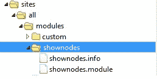
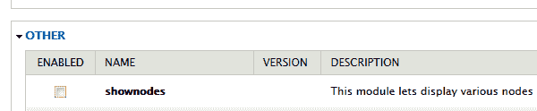
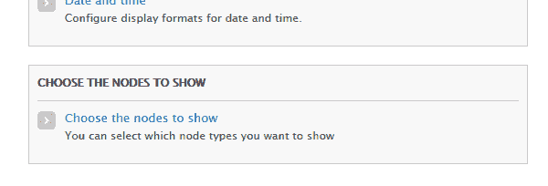
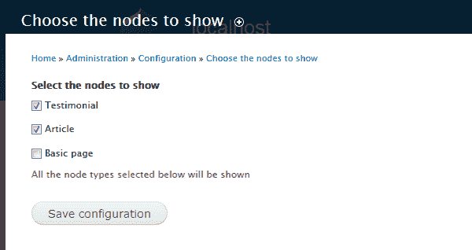
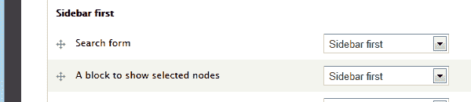

# 构建 Drupal 7 模块:显示最新节点

> 原文：<https://www.sitepoint.com/building-drupal-7-module-show-latest-nodes/>

Drupal 是最流行的开源内容管理系统之一。它有很多内置的功能和数以千计的免费和付费模块供你的网站选择。它有一个非常可扩展和灵活的架构，允许您在 Drupal 核心之上构建，并根据需要扩展其功能。Drupal 允许您使用 Drupal 钩子插入它的系统。我们将使用本文将要构建的模块中的一些钩子——一个 Drupal 7 模块，通过创建一个 Drupal 块来显示 Drupal 站点上不同类型的节点(Drupal 网站上的所有内容都被存储并被视为[节点](https://drupal.org/documentation/modules/node))。可以在模块的配置菜单中选择将要显示的节点类型。

在我们开始之前，如果您的机器上没有活动的 Drupal 安装，请按照他们的[安装指南](https://drupal.org/documentation/install)中的说明安装一个。

## 构建模块的基本结构

让我们首先为我们的模块创建基本的文件夹结构和文件。Drupal 模块需要放在 Drupal 安装中的一个特定目录中，并且需要有一些基本文件，以便 Drupal 系统可以将它识别为一个模块。我们需要做的第一件事是为我们的模块创建一个名为`shownodes`的文件夹。该文件夹应该保存在 Drupal 安装的`sites\all\modules\`文件夹中。在这个文件夹中创建两个名为`shownodes.info`和`shownodes.module`的空白文件。

文件`shownodes.info`向 Drupal 提供关于您的模块的一般信息，文件`shownodes.module`将包含我们的模块使用的各种钩子的实现。下面是我们模块的文件结构。



现在打开`shownodes.info`文件，添加以下内容:

```
name = shownodes
description = This module displays various nodes in a block on your Drupal site.
core = 7.x
```

这基本上描述了你的模块的基本属性，比如它的名字，描述以及它可以部署在哪个 Drupal 核心层。一旦您将这些细节添加到`shownodes.info`文件中，您应该能够在模块列表中看到您的模块，如下所示。您现在可以启用您的模块了。



## 理解 Drupal 挂钩

扩展 Drupal 的系统完全建立在钩子的概念上。钩子基于命名。对于一个在 Drupal 中实现钩子的模块，它必须创建一个名为`modulename_hookname`的函数，这取决于它需要在`.module`文件中实现哪个钩子。一旦有事件调用钩子，Drupal 系统将调用所有启用模块的钩子实现。要阅读更多关于可用钩子的信息，请访问[钩子文档页面](https://api.drupal.org/api/drupal/includes!module.inc/group/hooks/7)。

我们将在模块中实现的第一个钩子是 hook_help，它允许您在模块上提供帮助文本来描述模块的功能。

将以下代码添加到您的`shownodes.module`文件中

```
<?php
/**
 * @file
 * This is the main module file.
 */

/**
 * Implements hook_help().
 */
function shownodes_help($path, $arg) {

  if ($path == 'admin/help#shownodes') {
    $output = '<h3>' . t('About') . '</h3>';
    $output .= '<p>' . t('The shownodes module allows the Administrator to display various types of nodes as a block on your Drupal site.') . '</p>';
    return $output;
  }
}
```

我们通过一个名为`shownodes_help`的函数实现了`hook_help`钩子，每当帮助请求被触发时，这个函数返回我们模块的帮助文本。一旦你实现了这个钩子，帮助选项将显示在模块上，点击它将显示如下帮助。


## 向模块添加配置选项

现在让我们为我们站点的管理员添加一些配置选项。我们将为管理员创建一个选项页面，以便他可以选择要在块中显示的节点类型。这可以使用 Drupal 菜单钩子来完成。我们将在`shownodes.module`中实现 hook_menu 钩子，如下所示:

```
 /**
* Implementation of hook_menu().
*/
function shownodes_menu() {

  $items['admin/config/shownodes'] = array(
  'title' => t('Choose the nodes to show'),
  'description' => t('You can select which node types you want to show'),
  'page callback' => 'system_admin_menu_block_page',
  'access arguments' => array('administer site configuration'),
  'file' => 'system.admin.inc',
  'file path' => drupal_get_path('module', 'system'),
  );

  $items['admin/config/shownodes/settings'] = array(
  'title' => t('Choose the nodes to show'),
  'description' => t('You can select which node types you want to show'),
  'page callback' => 'drupal_get_form',
  'page arguments' => array('shownodes_admin_settings'),
  'access arguments' => array('administer site configuration'),
  'type' => MENU_NORMAL_ITEM,
  );

  return $items;
}

function shownodes_admin_settings() {

  $types = node_type_get_types();
  foreach($types as $node_type) {
    $nodetypes[$node_type->type] = $node_type->name;
  }

  $form['shownodes_nodes_toshow'] = array(
  '#type' => 'checkboxes',
  '#title' => t('Select the nodes to show'),
  '#options' => $nodetypes,
  '#default_value' => variable_get('shownodes_nodes_toshow', array('')),
  '#description' => t('All the node types selected below will be shown'),
  );

  return system_settings_form($form);
} 
```

你可以在前面提到的 hooks 文档页面阅读更多关于`hook_menu`的内容。

在这种情况下，我们在路径`admin/config/shownodes`和`admin/config/shownodes/settings`创建两个菜单项，然后在`drupal_get_form`的帮助下构建一个表单，它为我们从 Drupal 函数`node_type_get_types`获得的所有已安装的节点类型创建复选框。保存表单时，Drupal 会自动将选择的值存储在一个使用`variable_set`的变量中，这个变量的名称取自表单元素，在我们的例子中是`shownodes_nodes_toshow`。我们可以使用函数`variable_get('shownodes_nodes_toshow', array(''))`获取它的值。

我们将使用它在表单中设置默认值，然后在下面的块实现中显示所选的节点类型。一旦我们添加了上述功能，我们应该能够在管理->配置选项中看到如下所示的配置选项。



选择此选项将显示我们的表单，其中包含 Drupal 系统中的所有节点类型，我们将能够选择并保存我们希望在块中显示的节点类型，如下所示。



## 创建最新的节点块

保存配置后，我们将构建块来显示在配置中选择的节点类型。为了创建一个块，我们将实现钩子 [`hook_block_info`](https://api.drupal.org/api/drupal/modules!block!block.api.php/function/hook_block_info/7) 和 [`hook_block_view`](https://api.drupal.org/api/drupal/modules!block!block.api.php/function/hook_block_view/7) ，如下所示。

```
/**
 * Implements hook_block_info().
 */
function shownodes_block_info() {
  $blocks = array();

  $blocks['shownodeblock'] = array(
    'info' => t('A block to show selected nodes'),
  );

  return $blocks;
}

/**
 * Implements hook_block_view().
 */
function shownodes_block_view($block_name = '') {
  if ($block_name == 'shownodeblock') {

    //Get the selected node types and create a list of them
    $show_nodes_list = array();
    $show_nodes_array = variable_get('shownodes_nodes_toshow', array(''));
    foreach ($show_nodes_array as $key => $value) {
      if($value) {
          array_push($show_nodes_list,$value);
      }
    }

    //Based on the node types create a query and then load the node types
    $query = new EntityFieldQuery();
    $query
    ->entityCondition('entity_type', 'node')
    ->entityCondition('bundle', $show_nodes_list)
    ->propertyCondition('status', 1)
    ->propertyOrderBy('created', 'DESC');

    $result = $query->execute();
    $nodes = array();
    if (isset($result['node'])) {
      $nids = array_keys($result['node']);
      $nodes = node_load_multiple($nids);
    }

    //Loop through the loded nodes to create a list
    //Which we will pass to the theme
    $list = array();
    foreach ($nodes as $node) {
      $options = array('absolute' => TRUE);
      $url = url('node/' . $node->nid, $options);
      $list[] = '<a href='.$url.'>'.$node->title.'</a>';
    }

    //Return the content of the block
    $theme_args = array('items' => $list, 'type' => 'ol');
    $content = theme('item_list', $theme_args);

    $block = array(
      'subject' => t('Show Nodes Block'),
      'content' => $content,
    );
    return $block;
  }
}
```

在上面的代码中，我们在函数`shownodes_block_info`中定义了一个名为`shownodeblock`的新块。然后，在函数`shownodes_block_view`中，我们通过首先读取使用函数`variable_get('shownodes_nodes_toshow', array(''));`保存在配置中的值来提供该块的视图。接下来，我们使用 [`EntityFieldQuery`](https://api.drupal.org/api/drupal/includes!entity.inc/class/EntityFieldQuery/7) 类查询 Drupal 以获得基于节点类型的节点 id。最后，我们加载这些节点，然后遍历它们，在我们的块上显示它们。

一旦我们添加了上面的代码，我们应该在阻止列表中看到我们的块。您可以将块放置在其中一个区域中(区域是布局的实际部分，本质上是块的位置)



将块放置在其中一个区域后，可以在显示节点类型的区域中看到它，如下所示


## 结论

在本文中，我们从头开始创建了一个完整的 Drupal 模块。我们使用不同的 Drupal 钩子和 Drupal 函数来创建一个配置页面，并创建一个可以放在区域上的块。Drupal 提供了各种钩子，可以用来定制和提供核心的附加功能。通过这个简短而有趣的教程，我们已经证明了 Drupal 的可扩展特性使得对它进行扩展成为一项简单而愉快的任务。如果你想查看这个模块的完整源代码，请参见[Github repo](https://github.com/Swader/AbbasSuterwala-DrupalShowNodes)。

## 分享这篇文章