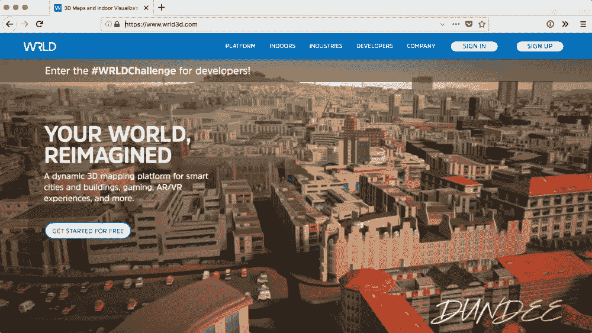
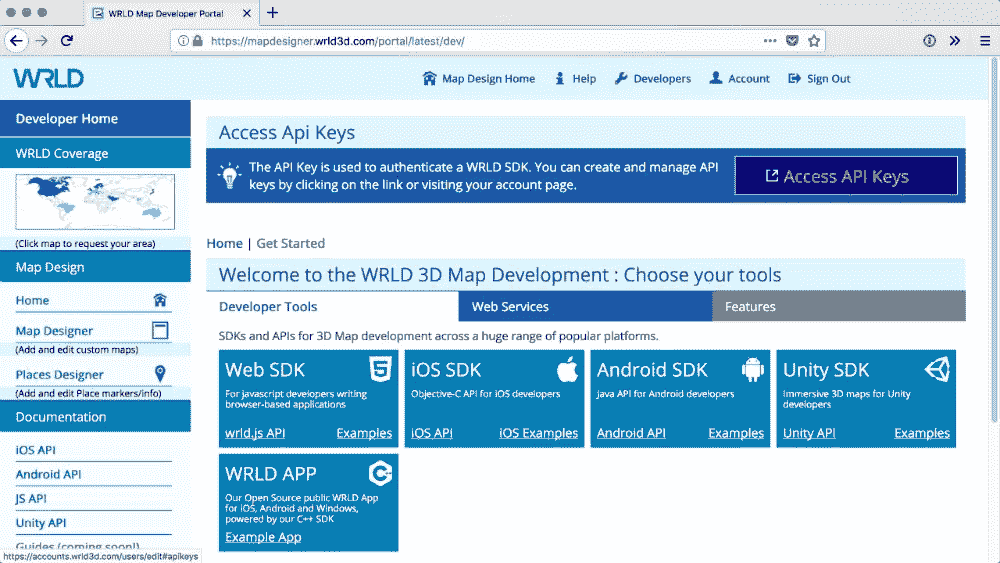
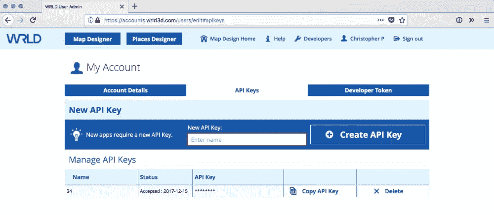
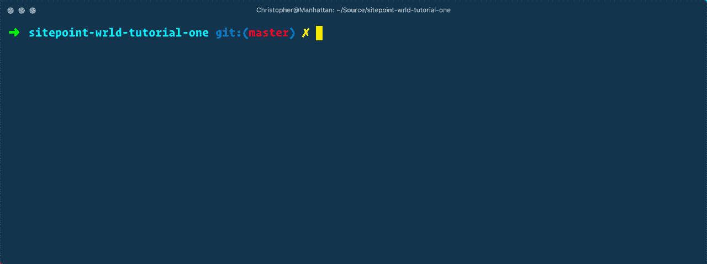
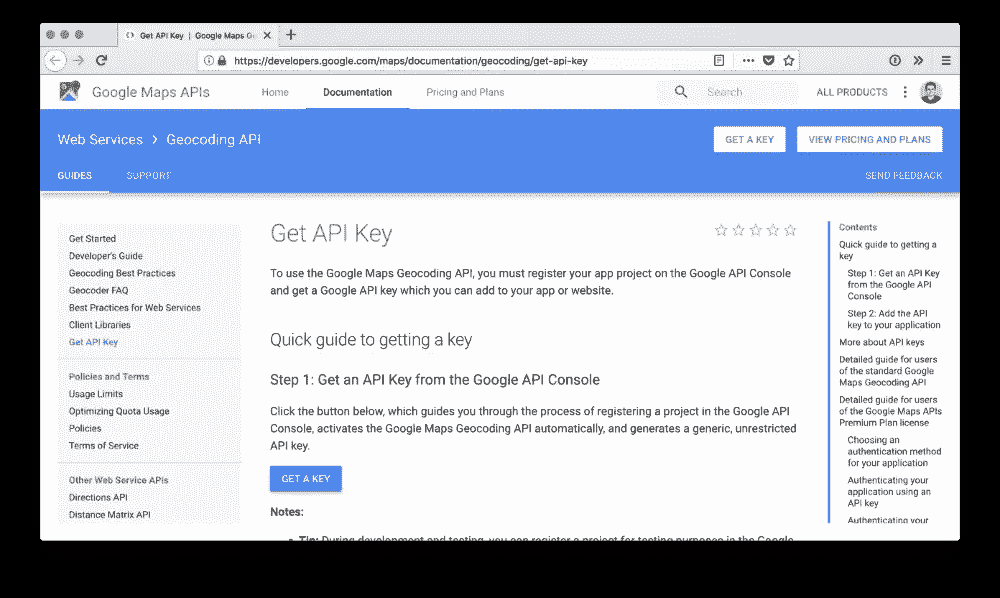

# 使用 WRLD 3D 构建动态 3D 地图

> 原文：<https://www.sitepoint.com/building-dynamic-3d-maps/>

*本文由 [WRLD 3D](https://www.wrld3d.com/) 赞助。感谢您对使 SitePoint 成为可能的合作伙伴的支持。*

> 以下事件发生于早上 7 点至 8 点，平安夜。事件实时发生。

对于我们所有的数据收集能力，当谈到在我们生活的 3D 世界中可视化这些数据时，我们仍然没有希望。我们盯着 2D 图表和日志条目，但我们从世界中提取的许多数据在 3D 环境中有意义。此外，在将这些数据应用到 3D 模型中时，可视化这些数据会非常有用。

这就是增强现实试图解决的问题。与虚拟现实的虚构环境相比，增强现实可以帮助我们解决许多现实问题；通过将我们原本通过 2D 媒介消费的数据应用到我们周围的真实世界。映射是增强现实的第一个孩子。

当 WRLD 向我们介绍他们的平台时，我立即被他们平台的图形和性能所吸引。然而，我越是使用他们的平台；我就越对他们的 API 的实用性和地图数据的保真度着迷。

我们将发布一系列教程，演示如何使用这个平台将信息带入它所应用的世界。每个教程都是根据一个受欢迎的电视节目为主题的。你可能已经猜到了，这第一个是关于 *24* 的。

在本教程中，我们将学习如何开始使用 WRLD 平台。我们将按照文档示例来呈现最简单的地图。然后，我们将创建一个编译代码的本地环境；开始用它来讲故事。

我们将讨论这些主题:

*   根据地名渲染地图
*   在地图上移动，为了一系列的事件
*   突出建筑物并在每个建筑物设计活动
*   用 HTML5 音频 API 播放声音文件
*   为地图更改天气条件和时间

> 本教程的代码可以在 Github 上找到[。它已经在 Firefox、Node 和 macOS 的现代版本上进行了测试。](https://github.com/assertchris-tutorials/sitepoint-wrld-tutorial-one)

## 入门指南

最简单的开始方法是遵循文档中的第一个例子。在此之前，我们需要一个账户。前往[https://www.wrld3d.com](https://www.wrld3d.com)，点击“注册”。



登录后，点击“开发者”和“访问 API 密钥”。



为您的应用程序创建一个新的 API 密钥。您可以将其命名为任何名称，但是您需要稍后复制生成的密钥…



对于第一个例子，我们可以从官方文档网站获得代码。我已经把它输入了 CodePen，并用纽约的坐标替换了它:

[//codepen.io/assertchris/embed/mpJZmo/?height=265&theme-id=0&default-tab=css,result&embed-version=2](//codepen.io/assertchris/embed/mpJZmo/?height=265&theme-id=0&default-tab=css,result&embed-version=2)

看笔<a href = " https://code Pen . io/assert Chris/Pen/mpj zmo/">WRLD</a>的入门作者克里斯托弗·皮特(<a href = " https://code Pen . io/assert Chris ">@ assert Chris</a>)在<a href = " https://code Pen . io ">code Pen</a【T11<br>

WRLD.js 基于[fleet . js](http://leafletjs.com/)，这使得任何以前做过一点基于地图的工作的人都很熟悉它。这也意味着地图是移动友好的和交互式的。

> 用鼠标左键单击并拖动，在地图上平移。用鼠标右键单击并拖动来旋转地图。单击并拖动，用鼠标中键改变透视角度。滚动鼠标滚轮会影响缩放。地图也可以在触摸设备上控制。

除了包含 Javascript SDK 和样式表之外；我们只需要大约 5 行格式化的代码来渲染一幅漂亮的纽约地图！第一个参数`map`是元素的 ID，WRLD 应该将地图渲染到这个元素中。第二个是我们生成的 API 密钥。第三个是配置对象。这个对象包含地图中心的坐标，以及一个可选的缩放级别。

## 设置构建链

CodePen 非常适合快速演示；但是我们需要更结实更像样的东西。让我们设置一些简单的东西，将我们所有的现代 Javascript 编译成大多数浏览器都能理解的版本。

[ParcelJS](https://parceljs.org/) 最近公布；作为一个快速、零配置的网络捆绑器。让我们来测试一下。首先，我们需要安装包裹作为一个全球应用程序，通过 NPM:

```
npm install -g parcel-bundler 
```

接下来，我们可以为我们的项目创建一些文件。我们需要一个 Javascript 文件、一个 CSS 文件和一个 HTML 入口点文件:

```
const Wrld = require("wrld.js")

const map = Wrld.map("map", "[your API key here]", {
    center: [40.73061, -73.935242],
    zoom: 16,
}) 
```

> 这是来自`tutorial/app.js`

```
@import "https://cdnjs.cloudflare.com/ajax/libs/leaflet/1.0.1/leaflet.css";

html,
body {
    margin: 0;
    padding: 0;
    width: 100%;
    height: 100%;
}

#map {
    width: 100%;
    height: 100%;
    background-color: #000000;
} 
```

> 这是来自`tutorial/app.css`

```
<!doctype html>
<html lang="en">
    <head>
        <meta charset="utf-8" />
        <link rel="stylesheet" href="./app.css" />
        <title>Getting started with WRLD</title>
    </head>
    <body>
        <div id="map"></div>
        <script src="./app.js"></script>
    </body>
</html> 
```

> 这是来自`tutorial/index.html`

注意`app.js`是如何要求`wrld.js`的？我们需要安装 WRLD Javascript SDK:

```
npm init -y
npm install --save wrld.js 
```

然后，我们可以开始使用 Parcel 构建和运行本地文件:

```
parcel index.html 
```

这将启动一个本地开发服务器，并捆绑 JS 和 CSS 文件。这个过程看起来像这样:



打开浏览器中显示的网址，你应该会再次看到纽约的地图。当我们对 JS 和 CSS 文件进行修改时，这些文件会自动重新编译并在浏览器中重新加载。Parcel 似乎确实名副其实。

这正是我们所需要的——一个轻松的构建链，让我们专注于完成 WRLD 的工作！

> 包裹还很新。您可能难以处理高度定制的工作流或构建需求；文档仍然有办法解释在那些情况下做什么。尽管如此，我认为这个简单的构建链将适合我们的需求，并且 Parcel 已经实现了它的承诺。

## 将名称转换为坐标

有时我们知道我们想去的地方的准确坐标。有时候我们只知道这个地方的名字。让我们快速转移话题，看看当我们只知道一个地方的名字时，如何找到它的坐标。

这是 WRLD 平台上尚未提供的少数服务之一。所以，让我们用一个谷歌 API 来解决这个问题。我们将需要另一个 API 密钥，因此请前往[https://developers . Google . com/maps/documentation/geocoding/Get-API-key](https://developers.google.com/maps/documentation/geocoding/get-api-key)并点击“获取密钥”:



接下来，我们可以使用 Google 地理编码服务查找地址的坐标，只需稍微修改一下我们的 Javascript:

```
const Wrld = require("wrld.js")

const keys = {
    wrld: "[your WRLD API key]",
    google: "[your Google API key]",
}

window.addEventListener("load", async () => {
    const address = encodeURIComponent("empire state building, new york")

    const endpoint = "https://maps.googleapis.com/maps/api/geocode/json?"
        + "key=" + keys.google + "&address=" + address

    // console.log(endpoint)

    const response = await fetch(endpoint)
    const lookup = await response.json()

    // console.log(lookup)

    const { lat, lng } = lookup.results[0].geometry.location

    const map = Wrld.map("map", keys.wrld, {
        center: [lat, lng],
        zoom: 12,
    })
}) 
```

> 这是来自`tutorial/app.js`

我已经将键重构为一个对象。我们甚至可以将它们移动到一个环境变量文件中，并从 Git 中排除该文件。这样的话，密钥可能是有用的，但对公众来说是隐藏的。我还将我的代码移到了一个异步短箭头函数中，这样我就可以使用`async`和`await`；因此它在文档加载后发生。

接下来，我们可以定义一个地址来查找。最好对地址进行编码，以便它可以用作查询字符串参数。我们可以将它和 Google API 键一起输入到地理编码 API 端点，以获得结果。

继续并取消控制台日志语句的注释，这样您就可以看到编码后的 URI 是什么样子，以及 Google 返回给我们的结果是什么样子。我们从 Google 得到了相当详细的结果，但是我们想要的部分在`results[0].geometry.location`里面。使用对象析构，我们可以只提取该对象的`lat`和`lng`键。

最后，我们可以将这些输入到`map`函数中，地图将呈现帝国大厦。正如我所说的，我们通常已经知道了地图中心的坐标。但是，当我们不知道时:这个服务和代码将帮助我们找到它们。

## 在地图上移动

让我们开始致力于我们的沉浸式地图体验。我们想让某人经历一系列事件，并将地图移动到每个新事件，这样我们就可以给他们讲故事。将故事内容与故事机制分开的一个好方法是创建一个单独的“数据”Javascript 导入:

```
module.exports = [
    {
        // start at Empire State Building
        lat: 40.7484405,
        lng: -73.98566439999999,
        seconds: 15,
        image: ".jack-1",
        text: "What a lovely day...<phone rings>",
    },
    {
        // stay in the same place but update story
        lat: 40.7484405,
        lng: -73.98566439999999,
        seconds: 15,
        image: ".chloe-1",
        text: "Jack, we have a problem...",
    },
    // ...more events
] 
```

> 这是来自`tutorial/story.js`

我们可以把故事分成地图事件。每个事件甚至都有一个`lat`和`lng`，尽管一些事件可能发生在先前的位置。对于每个事件，我们将展示一张某人发言的照片，以及他们在说什么。几秒钟后，我们会将摄像机移动到新的位置和/或扬声器。

我们可以将该文件导入到主 Javascript 文件中，并更改地图以显示第一个故事事件。我们甚至可以突出显示事件发生的建筑:

```
const story = require("./story")

window.addEventListener("load", async () => {
    // ...old code commented out here

    const { lat, lng } = story[0]

    const map = Wrld.map("map", keys.wrld, {
        center: [lat, lng],
        zoom: 15,
    })

    map.on("initialstreamingcomplete", () => {
        Wrld.buildings
            .buildingHighlight(
                Wrld.buildings
                    .buildingHighlightOptions()
                    .highlightBuildingAtLocation([lat, lng])
                    .color([125, 255, 125, 128]),
            )
            .addTo(map)
    })
}) 
```

> 这是来自`tutorial/app.js`

这段代码演示了当初始的地图渲染/流完成后，如何高亮显示一个建筑。创建一个模板选项对象，我们添加高亮的位置和颜色。我们将这个选项对象传递给`Wrld.buildings.buildingHighlight`来创建高光，并将其添加到地图中。颜色数组是一个 RGBA 值，这意味着第四个整数是一个不透明度值(`128`大约是`255`限制的一半，或 50%透明)。

> 这不是突出建筑物的唯一方法。我们也可以使用光线投射来选择一个建筑，但是这比我们在这里需要的更高级。你可以在[https://wrld 3d . com/wrld . js/latest/docs/API/L . wrld . buildings . building highlight options](https://wrld3d.com/wrld.js/latest/docs/api/L.Wrld.buildings.BuildingHighlightOptions)找到它的文档

事实上，当我们这么做的时候。我们可以将这个建筑亮点抽象成一个可重复使用的功能。我们甚至可以为每个事件添加特定的高光颜色，并在每次添加新的高光颜色时删除之前的建筑高光:

```
const { lat, lng, color } = story[0]

const map = Wrld.map("map", keys.wrld, {
    center: [lat, lng],
    zoom: 15,
})

map.on("initialstreamingcomplete", () => {
    highlightBuildingAt(lat, lng, color)
})

let highlight = null

const highlightBuildingAt = (lat, lng, color) => {
    if (highlight) {
        highlight.remove()
    }

    highlight = Wrld.buildings
        .buildingHighlight(
            Wrld.buildings
                .buildingHighlightOptions()
                .highlightBuildingAtLocation([lat, lng])
                .color(color),
        )
        .addTo(map)
} 
```

> 这是来自`tutorial/app.js`

这样，杰克和克洛伊可以有他们自己的亮色，以显示他们说话的时候。移除建筑高光甚至比添加它们更容易。我们只需要保存一个对我们创建的高光的引用，并对它调用`remove`方法。

## 移动地图

好了，现在我们需要将地图移动到每个新事件。我们将突出显示每个事件的建筑，这样我们就知道我们在看哪一个:

```
const { lat, lng, zoom, color, seconds } = story[0]

const map = Wrld.map("map", keys.wrld, {
    center: [lat, lng],
    zoom,
})

map.on("initialstreamingcomplete", () => {
    highlightBuildingAt(lat, lng, color)

    if (story.length > 1) {
        setTimeout(() => showNextEvent(1), seconds * 1000)
    }
})

let highlight = null

const highlightBuildingAt = (lat, lng, color) => {
    if (highlight) {
        highlight.remove()
    }

    highlight = Wrld.buildings
        .buildingHighlight(
            Wrld.buildings
                .buildingHighlightOptions()
                .highlightBuildingAtLocation([lat, lng])
                .color(color),
        )
        .addTo(map)
}

const showNextEvent = index => {
    const { lat, lng, zoom, degrees, color, seconds } = story[index]

    map.setView([lat, lng], zoom, {
        headingDegrees: degrees,
        animate: true,
        durationSeconds: 2.5,
    })

    setTimeout(() => {
        highlightBuildingAt(lat, lng, color)

        if (story.length > index + 1) {
            setTimeout(() => showNextEvent(index + 1), seconds * 1000)
        }
    }, 2.5 * 1000)
} 
```

> 这是来自`tutorial/app.js`

这里发生了很多事情，所以让我们来分解一下:

1.  我们已经为每个事件添加了一个`zoom`属性。这意味着我们可以制作事件之间缩放的动画，这给故事增加了很多活力。我们还为除第一个事件之外的所有事件添加了一个`degrees`属性。我们可以修改第一个事件的摄像机方向，但我对它默认的样子(360 度)很满意。给事件添加度数可以让我们用和缩放一样的方式来制作标题动画。
2.  如果有多个事件(假设这是安全的，但我还是添加了检查)，那么我们使用第一个事件的`seconds`属性来延迟到事件#2 的转换。我们创建一个`showNextEvent`函数，带有一个硬编码的索引值`1`。
3.  在`showNextEvent`中，我们使用`setView`方法来动画显示摄像机的位置、缩放和方向。动画将花费`2.5`秒，所以我们设置了这么长的超时时间。在超时回调函数中，我们高亮显示新的建筑(这样高亮显示只发生在摄像机移动之后)并排队等待下一个事件。

> 随意添加更多事件和/或完全改变故事。让它成为你自己的，并从中获得乐趣！

## 添加音频

我们的故事有点安静。我们需要一些悬疑的背景音乐让我们进入状态。去像[流行病之声](http://www.epidemicsound.com/)这样的网站，为你的故事找一些悬疑的音乐曲目。我下载了一些，放在一个`tutorial/tracks`文件夹里。

现在，让我们创建一个不可见的音频播放器，并让它随机播放曲目。为此，我们需要一个曲目列表:

```
<!doctype html>
<html lang="en">
    <head>
        <meta charset="utf-8" />
        <link rel="stylesheet" href="./app.css" />
        <title>Getting started with WRLD</title>
    </head>
    <body>
        <div id="map"></div>
        <audio class="track-1" src="./tracks/track-1.mp3" />
        <audio class="track-2" src="./tracks/track-2.mp3" />
        <audio class="track-3" src="./tracks/track-3.mp3" />
        <audio class="track-4" src="./tracks/track-4.mp3" />
        <audio class="track-5" src="./tracks/track-5.mp3" />
        <audio class="track-6" src="./tracks/track-6.mp3" />
        <audio class="track-7" src="./tracks/track-7.mp3" />
        <audio class="track-8" src="./tracks/track-8.mp3" />
        <audio class="track-9" src="./tracks/track-9.mp3" />
        <audio class="track-10" src="./tracks/track-10.mp3" />
        <script src="./app.js"></script>
    </body>
</html> 
```

> 这是来自`tutorial/index.html`

Parcel 正在监视`index.html`,并将其复制到`dist`文件夹中的文件的所有静态文件引用重写。如果我们在这个 HTML 文件中创建 HTML4 `audio`标签，Parcel 会将这些文件复制到 list 文件夹中，并通过开发服务器提供给它们。我们不一定要这样做，但是随着开发的进行，测试会更简单。

> 一种替代方法是从互联网上的某个地方引用这些文件。另一种方法是不使用开发服务器。

```
module.exports = [
    ".track-1",
    ".track-2",
    ".track-3",
    ".track-4",
    ".track-5",
    ".track-6",
    ".track-7",
    ".track-8",
    ".track-9",
    ".track-10",
] 
```

> 这是来自`tutorial/tracks.js`

我们可以使用这个列表找到 HTML 元素，链接到我们想要播放的每个`*.mp3`文件。我们正要在主 JS 文件中使用这个列表:

```
const nextTrack = () => {
    const index = Math.floor(Math.random() * tracks.length)

    const audio = new Audio(document.querySelector(tracks[index]).src)
    audio.addEventListener("ended", () => nextTrack())
    audio.play()
}

nextTrack() 
```

> 这是来自`tutorial/app.js`

我们想随机播放一首曲目，就找一个随机索引。然后，我们获取与该索引匹配的`audio`元素，并用其`src`属性值创建一个新的`Audio`对象。当曲目播放完毕后，我们再次调用`nextTrack`函数(这样下一首随机曲目开始循环播放)并开始随机选择的曲目。

> 不幸的是，我不能在 Github 库中包含我正在使用的曲目。首先，它们将大幅扩大回购规模。其次，我有权在 YouTube 产品中使用它们，但不得出于任何其他原因分发它们。如果你想得到我用过的曲目，可以在[这个疫音搜索结果页面](https://player.epidemicsound.com/search/?search_query=Magnus%20Ringblom%20Thriller)找到。

## 为事件添加信息卡

我之前提到过；WRLD.js 基于 LeafletJS。这太棒了，因为我们可以在使用 WRLD 地图的同时做传单允许我们做的任何事情。事实上，我们可以使用传单弹出来叙述故事事件。一个传单弹出看起来像这样:

```
L.popup()
    .setLatLng(latlng)
    .setContent("I am a popup!")
    .openOn(map) 
```

我们将在弹出窗口中嵌入每个事件的图像和文本。如果我们能根据建筑的高度来定位弹出窗口，那也是很酷的。不在正上方，但是…比如说…在大楼的中间。我们可以像这样使用:

```
let popup = null

const showPopup = (lat, lng, image, text, elevation) => {
    const src = document.querySelector(image).src

    const element1 = ""
    const element2 = "<span class='text'>" + text + "</span>"
    const element3 = "<div class='popup'>" + element1 + element2 + "</div>"

    popup = L.popup({
        closeButton: false,
        autoPanPaddingTopLeft: 100,
        elevation: Math.max(20, elevation / 2),
    })
        .setLatLng(L.latLng(lat, lng))
        .setContent(element3)
        .openOn(map)
} 
```

> 这是来自`tutorial/app.js`

`L.popup`接受一个选项对象。我们设置的选项有:

1.  我们想隐藏通常显示在传单弹出窗口上的关闭按钮。
2.  当摄像机完成平移以显示弹出窗口时，我们希望摄像机在屏幕的上/左之间留出足够的空间。
3.  我们希望弹出窗口距离底层至少 20 米，至多是建筑其他高度的一半。

我们还构建了一个 HTML 字符串；它将事件的图像和文本放在一个`.popup`元素中。我们可以对这些元素使用以下样式:

```
.hidden {
    display: none;
}

.image {
    display: flex;
    width: auto;
    height: 100px;
}

.text {
    display: flex;
    padding-left: 10px;
    font-size: 16px;
}

.popup {
    display: flex;
    flex-direction: row;
    align-items: flex-start;
} 
```

> 这是来自`tutorial/app.css`

`.popup`是一个 Flexbox 容器元素。我们对其应用的 flex 样式是，子元素应该显示在一行中，并且应该与容器的顶部对齐。有许多很棒的 Flexbox 指南。看一看 [Flexbox 僵尸](https://geddski.teachable.com/p/flexbox-zombies)有趣的学习方式…

> 注意，我们还为`index.html`中的图像定义了`.hidden`样式。我们不希望它们被显示出来——它们在那里是为了让 package 正确地复制和引用它们。

问题是:我们如何得到每栋建筑的标高？我们可以监听建筑信息事件，并从那里计算出标高。不幸的是，没有针对每个突出显示的方法来做到这一点，所以我们必须挂钩到“全局”事件，并悄悄地添加/删除侦听器:

```
let elevation = 0

const waitForElevation = onElevation => {
    const listener = event => {
        map.buildings.off("buildinginformationreceived", listener)

        const information = event.buildingHighlight.getBuildingInformation()

        if (!information) {
            onElevation(0)
        } else {
            const dimensions = information.getBuildingDimensions()
            const ground = dimensions.getBaseAltitude()
            const elevation = dimensions.getTopAltitude() - ground

            onElevation(elevation)
        }
    }

    map.buildings.on("buildinginformationreceived", listener)
} 
```

> 这是来自`tutorial/app.js`

`waitForElevation`创建一个监听器函数并将其添加到`buildinginformationreceived`地图事件中。一旦监听器被触发，它就会移除自己。通过这种方式，我们可以触发每一个突出显示类型的事件:添加侦听器→突出显示建筑物→调用侦听器→删除侦听器。

`buildinginformationreceived`接收一个事件，该事件有一个`getBuildingInformation`方法。如果建筑物有任何信息，我们得到地面高度，并从中计算出海拔。如果没有，我们调用`onElevation`函数参数。所以，`onElevation`用一个整数，`0`或者更大的整数来调用。

剩下要做的就是给每个`highlightBuildingAt`调用添加一个`onElevation`回调；并调用`waitForElevation`里面的那个函数:

```
map.on("initialstreamingcomplete", () => {
    highlightBuildingAt(
        lat, lng, color,
        elevation => showPopup(lat, lng, image, text, elevation)
    )

    if (story.length > 1) {
        setTimeout(() => showNextEvent(1), seconds * 1000)
    }
})

let highlight = null

const highlightBuildingAt = (lat, lng, color, onElevation) => {
    waitForElevation(onElevation)

    // ...rest of highlightBuildingAt
}

const showNextEvent = index => {
    // ...rest of showNextEvent

    setTimeout(() => {
        highlightBuildingAt(
            lat, lng, color,
            elevation => showPopup(lat, lng, image, text, elevation)
        )

        if (story.length > index + 1) {
            setTimeout(() => showNextEvent(index + 1), seconds * 1000)
        }
    }, 2.5 * 1000)
} 
```

> 这是来自`tutorial/app.js`

## 不断变化的天气和时间

杰克的故事在冬天上演；但是地图是阳光明媚的。让我们改变天气，使之更符合季节变化:

```
map.themes.setWeather(Wrld.themes.weather.Snowy) 
```

> 这是来自`tutorial/app.js`

改变天气容易得可笑。在这里，我们让它下雪；但是我们可以把它做成以下任何一种:

*   `Wrld.themes.weather.Clear`
*   `Wrld.themes.weather.Overcast`
*   `Wrld.themes.weather.Foggy`
*   `Wrld.themes.weather.Rainy`
*   `Wrld.themes.weather.Snowy`

同样，我们想让时间的流逝更真实一点。每 24 集应该发生在 1 小时的过程中。如果我们能让每个地点相隔 1 小时，那就太好了，但我们只有这些时间:

*   `Wrld.themes.time.Dawn`
*   `Wrld.themes.time.Day`
*   `Wrld.themes.time.Dusk`
*   `Wrld.themes.time.Night`

让我们根据每个事件更改一天中的时间:

```
const { lat, lng, zoom, color, seconds, image, text, time } = story[0]

const map = Wrld.map("map", keys.wrld, {
    center: [lat, lng],
    zoom,
})

if (time) {
    map.themes.setTime(time)
}

// ...later

const showNextEvent = index => {
    const {
        lat, lng, zoom, degrees, color, seconds, image, text, time
    } = story[index]

    map.setView(...)

    setTimeout(() => {
        if (time) {
            map.themes.setTime(time)
        }

        highlightBuildingAt(...)

        if (story.length > index + 1) {
            setTimeout(...)
        }
    }, 2.5 * 1000)
} 
```

> 这是来自`tutorial/app.js`

## 摘要

我们今天结束了。我希望你和我一起做这个的时候一样开心。花些时间润色你的故事；加入新的角色，新的音乐，以及任何你认为会让你的故事变得精彩的东西。我们很想看看你有什么想法。

这是最终产品的视频。我将在此基础上增加更多活动，但我对我们的管理感到非常自豪:

[https://www.youtube.com/embed/wsexlFaAm3o](https://www.youtube.com/embed/wsexlFaAm3o)

下一次，我们将学习更多关于 WRLD 平台允许的演示、动画和自动化。事实上，我们将利用 WRLD 创建一个有用的、可销售的移动友好应用程序。下次见！

## 分享这篇文章