# 用 WebMatrix 构建动态网站

> 原文：<https://www.sitepoint.com/building-dynamic-websites-with-webmatrix/>

微软最近推出了 WebMatrix，这是一款免费的轻量级工具，使用新的 Razor view 引擎，提供了迄今为止最简单的网站构建方式。WebMatrix 的安装中结合了 SQL Server Compact、IIS Express 和包含 Razor 语法的 ASP.NET 网页框架。所有这些都简化了创建和部署 WebMatrix 网站的流程。

本文将带您了解如何充分利用 WebMatrix 和新的 Razor 视图引擎。

在开始之前，您可能想阅读关于 WebMatrix 和 Web 应用程序库的本系列文章的第 1 部分。如果你还没有安装 WebMatrix，你可以在这里下载并获得安装说明[。](http://www.microsoft.com/web/webmatrix/)

## 为什么使用 WebMatrix？

如果已经安装了 Microsoft Visual Studio，为什么还要使用 WebMatrix？答案是易用性。WebMatrix 面向初学者、业余程序员以及那些喜欢利用开源应用程序资源的人。Visual Studio 可能会让没有经验的人望而生畏，而 WebMatrix 用户界面(UI)易于使用和理解。

### Razor 视图引擎

由于新的 Razor 视图引擎简化了您需要使用的语法，因此在 WebMatrix 中创建动态内容很容易。以前需要多个尖括号和百分比符号的代码可以用一个@字符写成 Razor 语法。例如，如果您想打印日期和时间，您应该这样做:

```
<p>The date and time is @DateTime.Now</p>
```

执行循环也很容易。下面是循环遍历计数器并将结果打印到窗口的代码:

```
@for(int i = 0;i < 5;i++) {

    <p>@i</p>

}
```

Razor 也有代码块。以下示例说明了如何使用它们:

```
@{

    var message = "Code block text";

}

<!DOCTYPE html>

<html lang="en">

    <head>

        <meta charset="utf-8" />

        <title></title>

    </head>

    <body>

        <h2>@message</h2>

    </body>

</html>
```

Razor 简化了标记，所以代码可读性更好，也更容易维护。使用 Razor 语法的另一个好处是自动 HTML 编码。这意味着您甚至不用考虑就可以降低 XSS 攻击的可能性。例如，您可以使用 Razor 语法打印以下代码，并且不会受到正在执行的 JavaScript 的影响:

```
@("<script>alert('If this pops up you're in trouble');</script>")
```

结果可以在下面看到。

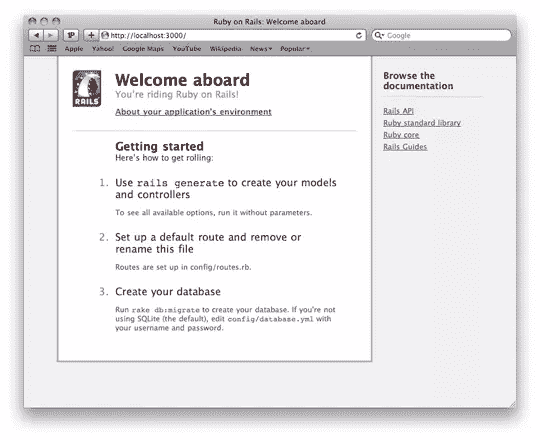

如果您想选择加入并关闭 Html 编码，您可以使用 HTML。Raw，保证字符串保持未编码状态:

```
@Html.Raw("<script>alert('If this pops up you\'re in trouble');</script>")
```

结果如下:

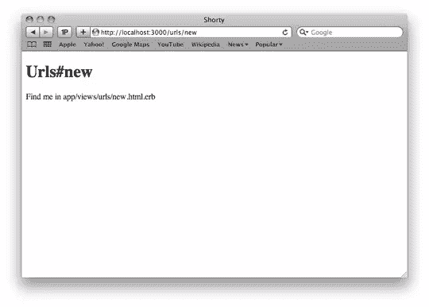

### 布局页面

Razor view 引擎使用**布局页面**来实现相同的目的，而不是使用带有内容占位符的母版页来创建整个网站的一致外观。

我们走吧。启动 WebMatrix。上次，我们从网络画廊转到**网站，但这次，我们将从模板**转到**网站。您将看到一个如下所示的屏幕:**


我们将从头开始创建我们的站点，所以让**空站点**高亮显示，在**站点名称**字段中为您的项目命名，然后单击 OK。

在下一个屏幕上，单击左下角的文件图标，查看您有哪些可用的文件。现阶段应该只是一个`robots.txt`文件。

在根网站下创建一个名为 **Shared** 的新文件夹，方法是右键单击您的网站名称，然后单击新建文件夹，或者单击新建菜单图标下的箭头，然后选择新建文件夹**。**

如果你愿意，你可以给这个文件夹起一个不同的名字，但是 Shared 遵循与 MVC 相同的设计模式。添加一个名为`_Layout.cshtml`的新文件。下划线很重要。默认情况下，ASP.NET 不会提供以下划线开头的页面。

一旦创建了页面，您需要添加一个对名为 **RenderBody** 的新方法的调用。 **RenderBody** 方法的位置决定了来自内容页面的数据将驻留在哪里。您的布局页面应该如下所示:

```
<!DOCTYPE html>

<html lang="en">

    <head>

        <meta charset="utf-8" />

        <title></title>

    </head>

    <body>

        <h1>Layout Page</h1>

        @RenderBody()

    </body>

</html>
```

将内容页面连接到布局页面是通过向内容页面添加一个`Layout`属性来实现的。用以下代码替换`default.cshtml` 页面中的代码:

```
@{

    Layout = "~/Shared/_Layout.cshtml

}

<h2>Hello world</h2>
```

布局页面还可以包含可由磁盘上的其他页面填充的内容。这是通过使用 **RenderPage** 方法实现的。该方法接受一个参数，即文件的位置，并将该参数注入页面。对于这个例子，我将创建一个头文件。将一个新的 CSHTML 文件添加到您之前创建的共享文件夹中，并将其命名为`_Header.cshtml`。将以下代码添加到文件中:

```
<h1>

    Heading here

</h1>
```

使用这个新页面就像在`_Layout.cshtml`页面中添加以下代码一样简单:

```
<!DOCTYPE html>

<html lang="en">

    <head>

        <meta charset="utf-8" />

        <title></title>

    </head>

    <body>

        @RenderPage("~/Shared/_Header.cshtml")

        @RenderBody()

    </body>

</html>
```

下面可以看到在 IIS Express 下运行的合并结果。


一个布局页面可以包含多个`RenderPage`方法，所以这是一个将布局页面与内容页面分开的好方法。

布局页面也使用节的概念。一个布局页面只能包含一个 **RenderBody** 方法，但是可以有多个部分。要创建一个部分，使用 **RenderSection** 方法。RenderSection 和 RenderPage 的区别在于，RenderPage 从文件中读取内容，而 RenderSection 运行您在内容页面中定义的代码块。下面的代码演示了如何呈现页脚部分:

```
<!DOCTYPE html>

<html lang="en">

    <head>

        <meta charset="utf-8" />

        <title></title>

    </head>

    <body>

        @RenderPage("~/Shared/_Header.cshtml")

        @RenderBody()

        <div id="footer">

            @RenderSection("footer")

            </div>

    </body>

</html>
```

RenderSection 需要一个参数，这是部分的名称。如果它不存在，将抛出一个异常。内容页可以使用以下代码向节中添加数据:

```
@section footer {

        <small>Copyright 2010</small>

}
```

`@section`语法后面是部分的名称，在本例中是 footer。然后你定义你想要显示的内容。您的`default.cshtml`文件现在应该如下所示:

```
@{

    Layout = "~/Shared/_Layout.cshtml";

}

<h2>Hello world</h2>

@section footer {

    <small>Copyright</small>

}
```

`_Layout.cshtml`页面中的页脚部分是必需的。如果它不存在，就会发生运行时异常。有些时候你不需要一个部分，即使它是在布局页面中定义的。要使某个部分可选，请使用以下代码:

```
@RenderSection("footer", required: false)
```

### 在内容和布局页面之间传递数据

有时，您有在内容页面中定义的数据，并且您需要在布局页面中引用该数据。由于有了 **PageData** 属性，实现这一点很容易。 **PageData** 属性是一个名称/值对的集合，它存储您需要在页面之间传递的数据。要演示这一点，请用以下代码替换默认页面中的代码:

```
@{

    Layout = "~/Shared/_Layout.cshtml";

    if(IsPost) {

        PageData["PostedText"] = Request["PostedText"];

    } else {

        PageData["PostedText"] = "No data posted";

    }

}

<h2>Hello world</h2>

<form method="post">

    <input type="hidden" name="PostedText" value="Displayed text" />

    <input type="submit" value="Update Heading" />

</form>

@section footer {

    <small>Copyright</small>

}
```

在上面的代码中，我创建了一个表单，当它被提交给服务器时，`IsPost`方法用于确定传入的请求是否是由 HTTP post 生成的。如果是这种情况，它将把 **PageData** 属性 *PostedText* 更改为隐藏字段输入的值，否则它将存储旧值。最后一步是更新布局页面以使用 **PageData** 属性。以下代码是`_Layout.cshtml`页面的外观:

```
<!DOCTYPE html>

<html lang="en">

    <head>

        <meta charset="utf-8" />

        <title></title>

    </head>

    <body>

        @RenderPage("~/Shared/_Header.cshtml")

        <h2>@PageData["PostedText"]</h2>

            @RenderBody()

        <div id="footer">

            @RenderSection("footer", required: false)

        </div>

    </body>

</html>
```

在提交数据之前，页面将如下所示:

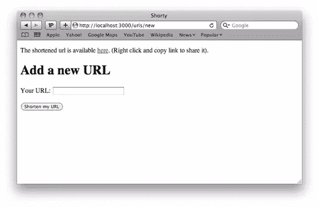

一旦你发布了数据，文本就会从*无数据发布*变为*显示的文本*，如下所示。

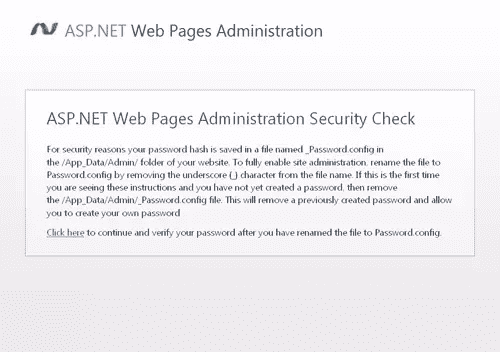

### 用助手创建可重用代码

编程时面临的一个常见问题是避免重复代码。否则，对于开发人员来说，这意味着额外的工作，并可能导致维护的噩梦。例如，假设您有以下代码:

```
@{

    var items = new[] { "one", "two", "three", "four" };

}

<ul>

    @foreach(var item in items) {

        <li>@item</li>

    }

</ul>
```

如果代码在一个地方，这没有问题，但是如果您需要在多个地方从一个值集合中呈现一个无序列表，该怎么办？糟糕的选择是复制并粘贴代码。WebMatrix 通过引入 **Web 助手**解决了这个问题，允许您创建可以在多个位置使用的代码片段。

要创建 Web 助手，首先需要在根目录下创建一个名为 **App_Code** 的新文件夹。驻留在该文件夹中的文件在运行时被编译成一个类。接下来，向网站添加一个新文件，并将其命名为`Helpers.cshtml`。将以下代码添加到文件中:

```
@helper ShowList(string[] items) {

    <ul>

        @foreach(var item in items) {

            <li>@item</li>

        }

    </ul>

}
```

`@helper` 表示一个助手方法。`ShowList`是 helper 的名字，它接受一个字符串数组，并把它们呈现在一个无序列表中。要使用这个助手，请在`default.cshtml`页面中使用下面的代码:

```
@{

    var items = new[] { "one", "two", "three", "four" };

    @Helpers.ShowList(items);

}
```

帮助器的作用类似于. NET 中的静态类，你可以通过文件名和方法名来引用它们。`@Helpers`映射到`App_Code`文件夹中的`Helpers.cshtml`，`ShowList`是帮助者的名字。

### ASP.NET 网页包管理

除了您在前一个例子中创建的 Web Helper 之外，还有一种简单的方法可以让您下载开源 Web Helper，这将使您的生活更加简单。要下载这些助手，你需要使用*软件包管理器*工具，它是 ASP.NET 网页软件包管理网站的一部分。按照以下步骤安装库:

1.选择您之前创建的`default.cshtml` 页面，并从功能区中点击**运行**。在浏览器的**地址栏**中，将`default.cshtml`替换为 *_Admin* 。你的网址应该看起来类似于`[http://localhost:1234/_Admin](http://localhost:1234/_Admin)`。

2.按**回车**浏览到上面的网址。由于这是您第一次登录页面的 *_Adm* *，系统会提示您创建密码。输入您的密码并按下*创建密码*。*

3.出于安全原因，您的密码保存在网站的`/App_Data/Admin/`文件夹中名为`_Password.config`的文件中。要启用站点管理，您必须浏览到该文件并删除文件名中的下划线(_)字符。默认情况下，所有站点都位于`/My Documents/My Web Sites`。完成这些步骤后，点击*点击此处*链接。该屏幕如下所示。


4.您现在将被重定向到登录页面。输入密码，点击*登录*按钮。一旦你登录后，**软件包管理器**会显示所有已安装的软件包。

5.点击*显示*下拉框，选择**在线**。此选项显示基于 web 的源，其中包含您可以安装的附加软件包列表。点击【ASP.NET Web 助手库 1.1】的*安装*按钮。详细信息页面显示了更多信息和该软件包的许可协议。

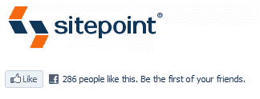

6.在详细页面中，再次点击 *Install* 安装软件包。安装完成后，软件包管理器会显示结果。

7.重复步骤 6 和 7 安装脸书。助手 1.0 包。这个包包括脸书助手，它可以很容易地将脸书集成到您的应用程序中。

两个库中都有大量的 Web 助手。您将看到使用这些 Web 助手创建动态内容是多么容易。

### 脸谱网

***【脸书】*** 助手旨在将你的 WebMatrix 站点与脸书整合，使得添加[【脸书】社交插件](http://developers.facebook.com/plugins)成为可能，例如通过几个简单的步骤添加 **Like** **按钮**、 **Facepile** 、**评论**、**登录按钮**和 **Like Box** 。它还允许您轻松地将您的网站与脸书登录机制相集成，因此用户不需要创建另一个帐户来访问您的网站。一些助手需要初始化，这意味着您需要明确授予助手对您的脸书帐户的访问权限。首先，让我们看看一些不需要初始化的帮助器。

### 喜欢按钮

*喜欢按钮*显示一个脸书**喜欢**T4【按钮。当用户点击你网站上的**赞按钮**时，一个故事会出现在用户朋友的**新闻订阅源**中，并带有一个返回到你网站的链接。添加以下代码以开始使用助手:

```
<!DOCTYPE html>

<html lang="en">

    <head>

        <meta charset="utf-8" />

        <title>Facebook Helpers</title>

    </head>

    <body>

        <br/><br/>

        @Facebook.LikeButton("https://www.sitepoint.com/")

    </body>

</html>
```

下图显示了为 SitePoint 主页点赞的按钮。

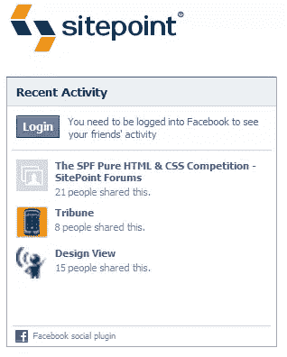

### 活动提要

当用户“喜欢”您网站上的内容时，以及当用户将您网站上的内容分享回脸书时，activity feed helper 都会显示故事。添加以下代码以开始使用助手:

```
<!DOCTYPE html>

<html lang="en">

    <head>

        <meta charset="utf-8" />

        <title>Facebook Helpers</title>

    </head>

    <body>

        <br/><br/>

        @Facebook.ActivityFeed(site: "https://www.sitepoint.com/")

    </body>

</html>
```

这张图片显示了 SitePoint 最近在脸书的活动。

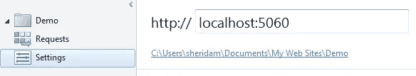

前面例子中的助手不需要初始化。现在让我们来看看一些帮助器，以及如何设置初始化。首先，记下你的网站运行的网址。点击*站点*工作区，然后*设置。*


接下来，您需要导航到*http://www.facebook.com/developers/createapp.php*并注册一个新的脸书应用程序。记下应用程序 Id 和密码，为此您需要登录您的脸书帐户。登录后，输入应用名称，点击*创建应用*，如下图所示。

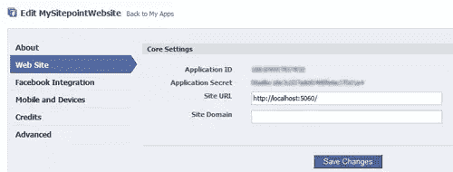

一旦你通过了安全检查，你就可以进入网站的详细信息。该屏幕还包括应用程序 ID 和应用程序机密，这是您的站点所需要的。当创建您的脸书应用程序时，确保您将站点 Url 设置为`http://localhost:[port]/`，将[ `port` ]占位符替换为运行您的本地 WebMatrix 站点的端口(如下所示)。

完成后点击*保存更改*。现在让我们来看看注释帮助器。

### 评论

评论显示了脸书的评论。评论框可以让你的用户轻松评论你的网站内容。第一步是添加 *Initialize* 助手，并传入上一节中的应用程序 ID 和应用程序秘密:

```
@{

    Facebook.Initialize("{your App ID}", "{your App Secret}");

}
```

一旦完成，下一步就是添加 *FbmlNamespaces* 、 *GetInitializationScripts* 和 *Comments* 助手。启用脸书注释所需的全部代码如下:

```
@{

    Facebook.Initialize("xxxxxxxxxxxxxxx", "xxaxaaxxaxaxxxaxaxxxxaaxaxxxaxax");

}

<!DOCTYPE html>

<html @Facebook.FbmlNamespaces()>

    <head>

        <meta charset="utf-8" />

        <title>Facebook Helpers</title>

    </head>

    <body>

        @Facebook.GetInitializationScripts()

        @Facebook.Comments()

    </body>

</html>
```

这里可以看到结果。

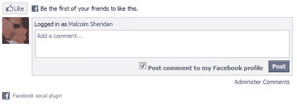

欲知脸书助手的完整名单，请访问 http://facebookhelper.codeplex.com。

### 推特

***TwitterGoodies*** 助手旨在将您的 WebMatrix 站点与 Twitter 集成在一起，只需几个简单的步骤就可以添加搜索和用户资料等功能。让我们来看看一些助手，看看这是多么容易使这项工作。

### 轮廓

*Profile* 助手加载一个 Twitter 配置文件。如果你想从 SitePoint 查看最新的推文，代码如下:

```
<!DOCTYPE html>

<html>

    <head>

        <meta charset="utf-8" />

        <title>Twitter Helpers</title>

    </head>

    <body>

        @TwitterGoodies.Profile(username: "sitepointdotcom")

    </body>

</html>
```

这里显示的是结果**。**

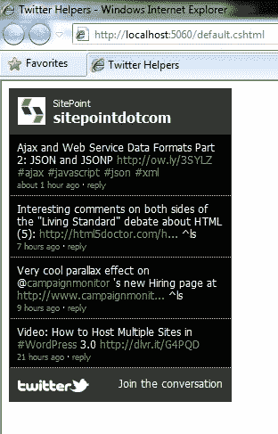

### 搜索

*搜索*助手让你能够搜索 Twitter。搜索可以基于趋势或概况。下面的代码将帮助器添加到您的页面，页面会自动更新对*站点点*的最新搜索:

```
<!DOCTYPE html>

<html>

    <head>

        <meta charset="utf-8" />

        <title>Twitter Helpers</title>

    </head>

    <body>

        @TwitterGoodies.Search(searchQuery: "sitepointdotcom")

    </body>

</html>
```

这是搜索结果。

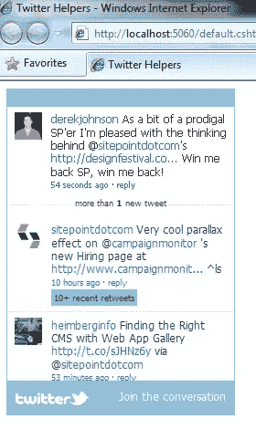

### 堆

Bing web helper 可以让你将阿炳搜索添加到你的网站上。如果您想让用户能够从您的网站搜索 Microsoft 网站，请添加以下代码:

```
@Bing.SearchBox("http://www.microsoft.com")
```

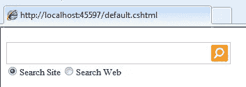

您还可以选择使用 AdvancedSearchBox 方法显示高级搜索选项:

```
@Bing.AdvancedSearchBox(

    siteUrl: "http://www.asp.net",

    siteName: "ASP.NET",

    boxWidth: 200,

    resultWidth: 300,

    resultHeight: 300,

    themeColor: "Blue",

    locale: "en-AU"

)
```

通过使用。NET 4.0，我可以为 AdvancedSearchBox 方法指定一个或所有参数。搜索 ASP.NET 4.0 会显示以下结果。

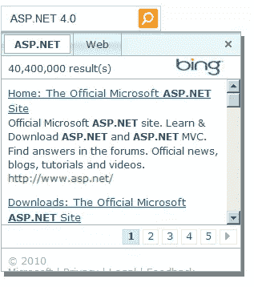

### 图表

图表是用图形表示数据的一种很好的方式，而*图表* Web Helper 使向您的网站添加图表变得很简单。若要呈现图表，请创建一个名为 PeopleChart.cshtml 的新页面，并添加以下代码:

```
<!DOCTYPE html>

<html lang="en">

    <head>

        <meta charset="utf-8" />

        <title></title>

    </head>

    <body>

        @{

        var key = new Chart(width: 600, height: 400)

            .AddTitle("Employees")

           .AddSeries(

           name: "Employee",

           chartType: "Pie",

           xValue: new[] {  "Peter", "Andrew", "Julie", "Mary", "Dave" },

           yValues: new[] { "2", "6", "4", "5", "3" })

           .Write();

     }

    </body>

</html>
```

结果显示在下面的饼图中。


设置`AddSeries` `xValue`和`yValue`属性为图表创建数据。`Write`方法在页面上呈现图表。图表看起来不错，但你可能已经注意到它占据了整个页面。这是因为默认情况下，图表呈现为 JPEG 图像。通常，您会希望在现有页面中呈现图表；为此，首先创建一个名为`PeopleChart.cshtml`的新 CSHTML 页面，并向其中添加 Razor 语法:

```
@{

    var key = new Chart(width: 600, height: 400)

        .AddTitle("Employees")

        .AddSeries(

        name: "Employee",

        chartType: "Pie",

        xValue: new[] {  "Peter", "Andrew", "Julie", "Mary", "Dave" },

        yValues: new[] { "2", "6", "4", "5", "3" })

        .Write();

}
```

现在返回到`default.cshtml` 页面并添加一个 HTML 图像标签，但是您需要引用`PeopleChart.cshtml`页面，而不是引用图像文件，如下所示:

```

```

现在，图表和其余的`default.cshtml`页面一起呈现出来了。

### 摘要

在本文中，我向您介绍了在 WebMatrix 中创建动态内容的一些步骤。你已经看到了新的 Razor 视图引擎，Razor 语法，以及将你的网站与社交媒体巨头脸书和 Twitter 整合。 [WebMatrix](http://www.microsoft.com/web/webmatrix/) 确实精简了开发；我希望你已经在这篇文章中看到了。

下一次，我们将更仔细地研究 WebMatrix 如何帮助您发布您的网站。同时，为什么不参加我们的简短[测验](https://www.sitepoint.com/quiz/microsoft/building-dynamic-websites-with-webmatrix/)来检查一下你学到了多少？

*   [网络应用程序库，第 1 部分](https://www.sitepoint.com/article/microsoft-web-app-gallery-part-1)
*   [使用网络应用程序库寻找合适的 CMS](https://www.sitepoint.com/finding-the-right-cms-with-web-app-gallery/)
*   用 WebMatrix 构建动态网站
*   [通过 WebMatrix 托管、发布和产生流量](https://www.sitepoint.com/hosting-publishing-and-generating-traffic-with-webmatrix/)

**note:**SitePoint Content Partner

本教程是在微软的支持下完成的。我们与微软合作，由 SitePoint 独立编写，努力共同开发对您最有用、最相关的内容。

## 分享这篇文章