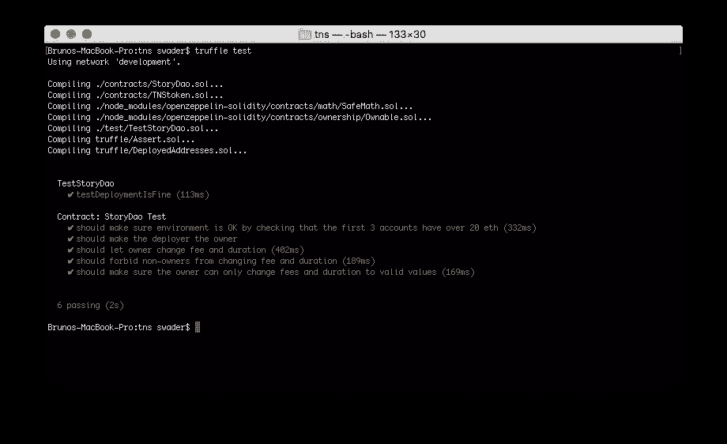

# 构建以太坊 DApps:白名单&测试一个故事 DAO

> 原文：<https://www.sitepoint.com/building-ethereum-dapps-whitelisting-testing-story-dao/>

在这个用以太坊构建 DApps 的系列教程的第 3 部分中，我们构建并部署了以太坊测试网 Rinkeby 的令牌。在这一部分，我们将开始编写故事 DAO 代码。

我们将使用[介绍文章](https://www.sitepoint.com/building-ethereum-dapps-app-rules-blockchain-setup)中列出的条件来指导我们。

## 合同大纲

让我们用这个框架创建一个新合同`StoryDao.sol`:

```
pragma solidity ^0.4.24;

import "../node_modules/openzeppelin-solidity/contracts/math/SafeMath.sol";
import "../node_modules/openzeppelin-solidity/contracts/ownership/Ownable.sol";

contract StoryDao is Ownable {
    using SafeMath for uint256;

    mapping(address => bool) whitelist;
    uint256 public whitelistedNumber = 0;
    mapping(address => bool) blacklist;
    event Whitelisted(address addr, bool status);
    event Blacklisted(address addr, bool status);

    uint256 public daofee = 100; // hundredths of a percent, i.e. 100 is 1%
    uint256 public whitelistfee = 10000000000000000; // in Wei, this is 0.01 ether

    event SubmissionCommissionChanged(uint256 newFee);
    event WhitelistFeeChanged(uint256 newFee);

    uint256 public durationDays = 21; // duration of story's chapter in days
    uint256 public durationSubmissions = 1000; // duration of story's chapter in entries

    function changedaofee(uint256 _fee) onlyOwner external {
        require(_fee < daofee, "New fee must be lower than old fee.");
        daofee = _fee;
        emit SubmissionCommissionChanged(_fee);
    }

    function changewhitelistfee(uint256 _fee) onlyOwner external {
        require(_fee < whitelistfee, "New fee must be lower than old fee.");
        whitelistfee = _fee;
        emit WhitelistFeeChanged(_fee);
    }

    function lowerSubmissionFee(uint256 _fee) onlyOwner external {
        require(_fee < submissionZeroFee, "New fee must be lower than old fee.");
        submissionZeroFee = _fee;
        emit SubmissionFeeChanged(_fee);
    }

    function changeDurationDays(uint256 _days) onlyOwner external {
        require(_days >= 1);
        durationDays = _days;
    }

    function changeDurationSubmissions(uint256 _subs) onlyOwner external {
        require(_subs > 99);
        durationSubmissions = _subs;
    }
} 
```

我们正在导入 SafeMath 来再次进行安全计算，但这一次我们还使用了 Zeppelin 的`Ownable`契约，该契约允许某人“拥有”故事并执行某些仅限管理员的功能。简单的说我们的`StoryDao is Ownable`就够了；请随意检查合同，看看它是如何运作的。

我们还使用了这个契约中的`onlyOwner`修饰符。函数修饰符基本上是函数的扩展和插件。`onlyOwner`修改器看起来像这样:

```
modifier onlyOwner() {
  require(msg.sender == owner);
  _;
} 
```

当`onlyOwner`被添加到一个函数中时，那么这个函数的主体就被*粘贴到`_;`部分所在的部分，并且在它之前的所有东西都首先执行。因此，通过使用这个修饰符，该函数自动检查消息发送者是否也是契约的所有者，如果是，则照常继续。否则，它会崩溃。*

通过在函数上使用`onlyOwner`修饰符来改变 story DAO 的费用和其他参数，我们确保只有管理员可以做这些改变。

### 测试

让我们测试初始功能。

如果文件夹`test`不存在，则创建它。然后在里面创建文件`TestStoryDao.sol`和`TestStoryDao.js`。因为在 Truffle 中没有测试异常的本地方法，所以还要创建内容为:

```
export default async promise => {
    try {
      await promise;
    } catch (error) {
      const invalidOpcode = error.message.search('invalid opcode') >= 0;
      const outOfGas = error.message.search('out of gas') >= 0;
      const revert = error.message.search('revert') >= 0;
      assert(
        invalidOpcode || outOfGas || revert,
        'Expected throw, got \'' + error + '\' instead',
      );
      return;
    }
    assert.fail('Expected throw not received');
  }; 
```

注意:可靠性测试通常用于测试低级的、基于契约的功能，即智能契约的内部功能。JS 测试通常用于测试契约是否可以从外部正确地交互，这是我们的最终用户将要做的事情。

在`TestStoryDao.sol`中，输入以下内容:

```
pragma solidity ^0.4.24;

import "truffle/Assert.sol";
import "truffle/DeployedAddresses.sol";
import "../contracts/StoryDao.sol";

contract TestStoryDao {

    function testDeploymentIsFine() public {
        StoryDao sd = StoryDao(DeployedAddresses.StoryDao());

        uint256 daofee = 100; // hundredths of a percent, i.e. 100 is 1%
        uint256 whitelistfee = 10000000000000000; // in Wei, this is 0.01 ether

        uint256 durationDays = 21; // duration of story's chapter in days
        uint256 durationSubmissions = 1000; // duration of story's chapter in entries

        Assert.equal(sd.daofee(), daofee, "Initial DAO fee should be 100");
        Assert.equal(sd.whitelistfee(), whitelistfee, "Initial whitelisting fee should be 0.01 ether");
        Assert.equal(sd.durationDays(), durationDays, "Initial day duration should be set to 3 weeks");
        Assert.equal(sd.durationSubmissions(), durationSubmissions, "Initial submission duration should be set to 1000 entries");
    }
} 
```

这将检查 StoryDao 契约是否以正确的费用和持续时间正确部署。第一行通过从已部署地址列表中读取来确保它已被部署，最后一部分做了一些*断言*——检查一个断言是真还是假。在我们的例子中，我们将数字与已部署合同的初始值进行比较。每当它为“真”时，`Assert.equals`部分就会发出一个表示“真”的事件，这就是 Truffle 在测试时监听的内容。

在`TestStoryDao.js`中，输入以下内容:

```
import expectThrow from './helpers/expectThrow';

const StoryDao = artifacts.require("StoryDao");

contract('StoryDao Test', async (accounts) => {

    it("should make sure environment is OK by checking that the first 3 accounts have over 20 eth", async () =>{
        assert.equal(web3.eth.getBalance(accounts[0]).toNumber() > 2e+19, true, "Account 0 has more than 20 eth");
        assert.equal(web3.eth.getBalance(accounts[1]).toNumber() > 2e+19, true, "Account 1 has more than 20 eth");
        assert.equal(web3.eth.getBalance(accounts[2]).toNumber() > 2e+19, true, "Account 2 has more than 20 eth");
    });

    it("should make the deployer the owner", async () => {
        let instance = await StoryDao.deployed();
        assert.equal(await instance.owner(), accounts[0]);
    });

    it("should let owner change fee and duration", async () => {
        let instance = await StoryDao.deployed();

        let newDaoFee = 50;
        let newWhitelistFee = 1e+10; // 1 ether
        let newDayDuration = 42;
        let newSubsDuration = 1500;

        instance.changedaofee(newDaoFee, {from: accounts[0]});
        instance.changewhitelistfee(newWhitelistFee, {from: accounts[0]});
        instance.changedurationdays(newDayDuration, {from: accounts[0]});
        instance.changedurationsubmissions(newSubsDuration, {from: accounts[0]});

        assert.equal(await instance.daofee(), newDaoFee);
        assert.equal(await instance.whitelistfee(), newWhitelistFee);
        assert.equal(await instance.durationDays(), newDayDuration);
        assert.equal(await instance.durationSubmissions(), newSubsDuration);
    });

    it("should forbid non-owners from changing fee and duration", async () => {
        let instance = await StoryDao.deployed();

        let newDaoFee = 50;
        let newWhitelistFee = 1e+10; // 1 ether
        let newDayDuration = 42;
        let newSubsDuration = 1500;

        await expectThrow(instance.changedaofee(newDaoFee, {from: accounts[1]}));
        await expectThrow(instance.changewhitelistfee(newWhitelistFee, {from: accounts[1]}));
        await expectThrow(instance.changedurationdays(newDayDuration, {from: accounts[1]}));
        await expectThrow(instance.changedurationsubmissions(newSubsDuration, {from: accounts[1]}));
    });

    it("should make sure the owner can only change fees and duration to valid values", async () =>{
        let instance = await StoryDao.deployed();

        let invalidDaoFee = 20000;
        let invalidDayDuration = 0;
        let invalidSubsDuration = 98;

        await expectThrow(instance.changedaofee(invalidDaoFee, {from: accounts[0]}));
        await expectThrow(instance.changedurationdays(invalidDayDuration, {from: accounts[0]}));
        await expectThrow(instance.changedurationsubmissions(invalidSubsDuration, {from: accounts[0]}));
    })
}); 
```

为了让我们的测试成功运行，我们还需要告诉 Truffle 我们想要部署 StoryDao 因为它不会为我们做这件事。因此，让我们在`migrations`中创建`3_deploy_storydao.js`，其内容与我们之前编写的迁移几乎相同:

```
var Migrations = artifacts.require("./Migrations.sol");
var StoryDao = artifacts.require("./StoryDao.sol");

module.exports = function(deployer, network, accounts) {
  if (network == "development") {
    deployer.deploy(StoryDao, {from: accounts[0]});
  } else {
    deployer.deploy(StoryDao);
  }
}; 
```

此时，我们还应该更新(或者创建，如果它不存在的话)我们的项目文件夹的根目录中的一个`package.json`文件，其中包含我们目前需要的以及在不久的将来可能需要的依赖项:

```
{
  "name": "storydao",
  "devDependencies": {
    "babel-preset-es2015": "^6.18.0",
    "babel-preset-stage-2": "^6.24.1",
    "babel-preset-stage-3": "^6.17.0",
    "babel-polyfill": "^6.26.0",
    "babel-register": "^6.23.0",
    "dotenv": "^6.0.0",
    "truffle": "^4.1.12",
    "openzeppelin-solidity": "^1.10.0",
    "openzeppelin-solidity-metadata": "^1.2.0",
    "openzeppelin-zos": "",
    "truffle-wallet-provider": "^0.0.5",
    "ethereumjs-wallet": "^0.6.0",
    "web3": "^1.0.0-beta.34",
    "truffle-assertions": "^0.3.1"
  }
} 
```

和一个内容为:

```
{
  "presets": ["es2015", "stage-2", "stage-3"]
} 
```

我们还需要在我们的 Truffle 配置中要求 Babel，以便它知道在编译测试时应该使用它。

*注意:Babel 是 NodeJS 的一个附加组件，它允许我们在当前的 NodeJS 中使用下一代 JavaScript，所以我们可以编写类似`import`等内容。如果这超出了你的理解，简单地忽略它，只是逐字粘贴。这样安装后，您可能再也不用处理这个问题了。*

```
require('dotenv').config();

================== ADD THESE TWO LINES ================
require('babel-register');
require('babel-polyfill');
=======================================================

const WalletProvider = require("truffle-wallet-provider");
const Wallet = require('ethereumjs-wallet');

// ... 
```

现在，**终于**运行`truffle test`。输出应该类似于以下内容:



有关测试的更多信息，请参见本教程，它是我们专门为测试智能合约而准备的。

在本课程的后续部分，我们将跳过测试，因为将它们打印出来会使教程太长，但请参考项目的最终源代码来检查它们。我们刚刚经历的过程已经为测试设置了环境，所以您可以直接编写测试，无需进一步设置。

## 白名单

现在让我们建立白名单机制，让用户参与故事的构建。将以下函数框架添加到`StoryDao.sol`:

```
function whitelistAddress(address _add) public payable {
    // whitelist sender if enough money was sent
}

function() external payable {
    // if not whitelisted, whitelist if paid enough
    // if whitelisted, but X tokens at X price for amount
} 
```

未命名的函数`function()`被称为**回退函数**，这是在没有特定指令的情况下(即，没有特定调用另一个函数)将钱发送到此合同时被调用的函数。这使得人们可以通过向 Dao 发送 Ether 来加入 StoryDao，或者立即加入白名单，或者购买令牌，这取决于他们是否已经加入白名单。

`whitelistSender`函数用于白名单，可以直接调用，但是如果发送者还没有被列入白名单，我们将确保回退函数在收到一些以太网时自动调用它。`whitelistAddress`函数被声明为`public`,因为它也应该可以从其他契约中调用，而后备函数为`external`,因为资金将只从外部地址流向这个地址。调用这个契约的契约可以很容易地直接调用所需的函数。

让我们先处理回退功能。

```
function() external payable {

    if (!whitelist[msg.sender]) {
        whitelistAddress(msg.sender);
    } else {
        // buyTokens(msg.sender, msg.value);
    }
} 
```

我们检查发送者是否已经在白名单上，并将调用委托给`whitelistAddress`函数。注意，我们注释掉了我们的`buyTokens`函数，因为我们还没有它。

接下来，让我们来处理白名单。

```
function whitelistAddress(address _add) public payable {
    require(!whitelist[_add], "Candidate must not be whitelisted.");
    require(!blacklist[_add], "Candidate must not be blacklisted.");
    require(msg.value >= whitelistfee, "Sender must send enough ether to cover the whitelisting fee.");

    whitelist[_add] = true;
    whitelistedNumber++;
    emit Whitelisted(_add, true);

    if (msg.value > whitelistfee) {
        // buyTokens(_add, msg.value.sub(whitelistfee));
    }
} 
```

注意，这个函数接受地址作为参数，而不是从消息中提取(从事务中)。这有一个额外的好处，那就是人们可以将其他人加入白名单，例如，如果有人无法负担加入 DAO 的费用。

我们通过一些健全性检查来启动该功能:发送者必须没有被列入白名单或黑名单(被禁止)，并且必须已经发送了足够的信息来支付费用。如果满足这些条件，地址将被添加到白名单中，白名单事件将被发出，最后，如果发送的以太网数量大于支付白名单费用所需的以太网数量，则剩余部分将用于购买令牌。

*注意:我们用`sub`而不是`-`来做减法，因为那是一个用于安全计算的`SafeMath`函数。*

用户现在可以将自己或他人列入白名单，只要他们向 StoryDao 合同发送 0.01 ether 或更多。

## 结论

在本教程中，我们构建了 DAO 的初始部分，但是还有很多工作要做。敬请关注:在下一部分，我们将处理添加内容的故事！

## 分享这篇文章