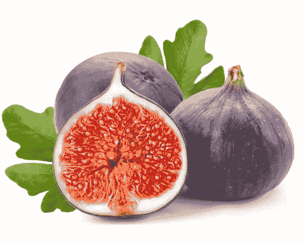

# 用 FigDice 构建国际化博客

> 原文：<https://www.sitepoint.com/building-internationalized-blog-figdice/>

在这个由两部分组成的系列文章的第一部分中，我开始关注 [FigDice](http://www.figdice.org) ，这是一个 PHP 模板系统，采用了与大多数略有不同的方法。



到目前为止，我们已经使用 Figdice 构建了一个非常简单的示例网站。我们实现了几个页面、一个 Twitter feed 和一些模板片段。

在第二部分，也是最后一部分，我们将向示例站点添加一个简单的博客，这使我们可以更详细地了解 Figdice 的数据馈送概念。我们还将关注国际化，将网站的一些内容翻译成另外两种语言。

## 代码

我为这个系列的第二部分创建了一个单独的代码库，你可以在 Github 上找到[。它扩展了我们在](https://github.com/sitepoint-examples/figdice-example-part-two)[第一部分](https://github.com/sitepoint-examples/figdice-example-part-one)中写的代码。

还有一个在线演示。

## 建立一个简单的博客

现在，让我们通过实现一个简单的博客来创建一个更复杂的数据馈送示例。

首先，创建另一个 feed 类——这次是针对博客。

```
<?php namespace Sitepoint\Feed;

	use figdice\Feed;

	class BlogFeed extends Feed
	{

		public function run() {

			return array(
				array(
					'id'			=>	3,
					'slug'		=>	'post-three',
					'title' 	=> 	'Sample Blog Post Three',
					'body'		=>	'<p>Donec sed odio dui. Maecenas sed diam eget risus varius blandit sit amet non magna. Aenean lacinia bibendum nulla sed consectetur. Vestibulum id ligula porta felis euismod semper. Cras mattis consectetur purus sit amet fermentum. Duis mollis, est non commodo luctus, nisi erat porttitor ligula, eget lacinia odio sem nec elit. Cum sociis natoque penatibus et magnis dis parturient montes, nascetur ridiculus mus.</p>',
					'author'	=>	array(
						'id'		=>	1,
						'name'	=>	'Bob',
					),
					'created'	=>	12345,
				),

				// .. more posts here, omitted for brevity

			);
		}
	}
```

同样，我们在伪造数据，但是从某种存储中检索博客文章是那种在其他地方广泛涉及的事情，应该相对简单。

现在修改`FeedFactory`类，让它知道我们的新提要:

```
// ...
use Sitepoint\Feed\BlogFeed;

class FeedFactory implements \figdice\FeedFactory
{
	// ...

	public function create($className, array $attributes) {

		if ($className == 'BlogFeed') {			
			return new BlogFeed();
		}

		if ($className == 'TwitterFeed') {			
			return new TwitterFeed();
		}

		// ... 

	} 
}
```

现在创建一个新视图，我们将在博客列表中使用它:

```
<!--  file: blog.html -->
<?xml version="1.0" encoding="utf-8"?>
<fig:template xmlns:fig="http://figdice.org/">

	<fig:dictionary file="menu.xml" name="menu" />

	<fig:feed class="BlogFeed" target="posts" />

	<fig:include file="layout.html" />

	<title fig:plug="docTitle"><fig:trans dict="menu" key="blog" /></title>

	<h1 fig:plug="pageTitle"><fig:trans dict="menu" key="blog" /></h1>

	<div fig:plug="pageContent">
		<article fig:walk="posts">
			<h2>			 					
				<a href="/blog/post/{slug}" fig:text="title"></a>
			</h2>
			<p class="author">By <span fig:text="author/name" /></p>
			<div fig:text="body"></div>
			<hr fig:auto="true" />
		</article>
	</div>

</fig:template>
```

大部分我们已经看到了，但是让我们看看`fig:walk`部分。这一次，我们不是创建一个简单的列表元素并注入一个属性，而是创建额外的标记；在本例中，我们为每个帖子创建了一个`<article>`元素。

一旦我们进入了一个“遍历”循环——本质上是一个迭代器——属性就可以通过名字来访问；参见`<div fig:text="body"></body>`的例子。

在`<h2>`标签中，我们通过使用`fig:text`将博客文章的标题插入到`<a>`标签中来创建一个链接，并使用花括号`{slug}`将文章的段落合并到 URL (href)属性中。

标签内的链接稍微复杂一些，因为我们正在定义一个将要被求值的表达式。它将字符串`/blog/post/`与文章的`slug`属性的值连接起来，生成一个 URL，例如`/blog/post/post-three`。

您还可以使用斜杠访问更深层次的属性。对于作者信息，我们希望从`author`中提取`name`属性；所以我们用`<span fig:text="author/name" />`。您也可以使用双点(`..`)符号来升级。

`<fig:dictionary>`和`<fig:trans>`用于国际化，我们很快就会看到。

## 源和属性

您可能还记得工厂的`create`方法还有第二个可选参数。如果向`fig:feed`元素添加任何不在`fig`、`class`或`target`名称空间中的附加属性，它们将作为第二个属性传递给工厂。

例如，您可以如下修改`blog.html`:

```
<fig:feed class="BlogFeed" target="posts" num-posts="5" sort="'date'" sort-direction="'asc'" />
```

注意双引号内的单引号*；这是因为这些值是经过评估的。*

然后，在你的工厂里，你可以使用`getParameter()`——或者如果你知道预期的类型，`getParameterBool()` / `getParameterInt()` / `getParameterString()`。这些方法都将默认值作为可选的第二个参数。

对于这个例子，我们可以这样扩展工厂:

```
// @file FeedFactory.php
	public function create($className, array $attributes) {

		$num_posts = $this->getParameterInt('num-posts', 10);
		$sort_by = $this->getParameterString('sort', 'date');
		$sort_dir = $this->getParameterString('sort-direction', 'desc');

		// now you can use these values, for example when you instantiate the feed
```

更多详情参见手册的[进给章节](http://www.figdice.org/en/manual.html#feeds)。

## 结束博客

现在我们已经实现了一个简单的博客列表，我们需要创建一个页面来显示一篇博客文章。

首先，让我们定义路线:

```
// Individual blog posts.
	$app->get('/blog/post/{slug}', function($slug) use ($view) {

		$view->loadFile( '../templates/post.html' );

		// We use mount to "inject" the slug into the view, which it can then use to "pull" the appropriate post.
		$view->mount('slug', $slug);

		return $view->render();

	});
```

注意我们是如何使用`mount()`方法将 slug——一个 URL 参数——注入到视图中的。

现在让我们创建视图:

```
// post.html
	<xml fig:mute="true"> <!-- Mute because this tag should not end up in the HTML document. But the FigDice template must have an XML root node. -->

		<fig:dictionary file="menu.xml" name="menu" />

		<!-- Load the page layout -->
		<fig:include file="layout.html" />

		<fig:feed class="BlogFeed" target="post" post-slug=" /slug " />

		<!-- Set the <title> tag -->
		<title fig:plug="docTitle"><fig:trans dict="menu" key="about" /></title>

		<!-- Set the <h1> tag -->
		<h1 fig:plug="pageTitle" fig:text="/post/title" />

		<!-- "Plug in" the page content -->
		<div fig:plug="pageContent">

			<p class="back"><a href="/blog">&laquo; <fig:trans dict="menu" key="blog" /></a></p>

			<p class="author">By <span fig:text="/post/author/name" /></p>
			<div fig:text="/post/body"></div>	
		</div>
	</xml>
```

这其中的大部分应该是熟悉的，但是让我们更仔细地看看`<fig:feed>`元素:

```
<fig:feed class="BlogFeed" target="post" post-slug=" /slug " />
```

注意我们是如何通过使用`post-slug`属性将“slug”变量反馈回 BlogFeed 类的，我们已经使用`mount()`方法将该变量提供给视图。

让我们修改 BlogFeed 类来检索一篇博文。因为我们将帖子定义为一个简单的数组，所以在实例化它之后放置它:

```
$posts = array( .... );

// Get the slug, if provided
$slug = $this->getParameterString('post-slug');

if ($slug) {

	// Use a little Underscore magic to retrieve the appropriate post
	$post = Arrays::find($posts, function($post) use ($slug) {
		return ($post['slug'] == $slug);
	});

	return $post;

} else {

	// No slug, we want the lot.
	return $posts;	

}
```

显然，在一个“真正的”应用程序中，您需要进行一些数据库查找，但是这个示例应该让您了解如何为视图设置数据提要。

## 情况

关于条件句的一个快速注释，可以使用`fig:cond`属性来实现。

例如，要显示给定特定条件下的某些内容:

```
<span fig:cond="logged_in == true">You are logged in</span>
```

要将一个类添加到已发布的`<article>`中:

```
<article>
		<fig:attr fig:cond="status == 1" name="class">published</fig:attr>
		...
	</article>
```

如果 status 设置为 1，则生成的 HTML 如下所示:

```
<article class="published">
		...
	</article>
```

## 国际化

FigDice 使翻译模板中的文本变得容易。让我们首先创建一些语言文件来保存我们的可翻译字符串。在大型应用程序中，您可能希望为每个模块创建一个文件，以便在多个应用程序中重用它们。

典型的结构可能如下所示:

```
lang
		en
			menu.xml
			products.xml
			checkout.xml
		es
			menu.xml
			products.xml
			checkout.xml
		fr
			menu.xml
			products.xml
			checkout.xml
```

让我们通过翻译示例站点的菜单来创建一个具体的示例:

```
<!-- lang/en/menu.xml -->
<fig:dictionary xmlns:fig="http://www.figdice.org/" language="en">
	<entry key="home">Home</entry>
	<entry key="about">About</entry>
	<entry key="blog">Blog</entry>
</fig:dictionary>
```

然后，这个文件的西班牙语版本:

```
<!-- lang/es/menu.xml -->
<fig:dictionary xmlns:fig="http://www.figdice.org/" language="es">
		<entry key="home">Inicio</entry>
		<entry key="about">Acerca</entry>
	<entry key="blog">Blog</entry>	
</fig:dictionary>
```

当您想要使用翻译的文本时，首先引用字典文件，并在模板中的某个位置给它一个标识符:

```
<fig:dictionary file="menu.xml" name="menu" />
```

现在，您可以使用字典的键(取自`fig:dictionary`声明中的`name`属性)和文本项的`key`来插入项的值:

```
// file: templates/menu.html
	<ul class="nav nav-pills pull-right">
		<li><a href="/"><fig:trans dict="menu" key="home" /></a></li>
		<li><a href="/about"><fig:trans dict="menu" key="about" /></a></li>
		<li><a href="/blog"><fig:trans dict="menu" key="blog" /></a></li>
	</ul>
```

现在，在应用程序代码的某个地方，告诉视图在哪里可以找到您的语言文件:

```
$view->setTranslationPath('../lang');
```

然后设置语言:

```
$view->setLanguage('es');
	// or $view->setLanguage('en'), $view->setLanguage('fr'), etc
```

让我们在示例应用程序中实现语言切换，尽管保持它非常简单。

首先，我们将在布局标题中添加一些链接(`templates/layout.html`):

```
<a href="/lang/en"></a> | <a href="/lang/es"></a>
```

您将在[样本库](https://github.com/sitepoint-examples/figdice-example-application)中找到我们正在使用的旗帜图标。

现在实现相应的路由，它只是在一个会话变量中弹出适当的语言代码:

```
$app->get('/lang/{lang}', function ($lang) use ($app) {

	$app['session']->set('lang', $lang);

	return $app->redirect('/');

});
```

最后，靠近`index.php`顶部:

```
// Get the language from the session, if it's set - default to English.
$language = $app['session']->get('lang', 'en');

// ...and set it.
$view->setLanguage($language);
```

现在，如果您浏览网站，您应该会发现单击其中一个标志会将菜单标签切换到适当的语言。

## 摘要

在这两篇文章中，我介绍了 FigDice，这是一个模板系统，它采用了一种与大多数非常不同的方法。还有比我所能涵盖的更多的东西，所以查看一下[手册](http://www.figdice.org/en/manual.html)、[教程](http://www.figdice.org/en/tutorials.html)、[示例](https://github.com/gabrielzerbib/figdice/tree/master/examples)或[参考](http://www.figdice.org/reference/)。

我预计，虽然有些人会喜欢 FigDice 采取的方法，但同样有些人不会——所以我很想听听你的想法和评论。

## 分享这篇文章