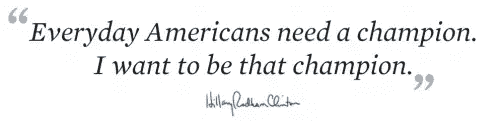
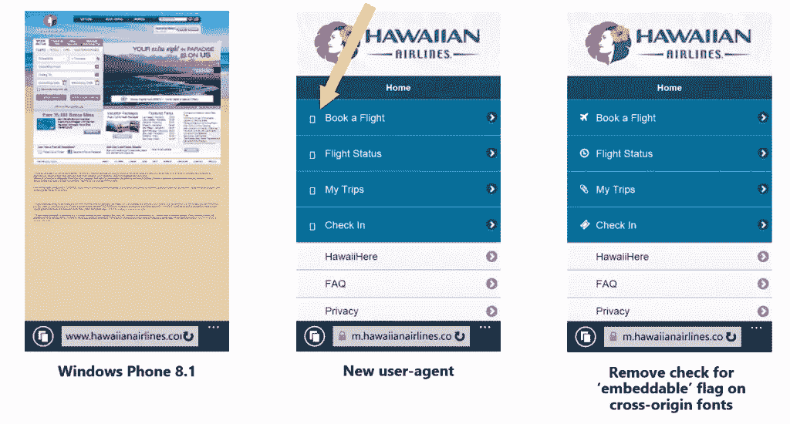

# 使用 Microsoft Edge 构建互操作性更强的网站

> 原文：<https://www.sitepoint.com/building-interoperable-web-microsoft-edge/>

本文是微软网站开发系列的一部分。感谢您对使 SitePoint 成为可能的合作伙伴的支持。

在过去的一年中，微软 Edge 团队一直在努力开发新的浏览器引擎，它将比以往任何时候都更好地正确、快速、可靠地呈现网络。作为一个用户，你最喜欢的网站将会正常工作，而作为一个 web 开发人员，你会发现 Microsoft Edge 应该像其他浏览器一样正常工作，从而比以往任何时候都更容易创建一个可以在任何地方工作的网站。

我们已经[实现了超过 45 个新标准](https://dev.modern.ie/platform/status/?utm_source=SitePoint&utm_medium=article56&utm_campaign=SitePoint)——比我们在一个版本中实现的还要多。我们还进行了数千次大大小小的改进，使 Edge 与其他浏览器的互操作性更强，以确保您获得更加无缝的 web 开发体验。

## 协调浏览器、内容和规范

网络是建立在多种独立的、可互操作的网络标准实现的原则之上的，我们认为尽我们的一份力量推动网络向前发展是很重要的。真正的互操作性意味着所有的 web 内容、浏览器和规范都遵循相同的明确定义的行为。

随着我们不断改进引擎，使其与 Blink 和 WebKit 的互操作性更强，我们已经花了大量时间与所有浏览器供应商合作，解决浏览器和规范中的互操作性问题。

[正如在](http://www.smashingmagazine.com/2015/01/26/inside-microsofts-new-rendering-engine-project-spartan/)之前所详述的，我们[将试图平衡向后兼容性和现代网络互操作性的旧 MSHTML (Trident)引擎分叉为一个新的“互操作性优先”引擎，名为微软 EdgeHTML。在这个旅程的开始，我们必须做一些改变:](http://blogs.windows.com/msedgedev/2015/02/26/a-break-from-the-past-the-birth-of-microsofts-new-web-rendering-engine/?WT.mc_id=16520-DEV-sitepoint-article56)

## 越来越多的谎言

改进微软 Edge 的最具影响力的变化之一也是最简单的——改变向网络服务器标识浏览器的[用户代理字符串](https://en.wikipedia.org/wiki/User_agent#Format_for_human-operated_web_browsers)。

即使在今天，大量的 web 服务器仍然嗅探用户代理字符串以给浏览器不同的内容。我们修复了大量的问题，只需改变用户代理字符串，并获得更现代的内容，在我们现有的 IE11 引擎中没有任何问题。

所有用户代理字符串包含了比你正在使用的实际浏览器更多的关于其他浏览器的信息——不仅仅是令牌，还有[‘有意义的’版本号](https://bugzilla.mozilla.org/show_bug.cgi?id=1169772)。

```
Internet Explorer 11’s UA string
Mozilla/5.0 (Windows NT 6.3; Trident/7.0; rv:11.0) like Gecko

Microsoft Edge UA string:
Mozilla/5.0 (Windows NT 10.0) AppleWebKit/537.36 (KHTML, like Gecko)
Chrome/42.0.2311.135 Safari/537.36 Edge/12.10136

```

在 W3C 讨论中, [Patrick H. Lauke](http://lists.w3.org/Archives/Public/public-html/2014Feb/0040.html) 恰当地将 userAgent 属性描述为“一个不断增长的谎言包”。(*“或者更确切地说，是一种平衡行为，添加足够多的遗留关键词，不会立即让旧的 UA-sniffing 代码崩溃，同时仍然试图传达一点点实际有用的准确信息。”*)

我们建议 web 开发者尽可能避免 UA 嗅探；现代网络平台的特性几乎都可以通过简单的方式检测出来。在过去的一年里，我们已经看到一些 UA-snugging 网站已经更新，可以检测 Microsoft Edge…只是为它提供了一个传统的 IE11 代码路径。这不是最好的方法，因为 Microsoft Edge 匹配“WebKit”行为，而不是 IE11 行为(Edge-WebKit 的任何差异都是我们有兴趣修复的错误)。根据我们的经验，Microsoft Edge 在这些网站的“WebKit”代码路径上运行得最好。此外，随着互联网在越来越多的设备上变得可用，请假设未知的浏览器是好的——请不要将您的网站局限于仅在一小部分当前已知的浏览器上工作。如果你这样做，你的网站将来几乎肯定会崩溃。

## 过去的问题

为了进一步确保网站不会检测到我们作为 Internet Explorer 的新引擎，我们还花了很多时间[删除传统 IE-isms](http://blogs.windows.com/msedgedev/2015/05/06/a-break-from-the-past-part-2-saying-goodbye-to-activex-vbscript-attachevent/?WT.mc_id=16520-DEV-sitepoint-article56) (不再有 ActiveX！).

在理想的情况下，web 开发人员应该编写包含前缀和非前缀 CSS 的可互操作内容——不幸的是，情况并非如此。2014 年，我们不得不[添加对 WebKit 前缀](http://blogs.msdn.com/b/ie/archive/2014/07/31/the-mobile-web-should-just-work-for-everyone.aspx?WT.mc_id=16520-DEV-sitepoint-article56) CSS 的支持，以呈现大量现代(移动)网站，之后我们观察到超过 40%的移动网站有所改善。呈现可用的移动网站现在取决于您的浏览器是否支持 WebKit CSS 前缀；[一种连火狐都在使用的方法](http://www.ghacks.net/2015/05/09/mozilla-adds-webkit-prefix-emulation-to-select-sites-in-firefox/)。

接受 WebKit CSS 比仅仅解析静态 CSS 更棘手；我们还需要在枚举 webkit 属性时首先列出它们，因为相当多的站点使用它们发现的第一个供应商前缀来准备前缀 CSS。

## 为未来做准备

我们非常关心 web 开发人员获得跨浏览器的一致功能集——这就是为什么我们花了大量时间添加最受欢迎的功能，如 [ES6](http://blogs.windows.com/msedgedev/2015/05/12/javascript-moves-forward-in-microsoft-edge-with-ecmascript-6-and-beyond/?WT.mc_id=16520-DEV-sitepoint-article56) ( [最高分](https://twitter.com/ryosukeniwa/status/599090582468763648)！)、HTTP/2、[响应图像](http://blogs.windows.com/msedgedev/2015/06/08/introducing-srcset-responsive-images-in-microsoft-edge/?WT.mc_id=16520-DEV-sitepoint-article56)和[媒体捕获](http://blogs.windows.com/msedgedev/2015/05/13/announcing-media-capture-functionality-in-microsoft-edge/?WT.mc_id=16520-DEV-sitepoint-article56)，以及像 [XPath](http://blogs.windows.com/msedgedev/2015/03/19/improving-interoperability-with-dom-l3-xpath/?WT.mc_id=16520-DEV-sitepoint-article56) 和 Motion JPEG 支持这样的老功能。如果您想知道 evergreen 浏览器即将推出的内容，请查看我们新的[平台状态](http://dev.modern.ie/platform/status/?utm_source=SitePoint&utm_medium=article56&utm_campaign=SitePoint)和[变更日志](http://dev.modern.ie/platform/changelog/?utm_source=SitePoint&utm_medium=article56&utm_campaign=SitePoint)页面。

## 数据数据数据

浏览器互操作性需要一系列永无止境的功能和漏洞修复；为了最大化我们工作的影响，我们需要使用[数据来帮助区分互操作性工作](https://youtu.be/MOQLVs2aZ_g?t=35m)的优先级。我们的 300 多万 Windows 10 Insider 用户一直在向我们发送网站问题报告；这些数据对于确定修复的优先级非常有价值。

我们还使用来自 Bing 网络爬虫的数据来通知我们的决定。爬虫看到 33 万亿个页面，440 亿个站点，和 7000 个 API 的使用，它帮助我们看到网站是如何建立的，以及我们的浏览器变化将如何影响网络。随着我们能够快速推出新版本的浏览器，我们能够比以往任何时候都更快地发现并修复互操作性问题。很多网站依赖于 JavaScript 库和框架，所以我们也向库提交补丁，以确保它们能在所有浏览器中工作。

## 有时标准并不能描述实际的网络内容

互操作性不仅仅是严格执行规范。我们也看到了许多标准并没有真正描述 web 开发人员做什么的情况，因此我们必须更加自由地解析和接受内容——即使这意味着背离规范。

一个简单的例子就是畸形的元刷新元素。Web 服务器经常使用 meta refresh 将浏览器重定向到他们网站的移动版本。一些移动网站正在发送格式错误的元刷新标签(缺少“URL”=令牌),这导致 IE 进入重定向的无限循环。

```
'Malformed':
<meta http-equiv="refresh" content="0;http://foo.com" />

Correct:
<meta http-equiv="refresh" content="0;url=http://foo.com" /> 
```

这里的解决方案是解析和处理“畸形”的标记 Web 最终会依赖于更宽容的浏览器的行为。我们也看到了许多规范在定义行为时(可能)过于规范的例子。有时候标准太迂腐；很容易看到 web 开发人员犯错误:

例如，页面经常使用`<meta charset="utf8">`来定义页面的字符集。“utf-8”是对[“技术上正确”的描述](https://en.wikipedia.org/wiki/UTF-8#Official_name_and_variants)。这是一个容易犯的“错误”;[HTML 文件中仅 GitHub 就有近 60 万条结果](https://github.com/search?l=html&q=charset+%22UTF8%22&ref=searchresults&type=Code&utf8=%E2%9C%93)。

这导致页面在 IE11 中呈现不正确——在这种情况下，拉引号:


借助 Microsoft Edge，我们现在可以更自由地接受“utf8”值，从而实现正确的渲染:



作为另一个例子，移动网络依赖于你的浏览器下载字体资源*，而不检查*[【CORS 标题】](http://davidwalsh.name/cdn-fonts)和‘可嵌入’标志(根据规范)——我们不得不改变我们的移动浏览器中的 WebKit 行为，以使移动网络工作。



随着我们在接受内容方面变得更加自由，我们也在努力确保规范符合 web 开发人员习惯的行为。

## 有时网络依赖于非标准化的行为

现代网页的很大一部分依赖于未被标准化的浏览器行为，而 web 开发者不得不依赖于未被明确定义的浏览器行为。在这些情况下，我们正在努力添加和修正规范，以确保所有浏览器中的 web 内容行为都得到可靠的规定。

## 有时网络依赖于浏览器漏洞

我们已经看到许多案例，web 开发人员开始依赖一个浏览器中的不正确行为，导致丑陋的黑客攻击或 UA-snugging 来修补这个问题。一个很好的例子是[scroll top bug](https://dev.opera.com/articles/fixing-the-scrolltop-bug/)——一旦(主要)网站开始依赖不可互操作的行为，就不可能在不破坏网页内容的情况下修复所有浏览器的问题。有时候，最好的方法是为破损的 API 提供替代方案——Chrome、Opera 和 Microsoft Edge 现在都支持替代方案 document.scrollingElement 属性。

另一个例子是将 [DOM 属性移动到原型链](https://developers.google.com/web/updates/2015/04/DOM-attributes-now-on-the-prototype)——这是浏览器工作方式的一个非常根本性的变化，只是最近才在所有浏览器中统一起来——这使得在网页中可靠地编程 DOM 行为变得更加容易。

## 让 Microsoft Edge 为网络做好准备

这些只是我们对浏览器引擎所做的成千上万大大小小的互操作性改变的一些例子。在开发过程中，微软 Edge 始终比任何以前的微软浏览器更能与更广泛的网络进行互操作。我们努力与其他浏览器保持一致，这对于网络来说是最好的，我们与其他供应商和标准机构合作[解决他们那边的问题](http://code.google.com/p/chromium/issues/detail?id=477076)。我们的长期希望是 web 内容、所有浏览器和规范都符合一个定义明确、设计良好的行为。

每个浏览器供应商都非常关心创建一个可互操作的网站。发展网络而不破坏它是非常困难的——任何错误都非常非常难以清除——但是一个可以跨所有浏览器和设备工作的可互操作的网络比以往任何时候都更接近了。如果你看到微软 Edge 无法与其他现代浏览器互操作的例子，请在 Twitter 上告诉我们 [@MSEdgeDev](https://twitter.com/msedgedev) ，或者在 [Connect](https://connect.microsoft.com/ie) 上提交一个 bug。

## JavaScript 的更多实践

这篇文章是微软技术倡导者的 web 开发系列的一部分，内容涉及实用的 JavaScript 学习、开源项目和互操作性最佳实践，包括[微软 Edge](http://blogs.windows.com/msedgedev/2015/05/06/a-break-from-the-past-part-2-saying-goodbye-to-activex-vbscript-attachevent/?WT.mc_id=16520-DEV-sitepoint-article56) 浏览器和新的 [EdgeHTML 渲染引擎](http://blogs.windows.com/msedgedev/2015/02/26/a-break-from-the-past-the-birth-of-microsofts-new-web-rendering-engine/?WT.mc_id=16520-DEV-sitepoint-article56)。

我们鼓励您使用 [dev.modern.IE](http://dev.modern.ie/tools/?utm_source=SitePoint&utm_medium=article56&utm_campaign=SitePoint) 上的免费工具跨浏览器和设备进行测试，包括 Windows 10 的默认浏览器 Microsoft Edge:

*   [扫描你的网站，寻找过时的库、布局问题和可访问性](http://dev.modern.ie/tools/staticscan/?utm_source=SitePoint&utm_medium=article56&utm_campaign=SitePoint)
*   [在 Mac、Linux 和 Windows 上使用虚拟机](http://dev.modern.ie/tools/vms/windows/?utm_source=SitePoint&utm_medium=article56&utm_campaign=SitePoint)
*   [在您自己的设备上远程测试 Microsoft Edge](https://remote.modern.ie/?utm_source=SitePoint&utm_medium=article56&utm_campaign=SitePoint)
*   [GitHub 编码实验室:跨浏览器测试和最佳实践](https://github.com/deltakosh/interoperable-web-development)

来自我们的工程师和布道者的关于 Microsoft Edge 和 Web 平台的深入技术学习:

*   【2015 年微软 Edge 网络峰会(对新浏览器、新支持的网络平台标准以及来自 JavaScript 社区的演讲嘉宾有何期待)
*   哇，我可以在 Mac 电脑上测试 Edge & IE 浏览器& Linux！(来自雷伊·班戈)
*   [在不破坏网络的情况下推进 JavaScript】(来自 Christian Heilmann)](http://channel9.msdn.com/Events/WebPlatformSummit/2015/Advancing-JavaScript-without-breaking-the-web/?WT.mc_id=16520-DEV-sitepoint-article56)
*   使网络正常工作的边缘渲染引擎(Jacob Rossi)
*   [用 WebGL 释放 3D 渲染](https://channel9.msdn.com/Events/WebPlatformSummit/2015/Unleash-3D-rendering-with-WebGL-and-Microsoft-Edge/?WT.mc_id=16520-DEV-sitepoint-article56)(来自大卫·卡图赫，包括[伏龙。JS](http://vorlonjs.com/?WT.mc_id=16520-DEV-sitepoint-article56) 和 [babylonJS](http://babylonjs.com/?WT.mc_id=16520-DEV-sitepoint-article56) 项目)
*   [托管网络应用和网络平台创新](https://channel9.msdn.com/Events/WebPlatformSummit/2015/Hosted-web-apps-and-web-platform-innovations/?WT.mc_id=16520-DEV-sitepoint-article56)(来自律师奶爸和基里尔·赛克谢诺夫，包括[流形。JS](http://manifoldjs.com/?WT.mc_id=16520-DEV-sitepoint-article56) 项目)

更多面向网络平台的免费跨平台工具和资源:

*   [适用于 Linux、MacOS 和 Windows 的 Visual Studio 代码](https://code.visualstudio.com/?WT.mc_id=16520-DEV-sitepoint-article56)
*   [用节点编码。JS](https://www.microsoftvirtualacademy.com/en-US/training-courses/building-apps-with-node-js-jump-start-8422/?WT.mc_id=16520-DEV-sitepoint-article56) 和[在 Azure 上免费试用](https://azure.microsoft.com/en-us/pricing/free-trial/?WT.mc_id=16520-DEV-sitepoint-article56)

## 分享这篇文章