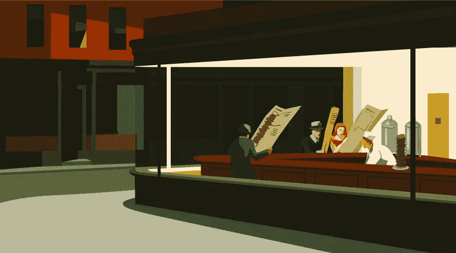

# 使用 Flexbox 构建大型菜单

> 原文：<https://www.sitepoint.com/building-mega-menus-flexbox/>



正如你可能知道的，Flexbox 最近随着[增加浏览器支持](http://caniuse.com/#feat=flexbox)而获得了发展势头。它允许开发人员构建复杂的用户界面，而无需处理不必要的 CSS 和 JavaScript 攻击。

Flexbox 使用线性布局模型，允许我们水平或垂直放置内容，而无需计算间距。flex 布局响应容器中的元素，因此需要更少的媒体查询。

在本文中，我将利用这个布局模型来构建一个大型导航菜单，在这个过程中，您将看到使用 flexbox 构建和扩展用户界面组件是多么简单。

我不会在这里详细讨论每个 Flexbox 属性，而是将重点放在特性的实际使用上。有关 Flexbox 的基本介绍，请参考以下资源:

*   [Guy Routledge 的 Flexbox 课程](https://www.sitepoint.com/premium/courses/flexbox-2950)
*   [面向初学者的 Flexbox 友好介绍](https://www.sitepoint.com/flexbox-css-flexible-box-layout/)
*   [Flexbox 完整指南](https://css-tricks.com/snippets/css/a-guide-to-flexbox/)

## 我们在建造什么？

为了了解我将向您展示如何构建，请看一下[全屏代码笔](https://codepen.io/SitePoint/pen/rwKzrz)。

本教程分为三个部分:

1.  构建导航栏:使用 flexbox 为我们想象的电子商务平台构建一个简单的导航栏
2.  构建单个下拉部分
3.  将单个下拉部分限制为三列

## 构建导航栏

导航栏的标记很简单。为了这个演示，我将用两个类(`navbar`和`menu`)来处理所有的事情。这里的 CSS 将排除任何与教程无关的样式。

```
<nav class="navbar">
  <ul class="menu">
    <li>
      <a href="#">
        Electronics
        <!-- FontAwesome icon -->
        <i class="fa fa-angle-down"></i>
      </a> 
    </li>

    <!-- ... More nav items here... -->

  <ul>
</nav>
```

`navbar`类负责将我们的导航栏放在可用空间的中心，但是我将把重点放在我将使用 flexbox 的`menu`类上。

我希望我的导航项目是水平布局。此外，我希望每个项目的间距相等，并根据需要缩小，如果没有足够的空间。

首先，我需要在`.menu`元素上建立一个 flex 格式上下文，我将用`display: flex`来完成。现在，`.menu`元素(flex 容器)的所有直接子元素都将是 flex 项目。

接下来，我希望菜单项的宽度相等。我已经添加了`flex: 1`来使它们以相等的宽度均匀增长。代码如下:

```
.navbar .menu {
  display: flex;
  position: relative;
}

.navbar .menu li {
  flex: 1;
  display: flex;
  text-align: center;
}

.navbar .menu a {
  flex: 1;
  justify-content: center;
  color: #ffffff;
  padding: 20px;
}
```

看着代码，您可能会奇怪为什么我对所有的 flex 项(`.navbar .menu li`)都重复了`display: flex`。

在演示中，当您将鼠标悬停在菜单项上时，它的背景颜色会发生变化。如果我没有将 flex 项目的`display`属性设置为`flex`，那么只有`li`元素将具有相同的宽度，而不是它们内部的内容(也就是说，一些突出显示的部分将是可点击的，而其他部分则不是)。

为了使内容扩展到其父级的整个宽度，我将 flex 项目本身放入 flex 容器中。准备好之后，我可以让每个嵌套的`a`元素变得和它的父元素一样宽(使用`flex: 1`)，这样就可以点击整个高亮区域。

或者，我也可以在不使用`li`元素 flex 容器的情况下实现这一点，但是我必须使用三个额外的属性(`display: inline-block`、`width: 100%`、`box-sizing: border-box`)，这是我希望避免的。

[这个演示展示了到目前为止已经完成的工作](https://codepen.io/SitePoint/pen/NgzaJX)。

只有五个 CSS Flexbox 属性，导航栏就准备好了。如您所见，这是一个干净的解决方案。

在下一节中，我将向您展示如何构建 mega navigation 的单个部分。

## 构建单个下拉部分

下面是我将用来构建单个下拉部分的标记，它将扩展到多个部分。将复制`container__list`项以创建其他部分。

```
<ul class="container">
  <!-- single column -->
  <div class="container__list">
    <!-- menu item -->
    <div class="container__listItem">
      <div>Televisions</div>
    </div>

    <!-- ... other menu items here -->

  </div>
</ul>
```

`container`是 flex 容器，每个直接子容器(即`container__list`)是一个 flex 项目。每个`container__list`都有多个导航项，每个导航项都由`container__listItem`包装。我已经将内容包装在一个`div`中，稍后我会再回来。

下面是 CSS:

```
.container {
  /* initially hidden; display:flex on hover */
  display: none;
  position: absolute;
  top: 56px;
  left: 0;
  right: 0;
  background-color: #ffffff;
  padding: 20px;
  text-align: left;
}

.container__list {
  flex: 1;
  display: flex;
  flex-wrap: wrap;
}

.container__listItem {
  flex: 0 0 25%;
  padding: 10px 30px;
}

.container__listItem > div {
  color: #DB6356;
}
```

请注意，我已经在`container__list`上使用了`flex-wrap`属性，但是我并没有将它用于导航栏本身。如前所述，当空间不足时，我不希望导航栏项目换行到下一行。相反，当可用的水平空间减少时，它们会等量收缩。

然而，对于`container__list`项，需求是反过来的。我希望我的列表项使用 25%的空间，因此每行最多容纳四项，这可以使用`flex-wrap: wrap`来实现。

我还将`flex-grow`设置为`0`。这很有用，因为它可以防止少于四个的项目等距分布。通过将它设置为`0`,我强迫这些项目保持 25%的空间。

现在`div`里面包装的内容呢？。我想介绍一种情况，您可能希望防止内容溢出。当你的内容直接在 flex 子元素中时，这是非常简单的。我可以使用下面的代码来用省略号(“…”)替换剪辑的文本。

```
.example {
  overflow: hidden;
  white-space: nowrap;
  text-overflow: ellipsis;
}
```

但是在本例中，我将内容放在了一个`div`中，它由一个`container__listItem`包装。因此，上述解决方案行不通。文章 [Flexbox 和截断文本](https://css-tricks.com/flexbox-truncated-text/)提供了一个解决方案。在下面的代码中，每个声明块中“updated”注释下面的行就是处理这个问题的行:

```
.container__list {
  flex: 1;
  display: flex;
  flex-wrap: wrap;
  /* updated */
  min-width: 0;
}

.container__listItem {
  flex: 0 0 25%;
  padding: 10px 30px;
  /* updated */
  overflow: hidden;
  white-space: nowrap;
  text-overflow: ellipsis;
}

.container__listItem > div {
  color: #DB6356;
  /* updated */
  overflow: hidden;
  white-space: nowrap;
  text-overflow: ellipsis;
}
```

## 将单个下拉部分限制为三列

在这个阶段，大部分工作已经完成。对于剩下的这一部分，我将添加另一个下拉部分，并强制限制为三列项目。

如前所述，我将复制`container__list`两次，并在一个名为“Appliances”的新下拉部分中使用它。这是为了演示的目的。在现实世界的例子中，您可能有一个通过 JavaScript 或使用后端语言生成的列表。

我将添加一个`has-multi`类来调整用户界面。使用这个类，我需要覆盖一些属性。

```
.container.has-multi .container__list {
  flex-basis: 33.333%;
}

.container.has-multi .container__list:not(:last-child) {
  border-right: solid 1px #f3f3f3;
  margin-right: 20px;
}

.container.has-multi .container__listItem {
  flex-basis: 100%;
}
```

这里我将`flex-basis`设置为 33.333%，因为我想在容器中显示三个部分。我只修改了`flex-basis`，但是另外两个属性`flex-grow`和`flex-shrink`已经从单个部分代码中继承了。当我的 T4 小于 3 时，这给了我灵活性。在只有两个列表的情况下，`container__list`项将增长并在它们之间分配空间。也就是说，每个将占据总宽度的 50%。

请注意，`.container__listItem`被设置为`flex-basis: 100%`，这确保了`container__list`中的单个列。我可以用 50%来允许每个部分有两列。

## 关于大菜单可用性的几点说明

我选择了巨型菜单作为我的例子，没有太多考虑它的可用性。在使用这样一个特性之前，我提供了一些讨论利弊的资源。

在我看来，大菜单导航对于显示所有选项是有用的，这种导航风格可以有效地用于电子商务网站。我喜欢[英特尔的](https://www.intel.com/)导航。

*   [巨型菜单的可用性优势和劣势(巨型菜单第一部分)](http://raisedbyturtles.org/usability-advantages-disadvantages-mega-menus)
*   [巨型菜单对网站导航很有效](https://www.nngroup.com/articles/mega-menus-work-well/)
*   [巨型下拉菜单](http://www.simpleusability.com/beinspired/2016/09/mega-drop-down-menus/)

## 最后的话

需要注意的一点是，本教程的最终大菜单并没有完全响应。主菜单栏将出现在较小的屏幕上，但大型菜单将不可用，只有顶级链接功能。出于本教程的目的，这应该足够了。如果你喜欢，请随意[分叉演示](https://codepen.io/SitePoint/pen/rwKzrz)并在此基础上进行改进。

一个巨大的下拉菜单导航系统是展示 Flexbox 的强大和简单的好方法，我希望我已经在本教程中传达了这一点。正如你所看到的，flexbox 不仅仅是将内容居中。

如果你使用了不同的基于 flexbox 的技术来构建一个庞大的菜单系统，请在评论中告诉我们。

*更新:我已经建立了这些巨型菜单的反应灵敏的移动友好版本，你可以在这个 CodePen 演示中找到[。](https://codepen.io/kalpeshsingh/pen/OjNWer)*

## 分享这篇文章