# 用 Stencyl 构建手机游戏

> 原文：<https://www.sitepoint.com/building-mobile-games-stencyl/>

开发一个很酷的游戏通常需要很高的编程技能。 [Stencyl](http://www.stencyl.com/) 提供了一个在 iOS、Android、Flash、Windows、Mac 或 Linux 上创建游戏的平台，无需编写一行代码。它提供了一个简单的拖放界面，可以让你更快地产生想法。在本教程中，我们将先睹为快地了解一下 Stencyl 是什么。在本教程中，我们将看到如何给游戏添加角色和场景，以及如何定义他们的行为。

Stencyl 的引擎是使用 [Haxe](http://haxe.org/) 并基于 [OpenFL](http://www.openfl.org/) 开发的，这解释了它的多平台支持。Stencyl 对于 flash 发布是免费的，在其他平台上发布需要许可证。虽然不需要编码就可以创建游戏，但是如果你愿意或者需要，你仍然可以编写代码。

## 入门指南

在本教程中，我们将使用 Linux。可以从[官方下载页面](http://www.stencyl.com/download/)下载 Stencyl。下载完成后，导航到提取的文件夹并启动 stencyl:

```
cd Stencyl
./Stencyl 
```

如果一切正常，您应该会看到如下内容:

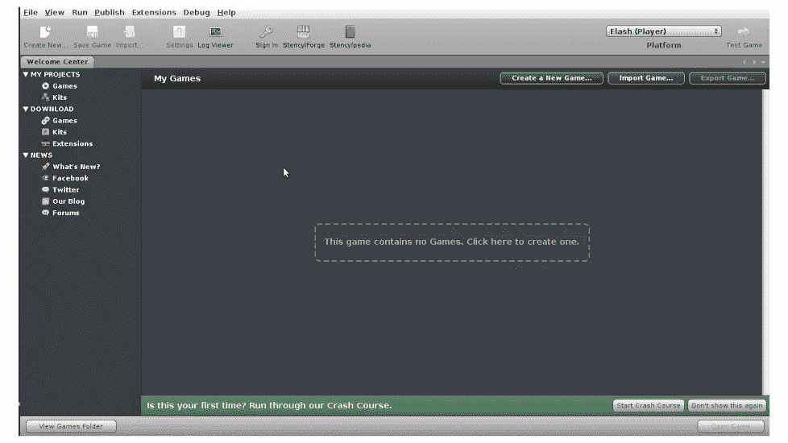

当我们开发一个游戏时，它会有一个场景，在那里事情发生，演员扮演他们的角色。让我们从创建我们的第一个演员开始，并定义它的行为。

你可以从 GitHub [这里](https://github.com/sitepoint-examples/stencylgame)下载最终教程游戏。

## 创建演员

要创建游戏，可以点击屏幕中间的绿色按钮*或者点击屏幕右上角的*按钮创建新游戏。你会被要求创建什么样的游戏，选择*空白游戏*。为你的游戏输入一个名字，例如`HelloStencyl`，保留默认屏幕并点击*创建*。

现在会提示你为你的游戏创建一个场景。将其命名为`MyScene`，并选择一种背景颜色。现在，你可以看到两个选项卡，一个仪表板选项卡和一个*我的场景*选项卡。单击仪表板选项卡。在左侧菜单中，在*资源*下，你可以看到*演员类型*。点击 *create* 按钮创建一个新的 Actor 类型。命名为大力水手。一个演员类型有一个动画，点击创建一个。将这个动画命名为`Popeye_Right`。下面是一个可以用来添加动画帧的图像:


这是你的屏幕现在应该看起来的样子。

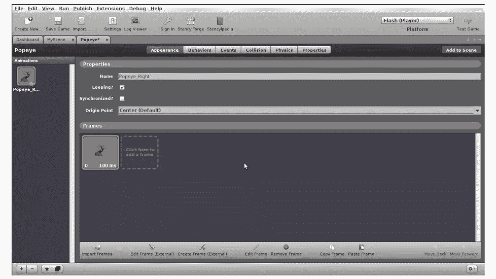

保存您的工作并切换到*我的场景*选项卡。在屏幕右侧，你应该会看到*面板*标签。点击它，你应该会看到*瓷砖和演员*标签。点击 *Actor* 选项卡，选择 Popeye 图像并通过点击屏幕将其放置在 *MyScene* 上。保存你的工作，点击屏幕右上角的*测试游戏*按钮。如果一切顺利，您应该能够看到如下所示的游戏场景:

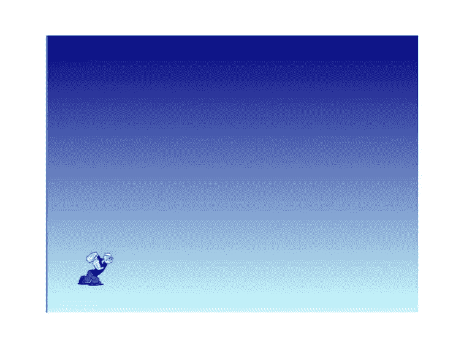

## 添加事件

接下来，我们将为我们的演员添加一些行为。选择演员，按下右箭头键，它应该向前移动，按下左箭头键，它应该向后移动。点击演员的对象选项卡，并选择*事件*选项卡。在左侧，有一个添加事件的按钮。点击*添加事件*将显示一个菜单。从菜单中选择*输入*，从*输入*中选择*键盘*。代码块应该是这样的:

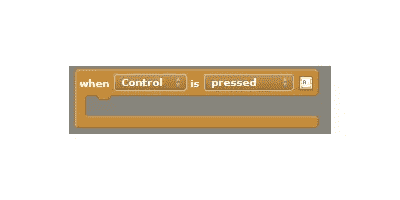

点击*控件*，将显示*选择控件*，点击将要求您选择一个控件。从控制列表中选择*右*。接下来，从右侧面板中选择*动作*选项卡，选择第二个代码块并将其拖动到现有代码块中。现在它应该是这样的:

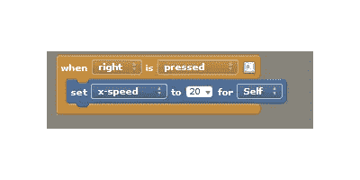

接下来，我们需要在释放右键时将运动速度设置为零。因此，添加一个新的键盘事件并设置代码块，如下所示:

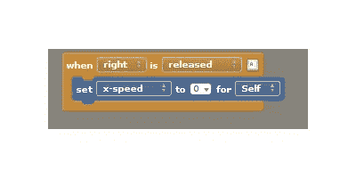

现在，通过点击*测试游戏*链接来测试游戏。在按下和释放右箭头键时，演员应该向前移动。接下来，我们需要设置左箭头键，使演员向后移动。因此，添加另一个键盘事件，如下所示:


你会注意到这和右键事件是一样的。唯一的区别是*否定*，这有助于演员在 x 轴上向后移动。另外，添加左键释放事件以停止释放按键时的动作，如下所示:

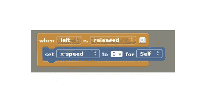

到目前为止，我们已经为我们的游戏创建了一个 actor，它可以在按下左右箭头键时前后移动。现在，让我们在游戏中再创造一个演员，并命名为*布鲁托*。这是我使用的图像:

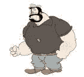

在你创建了演员并将上面的图像设置为动画帧后，切换到 *MyScene* 选项卡，像我们添加 Popeye 一样将 Bluto 添加到场景中。你的场景应该是这样的:

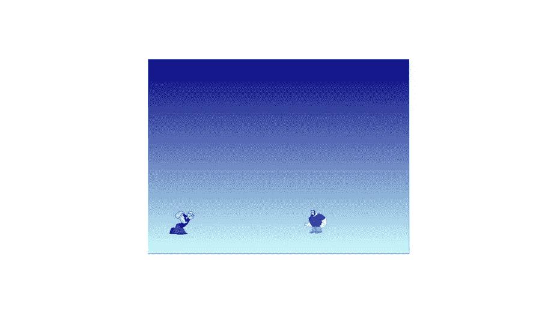

现在，试着运行这个游戏。你可以看到，当大力水手与布鲁托碰撞时，布鲁托移出了屏幕。那是因为零重力。

接下来，我们需要创建一个真实世界的场景，让我们添加一些重力。

在仪表盘选项卡中，点击*场景*，选择*场景*，选择*物理*选项卡。设置垂直重力为 85，测试游戏。这一次两个演员都摔倒了。

让我们为我们的场景添加一个曲面，以防止演员摔倒。

## 向场景添加图块

从*仪表板*选项卡中，选择*图块*并点击创建一个。命名图块并为其导入图像。这是我用过的图片:

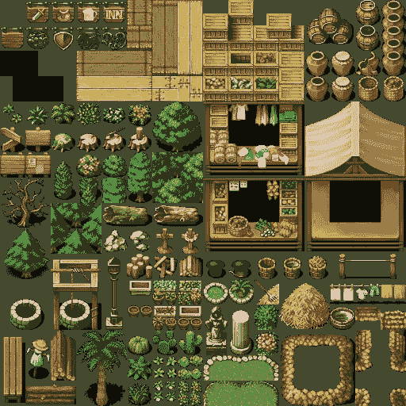

现在切换到*我的场景*标签。从屏幕右侧，选择*瓷砖*菜单，选择一个瓷砖并点击场景创建一面墙。它应该是这样的:

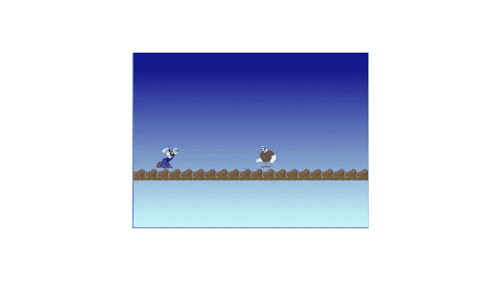

点击*测试游戏*链接，尝试运行游戏。在尝试前后移动 Popeye 时，您需要多次按下右/左箭头。这是因为重力现在被设置为模拟真实世界。为了在不需要多次点击的情况下向前和向后移动，我们需要分别在按下和释放一个键时禁用和启用重力。下面是代码块修改后的样子:

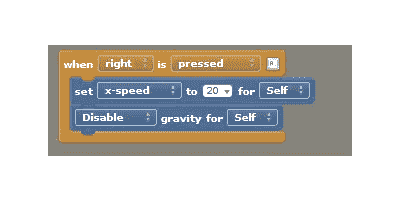

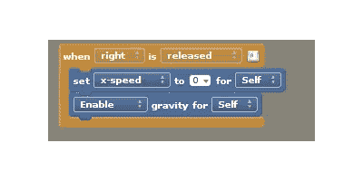

现在修改向后移动的代码块。

## 结论

在本教程中，我们看到了如何创建一个角色，如何定义角色行为以及如何创建一个场景。本教程展示了如何开始使用 Stencyl，我们所涉及的只是冰山一角。Stencyl 是一个很棒的工具，可以创建很棒的 2d 游戏。

Stencyl 有一个很棒的[社区](http://community.stencyl.com/)做后盾，你可以在他们的[维基](http://www.stencyl.com/help/)中找到很多问题的答案。

本教程中使用的一些图片来自谷歌图片搜索。

## 分享这篇文章