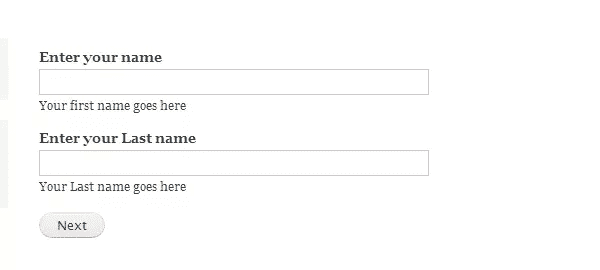
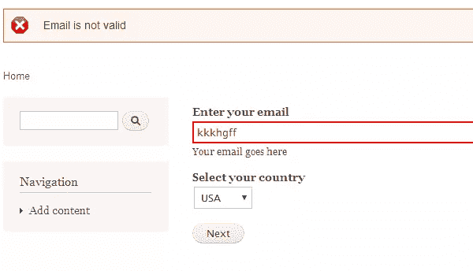

# 在 Drupal 中构建类似向导的多页表单

> 原文：<https://www.sitepoint.com/building-multi-page-wizard-like-form-drupal/>

Drupal 为您提供了构建表单的 API，只需指定表单的细节。它会自己创建底层的 HTML，只要你在其中指定你想要的字段。我们在上一篇文章的[中讨论了在 Drupal 中构建表单的细节。](https://www.sitepoint.com/understanding-forms-drupal/)

通常，我们只需要一个有几个字段的简单表单，但是可能会有这样的情况，一个页面上有太多的字段，表单看起来很混乱，填写起来很繁琐。这可能不适合你的站点，最好把你的表单分成几个逻辑部分，这样用户可以更容易地填写信息。将表单分成不同的逻辑块的一种方法是使用字段集，但这通常只适用于部分数量较少的情况。另一种组织表单的方法是将表单制作成向导或多页表单，用户可以在一页上填写详细信息，然后进入下一页。在本文中，我们将了解如何在 Drupal 中创建多页表单。

## 创建多页表单模块

我们要做的第一件事是在 Drupal 中创建一个模块。为此，在 Drupal 安装中创建一个文件夹`sites\all\modules\multipageform`,并向其中添加以下文件

multipageform.info

```
name = multipageform
description = This module creates a multipage form form using Drupal.
core = 7.x
```

多格式.模块

```
<?php
/**
 * @file
 * This is the main module file.
 */

 /**
 * Implements hook_help().
 */
function multipageform_help($path, $arg) {

  if ($path == 'admin/help#multipageform') {
    $output = '<h3>' . t('About') . '</h3>';
    $output .= '<p>' . t('The multipageform module shows how to create a multiple page form using Drupal.') . '</p>';
    return $output;
  }
}
```

完成后，您应该能够在模块列表中看到新模块。您现在可以启用该模块了。


## 定义表单中的页数和表单内容。

一旦我们准备好了模块，让我们开始定义多页表单。为此，我们要做的第一件事是创建一个菜单项来显示我们的表单。我们必须在模块中添加钩子菜单，如下所示

```
/**
* Implementation of hook_menu().
*/
function multipageform_menu() {
  $items['multipageform/form1'] = array(
        'type' => MENU_CALLBACK,
        'access arguments' => array('access content'),
        'page callback' => 'drupal_get_form',
        'page arguments'=>array('multipageform_form1'));

  return $items;
} 
```

在上面的代码中，我们在`multipageform/form1`处创建了一个菜单项，页面回调函数是`drupal_get_form`函数，参数是我们的`multipageform_form1`函数，它将返回表单供 Drupal 渲染。

现在我们将函数`multipageform_form1`定义如下

```
function multipageform_form1($form, &$form_state) {

    if(isset($form_state['values'])) {
        $currstep = $form_state['step'] + 1;
    }else {
        $currstep = 0;
    }
    $form_state['step'] = $currstep;
    $allsteps = getForm();
    $currform =  $allsteps[$currstep];

    return $currform;
}

function getForm() {

    $form = array();
    $step1 = array();
    $step1['name']=array(
        '#type'=>'textfield',
        '#title'=>t('Enter your name'),
        '#description'=>t('Your first name goes here')
      );
    $step1['last_name']=array(
        '#type'=>'textfield',
        '#title'=>t('Enter your Last name'),
        '#description'=>t('Your Last name goes here')
      );

    $step1['submit']=array(
        '#type'=>'submit',
        '#value'=>t('Next')
      );

    $form[] = $step1;

    $step2['email']=array(
        '#type'=>'textfield',
        '#title'=>t('Enter your email'),
        '#description'=>t('Your email goes here')
      );

    $step2['country']=array(
        '#type'=>'select',
        '#title'=>t('Select your country'),
        '#options'=>array('USA','UK','France','Japan')
      );

    $step2['submit']=array(
        '#type'=>'submit',
        '#value'=>t('Next')
      );

    $form[] = $step2;

    $step3['birthdate']=array(
            '#type'=>'date',
            '#title'=>t('Birthdate'),
          );

    $step3['submit']=array(
        '#type'=>'submit',
        '#value'=>t('Submit')
      );

    $form[] = $step3;

    return $form;
} 
```

在这个函数中，变量`$form_state`将包含多页表单的状态。在该状态下，我们将存储当前所在的步骤或页面，以及用户在之前步骤中输入的值。

这个函数首先要确定的是，用户是否已经开始了一个新的表单，或者我们是否需要进入表单的其他步骤/页面。为此，我们将在`$form_state[‘step’]`变量中保持我们所处的步骤。如果没有设置这个变量，那么我们就在第 0 步。否则，我们将步长增加 1。然后我们将当前步骤存储在`$form_state`中以备将来使用。

接下来，我们将获得当前步骤的表单。为此，我们必须为表单数组中的所有步骤定义表单元素。这在函数`getForm`中完成。在`getForm`中，第一步将姓名作为两个表单元素；第二步是电子邮件和国家，第三步是生日。在这里，您可以根据要构建的表单轻松地添加或删除元素甚至步骤。如果你转到网址`<your drupal url>/?q=multipageform/form1`，你会看到如下表格



## 存储窗体的状态。

现在我们需要存储表单在每个阶段的状态，这样当所有步骤完成后，我们可以将值存储在文件或数据库中。

为此，我们必须将函数`multipageform_form1_submit`定义如下

```
 function multipageform_form1_submit($form, &$form_state) {

    $form_state['storedvalues'][$form_state['step']] = $form_state['values'];
    if($form_state['step'] + 1 != getNumberOfSteps()) {
        $form_state['rebuild'] = TRUE;
    }else {

        //Reached end of multipage form

    }

}

function getNumberOfSteps() {
    return count(getForm());
}
```

在上面的代码中，函数`getNumberOfSteps`根据我们定义的步骤数组返回表单中的步骤数。然后在函数`multipageform_form1_submit`中，我们得到用户在`$form_state['values'];`中提交的当前步骤的值。我们将该值存储在`form_state`中，供语句中的当前步骤进一步使用

```
$form_state['storedvalues'][$form_state['step']] = $form_state['values']; 
```

然后我们检查这一步是否是最后一步。如果不是最后一步，我们设置`$form_state['rebuild']=TRUE`以便重建表单，我们的函数`multipageform_form1`将生成下一步的表单。

现在，如果您转到表单 URL，输入一些值并单击“下一步”,您应该转到第二步和第三步，如下所示


* * *


## 多页表单验证

我们可能希望根据我们在表单中收集的数据和我们拥有的一些规则来验证每个步骤中的数据。为此，我们必须编写如下函数`multipageform_form1_validate`

```
 function multipageform_form1_validate($form, $form_state) {

    switch ($form_state['step']) {
        case '0':
            if(empty($form_state['values']['name']))
             form_set_error('name','Name cannot be empty');
          else if(empty($form_state['values']['last_name']))
             form_set_error('last_name','Last name cannot be empty');
            break;

        case '1':
            if(filter_var($form_state['values']['email'], FILTER_VALIDATE_EMAIL) == false)
                 form_set_error('email','Email is not valid');
            break;

        default:
            break;
    }

} 
```

在上面的函数中，我们要做的第一件事是确定我们在哪个步骤上。我们使用`$form_state['step']`来完成这个任务，我们在其中存储了表单的当前步骤。

然后，在 switch 块中，我们添加了所有需要验证的步骤的案例。在上面的代码中，我们已经对步骤 0 和步骤 1 进行了验证。在步骤 0 中，我们检查姓名是否不为空，在步骤 1 中，我们检查电子邮件是否有效。如果我们发现错误，我们使用 Drupal 函数`form_set_error`设置错误，它不会将表单移动到下一步，而是向用户显示一个错误:



## 多页表单提交

一旦所有的步骤都完成了，你会想要提取所有的值，然后可能把它存储在一个文件或数据库中。为此，您必须修改`multipageform_form1_submit`函数，如下所示

```
function multipageform_form1_submit($form, &$form_state) {

    $form_state['storedvalues'][$form_state['step']] = $form_state['values'];
    if($form_state['step'] + 1 != getNumberOfSteps()) {
        $form_state['rebuild'] = TRUE;
    }else {

        $finalformvalues=array();
        $currStep = 0;
        foreach (getForm() as $step) {
            foreach ($step as $key => $value) {
                if(strcmp($key,"submit") != 0) {
                    $finalformvalues[$key] = $form_state['storedvalues'][$currStep][$key];
                }
            }
            $currStep++;
        }
        //Store the values from $finalformvalues in database or file etc

    }

} 
```

在上面的函数中，一旦我们检测到已经提交了表单的最后一步，我们就获取所有步骤的所有表单元素键，然后获取用户输入的值，这些值在放入数组`$finalformvalues`之前已经存储在`$form_state['storedvalues']`中。最后，`$finalformvalues`将包含所有步骤的所有表单元素的所有值。然后可以进一步处理和存储。

## 结论

Drupal 的表单 API 允许您创建表单，而不用担心如何呈现 HTML。此外，我们可以使用上面显示的方法来构建更长的表单，这些表单可以分解成多个步骤，这样用户处理起来更容易、更有逻辑性。Drupal 帮助我们轻松地在表单的各个步骤中保持状态，还提供钩子来验证值，并在出现问题时通知用户。这些都可以通过 Drupal 提供的功能轻松完成。祝您在 Drupal 中创建下一个多页表单愉快！

## 分享这篇文章