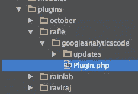
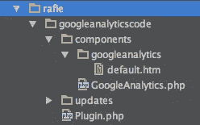
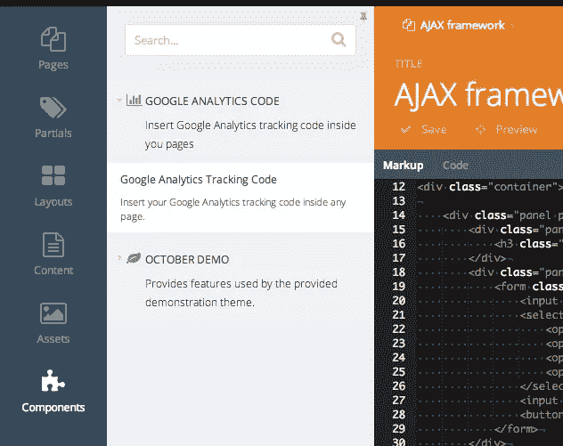
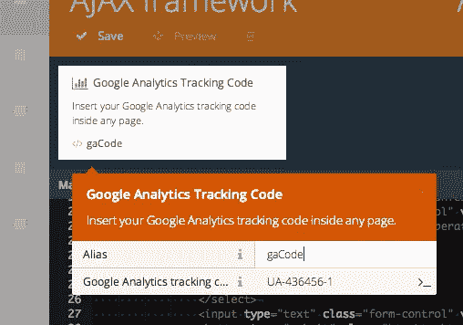
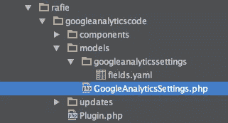
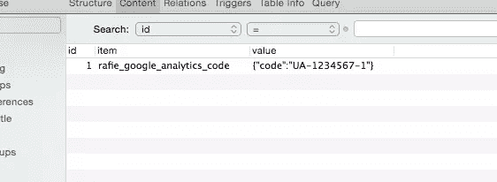

# 构建 OctoberCMS 插件:谷歌分析

> 原文：<https://www.sitepoint.com/building-octobercms-plugins-google-analytics/>

OctoberCMS 是内容管理系统中[冉冉升起的新星](https://www.sitepoint.com/introducing-octobercms-laravel-based-cms/)之一，和每个 CMS 一样，我们需要插件来扩展功能。在这篇文章中，我们将经历为十月 CMS 创建一个插件的基础。


## 我们正在建造的东西

几乎所有的网站都需要谷歌分析。我们将制作一个插件，使用组件标签将谷歌分析跟踪代码插入页面。

在设置表单中插入跟踪 id 后，您需要在要跟踪的页面上或部分页面中插入组件标记。

```

```

你可以在 [github](https://github.com/sitepoint-examples/rafie) 上看到最终的结果，并试用一下。

## 管理插件

十月在根目录里面有一个`plugins`文件夹，你可以在里面查找、安装、移除、开发插件。

要管理您的插件，您可以点击`System > updates`链接。我们有两种不同的方法来管理我们的插件。

### 创建新项目

在`System > Updates`页面下，你有一个`attach project`链接。

要附加一个项目，你需要在 10 月 CMS 网站上注册，进入项目页面，你可以创建一个新的项目。

创建项目后，您将拥有一个可用于附加项目的密钥。你可以从 [marketplace](http://Octobercms.com/plugins/) 中添加一个插件到你的项目中，并在后端的更新页面下更新你的网站。

### 使用命令行

另一种安装新插件的方法是通过[命令行](https://Octobercms.com/docs/help/console#utility-commands)，但是你仍然需要在网站上找到插件名称(这相当烦人)。在写这篇文章的时候，要安装一个新的插件，你需要指定`Author.PluginName`来找到它。

## 创建新插件

### 脚手架

10 月 CMS 使得创建新插件变得尽可能容易。您可以在`plugins`目录中创建一个新文件夹，或者使用命令行助手。

文件夹名称是您将公开使用的唯一名称空间，它不应与其他名称冲突。

要获得您独特的命名空间，您需要在十月 CMS 网站上注册为作者，并注册您的命名空间。

在`plugins`文件夹下，我将创建一个名为`RAFIE`的文件夹，这是我的命名空间，在这里我可以放置我所有的插件。

在本文中，我们将插件命名为`GoogleAnalyticsCode`。在这个文件夹下，我们只需要创建一个名为`Plugin.php`的文件来定义我们的插件。

另一种开始的方法是使用 October 提供的脚手架命令。

```
php artisan create:plugin RAFIE.GoogleAnalyticsCode
```



该命令还添加了一个名为`uploads`的文件夹，其中包含一个保存插件版本历史的`version.yaml`文件。

从`System\Classes\PluginBase`类覆盖的`pluginDetails`方法必须返回一个定义插件的数组。

```
public function pluginDetails(){
    return [
        'name'        => 'Google Analytics Code',
        'description' => 'Insert Google Analytics tracking code inside you pages',
        'author'      => 'RAFIE Younes',
        'icon'        => 'icon-bar-chart-o'
    ];
}
```

您可以查看[文档](http://Octobercms.com/docs/plugin/registration#registration-methods)以获得完整的方法列表，但是我们稍后将深入探讨每一种方法。

请注意，如果该插件没有出现在注册插件列表中，请按`check for updates`按钮刷新列表。

### 使用组件

为了能够与页面互动，十月使用组件，允许用户插入插件与他们的页面或部分互动。

```

```

要创建一个组件，您需要创建一个名为`components`的文件夹，并将您将要使用的所有类放入其中。

我们可以使用 10 月份提供的控制台 util 命令，而不是创建这些文件和文件夹。

```
php artisan create:component RAFIE.GoogleAnalyticsCode GoogleAnalytics
```



从`Cms\Classes\ComponentBase`覆盖的`componentDetails`方法是我们定义组件的地方。名称和描述将显示在管理仪表板上。



要注册一个组件，我们需要覆盖`Plugin`类中的`registerComponents`方法。

```
public function registerComponents(){
    return [
  'RAFIE\GoogleAnalyticsCode\Components\GoogleAnalytics' => 'gaCode'
    ];
}
```

我们基本上返回一个类名和组件名的数组。每个插件可以注册多个组件。

组件执行后，它将呈现`default.htm`部分，默认情况下，它将输出:

```
<p>This is the default markup for component GoogleAnalytics</p>
<small>You can delete this file if you want</small>
```

我们将用谷歌的谷歌分析跟踪代码来改变这些内容。

```
<script> (function(i,s,o,g,r,a,m){i['GoogleAnalyticsObject']=r;i[r]=i[r]||function(){
        (i[r].q=i[r].q||[]).push(arguments)},i[r].l=1*new Date();a=s.createElement(o),
            m=s.getElementsByTagName(o)[0];a.async=1;a.src=g;m.parentNode.insertBefore(a,m)
    })(window,document,'script','//www.Google-analytics.com/analytics.js','ga');

    ga('create', 'YOUR TRACKING CODE HERE', 'auto');
    ga('send', 'pageview'); </script>
```

当然，跟踪代码脚本需要在页面末尾加载，但这取决于您的主题。

默认页面必须接收来自用户的跟踪代码，这是我们可以使用组件属性的地方。

#### 组件属性

```

```

要定义属性，您可以使用`defineProperties`方法，并且必须返回可用属性的数组。

```
public function defineProperties(){
    return [
        'code' => [
            'title'             => 'Google Analytics tracking code',
            'description'       => 'Your Google Analytics tracking code, can be found in your Google Analytics dashboard',
            'default'           => '',
            'type'              => 'string',
            'validationPattern' => '^UA-\d{4,9}-\d{1,4}$',
            'validationMessage' => 'Not a tracking code',
            'placeholder'       => 'UA-XXXXXXX'
        ]
    ];
}
```

数组键是自描述的，你可以查看[文档](https://Octobercms.com/docs/plugin/components#component-properties)了解更多细节。



您可以使用表单或手动输入属性。现在我们需要捕捉值并将其传递给分部。

在我们的类组件中，我们有一个`onRender`方法，可以将值传递给页面。

```
public function onRender(){
    $this->page['code'] = $this->property('code');
}
```

`ComponentBase`类有一个代表呈现页面的`page`属性。

```
<script> (function(i,s,o,g,r,a,m){i['GoogleAnalyticsObject']=r;i[r]=i[r]||function(){
        (i[r].q=i[r].q||[]).push(arguments)},i[r].l=1*new Date();a=s.createElement(o),
            m=s.getElementsByTagName(o)[0];a.async=1;a.src=g;m.parentNode.insertBefore(a,m)
    })(window,document,'script','//www.Google-analytics.com/analytics.js','ga');

    ga('create', '{{ code }}', 'auto');
    ga('send', 'pageview'); </script>
```

在大多数情况下，您不希望使用属性在每个页面上编写跟踪代码。最好的方法是有一个设置表单，用户可以在其中输入一次代码。

### 使用设置

插件设置在模型目录下。插件结构应该是这样的。



`Settings.php`文件是我们定义设置的地方。该类应该扩展 Laravel `Model`类。

```
// googleanalyticscode/models/GoogleAnalyticsSettings.php

class GoogleAnalyticsSettings extends Model{
    public $implement = ['System.Behaviors.SettingsModel'];

    public $settingsCode = 'rafie_google_analytics_code';

    public $settingsFields = 'fields.yaml';
}
```

每个设置表单都应该实现来自 10 月 CMS 核心的`SettingsModel`。

`settingsCode`属性是我们在保存到数据库时应该使用的惟一键。

`settingsFields`是我们定义表单设置字段的文件名。CMS 将在与设置类文件同名的文件夹中查找。

```
// fields.yaml
fields:
  code:
    label: Your Google Analytics ID
    placeholder: UA-XXXXXXXX-X
```

我们只定义了一个可以放置跟踪代码的输入。您也可以定义密码字段、日期选择器或选项列表。务必检查可用选项列表。

唯一剩下的部分是在插件文件中注册我们的设置表单。

```
public function registerSettings(){
    return [
        'settings' => [
            'label'       => 'Google Analytics Code',
            'description' => 'Manage Google Analytics Settings.',
            'icon'        => 'icon-bar-chart-o',
            'class'       => 'RAFIE\GoogleAnalyticsCode\Models\GoogleAnalyticsSettings',
            'order'       => 1
        ]
    ];
}
```

标签和描述显示在仪表板的左侧菜单中。我们还定义了一个图标，以及菜单中的一个位置。


在更新设置和访问数据库后，您应该看到您的设置用您的唯一 ID 保存。



现在我们需要检索用户设置，并将它们传递给我们的组件 partial。最初，我们使用一个属性来完成它。我们现在需要在组件类内部做一些改变。

```
//Plugin.php

public function onRender(){
    $settings = GoogleAnalyticsSettings::instance();
    $this->page['code'] = $settings->code;
}
```

我们创建模型的一个实例，然后我们将代码字段作为一个属性来访问。这将给出与前一个相同的结果。

## 结论

十月是一个真正有前途的 CMS，有不同的处理插件和主题的方式。通过深入源代码并成为早期采用者之一，您可以学到更多东西。我们会有更多关于插件和主题的深度文章，但是现在让我们知道你对下面的评论中的介绍的想法。

## 分享这篇文章