# 用 Sails.js 构建实时聊天应用

> 原文：<https://www.sitepoint.com/building-real-time-chat-app-sails-js/>

如果你是目前使用 Django、Laravel 或 Rails 等框架的开发人员，你可能听说过 Node.js。你可能已经在项目中使用了 Angular 或 React 等流行的前端库。到目前为止，您应该在考虑完全转换到基于 Node.js 的服务器技术

然而，最大的问题是从哪里开始。今天，JavaScript 世界在过去的几年中以令人难以置信的速度增长，而且似乎还在不断扩大。

如果你害怕失去你在 Node universe 中辛苦获得的编程经验，不要担心，因为我们有 [Sails.js](https://sailsjs.com/) 。

Sails.js 是一个实时 MVC 框架，旨在帮助开发人员在短时间内构建生产就绪的企业级 Node.js 应用程序。Sails.js 是一个纯 JavaScript 解决方案，支持多个数据库(同时)和多种前端技术。如果你是一名 Rails 开发人员，你会很高兴得知 Sails.js 的创始人迈克·麦克尼尔受到了 Rails 的启发。您会发现 Rails 和 Sails.js 项目之间有很多相似之处。

在本文中，我将向您展示如何构建一个简单、用户友好的聊天应用程序，从而向您传授 Sails.js 的基础知识。sails-chat 项目的完整源代码可以在这个 [GitHub repo](https://github.com/brandiqa/sp-sails-chat) 中找到。

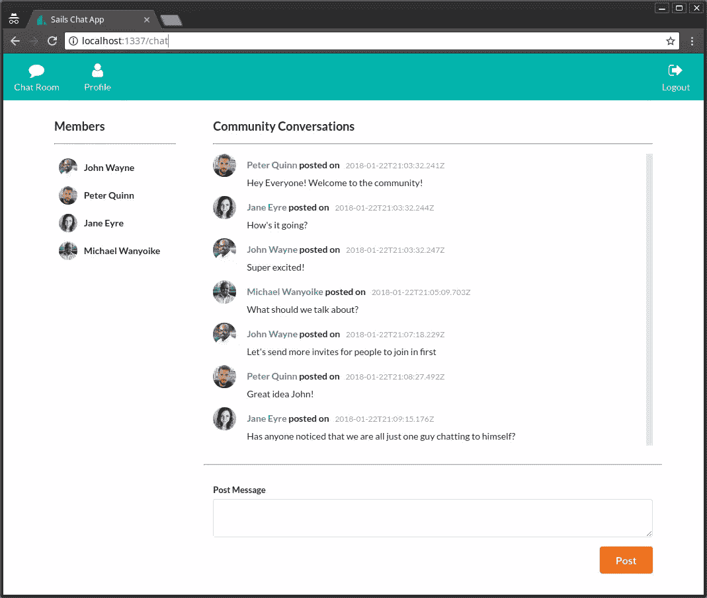

## 先决条件

在开始之前，您至少需要有使用 MVC 架构开发应用程序的经验。本教程面向中级开发人员。您还需要至少具备以下基本知识:

*   [Node.js](https://www.sitepoint.com/an-introduction-to-node-js/)
*   [现代 JavaScript 语法(ES6+)](https://www.sitepoint.com/anatomy-of-a-modern-javascript-application/#javascriptes2015) 。

为了实用和公平起见，本教程将使用默认安装在新的 Sails.js 项目中的核心库。与 React、Vue 或 Angular 等现代前端库的集成将不在此讨论。但是，我强烈建议您在阅读完本文后研究一下它们。此外，我们不会做数据库集成。我们将使用默认的基于文件的本地磁盘数据库进行开发和测试。

## 工程计划

本教程的目标是向您展示如何构建一个类似于 [Slack](https://slack.com/) 、 [Gitter](https://gitter.im/) 或 [Discord](https://discordapp.com/) 的聊天应用程序。

不尽然！大量的时间和汗水投入到构建这些美妙的平台中。目前开发出来的功能数量相当庞大。

相反，我们将构建一个聊天应用程序的最小可行产品版本，包括:

*   单人聊天室
*   基本认证([无密码](https://www.sitepoint.com/what-is-passwordless-authentication/)
*   档案更新。

我添加了*个人资料功能*作为奖励，以便在 Sails.js 功能上覆盖更多内容。

## 安装 Sails.js

在开始安装 Sails.js 之前，我们需要首先设置一个合适的 Node.js 环境。在撰写本文时，目前可用的最新稳定版本是 v 0 . 12 . 14。sails . js v 1 . 0 . 0 也可用，但目前处于测试阶段，不建议用于生产使用。

我接触到的 Node 最新稳定版本是 v8.9.4，遗憾的是 Sails.js v0.12 与目前最新的 LTS 无法正常工作。然而，我已经用 Node v.7.10 进行了测试，发现一切都运行顺利。这仍然很好，因为我们可以在代码中使用一些新的 ES8 语法。

作为一名 JavaScript 开发人员，您会意识到使用一个版本的 Node.js 是不够的。因此，我推荐使用 [nvm 工具](https://www.sitepoint.com/quick-tip-multiple-versions-node-nvm/)来轻松管理 Node.js 和 NPM 的多个版本。如果您还没有这样做，只需清除现有的 Node.js 安装，然后安装 nvm 来帮助您管理 Node.js 的多个版本。

下面是安装 Node v7 和 Sails.js 的基本说明:

```
# Install the latest version of Node v7 LTS
nvm install v7

# Make Node v7 the default
nvm default alias v7

# Install Sails.js Global
npm install -g sails 
```

如果你有一个良好的互联网连接，这应该只需要几分钟或更少。现在让我们继续使用 Sails generator 命令创建我们的新应用程序:

```
# Go to your projects folder
cd Projects

# Generate your new app
sails generate new chat-app

# Wait for the install to finish then navigate to the project folder
cd chat-app

# Start the app
sails lift 
```

应用程序应该需要几秒钟才能启动。您需要在浏览器中手动打开 url `http://localhost:1337`来查看您新创建的 web 应用程序。

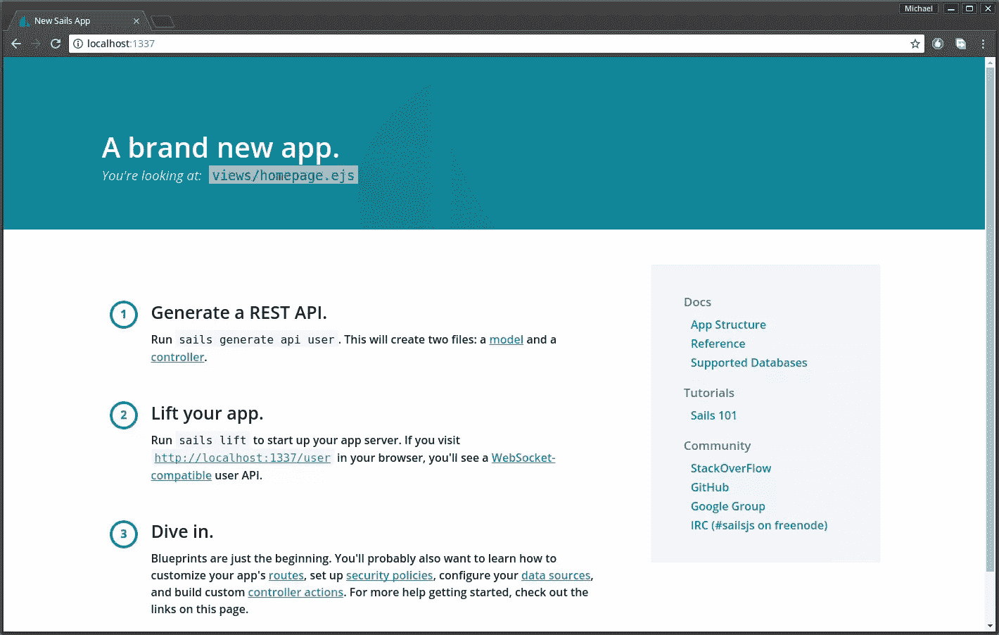

看到这个确认了我们有一个没有错误的运行项目，并且我们可以开始工作了。要停止项目，只需在终端按下`control` + `c`即可。使用您最喜欢的代码编辑器(我使用的是 Atom)来检查生成的项目结构。以下是您应该了解的主要文件夹:

*   `api`:控制器、模型、服务和策略(权限)
*   图像、字体、JS、CSS、Less、Sass 等。
*   `config`:项目配置，如数据库、路线、证书、地区、安全等。
*   `node_modules`:已安装的 npm 软件包
*   `tasks`:用于编译和注入资产的 Grunt 配置脚本和管道脚本
*   查看页面——例如，EJS、杰德或任何你喜欢的模板引擎
*   在开发模式下，Sails 用来构建和服务你的项目的临时文件夹。

在我们继续之前，我们需要做几件事:

*   **更新 EJS 包**。如果您有`package.json`中列出的 EJS 2.3.4，您需要立即将其更新为 2.5.5。它包含一个严重的安全漏洞。更改版本号后，进行 npm 安装以执行更新。
*   **热重装**。建议你安装[sails-hook-auto load](https://github.com/sgress454/sails-hook-autoreload)为你的 Sails.js app 启用热重装。这不是一个完美的解决方案，但会使开发更容易。要为当前版本的 Sails.js 安装它，请执行以下命令:

```
npm install sails-hook-autoreload@for-sails-0.12 --save 
```

## 安装前端依赖项

对于本教程，我们将花费尽可能少的时间来构建一个 UI。任何你熟悉的 CSS 框架都可以。对于本教程，我将使用[语义 UI](https://semantic-ui.com/) CSS 库。

Sails.js 没有关于如何安装 CSS 库的具体指南。有三种或三种以上的方法可以解决这个问题。让我们来看看每一个。

### 1.手动下载

您可以自己下载 CSS 文件和 JS 脚本，以及它们的依赖项。下载后，将文件放在`assets`文件夹中。

我不喜欢使用这种方法，因为它需要手动更新文件。我喜欢自动化任务。

### 2.使用凉亭

这种方法要求您在项目的根目录下创建一个名为`.bowerrc`的文件。粘贴以下代码片段:

```
{
"directory" : "assets/vendor"
} 
```

这将指示 Bower 安装到`assets/vendor`文件夹，而不是默认的`bower_components`文件夹。接下来，在全局范围内安装 Bower，并使用 Bower 在本地安装您的前端依赖项:

```
# Install bower globally via npm-
npm install -g bower

# Create bower.json file, accept default answers (except choose y for private)
bower init

# Install semantic-ui via bower
bower install semantic-ui --save

# Install jsrender
bower install jsrender --save 
```

稍后我会解释`jsrender`的目的。我认为最好是一次性完成安装依赖项的任务。您应该注意到 jQuery 也已经安装，因为它是`semantic-ui`的依赖项。

安装后，更新`assets/style/importer.less`以包含该行:

```
@import '../vendor/semantic/dist/semantic.css'; 
```

接下来在`tasks/pipeline.js`中包含 JavaScript 依赖项:

```
var jsFilesToInject = [

// Load Sails.io before everything else
'js/dependencies/sails.io.js',

// Vendor dependencies
'vendor/jquery/dist/jquery.js',
'vendor/semantic/dist/semantic.js',
'vendor/jsrender/jsrender.js',

// Dependencies like jQuery or Angular are brought in here
'js/dependencies/**/*.js',

// All of the rest of your client-side JS files
// will be injected here in no particular order.
'js/**/*.js'
]; 
```

当我们运行`sails lift`时，JavaScript 文件会按照`pipeline.js`的指令自动注入到`views/layout.ejs`文件中。当前的`grunt`设置将负责为我们注入 CSS 依赖项。

*重要提示:在`.gitignore`文件中添加`vendor`字样。我们不希望供应商依赖关系保存在我们的存储库中。*

### 3.使用 npm + grunt.copy

第三种方法需要更多一点的努力来设置，但会导致更少的内存占用。使用 npm 安装依赖项，如下所示:

```
npm install semantic-ui-css jsrender --save 
```

jQuery 将被自动安装，因为它也被列为`semantic-ui-css`的依赖项。接下来我们需要在`tasks/config/copy.js`中放置代码。这段代码将指示 Grunt 将所需的 JS 和 CSS 文件从`node_modules`复制到`assets/vendor`文件夹中。整个文件应该如下所示:

```
module.exports = function(grunt) {

grunt.config.set('copy', {
  dev: {
    files: [{
      expand: true,
      cwd: './assets',
      src: ['**/*.!(coffee|less)'],
      dest: '.tmp/public'
    },
    //Copy JQuery
    {
      expand: true,
      cwd: './node_modules/jquery/dist/',
      src: ['jquery.min.js'],
      dest: './assets/vendor/jquery'
    },
    //Copy jsrender
    {
      expand: true,
      cwd: './node_modules/jsrender/',
      src: ['jsrender.js'],
      dest: './assets/vendor/jsrender'
    },
    // copy semantic-ui CSS and JS files
    {
      expand: true,
      cwd: './node_modules/semantic-ui-css/',
      src: ['semantic.css', 'semantic.js'],
      dest: './assets/vendor/semantic-ui'
    },
    //copy semantic-ui icon fonts
    {
      expand: true,
      cwd: './node_modules/semantic-ui-css/themes',
      src: ["*.*", "**/*.*"],
      dest: './assets/vendor/semantic-ui/themes'
    }]
  },
  build: {
    files: [{
      expand: true,
      cwd: '.tmp/public',
      src: ['**/*'],
      dest: 'www'
    }]
  }
});

grunt.loadNpmTasks('grunt-contrib-copy');
}; 
```

将此行添加到`assets/styles/importer.less`:

```
@import '../vendor/semantic-ui/semantic.css'; 
```

将 JS 文件添加到`config/pipeline.js`:

```
// Vendor Dependencies
'vendor/jquery/jquery.min.js',
'vendor/semantic-ui/semantic.js',
'vendor/jsrender/jsrender.js', 
```

最后，执行该命令从`node_modules`文件夹中复制文件。每次全新安装项目时，您只需这样做一次:

```
grunt copy:dev 
```

记得把`vendor`加到你的`.gitignore`里。

### 测试依赖项安装

无论选择哪种方法，都需要确保加载了所需的依赖项。为此，用以下代码替换`view/homepage.ejs`中的代码:

```
<h2 class="ui icon header">
<i class="settings icon"></i>
<div class="content">
  Account Settings
  <div class="sub header">Manage your account settings and set e-mail preferences.</div>
</div>
</h2> 
```

保存文件后，做一个`sails lift`。您的主页现在应该看起来像这样:

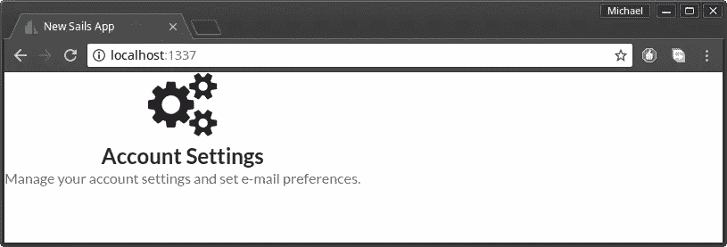

重启应用后，请务必进行刷新。如果图标丢失或字体看起来不合适，请仔细检查这些步骤，看看您错过了什么。使用浏览器的控制台查看哪些文件没有加载。否则，继续下一阶段。

## 创建视图

说到项目开发，我喜欢从用户界面开始。我们将使用[嵌入的 JavaScript 模板](http://www.embeddedjs.com/getting_started.html)来创建视图。这是一个默认安装在每个 Sails.js 项目中的模板引擎。但是，您应该知道它的功能有限，已经不再开发了。

打开`config/bootstrap.js`并插入这一行，以便给我们的网页一个合适的标题。将它放在现有函数中的`cb()`语句之前:

```
sails.config.appName = "Sails Chat App"; 
```

你可以偷看一下`views/layout.ejs`看看`title`标签是怎么设置的。接下来，我们开始构建我们的主页 UI。

### 主页设计

打开`/views/homepage.ejs`并用以下代码替换现有代码:

```
<div class="banner">
<div class="ui segment teal inverted">
  <h1 class="ui center aligned icon header">
    <i class="chat icon"></i>
    <div class="content">
      <a href="/">Sails Chat</a>
      <div class="sub header">Discuss your favorite technology with the community!</div>
    </div>
  </h1>
</div>
</div>
<div class="section">
<div class="ui three column grid">
  <div class="column"></div>
  <div class="column">
    <div class="ui centered padded compact raised segment">
      <h3>Sign Up or Sign In</h3>
      <div class="ui divider"></div>
      [TODO : Login Form goes here]
    </div>
  </div>
  <div class="column"></div>
</div>
</div> 
```

要理解上述代码中使用的 UI 元素，请参考语义 UI 文档。我在下面列出了确切的链接:

*   [段](https://semantic-ui.com/elements/segment.html)
*   [图标](https://semantic-ui.com/elements/icon.html)
*   [表头](https://semantic-ui.com/elements/header.html)
*   [网格](https://semantic-ui.com/collections/grid.html)

在`assets/styles/theme.less`中新建一个文件，粘贴以下内容:

```
.banner a {
color: #fff;
}

.centered {
margin-left: auto !important;
margin-right: auto !important;
margin-bottom: 30px !important;
}

.section {
margin-top: 30px;
}

.menu {
border-radius: 0 !important;
}

.note {
font-size: 11px;
color: #2185D0;
}

#chat-content {
height: 90%;
overflow-y: scroll;
} 
```

这些都是我们将在项目中使用的自定义样式。其余的样式将来自于`Semantic UI`库。

接下来，更新`assets/styles/importer.less`以包含我们刚刚创建的主题文件:

```
@import 'theme.less'; 
```

执行`sails lift`。您的项目现在应该如下所示:

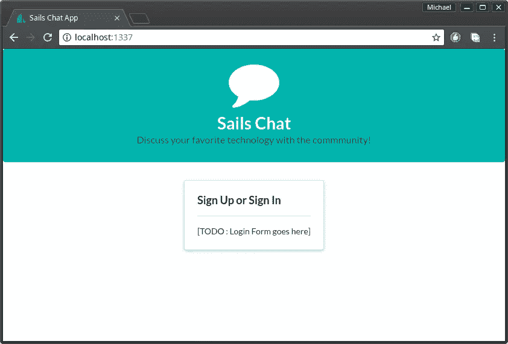

接下来，我们将看看如何构建导航菜单。

### 导航菜单

这将被创建为一个部分，因为它将被多个视图文件共享。在`views`文件夹中，创建一个名为`partials`的文件夹。然后创建文件`views/partials/menu.ejs`并粘贴以下代码:

```
<div class="ui labeled icon inverted teal menu">
<a class="item" href="/chat">
  <i class="chat icon"></i>
  Chat Room
</a>
<a class="item" href="/profile">
  <i class="user icon"></i>
  Profile
</a>
<div class="right menu">
  <a class="item" href="/auth/logout">
    <i class="sign out icon"></i>
    Logout
  </a>
</div>
</div> 
```

要理解上述代码，只需参考[菜单](https://semantic-ui.com/collections/menu.html)文档。

如果你检查上面的代码，你会注意到我们已经为`/chat`、`/profile`和`/auth/logout`创建了一个链接。让我们首先为`profile`和`chat room`创建视图。

### 轮廓

创建文件`view/profile.ejs`并粘贴以下代码:

```
<% include partials/menu %>

<div class="ui container">
<h1 class="ui centered header">Profile Updated!</h1>
<hr>
<div class="section">
  [ TODO put user-form here]
</div>
</div> 
```

如果您已经阅读了相关的文档，现在您应该已经熟悉了`header`和`grid` UI 元素。在文档的根，你会注意到我们有一个`container`元素。(在[容器](https://semantic-ui.com/elements/container.html)文档中找到更多相关信息。

一旦构建了 API，我们将在稍后构建用户表单。接下来，我们将为聊天室创建一个布局。

### 聊天室布局

聊天室将由三个部分组成:

*   **聊天用户** —用户列表
*   **聊天消息** —消息列表
*   **聊天帖子** —发布新消息的表单。

创建`views/chatroom.ejs`并粘贴以下代码:

```
<% include partials/menu %>

<div class="chat-section">
<div class="ui container grid">

  <!-- Members List Section -->
  <div class="four wide column">
    [ TODO chat-users ]
  </div>

  <div class="twelve wide column">

    <!-- Chat Messages -->
    [ TODO chat-messages ]

    <hr>

    <!-- Chat Post -->
    [ TODO chat-post ]

  </div>
</div>
</div> 
```

在查看页面之前，我们需要设置路由。

## 按指定路线发送

打开`config/routes.js`，这样更新:

```
'/': {
view: 'homepage'
},
'/profile': {
view: 'profile'
},
'/chat': {
view: 'chatroom'
} 
```

Sails.js 路由相当灵活。根据具体情况，定义路由的方式有很多种。这是我们将 URL 映射到视图的最基本版本。

启动你的 Sails 应用程序，或者刷新你的页面，如果它还在后台运行的话。目前主页和其他页面之间没有链接。这是有意的，因为我们稍后将构建一个基本的认证系统，将登录的用户重定向到`/chat`。现在，使用你浏览器的地址栏，在 URL 末尾添加`/chat`或`/profile`。

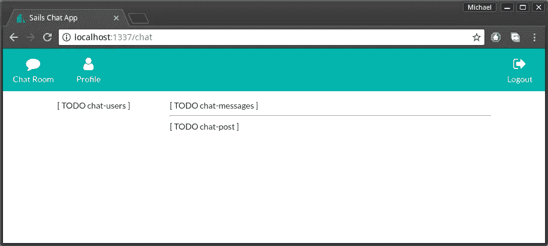

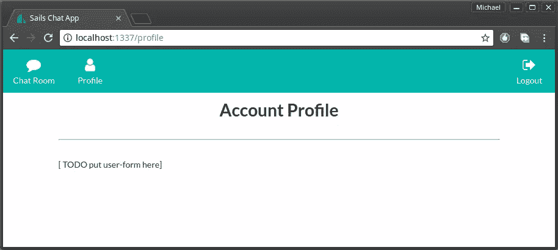

在这个阶段，你应该有上述观点。让我们开始创建 API。

## 生成用户 API

我们将使用 Sails.js 命令行实用程序来生成我们的 API。在这一步，我们需要停止应用程序:

```
sails generate api User 
```

不到一秒钟，我们得到消息“创建了一个新的 api！”基本上，我们刚刚创建了一个`User.js`模型和一个`UserController.js`。让我们用一些模型属性来更新`api/model/User.js`:

```
module.exports = {

attributes: {

  name: {
    type: 'string',
    required: true
  },

  email: {
    type: 'string',
    required: true,
    unique: true
  },

  avatar: {
    type: 'string',
    required: true,
    defaultsTo: 'https://s.gravatar.com/avatar/e28f6f64608c970c663197d7fe1f5a59?s=60'
  },

  location: {
    type: 'string',
    required: false,
    defaultsTo: ''
  },

  bio: {
    type: 'string',
    required: false,
    defaultsTo:''
  }
}
}; 
```

我相信上面的代码是不言自明的。默认情况下，Sails.js 使用本地磁盘数据库，它基本上是一个位于`.tmp`文件夹中的文件。为了测试我们的应用程序，我们需要创建一些用户。最简单的方法是安装[帆-种子包](https://www.npmjs.com/package/sails-seed):

```
npm install sails-seed --save 
```

安装后，你会发现文件`config/seeds.js`已经为你创建好了。粘贴以下种子数据:

```
module.exports.seeds = {
user: [
  {
    name: 'John Wayne',
    email: 'johnnie86@gmail.com',
    avatar: 'https://randomuser.me/api/portraits/men/83.jpg',
    location: 'Mombasa',
    bio: 'Spends most of my time at the beach'
  },
  {
    name: 'Peter Quinn',
    email: 'peter.quinn@live.com',
    avatar: 'https://randomuser.me/api/portraits/men/32.jpg',
    location: 'Langley',
    bio: 'Rather not say'
  },
  {
    name: 'Jane Eyre',
    email: 'jane@hotmail.com',
    avatar: 'https://randomuser.me/api/portraits/women/94.jpg',
    location: 'London',
    bio: 'Loves reading motivation books'
  }
]
} 
```

现在我们已经生成了一个 API，我们应该在文件`config/models.js`中配置迁移策略:

```
migrate: 'drop' 
```

Sails.js 使用三种迁移策略来确定每次启动时如何重建数据库:

*   **安全** —不用迁移，我来手工
*   **alter** —迁移但尽量保留现有数据
*   **删除** —删除所有表并重建所有内容

我更喜欢使用`drop`进行开发，因为我倾向于大量迭代。如果您想保留现有数据，可以设置`alter`。然而，我们的数据库每次都会被种子数据填充。

现在让我给你看些很酷的东西。启动您的 Sails 项目并导航到地址`/user`和`/user/1`。

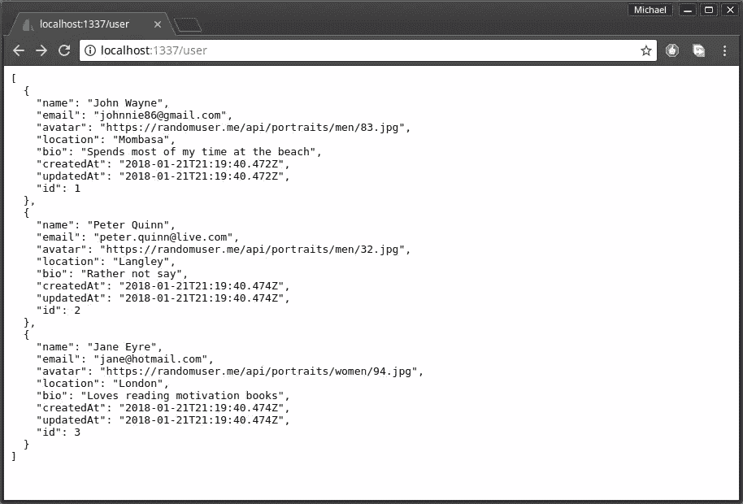

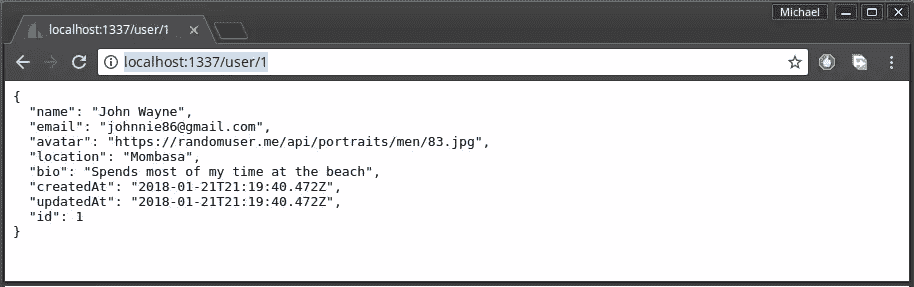

多亏了 Sails.js [Blueprints API](https://sailsjs.com/documentation/concepts/blueprints) ，我们不用写一行代码就有了一个全功能的 CRUD API。您可以使用 Postman 来访问用户 API 并执行数据操作，例如创建、更新或删除用户。

现在让我们继续构建概要文件表单。

### 轮廓形式

打开`view/profile.ejs`并用以下代码替换现有的 TODO 行:

```
">
<div class="ui grid">
  <form action="<%= '/user/update/'+  data.id %>" method="post" class="ui centered form">
    <div class="field">
      <label>Name</label>
      <input type="text" name="name" value="<%= data.name %>">
    </div>
    <div class="field">
      <label>Email</label>
      <input type="text" name="email" value="<%= data.email %>">
    </div>
    <div class="field">
      <label>Location</label>
      <input type="text" name="location" value="<%= data.location %>">
    </div>
    <div class="field">
      <label>Bio</label>
      <textarea name="bio" rows="4" cols="40"><%= data.bio %></textarea>
    </div>
    <input type="hidden" name="avatar" value=<%=data.avatar %>>
    <button class="ui right floated  orange button" type="submit">Update</button>
  </form>
</div> 
```

我们使用[语义 UI 表单](https://semantic-ui.com/collections/form.html)来构建表单界面。如果您检查表单的动作值`/user/update/'+ data.id`，您将意识到我使用的是一个蓝图路线。这意味着当用户点击`Update`按钮时，蓝图的更新动作将被执行。

然而，为了加载用户数据，我决定在用户控制器中定义一个自定义操作。用以下代码更新`api/controllers/UserController`:

```
module.exports = {

render: async (request, response) => {
  try {
    let data = await User.findOne({
      email: 'johnnie86@gmail.com'
    });
    if (!data) {
      return response.notFound('The user was NOT found!');
    }
    response.view('profile', { data });
  } catch (err) {
    response.serverError(err);
  }
}
}; 
```

在这段代码中，您会注意到我使用了`async/await`语法从数据库中获取用户数据。另一种方法是使用回调，这对于大多数开发人员来说是不容易理解的。我还硬编码了临时加载的默认用户帐户。稍后，当我们设置基本身份验证时，我们会将其更改为加载当前登录的用户。

最后，我们需要更改路线`/profile`以开始使用新创建的`UserController`。打开`config/routes`，按如下方式更新轮廓路线:

```
...
'/profile': {
  controller: 'UserController',
  action: 'render'
},
... 
```

导航到 URL `/profile`，您应该看到以下视图:


尝试更改其中一个表单字段，然后点击“更新”按钮。你会看到这样的景象:

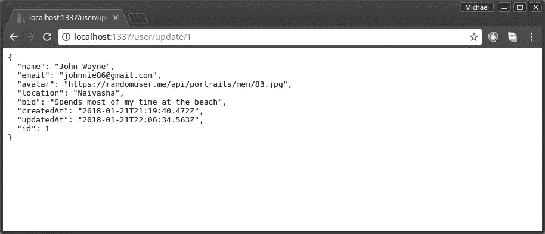

您会注意到更新已经生效，但是显示的数据是 JSON 格式的。理想情况下，我们应该在`views/user/findOne.ejs`中有一个只读的个人资料页面，在`/views/user/update.ejs`中有一个更新的个人资料页面。蓝图系统将猜测用于呈现信息的视图。如果找不到视图，它将只输出 JSON。现在，我们将简单地使用这个巧妙的技巧。创建文件`/views/user/update.ejs`并粘贴以下代码:

```
<script type="text/javascript"> window.location = '/profile'; </script> 
```

下次我们执行更新时，我们将被重定向到`/profile`页面。现在我们有了用户数据，我们可以创建在`views/chatroom.ejs`中使用的文件`views/partials/chat-users.js`。创建文件后，粘贴以下代码:

```
<div class="ui basic segment">  <h3>Members</h3>  <hr>  <div id="users-content" class="ui middle aligned selection list">  </div>  </div> // jsrender template <script id="usersTemplate" type="text/x-jsrender"> <div class="item">
  
  <div class="content">
    <div class="header">{{:name}}</div>
  </div>
</div> </script>  <script type="text/javascript"> function loadUsers() {
  // Load existing users
  io.socket.get('/user', function(users, response) {
    renderChatUsers(users);
  });

  // Listen for new & updated users
  io.socket.on('user', function(body) {
    io.socket.get('/user', function(users, response) {
      renderChatUsers(users);
    });
  });
}

function renderChatUsers(data) {
  const template = $.templates('#usersTemplate');
  let htmlOutput = template.render(data);
  $('#users-content').html(htmlOutput);
} </script> 
```

对于这个视图，我们需要一种客户端呈现方法来实时更新页面。这里，我们使用了 [jsrender](https://github.com/BorisMoore/jsrender) 库，一个比 EJS 更强大的模板引擎。`jsrender`的美妙之处在于它既可以接受一个数组，也可以接受一个单独的对象文字，模板仍然可以正确地呈现。如果我们要在`ejs`中这样做，我们需要结合一个`if`语句和一个`for`循环来处理这两种情况。

让我解释一下我们客户端 JavaScript 代码的流程:

1.  `loadUsers()`。当页面首次加载时，我们使用 Sails.js 套接字库为用户执行一个`GET`请求。这个请求将由 Blueprint API 处理。然后，我们将收到的数据传递给`renderChatUsers(data)`功能。
2.  仍然在`loadUsers()`函数中，我们使用`io.socket.on`函数注册一个监听器。我们监听与模型`user`相关的事件。当我们得到通知时，我们再次获取用户并替换现有的 HTML 输出。
3.  `renderChatUsers(data)`。这里我们使用 jQuery `templates()`函数获取一个 id 为`usersTemplate`的脚本。注意类型是`text/x-jsrender`。通过指定自定义类型，浏览器将忽略并跳过该部分，因为它不知道它是什么。然后我们使用`template.render()`函数来合并模板和数据。这个过程将生成一个 HTML 输出，然后我们将它插入 HTML 文档。

我们在`profile.ejs`中编写的模板在节点服务器上呈现，然后作为 HTML 发送到浏览器。对于`chat-users`的情况，我们需要进行客户端渲染。这将允许聊天用户在不刷新浏览器的情况下看到新用户加入群组。

在我们测试代码之前，我们需要更新`views/chatroom.ejs`来包含新创建的`chat-users`片段。用以下代码替换`[ TODO chat-users ]`:

```
...html
<% include partials/chat-users.ejs %>
... 
```

在同一个文件中，在末尾添加以下脚本:

```
<script type="text/javascript"> window.onload = function() {
  loadUsers();
} </script> 
```

这个脚本将调用`loadUsers()`函数。为了确认这是可行的，让我们执行一个`sails lift`并导航到`/chat` URL。

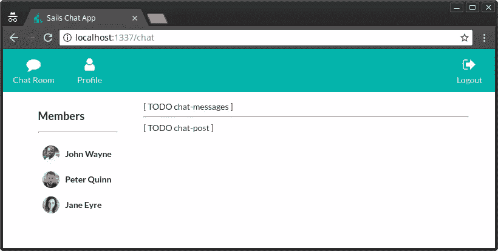

你的观点应该喜欢上图。如果是的话，让我们继续构建聊天室 API。

## 聊天消息 API

和以前一样，我们将使用 Sails.js 来生成 API:

```
sails generate api ChatMessage 
```

接下来，用这些属性填充`api/models/ChatMessage.js`:

```
module.exports = {

attributes: {

  message: {
    type: 'string',
    required: true
  },

  createdBy : {
    model: 'user',
    required: true
  }
}
}; 
```

注意，我们已经通过`createdBy`属性声明了与`User`模型的一对一关联。接下来，我们需要用一些聊天消息填充我们的磁盘数据库。为此，我们将使用`config/bootstrap.js`。按如下方式更新整个代码。我们使用`async/await`语法来简化我们的代码并避免回调地狱:

```
module.exports.bootstrap = async function(cb) {

sails.config.appName = "Sails Chat App";

// Generate Chat Messages
try {
  let messageCount = ChatMessage.count();
  if(messageCount > 0){
    return; // don't repeat messages
  }

  let users = await User.find();
  if(users.length >= 3) {
    console.log("Generating messages...")

    let msg1 = await ChatMessage.create({
      message: 'Hey Everyone! Welcome to the community!',
      createdBy: users[1]
    });
    console.log("Created Chat Message: " + msg1.id);

    let msg2 = await ChatMessage.create({
      message: "How's it going?",
      createdBy: users[2]
    });
    console.log("Created Chat Message: " + msg2.id);

    let msg3 = await ChatMessage.create({
      message: 'Super excited!',
      createdBy: users[0]
    });
    console.log("Created Chat Message: " + msg3.id);

  } else {
    console.log('skipping message generation');
  }
}catch(err){
  console.error(err);
}

// It's very important to trigger this callback method when you're finished with Bootstrap! (Otherwise your server will never lift, since it's waiting on Bootstrap)
cb();
}; 
```

最棒的是种子生成器在`bootstrap.js`之前运行。这样，我们可以确定已经首先创建了`Users`数据，这样我们就可以用它来填充`createdBy`字段。拥有测试数据将使我们能够在构建用户界面时快速迭代。

### 聊天消息用户界面

继续创建一个新文件`views/partials/chat-messages.ejs`，然后放置以下代码:

```
<div class="ui basic segment" style="height: 70vh;">  <h3>Community Conversations</h3>  <hr>  <div id="chat-content" class="ui feed">  </div>  </div>  <script id="chatTemplate" type="text/x-jsrender"> <div class="event">
  <div class="label">
     
  </div>
  <div class="content">
    <div class="summary">
      <a href="#"> {{:createdBy.name}}</a> posted on
      <div class="date">
        {{:createdAt}}
      </div>
    </div>
    <div class="extra text">
         {{:message}}
    </div>
  </div>
</div> </script>  <script type="text/javascript"> function loadMessages() {
  // Load existing chat messages
  io.socket.get('/chatMessage', function(messages, response) {
    renderChatMessages(messages);
  });

  // Listen for new chat messages
  io.socket.on('chatmessage', function(body) {
    renderChatMessages(body.data);
  });
}

function renderChatMessages(data) {
  const chatContent = $('#chat-content');
  const template = $.templates('#chatTemplate');
  let htmlOutput = template.render(data);
  chatContent.append(htmlOutput);
  // automatically scroll downwards
  const scrollHeight = chatContent.prop("scrollHeight");
  chatContent.animate({ scrollTop: scrollHeight }, "slow");
} </script> 
```

这里的逻辑和`chat-users`很像。在听的部分有一个关键的区别。我们使用 append，而不是替换呈现的输出。然后我们做一个滚动动画到列表的底部，以确保用户看到新收到的消息。

接下来，让我们更新`chatroom.ejs`以包含新的`chat-messages`片段，并更新脚本以调用`loadMessages()`函数:

```
...
<!-- Chat Messages -->
    <% include partials/chat-messages.ejs %>
...

<script type="text/javascript"> ...
  loadMessages();
... </script> 
```

您的视图现在应该如下所示:

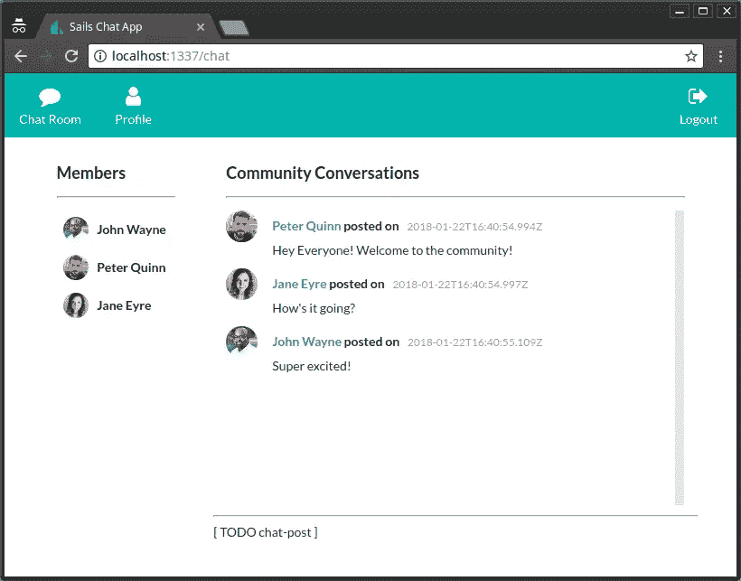

现在让我们构建一个简单的表单，允许用户向聊天室发布消息。

### 聊天帖子 UI

创建一个新文件`views/partial/chat-post.ejs`并粘贴以下代码:

```
<div class="ui basic segment">
<div class="ui form">
  <div class="ui field">
    <label>Post Message</label>
    <textarea id="post-field" rows="2"></textarea>
  </div>
  <button id="post-btn" class="ui right floated large orange button" type="submit">Post</button>
</div>
<div id="post-err" class="ui tiny compact negative message" style="display:none;">
  <p>Oops! Something went wrong.</p>
</div>
</div> 
```

这里我们使用 using `semantic-ui`元素来构建表单。接下来，将该脚本添加到文件的底部:

```
<script type="text/javascript"> function activateChat() {
  const postField = $('#post-field');
  const postButton = $('#post-btn');
  const postErr = $('#post-err');

  // Bind to click event
  postButton.click(postMessage);

  // Bind to enter key event
  postField.keypress(function(e) {
    var keycode = (e.keyCode ? e.keyCode : e.which);
    if (keycode == '13') {
        postMessage();
    }
  });

  function postMessage() {
    if(postField.val() == "") {
      alert("Please type a message!");
    } else {
      let text = postField.val();
      io.socket.post('/postMessage', { message: text }, function(resData, jwRes) {
        if(jwRes.statusCode != 200) {
            postErr.html("<p>" +  resData.message +"</p>")
            postErr.show();
        } else {
          postField.val(''); // clear input field
        }
      });
    }
  }
} </script> 
```

该脚本由两个函数组成:

*   `activateChat()`。该函数将 post 按钮绑定到 click 事件，将消息框(post 字段)绑定到按键(enter)事件。当任何一个被触发时，调用`postMessage()`函数。
*   `postMessage`。该函数首先进行快速验证，以确保 post 输入字段不为空。如果输入字段中提供了消息，我们使用`io.socket.post()`函数将消息发送回服务器。这里我们使用一个经典的回调函数来处理来自服务器的响应。如果出现错误，我们会显示错误消息。如果我们得到一个 200 状态码，意味着消息被捕获，我们清除 post 输入字段，准备输入下一条消息。

如果您返回到`chat-message`脚本，您会看到我们已经放置了代码来检测和呈现传入的消息。你应该也注意到了`io.socket.post()`正在向 URL `/postMessage`发送数据。这不是蓝图路线，是定制路线。因此，我们需要为它编写代码。

转到`api/controllers/UserController.js`并插入以下代码:

```
module.exports = {

postMessage: async (request, response) => {
    // Make sure this is a socket request (not traditional HTTP)
  if (!request.isSocket) {
    return response.badRequest();
  }

    try {
        let user = await User.findOne({email:'johnnie86@gmail.com'});
        let msg = await ChatMessage.create({message:request.body.message, createdBy:user });
        if(!msg.id) {
            throw new Error('Message processing failed!');
        }
        msg.createdBy = user;
        ChatMessage.publishCreate(msg);
    } catch(err) {
        return response.serverError(err);
    }

    return response.ok();
}
}; 
```

由于我们还没有设置基本的身份验证，我们现在将用户`johnnie86@gmail.com`硬编码为消息的作者。我们使用`Model.create()`water line form 函数来创建一个新的记录。这是一种不需要我们编写 SQL 代码就可以插入记录的奇特方式。接下来，我们向所有套接字发送一个 notify 事件，通知它们已经创建了一个新消息。我们使用在 Blueprints API 中定义的`ChatMessage.publishCreate()`函数来实现。在我们发出消息之前，我们确保用一个`user`对象填充了`createdBy`字段。这被`chat-messages` partial 用来访问创建消息的用户的头像和名字。

接下来，转到`config/routes.js`，将`/postMessage` URL 映射到我们刚刚定义的`postMessage`动作。插入此代码:

```
...
'/chat': {
view: 'chatroom'
}, // Add comma here
'/postMessage': {
controller: 'ChatMessageController',
action: 'postMessage'
}
... 
```

打开`views/chatroom.js`并包含`chat-post`部分。我们还将在`loadMessages()`函数之后调用`activateChat()`函数:

```
...
<% include partials/chat-messages.ejs %>
...

<script type="text/javascript"> ...
  activateChat();
... </script> 
```

刷新页面并尝试发送多条消息。

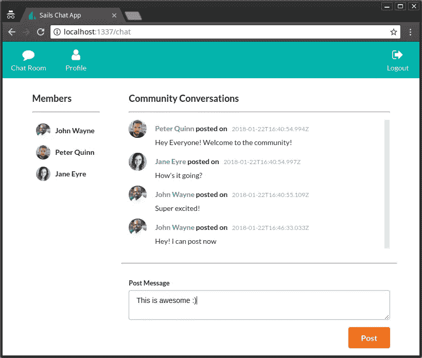

你现在应该有一个功能性的聊天系统。审查项目源代码，以防卡住。

## 基本认证

设置正确的身份验证和授权系统超出了本教程的范围。所以我们将满足于一个基本的无密码认证系统。让我们首先构建注册和登录表单。

### 登录/注册表单

创建一个新文件`views/auth-form.ejs`并粘贴以下内容:

```
<form method="post" action="/auth/authenticate" class="ui form">
<div class="field">
  <label>Full Names</label>
  <input type="text" name="name" placeholder="Full Names" value="<%= typeof name != 'undefined' ? name : '' %>">
</div>
<div class="required field">
  <label>Email</label>
  <input type="email" name="email" placeholder="Email" value="<%= typeof email != 'undefined' ? email : '' %>">
</div>
<button class="ui teal button" type="submit" name="action" value="signup">Sign Up &amp; Login</button>
<button class="ui blue button" type="submit" name="action" value="login">Login</button>
<p class="note">*Provide email only for Login</p>
</form>
<% if(typeof error != 'undefined') { %>
<div class="ui error message">
<div class="header"><%= error.title %></div>
<p><%= error.message %></p>
</div>
<% } %> 
```

接下来打开`views/homepage.ejs`，用 include 语句替换 TODO 行:

```
...
<% include partials/auth-form.ejs %>
... 
```

我们已经创建了一个表单，允许您通过输入姓名和电子邮件来创建新帐户。当您点击`Signup & Login`时，将创建一个新的用户记录，您将登录。但是，如果该电子邮件已被其他用户使用，将会显示一条错误消息。如果只是想登录，只需提供邮箱地址，点击`Login`按钮即可。认证成功后，你将被重定向到`/chat`网址。

现在，我刚才说的一切都不管用。我们需要实现这个逻辑。首先，让我们导航到`/`地址以确认`auth-form`看起来是货物。

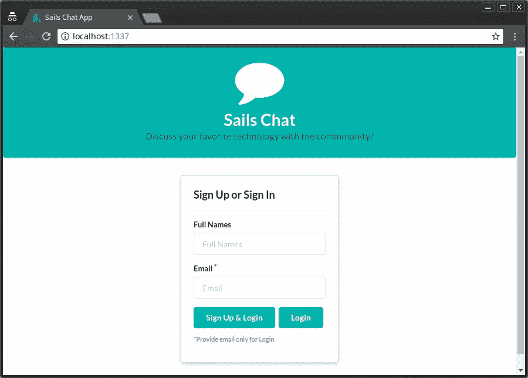

### 政策

既然我们正在建立一个认证系统，我们需要保护`/chat`和`/profile`路由不被公众访问。应该只允许经过身份验证的用户访问它们。打开`config/policies.js`并插入以下代码:

```
ChatMessageController: {
'*': 'sessionAuth'
},

UserController: {
'*': 'sessionAuth'
}, 
```

通过指定控制器的名称，我们还有效地阻止了 Blueprint API 为用户和聊天消息提供的所有路由。不幸的是，策略只适用于控制器。这意味着路线`/chat`在其当前状态下无法受到保护。我们需要为它定义一个自定义操作。打开`api/controller/ChatroomController.js`并插入以下代码:

```
...
render: (request, response) => {
    return response.view('chatroom');
}, 
```

然后用这个`config/routes.js`替换`/chat`的路由配置:

```
...
'/chat': {
     controller: 'ChatMessageController',
     action: 'render'
 },
 ... 
```

`/chat`路线现在应该受到保护，禁止公众进入。如果您重启应用程序并尝试访问`/profile`、`/chat`、`/user`或`/chatmessage`，您将会看到以下禁止信息:

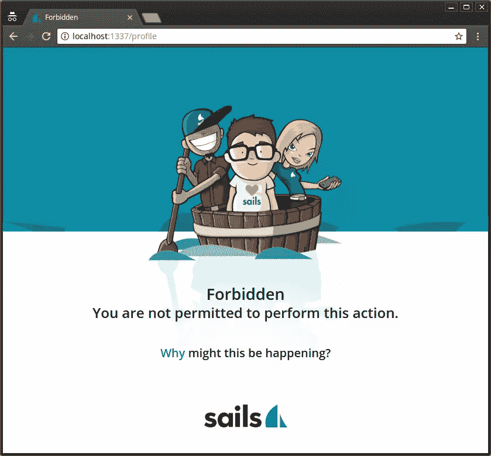

如果您想将用户重定向到登录表单，请转到`api/policies/sessionAuth`并用如下重定向调用替换禁止调用:

```
...
// return res.forbidden('You are not permitted to perform this action.');
return res.redirect('/');
... 
```

再次尝试访问被禁止的页面，你将被自动重定向到主页。现在让我们实现注册和登录代码。

### 授权控制器和服务

您需要首先停止 Sails.js 才能运行该命令:

```
sails generate controller Auth 
```

这将为我们创建一个空白的`api/controllers/AuthController`。打开它并插入以下代码:

```
authenticate: async (request, response) => {

    // Sign up user
    if(request.body.action == 'signup') {
        // Validate signup form

        // Check if email is registered

        // Create new user
    }

    // Log in user
},

logout: (request, response) => {
    // Logout user
} 
```

我在注释中解释了逻辑将如何流动。我们可以把相关的代码放在这里。然而，Sails.js 建议我们保持控制器代码简单易懂。为了实现这一点，我们需要编写助手函数来帮助我们完成上面提到的每一项任务。为了创建这些助手功能，我们需要创建一个服务。通过创建一个新文件`api/services/AuthService.js`来实现。插入以下代码:

```
/**
* AuthService.js
*
**/

const gravatar = require('gravatar')

// Where to display auth errors
const view = 'homepage';

module.exports = {

sendAuthError: (response, title, message, options) => {
  options = options || {};
  const { email, name} = options;
  response.view(view, { error: {title, message}, email, name });
  return false;
},

validateSignupForm: (request, response) => {
  if(request.body.name == '') {
    return AuthService.sendAuthError(response, 'Signup Failed!', "You must provide a name to sign up", {email:request.body.email});
  } else if(request.body.email == '') {
    return AuthService.sendAuthError(response, 'Signup Failed!', "You must provide an email address to sign up", {name:request.body.name});
  }
  return true;
},

checkDuplicateRegistration: async (request, response) => {
  try {
    let existingUser = await User.findOne({email:request.body.email});
    if(existingUser) {
      const options = {email:request.body.email, name:request.body.name};
      return AuthService.sendAuthError(response, 'Duplicate Registration!', "The email provided has already been registered", options);
    }
    return true;
  } catch (err) {
    response.serverError(err);
    return false;
  }
},

registerUser: async (data, response) => {
  try {
    const {name, email} = data;
    const avatar = gravatar.url(email, {s:200}, "https");
    let newUser = await User.create({name, email, avatar});
    // Let all sockets know a new user has been created
    User.publishCreate(newUser);
    return newUser;
  } catch (err) {
    response.serverError(err);
    return false;
  }
},

login: async (request, response) => {
  try {
        let user = await User.findOne({email:request.body.email});
        if(user) { // Login Passed
            request.session.userId = user.id;
            request.session.authenticated = true;
            return response.redirect('/chat');
        } else { // Login Failed
      return AuthService.sendAuthError(response, 'Login Failed!', "The email provided is not registered", {email:request.body.email});
    }
    } catch (err) {
        return response.serverError(err);
    }
},

logout: (request, response) => {
  request.session.userId = null;
    request.session.authenticated = false;
    response.redirect('/');
}
} 
```

仔细检查代码。作为一个中级开发人员，你应该能理解其中的逻辑。我在这里没做过什么花哨的事。然而，我想提几件事:

*   格拉瓦塔。你需要安装 Gravatar。这是一个 JavaScript 库，用于根据电子邮件地址生成 Gravatar URLs。

    ```
    ```bash
    npm install gravatar --save
    ``` 
    ```

*   `User.publishCreate(newUser)`。就像`ChatMessages`一样，我们触发一个事件，通知所有套接字一个新用户刚刚被创建。这将导致所有登录的客户端重新获取用户数据。回顾一下`views/partial/chat-users.js`看看我在说什么。
*   `request.session`。Sails.js 为我们提供了一个[会话存储库](https://sailsjs.com/documentation/concepts/sessions)，我们可以用它在页面请求之间传递数据。默认的 Sails.js 会话位于内存中，这意味着如果停止服务器，会话数据就会丢失。在`AuthService`中，我们使用 session 来存储`userId`和`authenticated`状态。

有了`AuthService.js`中的逻辑，我们可以继续用下面的代码更新`api/controllers/AuthController`:

```
module.exports = {

authenticate: async (request, response) => {
    const email  = request.body.email;

    if(request.body.action == 'signup') {
        const name = request.body.name;
        // Validate signup form
        if(!AuthService.validateSignupForm(request, response)) {
            return;
        }
        // Check if email is registered
        const duplicateFound = await AuthService.checkDuplicateRegistration(request, response);
        if(!duplicateFound) {
            return;
        }
        // Create new user
        const newUser = await AuthService.registerUser({name,email}, response);
        if(!newUser) {
            return;
        }
    }

    // Attempt to log in
    const success = await AuthService.login(request, response);
},

logout: (request, response) => {
    AuthService.logout(request, response);
}
}; 
```

看看我们的控制器有多简单和易读。接下来，让我们做一些最后的润色。

## 最后润色

既然我们已经设置了身份验证，我们应该删除我们在`api/controllers/ChatMessageController`的`postMessage`动作中放置的硬编码值。用以下代码替换电子邮件代码:

```
...
let user = await User.findOne({id:request.session.userId});
... 
```

我想提一点你可能没有注意到的事情，如果你看一下`views/partials/menu.ejs`中的注销 URL，我们已经放置了这个地址`/auth/logout`。如果你看一下`config/routes.js`，你会注意到我们还没有为它放置一个 URL。令人惊讶的是，当我们运行代码时，它工作了。这是因为 Sails.js 使用一种约定来确定解析特定地址需要哪个控制器和动作。

到目前为止，您应该已经拥有了一个功能性的 MVP 聊天应用程序。启动您的应用程序，测试以下场景:

*   无需输入任何内容即可注册
*   只需填写姓名即可注册
*   只需填写电子邮件即可注册
*   通过填写姓名和注册电子邮件进行注册，例如`johnnie86@gmail.com`或`jane@hotmail.com`
*   使用您的姓名和电子邮件注册
*   更新您的个人资料
*   尝试发布一条空白消息
*   发布一些消息
*   打开另一个浏览器，以另一个用户的身份登录，将两个浏览器并排放置，然后聊天
*   注销并创建一个新帐户。

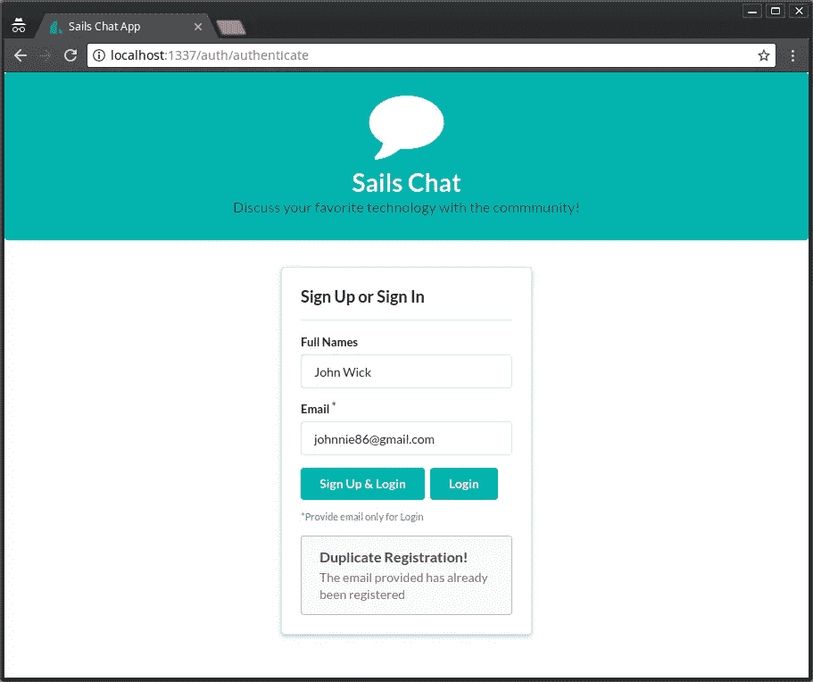

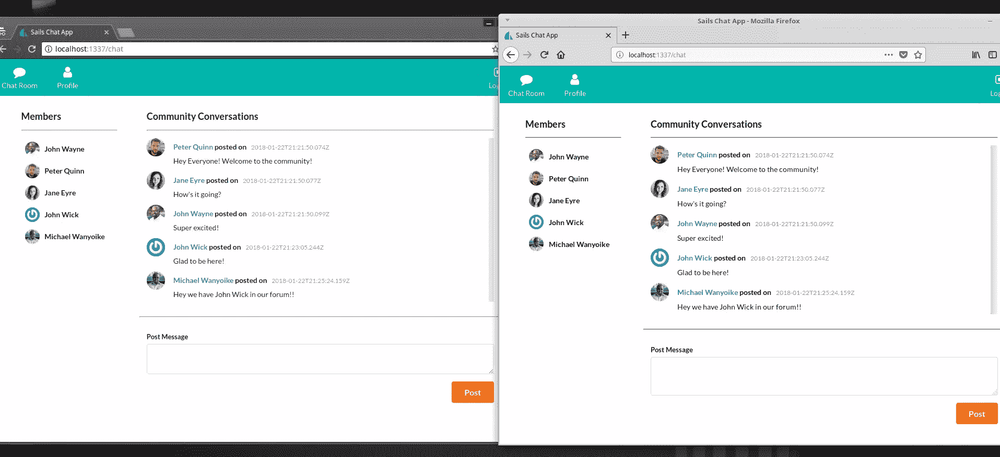

唷！我们刚刚一次性实现了许多功能，并进行了测试。再过几周，我们就可以推出一个集成了更多功能的生产就绪聊天系统，例如多个聊天室、频道附件、笑脸图标和社交账户集成！

## 摘要

在本教程中，我们没有把登录用户的名字放在顶部菜单的某个地方。你应该有能力自己解决。如果您已经阅读了整个教程，现在您应该能够熟练地使用 Sails.js 构建应用程序。

本教程的目标是向您展示，可以从非 JavaScript MVC 框架中用相对较少的代码行构建一些令人惊叹的东西。利用 Blueprint API 将帮助您更快地实现特性。我还建议你学习集成一个更强大的前端库——比如 React、Angular 或 Vue——来创建一个更具交互性的 web 应用程序。此外，学习如何为 Sails.js 编写测试以自动化测试过程是您的编程武器库中的一个重要武器。

## 分享这篇文章