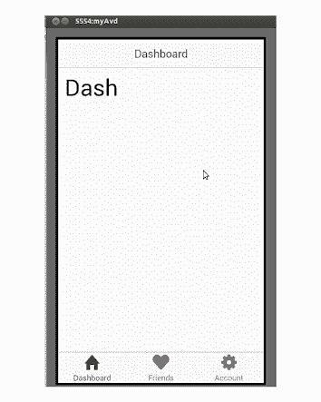
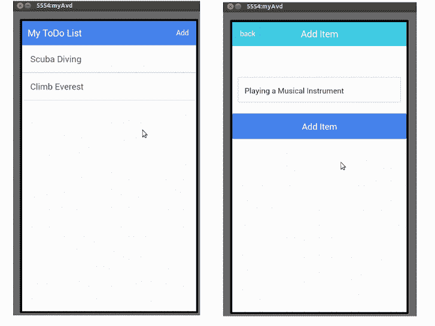

# 使用高级应用程序框架 Ionic 构建简单的应用程序

> 原文：<https://www.sitepoint.com/building-simple-app-using-ionic-advanced-html5-mobile-app-framework/>

自从混合移动技术出现以来，转向移动开发的 web 开发人员的数量急剧增加。

混合移动技术使 web 开发者能够开发在多种移动平台上运行的移动应用程序。所有这些都不需要学习本地平台语言和利用现有的技能。

混合移动技术已经发展了很多，并且存在许多不同的平台，例如 [PhoneGap](http://phonegap.com/) 和 [Titanium](http://www.appcelerator.com/titanium/) 。

一个新的混合移动开发平台是 Ionic。

Ionic 是一个先进的 HTML5 混合移动应用框架。这是一个开源的前端框架，用于使用 HTML5 创建漂亮的移动应用程序。

Ionic 应用基于 Cordova，所以 Cordova 工具可以用来构建、部署和测试应用。Ionic 专注于应用程序的外观和感觉，目前它使用 [AngularJS](https://angularjs.org/) 来构建令人敬畏的外观前端。

## 装置

要开始使用 Ionic，首先要确保你已经安装了 [Node.js](http://www.nodejs.org) 。

接下来，根据你计划开发的应用平台，安装所需的 [Android](http://cordova.apache.org/docs/en/3.3.0/guide_platforms_android_index.md.html#Android%20Platform%20Guide) 或 [IOS](http://cordova.apache.org/docs/en/3.3.0/guide_platforms_ios_index.md.html#iOS%20Platform%20Guide) 平台依赖。在本文中，我们将尝试为 Android 创建一个应用程序。

接下来，安装最新的 Cordova 和 Ionic 命令行工具，如下所示:

```
npm install -g cordova ionic 
```

安装完成后，尝试使用如下所示的选项卡模板创建一个新项目:

```
ionic start myIonicApp tabs 
```

导航到项目目录，添加 ionic 平台，构建应用程序并模拟它，如下所示:

```
cd myIonicApp
ionic platform add android
ionic build android
ionic emulate android 
```

下面是默认标签模板应用程序的样子:


## 入门指南

我们将创建一个简单的`ToDo List`应用程序。让我们使用空白模板创建一个简单的应用程序，这样我们就可以从头开始了。使用空白模板创建一个新的应用程序，如下所示:

```
ionic start myToDoList blank 
```

如果您导航到`myToDoList/www`目录，您可以看到 AngularJS 文件。这是我们添加相关代码来创建应用程序的地方。

## 创建和显示列表

首先，我们需要创建一个列表来显示待办事项列表。为此，我们将利用[离子列表](http://ionicframework.com/docs/api/directive/ionList/)指令。将`ion-list`添加到我们的`www/index.html`
中，如下所示:

```
<ion-list>
  <ion-item>Scuba Diving</ion-item>
  <ion-item>Climb Mount Everest</ion-item>
</ion-list> 
```

将上面的`ion-list`添加到`index.html`后，完整的 html 代码如下所示:

```
<!DOCTYPE html>
<html>

<head>
  <meta charset="utf-8">
  <meta name="viewport" content="initial-scale=1, maximum-scale=1, user-scalable=no, width=device-width">
  <title></title>

  <link href="lib/ionic/css/ionic.css" rel="stylesheet">
  <link href="css/style.css" rel="stylesheet">

  <!-- IF using Sass (run gulp sass first), then uncomment below and remove the CSS includes above
    <link href="css/ionic.app.css" rel="stylesheet">
    -->

  <!-- ionic/angularjs js -->
  <script src="lib/ionic/js/ionic.bundle.js"></script>

  <!-- cordova script (this will be a 404 during development) -->
  <script src="cordova.js"></script>

  <!-- your app's js -->
  <script src="js/app.js"></script>
</head>

<body ng-app="starter">

  <ion-pane>
    <ion-header-bar class="bar-stable">
      <h1 class="title">My ToDo List</h1>
    </ion-header-bar>
    <ion-content>
      <ion-list>
        <ion-item>Scuba Diving</ion-item>
        <ion-item>Climb Mount Everest</ion-item>
      </ion-list>
    </ion-content>
  </ion-pane>
</body>

</html> 
```

现在，重新构建并模拟应用程序，以查看运行中的列表。

如上面的代码所示，使用`ion-list`我们将 2 项硬编码到我们的待办事项列表中。为了使应用程序功能完整，我们应该能够动态添加和查看列表项。

在里面，`www/js/`创建一个`controllers.js`文件，并在其中定义一个名为`ToDoListCtrl`的新控制器。下面是`controllers.js`文件的样子:

```
angular.module('starter.controllers', [])
    .controller('ToDoListCtrl', function ($scope) {
}); 
```

在上面的代码中，我们定义了一个名为`starter.controller`的新模块，定义了一个名为`ToDoListCtrl`的新控制器。

接下来，我们需要将这个模块添加到我们现有的应用程序中。打开`www/js/app.js`并将该模块添加到其中。

下面是添加新的`starter.controllers`模块后`app.js`代码的样子。

```
angular.module('starter', ['ionic', 'starter.controllers'])
.run(function ($ionicPlatform) {
  $ionicPlatform.ready(function () {
    if (window.StatusBar) {
      StatusBar.styleDefault();
    }
  });
}) 
```

接下来，定义一个`$scope`来携带待办事项列表项。在内部，`ToDoListCtrl`声明了一个名为`toDoListItems`的新的`$scope`变量，如下所示:

```
.controller('ToDoListCtrl', function ($scope) {

  $scope.toDoListItems = [{
    task: 'Scuba Diving',
    status: 'not done'
  }, {
    task: 'Climb Everest',
    status: 'not done'
  }]
}); 
```

在`app.js`之后的`index.html`中包含`controllers.js`。

我们需要将上述控制器逻辑附加到`index.html`中的`ion-list`中。修改`ion-list`如下图所示:

```
<ion-list ng-controller="ToDoListCtrl">
  <ion-item ng-repeat="item in toDoListItems">
    {{item.task}}
  </ion-item>
</ion-list> 
```

正如您在上面的代码中看到的，我们使用了`ng-controller`指令将控制器附加到 ion-list。我们已经使用了`ng-repeat`指令来迭代`$scope`变量中定义的`toDoListItems`，并显示在列表中。

现在，重新构建应用程序并进行仿真，您应该会看到列表在运行。

## 向列表添加项目

接下来，我们需要实现一种向现有列表添加条目的方法。为此，我们将使用[ionic model](http://ionicframework.com/docs/api/service/%24ionicModal/)，它将在点击列表页面上的按钮后向上滑动。

首先在列表页面的顶部添加一个新按钮，向列表中添加新的项目。

接下来，让我们利用[离子键头条](http://ionicframework.com/docs/api/directive/ionHeaderBar/)让我们的头看起来更加丰富多彩。修改代码，如下所示:

```
<ion-header-bar align-title="left" class="bar-positive">

  <h1 class="title">My ToDo List</h1>

  <div class="buttons">
    <button class="button" ng-click="openModal()">Add</button>
  </div>
</ion-header-bar> 
```

正如你在上面的代码中看到的，我们添加了带有类`bar-positive`的`ion-header-bar`，这就是赋予它颜色的原因。你可以有许多不同类型的标题，参考[这里](http://ionicframework.com/docs/components/#header)的详细文件。

我们还在标题右侧添加了一个名为`Add`的新按钮，该按钮调用一个函数来打开一个模态窗口(我们稍后将对其进行定义)。

添加模态弹出到`index.html`中，如下所示:

```
<script id="modal.html" type="text/ng-template">
<div class="modal">

  <div class="bar bar-header bar-calm">
    <button class="button" ng-click="closeModal()">back</button>
    <h1 class="title">Add Item</h1>
  </div>
  <br></br>
  <br></br>
  <form ng-submit="AddItem(data)">
    <div class="list">
      <div class="list list-inset">
        <label class="item item-input">
          <input type="text" placeholder="ToDo Item" ng-model="data.newItem">
        </label>
      </div>
      <button class="button button-block button-positive" type="submit">
        Add Item
      </button>
    </div>
  </form>

</div>
</script> 
```

按照上面的代码，我们在模型中有一个标题，一个输入框和添加按钮，用于向待办事项列表添加新项目。

我们在标题中有一个 back 按钮，我们附加了一个`closeModal()`函数来使用`ng-click`关闭模态。我们使用`ng-submit`将一个名为`AddItem`的函数附加到一个表单上，在表单提交时将项目添加到现有列表中。

现在，我们需要将离子模型绑定到我们的控制器。我们将`$ionicModal`注入控制器，并定义所需的功能，如下所示:

```
angular.module('starter.controllers', [])

.controller('ToDoListCtrl', function ($scope, $ionicModal) {

// array list which will contain the items added
$scope.toDoListItems = [];

//init the modal
$ionicModal.fromTemplateUrl('modal.html', {
  scope: $scope,
  animation: 'slide-in-up'
}).then(function (modal) {
  $scope.modal = modal;
});

// function to open the modal
$scope.openModal = function () {
  $scope.modal.show();
};

// function to close the modal
$scope.closeModal = function () {
  $scope.modal.hide();
};

//Cleanup the modal when we're done with it!
$scope.$on('$destroy', function () {
  $scope.modal.remove();
});

//function to add items to the existing list
$scope.AddItem = function (data) {
  $scope.toDoListItems.push({
    task: data.newItem,
    status: 'not done'
  });
  data.newItem = '';
  $scope.closeModal();
};

}); 
```

如上面的代码所示，我们使用了`.fromTemlateUrl`来加载 html 内容，并在初始化过程中定义了两个选项来定义`$scope`和内容加载时使用的动画类型。

我们还定义了打开、关闭模式的函数和向现有数组添加项目的函数。

## 演示屏幕

我们的实现现在已经完成，我们准备运行和模拟我们的应用程序。保存所有文件，重建和模拟应用程序。我们的待办事项应用程序的两个屏幕应该是这样的:



enter image description here

## 结论

在本文中，我们看到了如何开始使用 Ionic——一种用于混合应用程序开发的高级 HTML5 框架。我们使用了一些像`ionicModal`和`ion-list`这样的 Ionic 工具来开发一个简单和基本的待办事项应用程序。

该应用程序可以扩展许多功能，详情请参见[这里的](http://ionicframework.com/docs/)。我建议参考 [AngularJS 文档](https://docs.angularjs.org/guide)，以便更好地了解 AngularJS。同时，上述文章中的代码可以在 [GitHub](https://github.com/jay3dec/IonicSampleApp) 上获得。

## 分享这篇文章