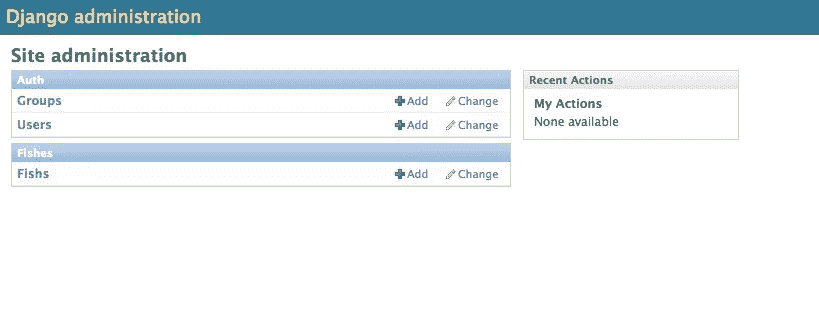
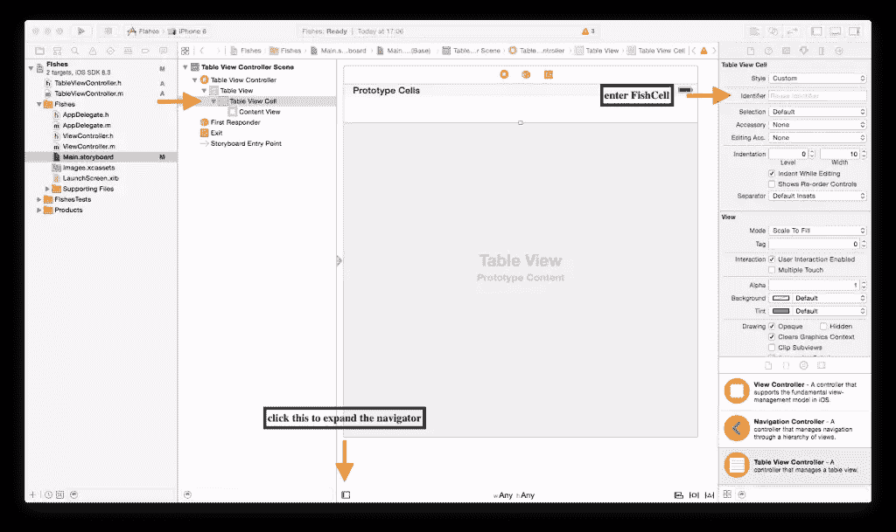
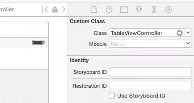

# 为移动应用程序构建简单的 REST API

> 原文：<https://www.sitepoint.com/building-simple-rest-api-mobile-applications/>

了解如何使用 Python 为移动设备创建一个简单的 REST API 来向 iOS 应用程序提供数据。

今天我们将构建一个简单的 iOS 应用程序和 API 来获取和显示鱼的名字。您可以使用任何与网站创建相关的语言(如 PHP、Python 或 Ruby)编写一个 REST API(T1 ),并使用您的 iOS 应用程序来使用端点。可以把它们想象成提供数据的 URL(GET request)或者可以向其提交数据的 URL(POST request)。如果您想进一步为您的应用程序设计这些端点，请遵循我们的[构建 RESTful APIs 的 13 个最佳实践](https://www.sitepoint.com/build-restful-apis-best-practices/)，否则就让我们开始吧！

## 使用 djangorestframework 构建一个简单的 REST api

我们将使用 Django (Python MVC 框架)和 *djangorestframework* 。Djangorestframework 是使用 django (python)构建的，专门用于通过 REST 框架公开数据。

首先，您需要安装 Python v2.7 或更高版本以及 Django 1.7.4 或更高版本。如果没有，现在就安装 [Python](http://www.python.org/download/) 和 [Django](https://www.djangoproject.com/download/) 。

您可以通过启动命令行并键入`python`命令来测试您的安装。如果一切正常，您应该会看到版本信息。键入以下内容继续:

```
>>> import django
>>> print(django.get_version())
1.7.4
```

这证明您已经在系统上安装了 Django。接下来，我们构建 Django 项目:

```
$ django-admin.py startproject marine
```

这是创建的文件和文件夹的列表。

```
marine/
manage.py
marine/
__init__.py
settings.py
urls.py
wsgi.py
```

您可以通过执行以下命令来检查是否一切正常:

```
$ python manage.py runserver
```

这将启动 Django 开发 web 服务器进行测试。成功后，您将看到:

```
Performing system checks...

0 errors found
February 15, 2015 - 15:50:53
Django version 1.7.4, using settings 'mysite.settings'
Starting development server at http://127.0.0.1:8000/
Quit the server with CONTROL-C.
```

如果你打开网址 [http://127.0.0.1:8000/](http://127.0.0.1:8000/) 你会看到一个占位符网站。

现在我们有了一个网站的框架。接下来，我们将构建一个应用程序(一个容器)，其中包含一个模型(如模型-视图-控制器)。模型是应用程序的数据源。

打字:

```
$ python manage.py startapp fishes
```

将产生以下文件

```
fishes/
__init__.py
admin.py
migrations/
__init__.py
models.py
tests.py
views.py
```

在`models.py`文件中，有一个导入行`from django.db import models`。向其中添加以下代码。

```
class Fish(models.Model):
name = models.CharField(max_length=255)
created = models.DateTimeField('auto_now_add=True')
active = models.BooleanField()
```

这将创建一个类，该类公开鱼的名称、创建日期以及数据行是否活动。您可以通过参考相关文档来更改字段类型。

现在将 fishes 应用程序添加到`marine/settings.py`文件中进行注册。在`INSTALLED_APPS`下面添加`fishes`到列表中。运行`python manage.py sql fishes`查看数据库模式 SQL 的预览，该模式将在我们激活应用程序时运行。

```
BEGIN;
CREATE TABLE "fishes_fish" (
"id" integer NOT NULL PRIMARY KEY,
"name" varchar(255) NOT NULL,
"created" datetime NOT NULL,
"active" bool NOT NULL
)
;

COMMIT;
```

要确认在默认的 sqlite 数据库中创建相关的表，在较旧的 Django 版本中键入`python manage.py migrate`或`python manage.py syncdb`。Django 将默认创建认证表，并在 sqlite3 数据库中创建空的`fishes_fish`表。由于这是您第一次运行 Django，提示将询问您是否想要创建一个超级用户。

如果由于某种原因，没有提示您创建超级用户，请在命令提示符下键入:

```
$ python manage.py createsuperuser
```

按照说明创建管理员帐户。Django 提供了一个内置的管理页面，允许您插入和修改数据。该功能需要通过编辑`fishes`文件夹中的`admin.py`文件来激活。在`from django.contrib import admin`后添加以下代码

```
...
from fishes.models import Fish
admin.site.register(Fish)
```

我们将使用我们创建的帐户登录管理页面。启动开发服务器:

```
$ python manage.py runserver
```

打开 *127.0.0.1:8000/admin* ，输入超级用户 id 和密码。您应该会看到一个带有`Marine`列表的管理页面。点击`Fishes`添加或修改数据。补充一些数据。



到目前为止，我们已经建立了一个工作正常但简单的 Django 网站。我们现在将通过[下载并安装](http://www.django-rest-framework.org/#installation)来将`djangorestframework`整合到网站中。需要记住的一件关键事情是将`rest_framework`添加到`marine/settings.py`中的`INSTALLED_APPS`列表中，并将`urls.py`改为

```
from django.contrib import admin
from rest_framework import routers
from fishes import views

router = routers.DefaultRouter()
#makes sure that the API endpoints work
router.register(r'api/fishes', views.FishViewSet)
admin.autodiscover()

urlpatterns = patterns('',
# Examples:
# url(r'^$', 'marine.views.home', name='home'),
# url(r'^blog/', include('blog.urls')),

url(r'^admin/', include(admin.site.urls)),
url(r'^', include(router.urls)),
url(r'^api-auth/', include('rest_framework.urls', namespace='rest_framework'))
)
```

这段代码打开了对“djangorestframework”至关重要的 API 路由，并使用正则表达式来设置网站的有效 URL。

当我们安装`djangorestframework`时，它给了我们使用序列化器的能力，序列化器将从 fish 模型获得的数据展平成一种字符串格式，可以是 XML 或 JSON。为了创建鱼类模型的序列化程序，我们在`fishes`文件夹下创建了一个文件，并将其命名为`serializers.py`。以下是该文件的内容:

```
from fishes.models import Fish
from rest_framework import serializers

class FishSerializer(serializers.HyperlinkedModelSerializer):
class Meta:
model = Fish
fields = ('name', 'active', 'created')
```

在`views.py`文件中，添加:

```
from rest_framework import viewsets
from rest_framework import permissions
from fishes.models import Fish
from fishes.serializers import FishSerializer

# Create your views here.
class FishViewSet(viewsets.ModelViewSet):
# this fetches all the rows of data in the Fish table
queryset = Fish.objects.all()
serializer_class = FishSerializer
```

现在如果你打开*[http://127 . 0 . 0 . 1:8000/api/fishes/](http://127.0.0.1:8000/api/fishes/)*你会看到可浏览的 API。

```
HTTP 200 OK
Content-Type: application/json
Vary: Accept
Allow: GET, POST, HEAD, OPTIONS

[
{
"name": "Dory",
"created": "2014-06-21T04:23:01.639Z",
},
{
"name": "Angel",
"created": "2014-07-21T04:23:01.639Z",
},
{
"name": "Clown",
"created": "2014-08-21T04:23:01.639Z",
}
]
```

你可以在 GitHub 上找到 [REST API 应用的源代码。没有数据，所以你需要在下载后在旧的 Django 版本上运行`python manage.py migrate`或`python manage.py syncdb`。](https://github.com/sitepoint-editors/simple-api-mobile "REST API")

## iOS 移动应用程序

接下来，我们将介绍创建从 API 接收数据的移动应用程序所需的关键步骤。我们使用`UITableView`在列表中显示我们的数据。在 XCode 6.3.1(撰写本文时的最新版本)中，创建一个新项目

*文件>新>项目> iOS 应用>单视图应用*

*   **产品名称**:鱼
*   **语言**:目标-C
*   **设备** : iPhone(默认为通用，包括 iPhone 和 iPad)
*   暂时不用核心数据。

选择保存项目的位置，然后单击*创建*。我们将处理包含在*鱼*文件夹中的文件。

默认情况下，项目有一个视图控制器。我们希望将来自 REST API 的数据显示为一个列表，所以将使用一个`Table View Controller`来代替。创建一组新的 Objective-C 文件(*文件>新建>文件> iOS 源>可可触摸类*)。

*   **级** : `TableViewController`
*   的**子类:`UITableViewController`**
*   我们不需要 XIB 的档案

将这些新文件保存在*fishs*文件夹中。

打开 *Main.storyboard* ，进入[对象库](https://developer.apple.com/library/ios/recipes/xcode_help-IB_objects_media/Chapters/AddingObject.html "Object library")，拖动`Table View Controller`对象到 storyboard。选择并删除默认的`View Controller`。确保在[检查器](https://developer.apple.com/library/mac/recipes/xcode_help-general/Chapters/AbouttheUtilityArea.html "Attributes Inspector")中，选中所选`Table View Controller`的*是初始视图控制器*复选框。



–在 *Main.storyboard* 中，展开`Table View Controller`露出`Table View Cell`，选择*属性检查器*，输入`FishCell`作为*标识*。这将界面构建器故事板中的单元链接到代码。
–将`Style`从*基本*更改为*副标题*。这允许我们显示由`cell.detailTextLabel`设定的值。
–选择`Table View Controller Scene`下的`Table View Controller`，点击身份检查器，进入`TableViewController`进入*自定义类>类*。这将整个场景链接到 *TableViewController.m* 文件。



接下来，我们添加代码，让这个应用程序做一些事情。该代码演示了使用一个简单的`NSArray`来显示在 *TableViewController.m* 中硬编码的数据。用下面的函数替换任何现有的函数。

```
- (NSInteger)numberOfSectionsInTableView:(UITableView *)tableView {
#warning Potentially incomplete method implementation.
// Return the number of sections.
return 1;
}
- (NSInteger)tableView:(UITableView *)tableView numberOfRowsInSection:(NSInteger)section {
#warning Incomplete method implementation.
// Return the number of rows in the section. I currently have three rows we would like to show
return 3;
}

- (UITableViewCell *)tableView:(UITableView *)tableView cellForRowAtIndexPath:(NSIndexPath *)indexPath {
UITableViewCell *cell = [tableView dequeueReusableCellWithIdentifier:@"FishCell" forIndexPath:indexPath];
//temporary data to demonstrate the structure of a NSDictionary in an NSArray, which is the general structure of a JSON, this can be removed in a later stage
NSArray *fishes = @[
@{@"name": @"Dory", @"created": @"2014-06-21T04:23:01.639Z"},
@{@"name": @"Angel", @"created": @"2014-07-21T04:23:01.639Z"},
@{@"name": @"Clown", @"created": @"2014-08-21T04:23:01.639Z"}
];
if (cell == nil) {
cell = [[UITableViewCell alloc] initWithStyle:UITableViewCellStyleDefault reuseIdentifier:@"FishCell"];
}
//We will replace fishes with fishJson once we have code that downloads from the REST api
[cell.textLabel setText:[[fishes objectAtIndex:indexPath.row] objectForKey:@"name"] ];
[cell.detailTextLabel setText:[[fishes objectAtIndex:indexPath.row] objectForKey:@"created"]];
return cell;
}
```

现在，我们可以测试这个简单的应用程序。选择*产品>运行*。

接下来，我们需要从使用`djangorestframework`发布的 REST api 中获取 JSON。我们通过在`@interface`级别注册并与`@property`和`@synthesize`合成，建立了一个名为`fishJson`的`NSArray`对象。这取代了 setters 和 getters 的代码。然后我们替换掉`numberOfRowsInSection`中的代码，用包含来自 REST API 的 JSON 的`fishJson`替换`fishes`。再次替换任何现有的函数或声明。

```
@interface TableViewController ()
@property (strong) NSArray *fishJson;
@end

@implementation TableViewController
@synthesize fishJson;
- (void) downloadData {
//I use NSMutableString so we could append or replace parts of the URI with query parameters in the future
NSMutableString *remoteUrl = [NSMutableString stringWithFormat:@"http://127.0.0.1:8000/api/fishes/?format=%@", @"json"];
NSURLRequest *request = [NSURLRequest requestWithURL:[NSURL URLWithString:remoteUrl] ];
NSError *jsonError = nil;
NSHTTPURLResponse *jsonResponse = nil;

NSData *response;
do {
response = [NSURLConnection sendSynchronousRequest:request returningResponse:&jsonResponse error:&jsonError];
} while ([jsonError domain] == NSURLErrorDomain);

if([jsonResponse statusCode] != 200) {
NSLog(@"%ld", (long)[jsonResponse statusCode]);
} else {
NSLog(@"%@", @"200 OK");
}
NSError* error;
if(response) {
//fishJson was defined earlier near the top as a NSArray object
fishJson = [NSJSONSerialization
JSONObjectWithData:response
options:kNilOptions
error:&error];
}
}
```

我们需要确保该方法在应用程序启动时运行，在下面添加以下内容`viewDidLoad`:

```
[self downloadData];
```

这里我们更新了`numberOfRowsInSection`方法。这段代码确保行数与包含在`fishJson`数组中的元素数相匹配。

```
- (NSInteger)tableView:(UITableView *)tableView numberOfRowsInSection:(NSInteger)section {
#warning Incomplete method implementation.
// Return the number of rows in the section.
return [fishJson count];
}
```

更新`cellForRowAtIndexPath`方法，以便它从我们的 REST 提要中加载条目:

```
- (UITableViewCell *)tableView:(UITableView *)tableView cellForRowAtIndexPath:(NSIndexPath *)indexPath {
UITableViewCell *cell = [tableView dequeueReusableCellWithIdentifier:@"FishCell" forIndexPath:indexPath];

// Configure the cell...
if (cell == nil) {
cell = [[UITableViewCell alloc] initWithStyle:UITableViewCellStyleDefault reuseIdentifier:@"FishCell"];
}
[cell.textLabel setText:[[fishJson objectAtIndex:indexPath.row] objectForKey:@"name"] ];
[cell.detailTextLabel setText:[[fishJson objectAtIndex:indexPath.row] objectForKey:@"created"]];
return cell;
}
```

现在我们有了一个简单的移动应用程序来显示从在线或本地 REST API 获得的数据。您可以在上面的同一个存储库中找到 iOS 应用程序的代码。本教程包含了许多概念和组件，这是典型的“现实世界”的应用程序。如果你遇到了任何问题，或者有任何问题或意见，请在下面的评论中告诉我。

## 分享这篇文章