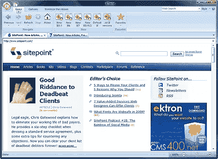
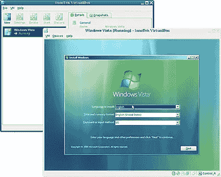

# 如何构建最好的浏览器测试套件

> 原文：<https://www.sitepoint.com/building-the-best-browser-test-suite/>

测试一个网站过去要容易得多。你会在 Internet Explorer 中开发和测试你的代码，除了主要的 HTML、CSS 或 JavaScript 错误之外，对任何事情都全然不知。即使是最尽责的开发人员也只会测试几个其他少数民族的浏览器。

今天，我们面临着 5 种主流浏览器，更复杂的是，每一种都有多个版本。使用统计因网站而异，但以下浏览器应该能满足 99%的用户需求:

*   微软 IE6 和 IE7 (IE8 即将推出)
*   Mozilla Firefox 2 和 3 (Firefox 3.5 即将推出)
*   苹果 Safari 3 ( [Safari 4 即将推出](https://www.sitepoint.com/safari-4-first-look/)
*   谷歌浏览器 1
*   歌剧 9

需要接近 100%的用户覆盖率？再加上 IE5、IE5.5、Netscape 6、Mozilla 1.7、mobile Opera mini、PlayStation 3、PSP、几个历史版本的 Mac Safari 和几个屏幕阅读器。这是一个令人生畏的列表:测试您的 web 应用程序可能比构建它需要更长的时间！

幸运的是，在一台 PC 上安装多个版本的 Firefox、Safari 和 Opera 很容易:只需选择不同的安装文件夹。对 Chrome 来说还为时尚早，但我怀疑谷歌会发布自动更新，这样大多数用户都会有最新版本。

一如既往，最难的是 Internet Explorer。该浏览器与 Windows 紧密集成，因此只能安装一个版本。Vista 用户不能降级，必须使用 IE7 或 IE8。然而，有很多方法可以在一台 PC 上测试多个浏览器。

## 在线浏览器模拟器

有几个在线系统可以用来展示你的网站是如何跨操作系统和浏览器的各种组合工作的:

*   [浏览器主机](http://browsershots.org/)
*   [跨浏览器测试](http://www.crossbrowsertesting.com/)
*   [石蕊](http://litmusapp.com/)
*   [浏览器摄像头](http://www.browsercam.com/)
*   [IE 网络呈现器](http://ipinfo.info/netrenderer/)(仅 IE 浏览器)
*   [浏览器阵营](http://www.browsrcamp.com/)(仅限 Mac 浏览器)

没有什么需要安装，但是，你的网站必须是活的，测试是一个缓慢的过程，更好的服务是收费的。你只看到一个截图，所以调试是棘手的，你肯定不会发现 JavaScript 错误或其他微妙的问题。

这些系统无疑是有用的，但是最好在测试过程的最后使用它们。

## 安装多个版本的 Internet Explorer

一台电脑上可以安装多个版本的 IE。IE6 的独立版本(以及任何回到 3.0 的版本)可以从[evolt.org 浏览器档案](http://browsers.evolt.org/?ie/32bit/standalone)下载。XP 用户可以简单地提取文件，并创建一个快捷方式到 iexpore.exe。不幸的是，他们不能在 Vista 中工作。

另一个选择是 [Xenocode 浏览器沙箱](http://www.xenocode.com/browsers/)，它提供 IE6、IE7、IE8、Firefox 2、Firefox 3、Chrome、Opera 和 Safari。这些是单个的。exe 文件，这些文件使用虚拟化技术来确保浏览器在自己的隔离环境中运行，而不会影响您的核心系统。

最后，还有来自 [DebugBar](http://www.debugbar.com/) 的 [IETester](http://www.my-debugbar.com/wiki/IETester/HomePage) 。这当然是最容易安装和使用的应用程序。它提供了从 5.5 到 8.0 beta 的所有 IE 版本的选项卡式浏览。

虽然这些工具是有用的，但你应该知道你不是在运行 IE 的“真正”安装。这些问题包括:

*   有一些界面怪癖和功能，如浏览器历史，cookies 和缓存可能不会像你预期的那样工作。
*   在 IE5.5/6.0 中，滤镜和过渡失败，因此 24 位 png 和透明效果不会出现。有一个针对 XP 独立浏览器的[解决方案，但是 Xenocode 和 IETester 似乎都没有实现解决方案。](http://www.optimalworks.net/blog/2008/web-development/ie-png-filter-problems)
*   旧的浏览器可能会使用最新的 IE7 JavaScript 引擎。
*   条件 CSS 注释会失败或者变得混乱——这是[避免它们的另一个好理由](https://www.sitepoint.com/5-reasons-to-avoid-css-hacks-and-conditional-stylesheets/)！

## 使用虚拟机

运行旧版本 IE 最可靠的方法是使用安装了全新 Windows 的专用电脑。然而，没有必要让你的办公室堆满笨重的旧台式机:你可以使用虚拟机软件在一台机器上模拟任意数量的 PC。流行的虚拟机软件包括:

*   [**VMware**](http://www.vmware.com/) :数一数二最好的。令人困惑的是，VMware Server 是免费的，而 VMware Workstation 是提供快照和克隆的更高级的商业产品。
*   [**VirtualBox**](http://www.virtualbox.org/):Sun Microsystems 旗下的优秀开源产品。它感觉像 VMware 一样快，尽管缺少一些次要功能，如主机和来宾操作系统之间的文件拖放。
*   微软虚拟个人电脑 :一个可靠的免费虚拟机，尽管它不如竞争对手那样快或功能齐全。

安装软件后，创建一台新的 PC，然后在虚拟光驱中使用 Window 安装盘或 ISO 启动。从 98 到 XP 的任何版本的 Windows 都应该足以安装旧版本的 IE。

使用虚拟机还有其他几个优势:

*   虚拟磁盘可以复制和备份。您可以删除操作系统，并在几秒钟内恢复到以前的映像。
*   你可以安装旧的浏览器或试用新的软件，而不会污染你的主电脑。
*   您可以安装其他操作系统，如 Linux，并测试一系列其他浏览器(Lynx 非常适合评估可访问性)。

构建你的浏览器套件需要时间，而且没有一个解决方案是完美的。然而，新发布的[微软 SuperPreview 可能是许多浏览器测试问题的答案……](https://www.sitepoint.com/microsoft-superpreview-website-tester/)

我错过了你测试多个浏览器的首选方法了吗？

## 分享这篇文章