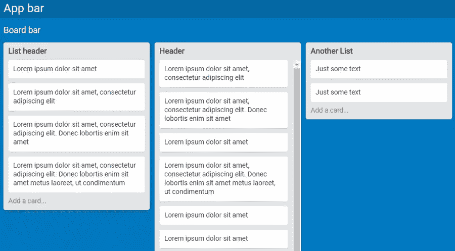
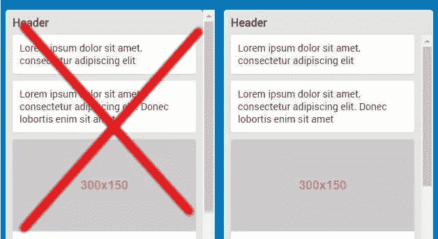

# 用 CSS 网格和 Flexbox 构建 Trello 布局

> 原文：<https://www.sitepoint.com/building-trello-layout-css-grid-flexbox/>

在本教程中，我将带你完成一个 [Trello](https://trello.com/) 棋盘屏幕的基本布局的实现([见这里的例子](https://trello.com/b/nC8QJJoZ/trello-development-roadmap))。这是一个响应式的、仅支持 CSS 的解决方案，只开发布局的结构特性。

作为预览，[这里有一个最终结果的 CodePen 演示](https://codepen.io/SitePoint/pen/brmXRX?editors=0100)。



除了[网格布局](https://www.sitepoint.com/introduction-css-grid-layout-module/)和 [Flexbox](https://www.sitepoint.com/flexbox-css-flexible-box-layout/) 之外，该方案还采用了[计算](https://www.sitepoint.com/css3-calc-function/)和[视口单元](https://www.sitepoint.com/css-viewport-units-quick-start/)。为了使代码更具可读性和效率，我还将利用 [Sass 变量](http://sass-lang.com/documentation/file.SASS_REFERENCE.html#variables_)。

没有提供回退，所以确保在支持的浏览器中运行代码。事不宜迟，让我们开始一个接一个地开发屏幕组件。

## 屏幕布局

Trello 板的屏幕由应用程序栏、板栏和包含卡片列表的部分组成。我将用下面的标记框架构建这个结构:

```
<div class="ui">
  <nav class="navbar app">...</nav>
  <nav class="navbar board">...</nav>
  <div class="lists">
    <div class="list">
      <header>...</header>
      <ul>
        <li>...</li>
        ...
        <li>...</li>
      </ul>
      <footer>...</footer>
    </div>
  </div>
</div>
```

这种布局将通过 CSS 网格来实现。具体来说就是一个 3×1 的网格(也就是一列三行)。第一行是 app 栏，第二行是 board 栏，第三行是`.lists`元素。

前两行各有一个固定的高度，而第三行将跨越剩余的可用视口高度:

```
.ui {
 height: 100vh;
 display: grid;
 grid-template-rows: $appbar-height $navbar-height 1fr;
}
```

视口单位确保`.ui`容器总是和浏览器的视口一样高。

将网格格式上下文分配给容器，并定义上面指定的网格行和列。更准确地说，只定义了行，因为不需要声明唯一列。调整行的大小是通过两个 Sass 变量来实现的，这两个变量分别代表条形和`fr`单元的高度，以使`.lists`元素的高度跨越剩余的可用视口高度。

## 卡片列表部分

如前所述，屏幕网格的第三行是卡片列表的容器。下面是其标记的概要:

```
<div class="lists">
  <div class="list">
    ...
  </div>
  ...
  <div class="list">
    ...
  </div>
</div>
```

我使用一个全视区宽度的 Flexbox 单行容器来格式化列表:

```
.lists {
 display: flex;
 overflow-x: auto;
  > * {
 flex: 0 0 auto; // 'rigid' lists
 margin-left: $gap;
  }
 &::after {
 content: '';
 flex: 0 0 $gap;
  }
}
```

将 auto 值赋给`overflow-x`属性告诉浏览器，当列表不适合视窗提供的宽度时，在屏幕底部显示水平滚动条。

在 flex 项目上使用了`flex`速记属性，使列表*变得刚性*。`flex-basis`(速记中使用的)的 auto 值指示布局引擎从`.list`元素的 width 属性中读取大小，而`flex-grow`和`flex-shrink`的零值防止该宽度的改变。

接下来，我需要在列表之间添加一个水平分隔符。如果设置了列表的右边距，则不会呈现水平溢出的纸板中最后一个列表之后的边距。为了解决这个问题，列表由左边距分隔，最后一个列表和右视口边缘之间的空间通过向每个`.lists`元素添加一个`::after`伪元素来处理。默认的`flex-shrink: 1`必须被覆盖，否则伪元素会“吸收”所有的空格，然后消失。

请注意，在 Firefox < 54 上，需要在`.lists`上显式显示`width: 100%`，以确保正确的布局渲染。

## 卡片列表

每个卡片列表都由一个标题栏、一系列卡片和一个页脚栏组成。以下 HTML 片段捕获了这种结构:

```
<div class="list">
  <header>List header</header>
  <ul>
    <li>...</li>
    ...
    <li>...</li>
  </ul>
  <footer>Add a card...</footer>
</div>
```

这里的关键任务是如何管理列表的高度。页眉和页脚具有固定的高度(不一定相等)。然后是数量可变的卡片，每张卡片都有不同的内容。因此，随着卡片的添加或删除，列表会垂直地增减。

但是高度不能无限增长，它需要有一个上限，这个上限取决于`.lists`元素的高度。一旦达到这个限制，我希望出现一个垂直滚动条，允许访问溢出列表的卡片。

这听起来像是`max-height`和`overflow`属性的工作。但是如果这些属性被应用到根容器`.list`，那么，一旦列表达到它的最大高度，所有`.list`元素的滚动条都会出现，包括页眉和页脚。下图显示了左侧的错误侧边栏和右侧的正确侧边栏:



因此，让我们将`max-height`约束应用于内部`<ul>`。应该使用哪个值？列表父容器的高度必须减去页眉和页脚的高度(`.lists`):

```
ul {
 max-height: calc(100% - #{$list-header-height} - #{$list-footer-height});
}
```

但是有一个问题。百分比值不是指`.lists`，而是指`<ul>`元素的父元素`.list`，并且该元素没有确定的高度，因此无法解析该百分比。这可以通过使`.list`和`.lists`一样高来解决:

```
.list {
  height: 100%;
}
```

这样，由于`.list`总是和`.lists`一样高，不管它的内容是什么，它的`background-color`属性都不能用于列表背景色，但是可以使用它的子元素(页眉、页脚、卡片)来达到这个目的。

需要对列表的高度进行最后一次调整，以在列表底部和视窗底部边缘之间留出一点空间(`$gap`):

```
.list {
 height: calc(100% - #{$gap} - #{$scrollbar-thickness});
}
```

进一步减去`$scrollbar-thickness`的量，以防止列表接触到`.list`元素的水平滚动条。事实上，在 Chrome 上，这个滚动条“生长”在`.lists`框内。也就是说，100%值是指`.lists`的高度，包括滚动条。

在 Firefox 上，滚动条被“附加”在。`lists`身高，亦即 100%指身高。`lists`不包括滚动条。所以这个减法是不必要的。因此，当滚动条可见时，在 Firefox 上，已经达到最大高度的列表的底部边框和滚动条顶部之间的可视空间会稍微大一些。

以下是该组件的相关 CSS 规则:

```
.list {
 width: $list-width;
 height: calc(100% - #{$gap} - #{$scrollbar-thickness});

  > * {
 background-color: $list-bg-color;
 color: #333;
 padding: 0 $gap;
  }

  header {
 line-height: $list-header-height;
 font-size: 16px;
 font-weight: bold;
 border-top-left-radius: $list-border-radius;
 border-top-right-radius: $list-border-radius;
  }

  footer {
 line-height: $list-footer-height;
 border-bottom-left-radius: $list-border-radius;
 border-bottom-right-radius: $list-border-radius;
 color: #888;
  }

  ul {
 list-style: none;
 margin: 0;
 max-height: calc(100% - #{$list-header-height} - #{$list-footer-height});
 overflow-y: auto;
  }
}
```

如上所述，列表背景颜色是通过将`$list-bg-color`值赋给每个`.list`元素的子元素的`background-color`属性来呈现的。`overflow-y`仅在需要时显示卡片滚动条。最后，一些简单的样式被添加到页眉和页脚。

## 收尾

单张卡片的 HTML 只包含一个列表项:

```
<li>Lorem ipsum dolor sit amet, consectetur adipiscing elit</li>
```

或者，如果卡片有封面图像:

```
<li>
  
  Lorem ipsum dolor sit amet
</li>
```

这是相关的 CSS:

```
li {
 background-color: #fff;
 padding: $gap;

 &:not(:last-child) {
 margin-bottom: $gap;
  }

 border-radius: $card-border-radius;
 box-shadow: 0 1px 1px rgba(0,0,0, 0.1);

  img {
 display: block;
 width: calc(100% + 2 * #{$gap});
 margin: -$gap 0 $gap (-$gap);
 border-top-left-radius: $card-border-radius;
 border-top-right-radius: $card-border-radius;
  }
}
```

在设置了背景、填充和下边距之后，封面图像布局就准备好了。图像宽度必须从左填充边缘到右填充边缘跨越整张卡片:

```
width: calc(100% + 2 * #{$gap});
```

然后，分配负边距以水平和垂直对齐图像:

```
margin: -$gap 0 $gap (-$gap);
```

第三个正边距值负责封面图像和卡片文本之间的间距。

最后，我向占据屏幕布局第一行的两个栏添加了一个 flex 格式上下文。但它们只是草图。通过对演示进行扩展[，您可以随意构建自己的实现。](https://codepen.io/SitePoint/pen/brmXRX?editors=0100)

## 结论

这只是完成这种设计的一种可能的方法，看看其他方法会很有趣。此外，这将是很好的完成布局，例如完成两个屏幕酒吧。

另一个潜在的增强是实现卡片列表的自定义滚动条。

因此，请随意[分叉演示](https://codepen.io/SitePoint/pen/brmXRX?editors=0100)并在下面的讨论中发布链接。

## 分享这篇文章