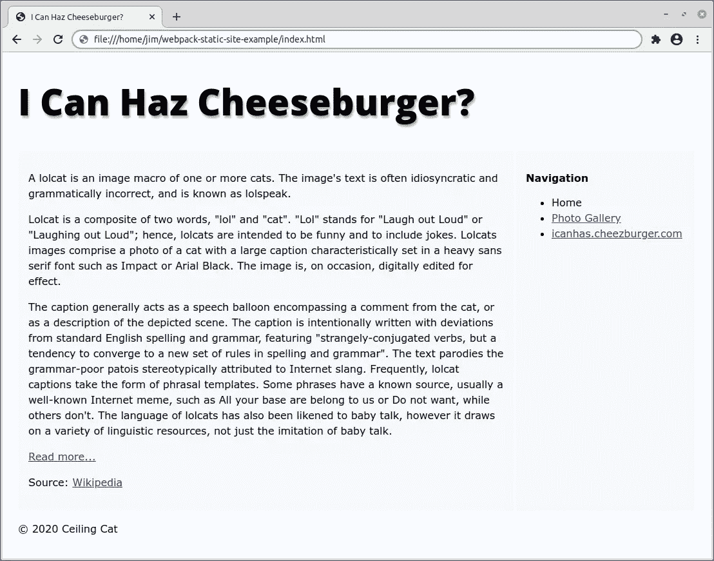
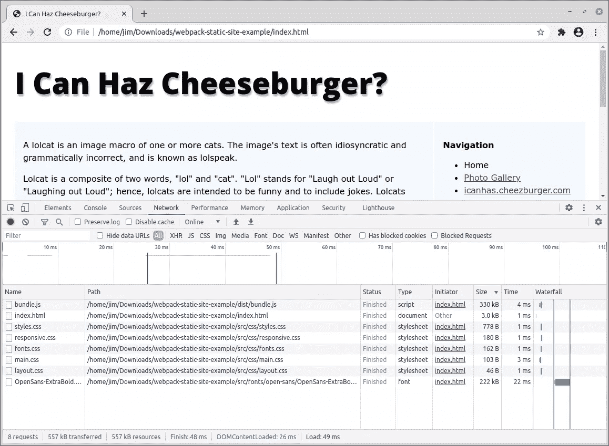

# 如何使用 Webpack 捆绑一个简单的静态站点

> 原文：<https://www.sitepoint.com/bundle-static-site-webpack/>

Webpack 已经成为 JavaScript 工具链中不可或缺的一部分。它在 GitHub 上有超过 55，000 颗星，被 JavaScript 世界的许多大玩家使用，如 React 和 Angular。

然而，你不需要使用前端框架，或者从事大型项目来利用它。Webpack 主要是一个捆绑器，因此您也可以使用它来捆绑您想得到的任何资源或资产。

在这篇文章中，我将向您展示如何安装和配置 webpack，然后使用它为一个简单的静态站点创建一个小型的包。

## 但是你为什么要这么做呢？

好问题。很高兴你问了！

这样做的原因之一是尽量减少对服务器的 HTTP 请求。随着普通网页的增长，你可能会包括 jQuery(是的，[它在 2020 年](https://trends.builtwith.com/analytics/jQuery)仍然流行)、一些字体、一些插件、各种样式表和一些你自己的 JavaScript。如果您对这些资产中的每一项都发出网络请求，事情很快就会堆积起来，您的页面会变得缓慢。捆绑代码可以在某种程度上缓解这个问题。

Webpack 还可以简化代码，进一步减小代码的大小，并且可以让您以自己喜欢的方式编写资产。例如，在本文中，我将演示如何让 webpack 将现代 JavaScript 转换成 ES5。这意味着你可以使用最新的语法编写 JavaScript(尽管这可能还不被完全支持)，然后服务于几乎可以在任何地方运行的浏览器 ES5。

最后，这是一个有趣的学习练习。您是否在自己的项目中使用这些技术取决于您自己，但是通过遵循这些技术，您将对 webpack 做什么、如何做以及它是否适合您有一个明确的理解。

## 启动并运行

首先，您需要在计算机上安装 Node 和 npm。如果你还没有得到 Node，你可以[从 Node 网站](https://nodejs.org/en/download/)下载，也可以[借助版本管理器](https://www.sitepoint.com/quick-tip-multiple-versions-node-nvm/)下载安装。就我个人而言，我更喜欢第二种方法，因为它允许您在 Node 的多个版本之间切换，并且消除了一系列权限错误，否则您可能会看到以管理员权限安装节点包。

我们还需要一个框架项目来工作。[这是我之前做的一个](https://github.com/sitepoint-editors/webpack-static-site-example)。要让它在您的机器上运行，您应该从 GitHub 克隆项目并安装依赖项:

```
git clone https://github.com/sitepoint-editors/webpack-static-site-example
cd webpack-static-site-example
npm install 
```

这将把 [jQuery](https://jquery.com/) ，加上 [Slick Slider](https://kenwheeler.github.io/slick/) 和[light box 2](https://lokeshdhakar.com/projects/lightbox2/)——我们将在网站上使用的两个插件——安装到项目根目录下的`node_modules`文件夹中。

之后，您可以在浏览器中打开`index.html`并浏览网站。您应该会看到类似这样的内容:



如果你在以上任何一个步骤上需要帮助，为什么不去我们的论坛发帖提问呢？

## 将 Webpack 引入项目

我们需要做的下一件事是安装 webpack。我们可以使用以下命令来实现这一点:

```
npm install webpack webpack-cli --save-dev 
```

这将安装 webpack 和 webpack CLI，并将它们添加到您的`package.json`文件的`devDependency`部分:

```
"devDependencies": {
  "webpack": "^5.1.3",
  "webpack-cli": "^4.0.0"
} 
```

接下来，我们将创建一个`dist`文件夹，其中将包含我们捆绑的 JavaScript:

```
mkdir dist 
```

现在我们可以尝试从命令行运行 webpack，看看它是否设置正确:

```
./node_modules/webpack/bin/webpack.js ./src/js/main.js --output-filename=bundle.js --mode=development 
```

我们在这里做的是告诉 webpack 将`src/js/main.js`的内容捆绑到`dist/bundle.js`中。如果一切安装正确，您应该会在命令行中看到类似如下的输出:

```
asset bundle.js 1.04 KiB [emitted] (name: main)
./src/js/main.js 192 bytes [built] [code generated]
webpack 5.1.3 compiled successfully in 45 ms 
```

并且 webpack 会在`dist`文件夹中创建一个`bundle.js`文件。如果您在您选择的文本编辑器中查看该文件，您会在底部看到一堆样板文件和`main.js`的内容。

## 自动化我们的设置

如果我们每次想运行 webpack 时都必须在终端中输入以上所有内容，那将会非常烦人。因此，让我们创建一个可以运行的 [npm 脚本](https://docs.npmjs.com/misc/scripts)。

在`package.json`中，修改`scripts`属性，如下所示:

```
"scripts": {
  "test": "echo \"Error: no test specified\" && exit 1",
  "build": "webpack ./src/js/main.js --output-filename=bundle.js --mode=development"
}, 
```

请注意，我们可以省去 webpack 模块的完整路径，因为当从脚本运行时，npm 会自动在`node_modules`文件夹中查找该模块。现在当你运行`npm run build`的时候，和之前应该会发生同样的事情。酷吧。

## 创建 Webpack 配置文件

注意我们是如何将文件路径和输出文件路径作为参数传递给 webpack 的？嗯，我们可能应该改变这一点，并在配置文件中指定这些。当我们以后使用装载机时，这将使我们的生活更容易。

在项目根目录下创建一个`webpack.config.js`文件:

```
touch webpack.config.js 
```

并添加以下代码:

```
module.exports = {
  entry: './src/js/main.js',
  mode: 'development',
  output: {
	path: `${__dirname}/dist`,
	filename: 'bundle.js',
  },
}; 
```

并将 npm 脚本更改为以下内容:

```
"scripts": {
  ...
  "build": "webpack"
}, 
```

在`webpack.config.js`中，我们导出了一个配置对象，它指定了入口点、【webpack 应该在中运行的模式(稍后将详细介绍)，以及包的输出位置。再次运行一切，它应该仍然像以前一样工作。

## 包括捆绑包

现在我们已经让 webpack 为我们生成了一个包，接下来我们需要做的就是将它包含在某个地方。但是首先，让我们创建一个不同的入口点，这样我们就可以列出我们希望 webpack 为我们捆绑的资产。这将是一个名为`app.js`的文件，位于`src/js`目录中:

```
touch src/js/app.js 
```

将以下内容添加到`app.js`:

```
require('./main.js'); 
```

并更改 webpack 配置，如下所示:

```
entry: './src/js/app.js', 
```

再次运行`npm run build`以重新创建包。一切都应该像以前一样工作。

现在，如果你看一下`index.html`,你会注意到 JavaScript 方面没什么进展。在文件的底部，我们包含了 jQuery 和一个名为`main.js`的文件，当你点击 *Read more…* 链接时，它负责显示更多信息。

让我们编辑`index.html`来包含包而不是`main.js`。看看文件的底部。您应该看到:

```
 <script src="./node_modules/jquery/dist/jquery.min.js"></script>
	<script src="./src/js/main.js"></script>
  </body>
</html> 
```

将此更改为:

```
 <script src="./node_modules/jquery/dist/jquery.min.js"></script>
	<script src="./dist/bundle.js"></script>
  </body>
</html> 
```

在浏览器中刷新页面，确信*阅读更多…* 链接仍然有效。

## 绑定 jQuery

接下来，让我们将 jQuery 添加到包中。这将减少页面发出的 HTTP 请求的数量。为此，我们必须像这样修改`app.js`文件:

```
window.$ = require('jquery');
require('./main.js'); 
```

这里我们需要 jQuery，但是因为我们使用 npm 安装了它，所以我们不需要包含完整的路径。我们还将它通常的别名`$`添加到全局`window`对象中，以便其他脚本可以访问它。我们在 jQuery 之后需要`main.js`,因为前者依赖于后者，并且顺序很重要。

更改`index.html`以删除 jQuery 脚本标记:

```
 <script src="./dist/bundle.js"></script>
  </body>
</html> 
```

运行`npm run build`并再次刷新浏览器中的页面，确认*阅读更多……*链接仍然有效。是吗？很好！

## 衡量我们的进步

谈论性能当然很好，但是如果你没有建立某种可测量的度量标准，它就没有什么意义。在我们的例子中，我们试图减少浏览器发出的 HTTP 请求的数量，我们可以在浏览器的开发工具中查看这些请求。我将使用 Chrome 作为一个例子来说明如何做到这一点，但这个原理对于任何现代浏览器都是一样的。

按下`F12`键打开开发者工具，然后确保选择了*网络*选项卡。然后点击并按住地址栏旁边的重新加载符号(带箭头的圆圈)，选择*清空缓存并硬重新加载*。您应该会看到类似下图的内容。



正如您在窗口底部的栏中所看到的，正在发出八个请求(我们已经通过在包中添加 jQuery 去掉了一个请求),总共有 557kB 的请求正在通过网络传输。

## 捆绑 CSS

看一下`index.html`，我们对网络请求的另一件事是 CSS。如您所见，我们在页面顶部包含了`main.css`,这个文件又导入了另外四个 CSS 文件。

尽管在其标准配置中，webpack 只能处理 JavaScript，但是我们可以使用一个叫做 loader 的东西来让它捆绑我们的 CSS。来自 [webpack 文档](https://webpack.js.org/concepts/loaders/):

> 加载器是应用于模块源代码的转换。它们允许您在`import`或“加载”文件时对文件进行预处理。因此，加载器有点像其他构建工具中的“任务”,并提供了一种处理前端构建步骤的强大方法。加载器可以将文件从不同的语言(如 TypeScript)转换为 JavaScript，或者将内嵌图像作为数据 URL 加载。加载器甚至允许你直接从你的 JavaScript 模块中做类似于`import` CSS 文件的事情！

所以让我们修改一下`app.js`:

```
// CSS
require('../css/main.css');

// JavaScript
window.$ = require('jquery');
require('./main.js'); 
```

我们需要改变`webpack.config.js`来告诉它在遇到以`.css`结尾的文件时运行哪个加载程序:

```
module.exports = {
  ...
  module: {
	rules: [
	  {
		test: /\.css$/,
		use: [
		  'style-loader',
		  'css-loader',
		],
	  },
	],
  },
}; 
```

如你所见，我指定了两个加载器: [css 加载器](https://www.npmjs.com/package/css-loader)和[样式加载器](https://www.npmjs.com/package/style-loader)。其中，css-loader 将 css 转换为 JavaScript 模块，而 style-loader 在运行时将 JavaScript 模块导出的 CSS 注入到一个`<style>`标签中。让我们安装两者:

```
npm install --save-dev css-loader style-loader 
```

现在让我们使用`npm run build`再次运行 webpack，看看会发生什么:

```
> Webpack-static-site-example@1.0.0 build /home/jim/Downloads/webpack-static-site-example
> webpack

asset bundle.js 349 KiB [emitted] (name: main)
runtime modules 931 bytes 4 modules
modules by path ./src/ 356 KiB
  modules by path ./src/css/*.css 3.96 KiB 6 modules
  modules by path ./src/js/*.js 294 bytes
	./src/js/app.js 102 bytes [built] [code generated]
	./src/js/main.js 192 bytes [built] [code generated]
  ./src/fonts/open-sans/OpenSans-ExtraBold.ttf 352 KiB [built] [code generated] [1 error]
modules by path ./node_modules/ 290 KiB
  modules by path ./node_modules/css-loader/dist/runtime/*.js 2.38 KiB
	./node_modules/css-loader/dist/runtime/api.js 1.57 KiB [built] [code generated]
	./node_modules/css-loader/dist/runtime/getUrl.js 830 bytes [built] [code generated]
  ./node_modules/jquery/dist/jquery.js 281 KiB [built] [code generated]
  ./node_modules/style-loader/dist/runtime/injectStylesIntoStyleTag.js 6.67 KiB [built] [code generated]

ERROR in ./src/fonts/open-sans/OpenSans-ExtraBold.ttf 1:0
Module parse failed: Unexpected character '' (1:0)
You may need an appropriate loader to handle this file type, currently no loaders are configured to process this file. See https://webpack.js.org/concepts#loaders
(Source code omitted for this binary file)
 @ ./node_modules/css-loader/dist/cjs.js!./src/css/fonts.css 4:0-86 6:73-102
 @ ./node_modules/css-loader/dist/cjs.js!./src/css/main.css 3:0-104 8:26-59
 @ ./src/css/main.css 2:12-89 9:17-24 13:15-29
 @ ./src/js/app.js 2:0-26

webpack 5.1.3 compiled with 1 error in 292 ms 
```

哦不！它爆炸了。检查输出，似乎在`src/css/fonts.css`中有一个错误。如果您打开该文件并查看第 5 行，您将看到我们包含了一个自定义字体(`src/fonts/open-sans/OpenSans-ExtraBold.ttf`)，而 webpack 不知道如何处理它。

但是不要担心，我们已经得到了！我们只需要用另一台装载机。这次是 [url-loader](https://www.npmjs.com/package/url-loader) ，它可以将字体和图像等资产转换成[数据 URL](https://developer.mozilla.org/en-US/docs/Web/HTTP/Basics_of_HTTP/Data_URIs)，然后可以将其添加到 bundle 中:

```
module.exports = {
  ...
  module: {
	rules: [
	  {
		test: /\.css$/,
		use: [
		  'style-loader',
		  'css-loader',
		],
	  },
	  {
		test: /\.ttf$/,
		use: [
		  'url-loader',
		],
	  },
	],
  },
}; 
```

当然，我们需要安装它:

```
npm install url-loader --save-dev 
```

现在构建应该运行了。通过从`index.html`中移除 CSS `<link>`标签，重新创建包并刷新页面来进行测试。

## 捆绑第三方库

现在让我们把注意力转向`photos.html`。在这个页面上还发生了一些事情，因为我们使用了两个库——Slick Slider 和 light box 2——这两个库都依赖于 jQuery。幸运的是，我们可以应用我们所学的技术将它们包含在包中。

像这样修改:

```
// CSS
require('slick-carousel/slick/slick.css');
require('slick-carousel/slick/slick-theme.css');
require('lightbox2/dist/css/lightbox.min.css');
require('../css/main.css');

// JS
window.$ = require('jquery');
window.slick = require('slick-carousel');
window.lightbox = require('lightbox2');
require('./main.js'); 
```

另外，从文档的头部删除 CSS include，从页脚删除脚本 include。这应该会给我们:

```
<!DOCTYPE html>
<html lang="en">
  <head>
	<meta charset="UTF-8">
	<title>I Can Haz Cheeseburger?</title>
  </head>
  <body>
	...

	<script src="dist/bundle.js"></script>
	<script> $('.slick-slider').slick({
		dots: true,
		arrows: false,
		infinite: true,
		speed: 500,
		fade: true,
		cssEase: 'linear'
	  }); </script>
  </body>
</html> 
```

虽然没有什么可以阻止我们在包中包含光滑的初始化代码，但我将把它留在这个页面上，因为我们只想在这里使用它。

现在让我们运行 webpack，看看会发生什么:

```
...

ERROR in ./node_modules/slick-carousel/slick/ajax-loader.gif 1:7
Module parse failed: Unexpected character '' (1:7)
You may need an appropriate loader to handle this file type, currently no loaders are configured to process this file. See https://webpack.js.org/concepts#loaders
(Source code omitted for this binary file)
 @ ./node_modules/css-loader/dist/cjs.js!./node_modules/slick-carousel/slick/slick-theme.css 4:0-62 10:73-102
 @ ./node_modules/slick-carousel/slick/slick-theme.css 2:12-83 9:17-24 13:15-29
 @ ./src/js/app.js 3:0-47

.... 
```

哦，不，更多的错误！这一次，`slick-theme.css`文件似乎有问题，它引用了 GIF 格式的图像。Webpack 不知道如何处理 GIF，所以它举起双臂，停止工作。但我们知道该怎么做，对吗？

将`webpack.config.js`中的第二条规则更改如下:

```
{
  test: /\.(svg|gif|png|eot|woff|ttf)$/,
  use: [
	'url-loader',
  ],
}, 
```

您会注意到我已经修改了正则表达式以匹配其他几种文件类型。这些都是 Slick 或者 Lightbox2 所需要的。再次运行 webpack 并确保它没有错误地完成。

重新运行 build 命令，刷新页面，确保一切正常。

## 一些收尾工作

我们差不多完成了，但是还有一些地方我们可以改进。

### 处理无样式内容的闪现

如果你在服务器上尝试这个(仅仅在你的浏览器中打开文件可能不起作用)，当页面加载时，你会注意到一个无样式内容的[闪烁。让我们在本地复制这个。](https://en.wikipedia.org/wiki/Flash_of_unstyled_content)

首先，在您的系统上全局安装 http-server 软件包:

```
npm install -g http-server 
```

然后导航到项目的根目录，发出以下命令:

```
http-server 
```

这将在您的 PC 上启动一个 HTTP 服务器。导航到 [http://127.0.0.1:8080](http://127.0.0.1:8080) ，你会像以前一样看到这个网站。接下来，进入浏览器开发工具的*网络*标签，找到限制连接速度的菜单。选择一个*快速 3G* 预置(或等效)，然后硬刷新页面。您将看到 HTML 是如何加载的，然后在一两秒钟后应用 CSS。显然这不是最优的。

注意:模拟慢速连接在所有现代浏览器中都是可能的。这里有关于如何在 [Chrome](https://developers.google.com/web/tools/chrome-devtools/network#throttle) 中这样做的说明，这里有如何在 [Firefox](https://developer.mozilla.org/en-US/docs/Tools/Network_Monitor/Throttling) 中这样做的说明。

解决这个问题的一个方法是利用`<script>`标签的阻塞特性，将 include 移到文件的顶部。

```
<!DOCTYPE html>
<html lang="en">
  <head>
	<meta charset="UTF-8">
	<title>I Can Haz Cheeseburger?</title>
	<script src="dist/bundle.js"></script>
  </head>
  <body>
	...
  </body>
</html> 
```

这有点工作，但现在需要几秒钟来加载网站，这也不是完美的。

### 提取 CSS

我们可以通过将 CSS 提取到它自己的包中并加载到页面的顶部，而 JavaScript 包保持在页面底部的位置来改善这种情况。为此我们需要 [mini-css-extract-plugin](https://www.npmjs.com/package/mini-css-extract-plugin) ，所以让我们先安装它:

```
npm install --save-dev mini-css-extract-plugin 
```

然后像这样修改`webpack.config.js`:

```
const MiniCssExtractPlugin = require('mini-css-extract-plugin');

module.exports = {
  entry: './src/js/app.js',
  mode: 'development',
  output: {
	path: `${__dirname}/dist`,
	filename: 'bundle.js',
  },
  plugins: [new MiniCssExtractPlugin()],
  module: {
	rules: [
	  {
		test: /\.css$/,
		use: [
		  MiniCssExtractPlugin.loader,
		  'css-loader',
		],
	  },
	  {
		test: /\.(svg|gif|png|eot|woff|ttf)$/,
		use: [
		  'url-loader',
		],
	  },
	],
  },
}; 
```

这里，在用 MiniCssExtractPlugin 的加载器替换 style-loader 之前，我们要求我们的新插件位于文件顶部，并将其添加到`plugins`数组中。现在当你运行`npm run build`时，在`dist`文件夹中会生成两个包——`bundle.js`和`main.css`。

更改`index.html`和`photos.html`以包含它们，如下所示:

```
<!DOCTYPE html>
<html lang="en">
  <head>
	<meta charset="UTF-8">
	<title>I Can Haz Cheeseburger?</title>
	<link rel="stylesheet" href="./dist/main.css">
  </head>
  <body>
	...
	<script src="./dist/bundle.js"></script>
	<!-- Only photos.html -->
	<script>$('.slick-slider').slick({ ... });</script>
  </body>
</html> 
```

现在我们避免了 FOUC，网站加载速度加快了几秒钟，这无疑是一个进步。

### 不同页面的不同捆绑包

您可能已经注意到，无论用户访问哪个页面，我们都将所有资产包含在我们的捆绑包中，并为这些捆绑包提供服务。严格地说，如果用户只访问索引页面，他们不需要为照片页面上的滑块下载样式和代码。

根据您想在多大程度上采用这种方法，为照片页面和网站上的其他页面创建单独的包是完全可能的。为此，您可以使用 [HtmlWebpackPlugin](https://webpack.js.org/plugins/html-webpack-plugin/) ，它简化了 HTML 文件的创建，以服务于您的 webpack 包。

不幸的是，这项技术超出了本教程的范围，但是你可以在这里找到一个很好的指南。

### 缩小包裹

如果您使用一个包包一切的方法，一个简单的方法是在生产模式下运行 webpack，这将看到它输出一个更小的、缩小的包。

为此，将`webpack.config.js`修改如下:

```
module.exports = {
  entry: './src/js/app.js',
  mode: 'production',
  ...
}; 
```

现在，当您运行 build 命令时，webpack 将输出一个缩小和优化的包。这使得`bundle.js`的大小从 821.8kB 降到了 485.9kB。总的来说，还不错。

如果你决定将你的包分成 JavaScript 和 CSS，事情会变得有点复杂。为了优化 CSS，我们需要一个额外的插件—[optimize-CSS-assets-web pack-plugin](https://www.npmjs.com/package/optimize-css-assets-webpack-plugin)。要使用它，我们必须覆盖 [webpack 的默认最小化器](https://webpack.js.org/configuration/optimization/#optimizationminimizer)，这反过来意味着我们也需要指定一个 JavaScript 最小化器。对于这个任务， [terser-webpack-plugin](https://www.npmjs.com/package/terser-webpack-plugin) 是一个不错的选择。

让我们安装这两个:

```
npm install --save-dev optimize-css-assets-webpack-plugin terser-webpack-plugin 
```

然后像这样修改`webpack.config.js`:

```
const MiniCssExtractPlugin = require('mini-css-extract-plugin');
const OptimizeCssAssetsPlugin = require('optimize-css-assets-webpack-plugin');
const TerserPlugin = require('terser-webpack-plugin');

module.exports = {
  entry: './src/js/app.js',
  mode: 'production',
  output: {
	path: `${__dirname}/dist`,
	filename: 'bundle.js',
  },
  plugins: [new MiniCssExtractPlugin()],
  module: {
	rules: [
	  {
		test: /\.css$/,
		use: [
		  MiniCssExtractPlugin.loader,
		  'css-loader',
		],
	  },
	  {
		test: /\.(svg|gif|png|eot|woff|ttf)$/,
		use: [
		  'url-loader',
		],
	  },
	],
  },
  optimization: {
	minimize: true,
	minimizer: [
	  new TerserPlugin({
		extractComments: false,
	  }),
	  new OptimizeCssAssetsPlugin(),
	],
  },
}; 
```

查看代码，您可以看到我们需要在文件顶部添加两个新插件，并且我们已经为导出的配置对象添加了一个`optimization`键。这允许我们将 Terser 指定为 JavaScript 的最小化器，将优化 CSS 资产插件指定为 CSS 的最小化器。现在，当您运行`npm run build`时，应该会输出两个最小化的包。

这将包的大小分别从 446.6kB 和 338.8kB 减少到 144kB 和 336kB。对于一些 CSS、JS 和其他一些资产来说，总共 480kB 的包看起来有点多，但是请记住其中 222kB 是字体。

### 将 ES6 转换为 ES5

您还可以安装 [babel-loader](https://www.npmjs.com/package/babel-loader) 并让 webpack 通过它运行 JavaScript 文件，从而将现代 JavaScript 移植到 ES5:

```
npm install --save-dev @babel/core babel-loader @babel/preset-env 
```

然后在`webpack.config.js`中为 Javascript 文件定义一个新规则:

```
{
  test: /\.js$/,
  exclude: /(node_modules|bower_components)/,
  use: {
	loader: 'babel-loader',
	options: {
	  presets: ['@babel/preset-env'],
	},
  },
}, 
```

现在，当你运行`npm run build`时，JavaScript 文件将通过 Babel 管道传输，并转换成几乎可以在任何浏览器上运行的 ES5 语法。

当然，您可以将 Babel 替换成您喜欢的几乎任何其他编译成 JavaScript 的语言。例如，这里有一个 [TypeScript 加载器](https://www.npmjs.com/package/typescript-loader)，它可以让你将 TypeScript 添加到你的项目中。

## 结论

所以你有它。在本文中，我演示了如何使用 webpack 捆绑一个简单的静态站点——这个过程减少了 HTTP 请求的数量，从而使站点可能更快、响应更快。我还演示了如何让 webpack 缩小结果包，从而减小文件大小，以及如何使用 babel-loader 将现代 JavaScript 转换成 ES5。

但是在我结束之前，让我们比较一下我们最初的配置和最终的配置。以`index.html`为例，页面最初发出 9 个请求，有效负载为 319kB。使用 Chrome 中预设的*快速 3G* ，页面加载需要 4.14 秒。相比之下，使用双包设置，页面发出两个请求，有效负载为 472kB，加载时间为 4.34 秒。

嗯……这可能会让你想知道你到底为什么要为这些事情费心。但是，不要忘记两个包都被浏览器缓存，所以当您访问照片页面时，原始设置必须从服务器获取所有滑块代码，并且需要 6.5 秒才能完全加载。捆绑的设置已经有了它需要的大部分内容，并且在 3.32 秒内准备就绪。

即使这个策略并不适合所有人，希望通过跟随它，你已经深入了解了 webpack 做什么以及它是如何做的。对于那些希望进一步探索 webpack 的人，我推荐“[一个 Webpack](https://www.sitepoint.com/webpack-beginner-guide/) 的初学者指南”，它对一些重要的概念进行了相当深入的介绍，例如 webpack dev server，它将向您介绍热模块重载的奇妙世界。

## 分享这篇文章