# Adobe Business Catalyst 简介-第 2 部分

> 原文：<https://www.sitepoint.com/business-catalyst-part-2/>

在本系列第一部分的[中，我们开始探索](https://www.sitepoint.com/article/intro-business-catalyst)  ，这是一个全服务平台，你可以用它来支持你客户的在线业务。在那一期文章中，我向您展示了使用您设计和管理的内容管理工具和模板来实现您的设计并围绕它构建一个网站是多么容易。我们添加了交互式表单来收集可用于营销活动的数据，并且我们在您的在线商店中创建了产品和目录，而无需进行任何后端开发。对于每一项新功能，我们看到了如何对自己创造的用户体验进行非常精细的控制，以帮助客户的在线业务增长。

这就是 Business Catalyst 的真正优势:该平台旨在为您提供扩展业务的工具，以便您可以为您的客户提供发展业务的解决方案。

附加阅读包括:

*   [Adobe Business Catalyst 简介-第 1 部分](https://sitepoint.com/intro-business-catalyst/)
*   [Adobe Business Catalyst 简介–第 2 部分](https://sitepoint.com/business-catalyst-part-2/)
*   [Adobe Business Catalyst 简介–第 3 部分](https://sitepoint.com/introduction-to-adobe-business-catalyst-part-3/)
*   [如何使用 Adobe Business Catalyst 建立在线商店](https://sitepoint.com/how-to-set-up-an-online-store-with-adobe-business-catalyst/)

在这一部分中，我们将更深入地研究这些核心功能，以完成在线商店的构建，了解内置于系统中的丰富的分析工具，并向您展示如何为您的客户提供他们自己的访问登录—减少权限。

不过，首先，让我们快速回顾一下工作环境:您可以使用 Business Catalyst online 作为一套基于网络的工具来管理您网站的结构、内容和功能，或者您可以在本地工作并将您的文件 FTP 到您的网站以进行进一步集成。如果您使用 Dreamweaver 来开发您的站点，该产品提供了一个 Business Catalyst 扩展，它集成了您的站点模板和模块功能，因此您可以在本地工作，并随时同步到远程站点。对于本演练，我将在线工作。

## 电子商务配置

在本系列的第一部分中，我们建立了一个简单的在线商店，并用目录和产品填充它。Business Catalyst 允许您在模板中深入挖掘，以定制您的产品呈现方式——从页面的外观和感觉到数据元素。还有一个完全集成的购物车解决方案隐藏在引擎盖下。因此，让我们定制购物车、结帐和履行的不同工作流组件，以完善我们的在线商店。

## 购物车

这对你来说可能是显而易见的，但为了确保我们在同一页上，购物车的目的是允许顾客在访问在线商店的过程中选择多件商品进行购买，并在完成后在一个结账过程中完成所有这些商品的购买。Business Catalyst 购物车遵循强大的约定，因为它是基于*会话的*——这意味着购物车中的数据只在当前会话中存在——它使用 Ajax 让客户在当前页面继续购物的同时向购物车添加商品。产品被添加到页面中，购物车内容模块被添加到模板中，因此它在整个网站中都是持久的(更多信息请参见[第一部分](https://www.sitepoint.com/article/intro-business-catalyst))。

在购物页面上，列出了商品的名称、价格、数量和一个添加到购物车按钮。当客户点击按钮时，产品被添加到购物车中，他们会得到一个警告提示，如图[图 1，“向购物车添加商品”](#fig_itemaddalert "Figure 1. Adding an item to the shopping cart")所示。(如果您喜欢冒险，可以使用一点 Ajax 来捕获事件并以内联方式显示消息！)

**图一。向购物车添加商品**

一旦添加了商品，查看购物车模块就会更新，以反映购物车中商品的总数及其总成本。当您点击查看购物车链接时，您可以看到购物车的详细内容。像大多数商业催化剂工具一样，默认设计简单且功能齐全——但是它可能不适合你的网站设计。在设计过程中，您可以确定哪些元素需要修改，并选择哪些功能和数据元素适合客户的在线商店。让我们看看默认的设计，如图[图 2，“查看购物车”](#fig_viewcart "Figure 2. Viewing the cart")所示。

**图二。查看购物车**

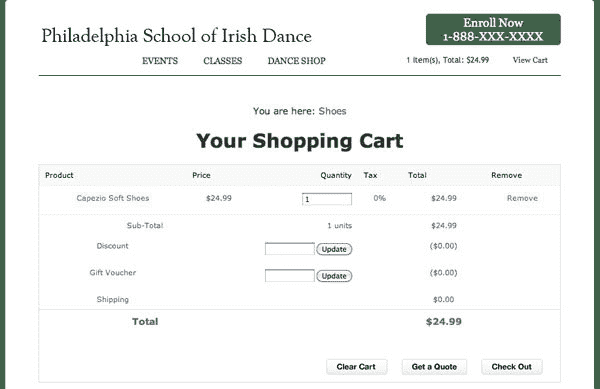

首先，我想删除面包屑导航，并更新用于标题的样式。我将登录到 Business Catalyst 网站的管理部分，点击 eCommerce ，调出我用来管理在线商店的工具。我想编辑用于购物车的模板，所以我点击了右侧导航栏中的查看定制选项链接。正如您在第 1 部分中所记得的，这也是我们访问模板来定制产品和目录页面的地方。您可以在下方找到购物车模板。点击购物车，弹出编辑界面，如图[图 3，“定制网店布局”](#fig_customizeshoplayout "Figure 3. Customizing online shop layouts")。

**图 3。定制网店布局**

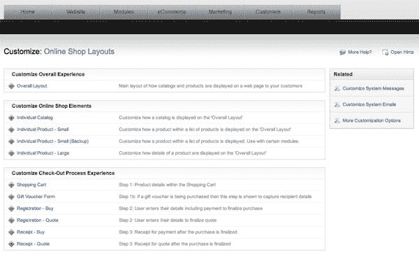

同样，默认模式是“设计”视图，它允许您查看页面的元素。此外，Business Catalyst 允许您访问布局可用的所有数据元素，如图 4 中的[“编辑购物车页面”](#fig_editcart "Figure 4. Editing the shopping cart page")所示。如果您想添加更多的数据元素，您可以使用标签插入下拉菜单来插入它们。

**图 4。编辑购物车页面**

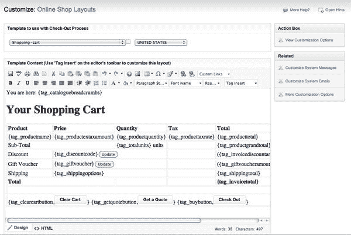

在这种情况下，我将更新一些样式并修整页面的内容。我想要对这个过程进行详细的控制，所以我切换到 HTML 模式，如图[图 5，“在 HTML 模式下编辑购物车”](#fig_htmlmode "Figure 5. Editing the shopping cart in HTML mode")所示。

**图 5。在 HTML 模式下编辑购物车**

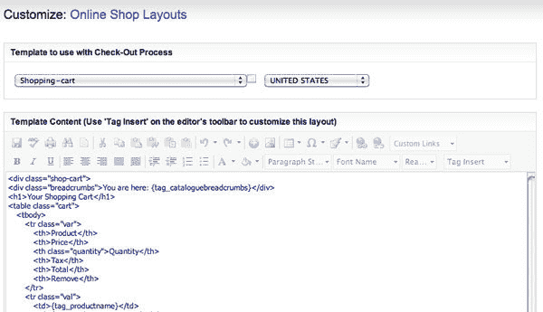

我删除了包含面包屑导航的`div`，并更改了页面的`style`属性和`title`。此外，有一些元素不符合我们当前的设计，但对网站的未来发展很重要:礼品券和折扣是鼓励回头客的好方法，很容易作为产品设置的一部分。目前，由于我们没有这些程序，让我们将它们从购物车屏幕中删除。此外，我们的客户不希望允许客户请求报价，所以我删除了 HTML 并切换回设计视图；结果如[图 6【修改后的购物车布局】](#fig_modifiedcart "Figure 6. The modified shopping cart layout")所示。这非常简单——不需要写任何要求，也不需要与开发人员讨价还价。你都准备好了。

**图 6。修改后的购物车布局**

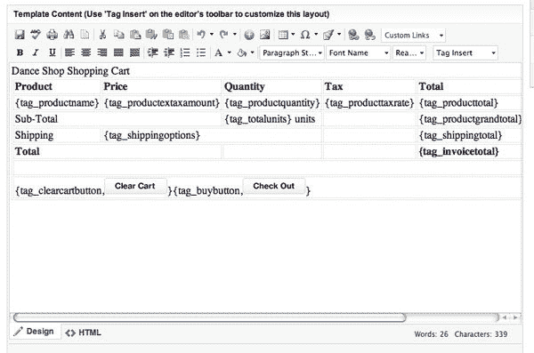

保存更改后，我可以刷新购物车页面。我的设计——如图 7[“更新的购物车页面”](#fig_modifiedcartpage "Figure 7. The updated shopping cart page")所示——不会赢得任何奖项，但我希望它向您展示了您可以定制您的商店的控制水平。

**图 7。更新后的购物车页面**

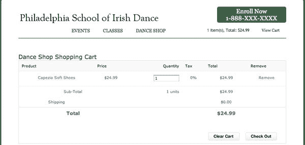

让我们继续浏览模板。Business Catalyst 可以轻松确保您定制了结账流程中的所有内容。仔细查看在线商店布局页面，模板是按顺序排列的，因此您可以逐一查看，以确保符合客户的需求。客户要做的第一件事是将商品添加到购物车，一旦他们完成购物，他们将需要查看购物车的内容。接下来，他们需要输入他们的账单信息，最后，他们会看到一个确认屏幕。在 Business Catalyst 中，一切都已准备就绪，您可以将您的触觉应用到结账体验中，如图[图 8，“定制结账流程的每个步骤”](#fig_checkoutprocess "Figure 8. Customizing each step of the checkout process")所示。

**图 8。定制结账流程的每个步骤**

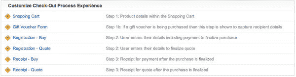

一旦我们对购物车详细信息页面进行了更改，我们在结账流程中还需要定制两个步骤:付款和确认。让我们通过点击购物车页面上的结帐来看看付款页面现在是什么样子。付款页面——如图[图 9 所示，“默认结账页面”](#fig_checkoutpage "Figure 9. The default checkout page")——实际上是完成购买的主要数据输入步骤:客户输入他们的姓名、地址、账单和信用卡信息，并提交表单进行处理。

**图 9。默认结账页面**

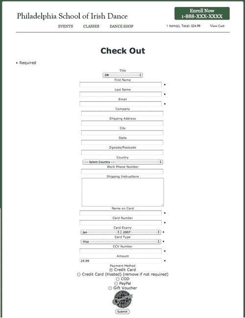

同样，默认布局是完全功能性的，非常简单，但需要一些更新和定制，以满足我们的业务和设计目标。在这种情况下，我们不只是要改变页面的外观和感觉:我们要定制下拉菜单和支付选项中的一些选项。该模板称为注册-购买。点击它进行编辑。

在 HTML 视图中，我向下滚动并修改国家列表，删除我们不会开展业务的国家，更新接受的信用卡列表和到期日期，并修改我们将要接受的支付方式。更新后的页面如[图 10 所示，“修改后的结账页面”](#fig_checkoutmodified "Figure 10. The modified checkout page")。

**图 10。修改后的结账页面**

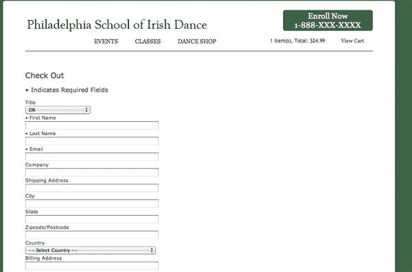

作为替代方案(为了在现场级别获得更多的控制)，我可以转到模块部分，点击网络表单，并选择网上商店购买表单。在表单编辑器中，您可以添加和删除您想在购买表单上保留或删除的字段，如图[图 11，“编辑网上商店购买表单模块”](#fig_webform_purhase "Figure 11. Editing the Online Shop Purchase Form Module")所示。

**图 11。编辑网店购买表单模块**

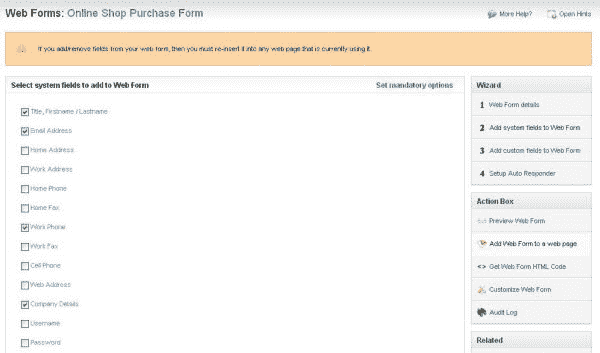**important:** Changing the Module?

如果您对模块本身进行了更改，请记住，您必须将其重新插入到使用它的页面或模板中。

在 CSS 中做了一个小的编辑，表单块现在是左对齐的，在做了一些小的文本编辑后，我们有了一些更接近我们设计的东西。与商店中的所有元素一样，您可以继续微调和完善用户体验，以创建适合您客户的设计。支付处理将在后端处理——我们接下来会看到这一点——但是输入到必填字段的数据的验证是在 JavaScript 中处理的。您可以向页面添加一些 Ajax 来执行一些内联验证，并进一步改善用户体验。如果你想编辑消息中的措辞，你可以在名为`ValidationFunctions_EN.js`的 JavaScript 文件中进行——这一切都可以访问并在你的控制之下。

最后一步是定制支付确认页面。返回在线商店布局页面，点击收据-购买编辑模板。如果您想添加任何客户服务信息或联系信息，您可以在此处添加。

在您接受信用卡支付之前，您需要配置您的支付网关。进入电子商务 > 支付网关，为您的客户选择合适的网关，如图[图 12，“配置支付网关”](#fig_paymentgateways "Figure 12. Configuring Payment Gateways")所示。请注意，信用卡处理需要升级的付费账户。

**图 12。配置支付网关**

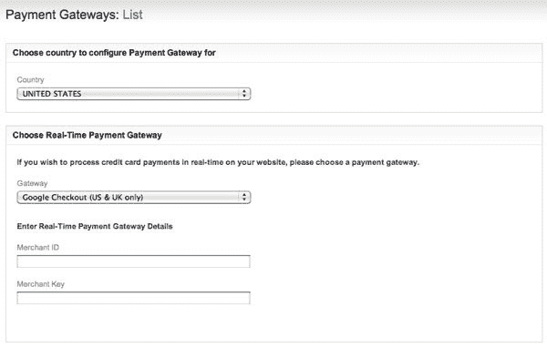

您需要从您的客户那里获得适当的商家信息来设置网关，如果他们也想通过 PayPal 接收付款，还需要获得 PayPal 信息，如图[图 13，“PayPal”](#fig_paypal "Figure 13. PayPal")所示。

**图 13。贝宝**

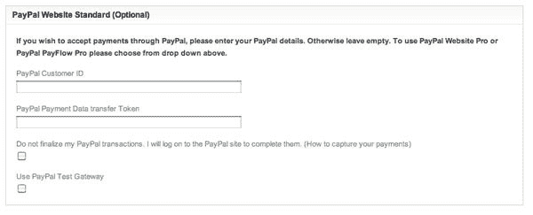

您将希望与您的客户一起配置网站的这一部分，但是正如您所看到的，对它进行更新就像在线商店的任何其他部分一样简单。电子商务部分的其他细节也很容易定制——发货选项、税务代码，甚至 QuickBooks 集成都是预先构建的，随时可用。

## 分享这篇文章