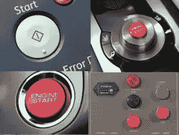
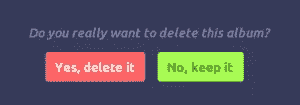

# UX 困境:红色按钮与绿色按钮

> 原文：<https://www.sitepoint.com/button-ux-red-green/>

说到行动号召，“按钮颜色”是 A/B 测试的经典指标之一。这也是设计论坛上的一个热门讨论话题，如果这个堆栈交换 UX 讨论是值得信赖的话。

在讨论中，一个用户问:

> 哪个选项对用户来说更直观？

以下是他提出的两种选择:

虽然一位读者立即拒绝了这些选项——引用的理由是 10%的男性是红/绿色色盲——但这个问题无疑引发了许多明智的辩论。

这包括讨论颜色的心理意义，以及使用的平台和按钮的物理位置。

## 颜色的意义

就标准的在线用法而言，红色通常与删除按钮联系在一起。在西方文明中，它也通常表示危险——想想停车标志、消防车和尾灯。

这可能是删除按钮使用红色的原因——由于其含义，它自然会让我们暂停。

当然，颜色心理学并没有被植入我们的大脑。就像口语一样，我们从小就学习，也像语言一样，因地区而异，甚至因时代而异。

今天，如果父母给他们的小男孩穿粉红色的衣服，他们会看到奇怪的表情，然而这在一百年前是很正常的。

看看这个[伟大的色轮](http://www.informationisbeautiful.net/visualizations/colours-in-cultures/)快速参考指南，了解颜色在各种文化中的含义。如果你想为特定的地理区域重新定位你的站点设计，这是一个理想的工具。

对于你的手机来说也是如此:红色的按钮警告我们将要切断一个电话，而绿色的给我们的信息是我们将继续这个电话。红色在西方社会意味着什么，这是不言而喻的。

绿色在许多国家也意味着“前进”，以及一种自然的感觉，并给我们一种“前进”和成长的感觉。

然而，正如一位讨论参与者指出的，它也提出了围绕“假阳性”的问题。

> 这两种方式似乎都提出了一个假阳性范式。这可以更简单，并且不必强迫用户花费时间来理解颜色到标签的关联。

为了克服联想，评论者指出，简单地弱化你不希望用户使用的按钮会更有效。这意味着用户可以花更少的时间来处理应该是一个简单的选择。

对你来说，是他们发起的行动。行动的确认不应该是一个 50/50 是/否的问题。

这可以通过简单地将你不希望用户使用的颜色静音来最有效地完成。这可以是一个暗绿色，甚至更有效的中性灰色。

## 个案研究

这场伟大的“红绿大战”是一场旷日持久的网络战争，没有确定的赢家。

网上有大量的案例研究，但其中许多都是相互矛盾的。这更有可能是由于什么平台测试什么，而不是像 HubSpot 提出的关于可执行 A/B 测试那样简单明了。

在这个测试中，使用了两个页面——原始页面使用绿色按钮，复制页面使用红色按钮。他们发现，有趣的是，在这种情况下，绿色的影响比红色大得多，转化率高出 21%。

测试是在几天的流量中进行的，页面收到了大约 2000 次访问，按钮点击量由 Performable 测量。页面的其他每个方面都是一样的，但是结果却远远超出了预期。

同样，Dmix 进行的一项[测试比较了红色和绿色按钮的反馈，也提高了转换率——这次提高了 34%。](http://dmix.ca/2010/05/how-we-increased-our-conversion-rate-by-72/)

这一点，以及使用红色对绿色(或用深橙色代替红色)的进一步测试都表明红色的转化率更高。

## 这是什么意思？

回到最初的讨论，可能经常是“颜色的配对”而不是实际的颜色本身给设计师带来了问题。

虽然引用色盲作为避免红/绿关系的原因的参与者被火焰击落——他们可能有道理。

模拟:色盲用户看到的红色和绿色。来源:[http://UX movement . com/content/never-pair-green-and-red-together-on-the-web/](http://uxmovement.com/content/never-pair-green-and-red-together-on-the-web/)

正如你在图中看到的，患有色盲的人看红色和绿色非常不同，很难区分两者。由于红色和绿色在色轮上相对，它们是互补色，所以缺乏对比。

我们处理和解释颜色的方式意味着，如果你把一个红色和绿色的按钮放在一起，对我们的大脑来说最简单的方法就是什么也不做。

因为我们都很熟悉 CTA 按钮，所以同时使用红色和绿色实际上会产生与我们试图做的相反的效果。我们被[分析麻痹](http://en.wikipedia.org/wiki/Analysis_paralysis "Wikipedia: Page detailing Analysis paralysis ")锁定。

考虑到这一点，选择绿色或红色作为行动号召——但不要两者都选——是避免这个问题的最好方法。

还值得考虑与页面上其他颜色的对比。显然，如果你有一个以绿色为主的页面，那么绿色按钮就不太可能突出。

## 橙色怎么样？

正如我们之前看到的，一些设计师选择了深橙色而不是红色，因为这与一些背景形成了更好的对比。

为了测试背景颜色和按钮颜色的对比，可以试试 Joe Dalson 的[颜色对比工具](https://www.joedolson.com/tools/color-contrast-compare.php)，以确保有足够的差异，让色盲的人可以清楚地看到按钮。您还应该测试按钮上使用的文本颜色的对比度，以获得最佳效果。

我最近看到一篇文章，说[橙色是 CTA 按钮的未来](http://unbounce.com/conversion-rate-optimization/the-future-of-marketing-call-to-action-buttons/)。

这当然是亚马逊的情况——总是痴迷的用户测试者——在大多数最重要的行动号召中使用 orange。但是这种颜色有什么联系呢？

橙色没有红色强烈，因此更有吸引力，没有紧迫感。这是一种友好的颜色，适合喜欢给人以友善和平易近人印象的品牌。

然而，由于红色与紧急联系在一起，我仍然相信它是 CTA 按钮的默认选择，只是因为它在心理上提示用户立即采取行动。

总的来说，红色似乎是 CTA 按钮的颜色，最好是单独使用，在使用按钮文本和网站背景颜色时进行对比测试。

绿色也可以起作用，但是你不能否认强调红色有效性的大量研究。

然而，这是否足以满足正在进行的红绿之争，还有待商榷。

## 分享这篇文章