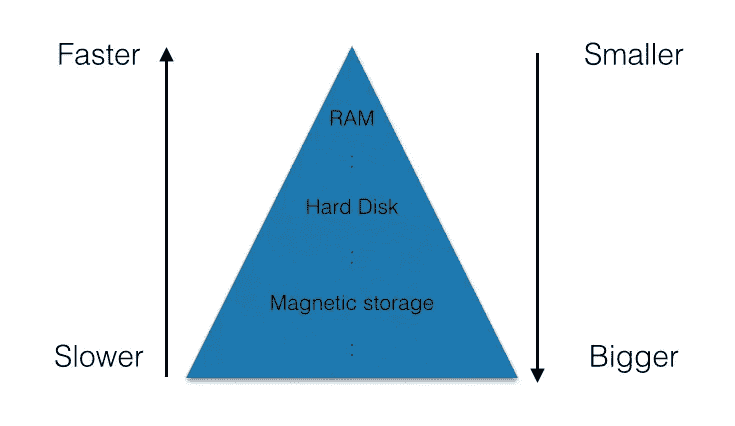
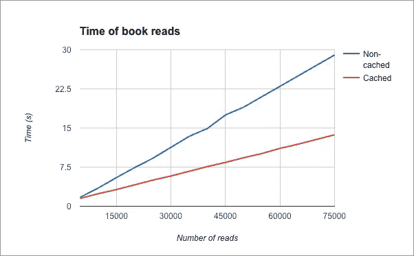

# 用 Redis 缓存 MongoDB 数据库

> 原文：<https://www.sitepoint.com/caching-a-mongodb-database-with-redis/>

如今，性能是开发 web 服务时需要评估的最重要的指标之一。保持客户参与对任何公司都至关重要，尤其是初创公司，因此提高性能和减少页面加载时间极其重要。

当运行与数据库交互的 web 服务器时，其操作可能会成为瓶颈。MongoDB 在这里也不例外，随着您的 MongoDB 数据库的扩展，事情真的会变慢。如果数据库服务器与 web 服务器分离，这个问题甚至会变得更糟。在这样的系统中，与数据库的通信会导致很大的开销。

幸运的是，您可以使用一种叫做**缓存**的方法来加快速度。在本教程中，我们将介绍这种方法，并了解如何使用它来增强 Node.js web 服务的性能。

## 背景

缓存是一种旨在解决主要存储问题的策略，这意味着:存储越大，速度越慢，反之亦然。在计算机中，你有一个很大但相对较慢的硬盘。然后是速度更快但存储容量更小的 RAM，最后是速度非常快但体积很小的 CPU 寄存器。下图展示了内存问题:



缓存是将最近访问的数据存储在更快的存储系统中的组件。每次发出对该数据的请求时，都可以(有可能)从更快的内存中提取该数据。缓存背后的基本假设是，最近被读取的数据被再次读取的机会更高。因此，它们应该存储在更快的存储器中，以便下一次读取会更快。

为了更好地理解这个概念，想象一群人坐在图书馆里。图书馆本身代表了一个庞大的存储系统，但是在那里很难找到一些书。在我们的想象中，图书馆是一个又大又慢的存储机制。假设这些人，无论什么时候找到一本书，都会去读，但不会归还，因为他们更喜欢把它放在桌子上。他们有这种行为是因为他们确信他们很快会再次需要它，把那本书放在桌子上更容易拿得到的地方是有意义的。在这个例子中，库是主存储系统，而表是我们的缓存。

在本教程中，我们将构建一个名为“fastLibrary”的 web 服务。这里我们将实现虚拟库的缓存概念。MongoDB 将是主要的存储系统，我们将使用 [Redis](http://redis.io/) 构建缓存。我们的网络服务器将与 [Express.js](http://expressjs.com/) 一起工作。如果您不熟悉这些技术，我建议您在开始本教程之前深入了解这些主题。出于我们的目的，我建议您阅读一下 SitePoint 上发布的这些文章:

*   [平均堆栈简介](https://www.sitepoint.com/introduction-mean-stack/)
*   [node . js Express 的 5 个简单性能调整](https://www.sitepoint.com/5-easy-performance-tweaks-node-js-express/)
*   [表达自己](https://www.sitepoint.com/express-yourself/)

[你可以在这个 GitHub 资源库](https://github.com/sitepoint-editors/mongodb-redis-cache)中找到本教程的所有代码。

## 基本制度

作为第一步，我们将构建一个在 MongoDB 中存储数据的基本 web 服务器。在本演示中，我们将其命名为“fastLibrary”。服务器将有两个基本操作:

*   POST `/book`:这个端点将接收书名、作者和书的内容，并在数据库中创建一个图书条目。
*   GET `/book/:title`:这个端点将获得一个标题并返回其内容。我们假设书名唯一地标识了书籍(因此，不会有两本书名相同的书)。当然，更好的选择是使用 ID。然而，为了简单起见，我们将简单地使用标题。

这是一个简单的库系统，但是我们稍后会添加更多的高级能力。

现在，让我们创建应用程序所在的目录:

```
mkdir fastLibrary
cd fastLibrary
```

本教程假设您已经安装了 [Node.js](https://nodejs.org/en/) 和 [npm](https://www.npmjs.com/) 。如果你需要学习如何安装它们，[你可以看看这个资源](http://howtonode.org/how-to-install-nodejs)。

第一步是输入以下命令并回答问题，以便创建新项目的初始结构:

```
npm init
```

然后，我们必须安装 Express 和 MongoDB 驱动程序，并将它们保存为依赖项:

```
npm install express --save
npm install mongodb --save
```

现在，是时候创建名为`index.js`的主文件了。这是我们要做大部分工作的文件。首先创建一个简单的应用程序，将其连接到 MongoDB 并监听端口 8000:

```
var express = require('express'),
    MongoClient = require('mongodb').MongoClient,
    app = express(),
    mongoUrl = 'mongodb://localhost:27017/textmonkey';

MongoClient.connect(mongoUrl, function (err, db) {
    if (err) throw 'Error connecting to database - ' + err;

    app.listen(8000, function () {
        console.log('Listening on port 8000');
    });
});
```

确保您的机器上安装了 MongoDB。您可以使用以下命令来启动它:

```
mongod --dbpath=/data --port 27017
```

一旦完成，我们将实现一个功能，使保存数据库中某个键的文本成为可能。该函数将简单地获取一个键和一些文本，并将其保存在数据库中。我们正在包装 MongoDB 函数，以便稍后添加缓存逻辑。所有的数据库功能将作为一个单独的模块驻留在一个名为`access.js`的文件中:

```
module.exports.saveBook = function (db, title, author, text, callback) {
    db.collection('text').save({
        title: title,
        author: author,
        text: text
    }, callback);
};
```

类似地，我们将实现`findText`函数:

```
module.exports.findBookByTitle = function (db, title, callback) {
    db.collection('text').findOne({
        title: title
    }, function (err, doc) {
        if (err || !doc) callback(null);
        else callback(doc.text);
    });
};
```

此时，我们可以将所有代码放入实际的端点:

```
var express = require('express'),
    MongoClient = require('mongodb').MongoClient,
    app = express(),
    mongoUrl = 'mongodb://localhost:27017/textmonkey';

var access = require('./access.js');

MongoClient.connect(mongoUrl, function (err, db) {
    if (err) throw 'Error connecting to database - ' + err;

    app.post('/book', function (req, res) {
        if (!req.body.title || !req.body.author) res.status(400).send("Please send a title and an author for the book");
        else if (!req.body.text) res.status(400).send("Please send some text for the book");
        else {
            access.saveBook(db, req.body.title, req.body.author, req.body.text, function (err) {
                if (err) res.status(500).send("Server error");
                else res.status(201).send("Saved");
            });
        }
    });

    app.get('/book/:title', function (req, res) {
        if (!req.param('title')) res.status(400).send("Please send a proper title");
        else {
            access.findBookByTitle(db, req.param('title'), function (book) {
                if (!text) res.status(500).send("Server error");
                else res.status(200).send(book);
            });
        }
    });

    app.listen(8000, function () {
        console.log('Listening on port 8000');
    });
});
```

## 添加缓存

到目前为止，我们已经创建了一个基本的图书馆 web 服务，但是它的速度一点也不惊人。在这一节中，我们将通过缓存结果来优化`findBookByTitle()`函数。

为了更好地理解我们将如何实现这个目标，让我们回到我们的例子，人们坐在传统的图书馆里。假设他们想找到某个书名的书。首先，他们会环顾桌子周围，看看他们是否已经把它带到那里了。如果他们有，那太好了！他们刚刚进行了一次*缓存命中*，即在缓存中找到一个项目。如果他们没有找到它，他们有一个*缓存未命中*，这意味着他们没有在缓存中找到该项目。万一丢失了一件东西，他们将不得不在图书馆里寻找这本书。当他们找到它时，他们会把它放在桌子上或插入缓存中。

在我们的教程中，我们将对`findBookByTitle()`函数遵循完全相同的算法。当有人问我们要某个书名的书时，我们会在缓存中寻找。如果没有找到，我们将在主存储中寻找它，这是我们的 MongoDB 数据库。

在`saveBook()`函数中不会发生任何变化，因为它对缓存没有影响。我们需要更改`findBookByTitle()`，它将具有以下流程:


首先要安装 Node.js Redis 客户端。这可以通过国家预防机制来实现:

```
npm install redis --save
```

如果你需要安装 Redis，[你可以在这里学习如何做](http://redis.io/topics/quickstart)。完成后，在您的机器上本地运行 Redis:

```
redis-server
```

现在，在`index.js`文件的顶部，要求并初始化 Redis 客户机:

```
var redisClient = require('redis').createClient;
var redis = redisClient(6379, 'localhost');
```

现在让我们编写函数`access.findBookByTitleCached()`，这将是我们之前构建的函数的增强版本。该函数将遵循我们刚刚介绍的逻辑。我们将把每本书的数据存储在 Redis 数据库中，当我们按书名查询书籍时，我们将使用每本书的书名作为其数据的键。

```
module.exports.findBookByTitleCached = function (db, redis, title, callback) {
    redis.get(title, function (err, reply) {
        if (err) callback(null);
        else if (reply) //Book exists in cache
        callback(JSON.parse(reply));
        else {
            //Book doesn't exist in cache - we need to query the main database
            db.collection('text').findOne({
                title: title
            }, function (err, doc) {
                if (err || !doc) callback(null);
                else {\\Book found in database, save to cache and
                    return to client
                    redis.set(title, JSON.stringify(doc), function () {
                        callback(doc);
                    });
                }
            });
        }
    });
};
```

我们还必须更新端点来调用适当的函数:

```
app.get('/book/:title', function (req, res) {
    if (!req.param('title')) res.status(400).send("Please send a proper title");
    else {
        access.findBookByTitleCached(db, redis, req.param('title'), function (book) {
            if (!text) res.status(500).send("Server error");
            else res.status(200).send(book);
        });
    }
});
```

## 缓存策略

我们已经创建了一个与 Redis 协同工作的基本系统来缓存来自数据库的所有查询结果。然而，我们必须承认这不是一个智能系统。它只是将每个结果保存在 Redis 缓存中。通过这种方式，高速缓存会慢慢地使计算机的 RAM 过载，直到填满为止。

由于这种内存限制，我们必须删除缓存中的一些项目，只保留少数项目。理想情况下，我们希望只保留那些最有可能再次阅读的内容。为了选择我们想要删除的项目，我们必须建立一种缓存策略。删除随机项目可能是一个有效的策略，但它显然不会非常有效。我们将使用最流行的策略之一:LRU(最近最少使用)。该策略删除最近最少使用的缓存项目(顾名思义)。

幸运的是，Redis 内部实现了一个 LRU 机制，所以我们不必在应用层为它费心。为此，我们所要做的就是配置 Redis 以 LRU 方式删除项目。为此，我们将在启动 Redis 的命令中添加两个参数。第一个将限制它可以使用的内存量(在本例中我们选择 512 MB)，而第二个将告诉它使用 LRU 策略。该命令将如下所示:

```
redis-server --maxmemory 10mb --maxmemory-policy allkeys-lru
```

[你可以在 Redis 这里](http://redis.io/topics/lru-cache)阅读更多关于内存管理的内容。

## 保持缓存更新

缓存引入的一个问题是当数据改变时保持缓存最新。例如，让我们创建端点`PUT /book/:title`来更新某本书的文本。为此，我们将实现函数`access.updateBookByTitle(title)`。

自然的做法是简单地更新包含该书的主数据库中的记录。但是如果物品在缓存中呢？在这种情况下，下次我们读取它时，我们将获得缓存命中，并从缓存中读取该项。但是，该项目将是该书的未更新版本，这意味着用户可能无法获得其最新版本。不是所有的系统都能容忍这种不准确性。因此，我们将用更新后的新数据更新缓存。

在这种情况下，更新功能的实现如下:

```
module.exports.access.updateBookByTitle = function (db, redis, title, newText, callback) {
    db.collection("text").findAndModify({
        title: title
    }, {
        $set: {
            text: text
        }
    }, function (err, doc) { //Update the main database
        if (err) callback(err);
        else if (!doc) callback('Missing book');
        else {
            //Save new book version to cache
            redis.set(title, JSON.stringify(doc), function (err) {
                if (err) callback(err);
                else callback(null);
            });
        }
    });
};
```

我们将添加适当的端点:

```
app.put('/book/:title', function (req, res) {
    if (!req.param("title")) res.status(400).send("Please send the book title");
    else if (!req.param("text")) res.status(400).send("Please send the new text");
    else {
        access.updateBookByTitle(db, redis, req.param("title"), req.param("text"), function (err) {
            if (err == "Missing book") res.status(404).send("Book not found");
            else if (err) res.status(500).send("Server error");
            else res.status(200).send("Updated");
        });
    }
});
```

另一个值得注意的场景如下:同一个数据库有多个单独的缓存。例如，当您有一个主数据库和多台运行该应用程序的机器时，可能会出现这种情况。如果每台机器都有一个缓存就太好了，因为这样可以防止大量数据往返于数据库之间。在这种情况下，必须建立一种机制来确保来自一台机器的更新影响所有的缓存。不幸的是，这种场景的深化超出了本教程的范围，但是我们可能会提出一些聪明的解决方案来解决我在下一篇文章中提出的问题。

## 韵律学

现在我们有了一个不错的工作缓存应用程序，是时候享受我们工作的成果并测试我们应用程序的性能了。对于这个测试，我们首先将 1000 本书插入图书馆，然后随机阅读它们。现在，我们将测量缓存应用程序和非缓存应用程序的服务器响应速度。测试结束时，这些是结果。我把它们放在一个图表里:



## 结论

在本教程中，我展示了如何通过缓存访问的数据来加速连接到数据库的 web 服务器。虽然本教程使用 Redis 作为缓存，但是您也可以使用其他键值存储来实现这个目的。另一个流行的数据库的例子是 Memcached。我选择 Redis 主要是因为它的受欢迎程度、详细的文档和易用性。

虽然缓存是一个很好的性能助推器，但它并不适合每个应用程序。以下是您在考虑缓存时可以考虑的一些事项:

*   数据库读取真的对性能有很大影响吗？你应该做一些测试，看看这是不是你真正的问题
*   您是否使用许多不同的键进行查询？在主数据库中，许多参数可用于查询集合。在缓存中，只有一个键(一个参数或参数集合)可用于查询。缓存所有可能的键可能是有害的。试着想想哪些查询是最常用的，应该被缓存。
*   您的应用程序是否执行大量数据库更新？虽然缓存加快了读取速度，但也减慢了写入速度。
*   您是否在尝试缓存复杂的查询？复杂的查询将更难缓存，效率也更低。

最后，值得记住这个习语:

> 过早优化是万恶之源。

这应该提醒你，优化有其适当的时间和地点。我希望你喜欢这个教程，我期待着阅读你的想法和评论。

## 分享这篇文章