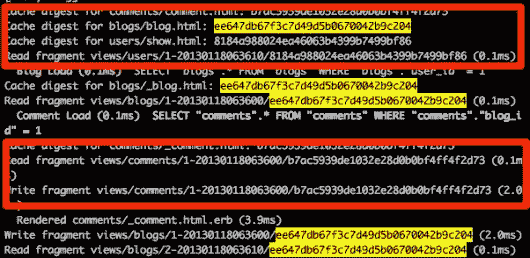
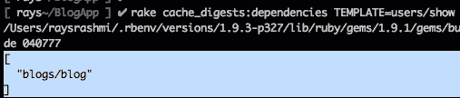
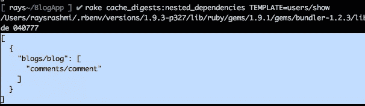

# 缓存和缓存摘要的基础知识

> 原文：<https://www.sitepoint.com/caching-cache-digest/>

这是对 Rails 中缓存的介绍。您可能知道 Rails“自动地”执行一些缓存，但是您不太确定这是什么意思。请继续阅读，寻找答案。

简而言之，缓存使我们能够快速访问值，而无需访问更昂贵的存储，如数据库。通过这种方式，我们可以提高 Rails 应用程序的性能。Rails 几乎可以缓存任何东西，从对象到页面到部分。

Rails 主要提供三种缓存技术。

*   页面缓存
*   动作缓存
*   片段缓存

在我们开始之前，请确保您已经在环境文件中启用了缓存。

```
config.action_controller.perform_caching = true
```

对于`production.rb`默认为真，对于`development.rb`和`test.rb`为假。

### 页面缓存

页面缓存是一种在文件中存储操作输出的机制。因此，当请求进来时，web 服务器可以不通过 Actionpack 作出响应。为了进行测试，我创建了一个示例应用程序。我生成了一个带有标题和描述属性的支架博客。在我们的博客控制器中，我们有一个索引操作，我们想缓存它。为了实现这一点，为我们希望缓存的动作调用 **caches_page** 方法。

```
class BlogsController < ApplicationController
  caches_page :index
  def index
    @blogs = Blog.all
  end
end
```

Rails 在/public 目录中创建了一个名为**blogs.html**的文件，当我们启动服务器并请求/blogs 时，Rails 将第一次访问的页面缓存在上述 blogs.html 文件中。此后的任何时候，您都会看到该缓存文件，如以下日志条目所示:

```
Write page /Users/rashmiyadav/crap/cache_digest_test/public/blogs.html (0.7ms)
```

如果您想缓存另一个动作，只需将它添加到方法 caches_page 中

```
caches_page :index, :show
```

为了使页面过期，我们可以缓存新版本，发出对 **expire_page:** 的调用

```
class BlogsController < ApplicationController
  caches_page :index
  def  index
    @blogs = Blog.all
  end
  def create
    expire_page :action => :index
    @blog = Blog.new(params[:blog])
    @blog.save
  end
  def update
    expire_page :action => :index
    @blog = Blog.find(params[:id])
    @blog.update_attributes(params[:blog])
  end
end
```

每当我们更新或创建记录时，它都会使索引缓存过期。您可以使用日志再次验证这一点:

```
Expire page /Users/rashmiyadav/crap/cache_digest_test/public/cache/blogs.html (0.2ms)  
```

expire_page 方法有许多参数，比如缓存页面的路径，比如“/blogs”，或者带有操作、控制器名称和过期格式的散列。

```
expire_page :controller => 'blogs', :action  => 'show', :format => 'json'
```

**配置**

默认情况下，Rails 将缓存文件存储在/public 目录中，但是我们可以更改它。简单的更改 config/application.rb 文件中的 **page_cache_directory** 值:

```
config.action_controller.page_cache_directory = Rails.public_path + "/cache" 
```

现在，所有缓存文件都将位于/public/cache 目录中。需要记住的一点是，如果您在开发中本地运行服务器，并且您的公共目录中有旧的缓存文件，服务器将继续在公共目录中获取旧的缓存文件。换句话说，不要忘记从公共目录中删除旧的缓存文件。

页面缓存的另一个配置项是缓存文件的扩展。缓存文件的扩展名取决于传入的请求。如果是 json，那么缓存文件将是。如果请求是 xml，那么缓存文件将是。‘XML’等等。如果一个请求没有任何特定的扩展名，那么默认情况下，它将得到一个。“html”扩展名。我们可以使用**config . action _ controller . page _ cache _ extension**进行配置。

页面缓存是加快应用程序速度的一种方式，但是如果您的内容位于身份验证之后，就不要选择页面缓存。让我们看看 Rails 中的其他缓存方法。

### 动作缓存

动作缓存类似于页面缓存，只是过滤器在缓存发生之前执行。让我们以博客应用程序为例:

```
class BlogsController < ApplicationController
  before_filter :authenticate
  caches_action :index
  def index
    @blogs = Blog.all
  end
end
```

我们调用 **caches_action** 来缓存索引操作。我们第一次点击链接 http://localhost:3000/blogs 时，会出现以下博客条目:

```
Write fragment views/localhost:3000/blogs (1.8ms)
```

现在，每次我们调用 index 操作时，它都会在给出缓存的响应之前运行 authenticate 方法。这是动作和页面缓存的主要区别。动作缓存在为缓存提供服务之前运行所有过滤器。

#### **缓存过期**

要使缓存过期，我们只需要调用 **expire_action:**

```
class BlogsController < ApplicationController
  caches_action :index
  def index
    @blogs = Blog.all
  end
  def create
    expire_action :action => :index
    @blog = Blog.new(params[:blog])
    @blog.save
  end
  def update
    expire_action :action => :index
    @blog = Blog.find(params[:id])
    @blog.update_attributes(params[:blog])
  end
end
```

当我们更新和创建一个记录时，它将使动作缓存过期。下面是相应的日志条目:

```
Expire fragment views/localhost:3000/blogs (59.0ms)
```

expire_action 方法采用与上述 expire_page 相同的参数:

```
expire_action(:controller => :blogs, :action => :show, :id => 25)
```

#### **配置**

如果我们需要基于某些条件缓存一个动作，我们可以通过使用:If 或:unless 和 proc 来实现。例如，如果我们不想缓存 json 请求的索引操作:

```
class BlogsController > ApplicationController
  caches_action :index, :if => Proc.new{|c|!c.request.format.json?}
  def index
    @blogs = Blog.all
    respond_to do |format|
      format.html # index.html.erb
      format.json { render json: @blogs }
      format.csv
    end
  end
end
```

我们还可以配置默认的缓存路径。

```
caches_action :show, :cache_path => { :project => 1 }
```

如果您传递:layout => false，它将只缓存您的操作内容。当您的布局包含动态信息时，这很有用。

### 片段缓存

页面缓存和动作缓存都缓存整个页面或整个动作，但是如果我们只需要缓存视图的一部分呢？这就是片段缓存发挥作用的地方。我们通常有一个动态内容的视图，所以我们不能存储整个页面。然而，很可能我们可以缓存页面的位，并根据需要使它们过期。

如果我们显示一篇带有他们评论的博客文章，我们可以自己缓存评论:

```
<div>
  <%= @blog.title %><%= @blog.desc %>
</div>

<%cache("blog_comments_#{@blog.id}") do%>
  <h3>Comments</h3>
  <% @blog.comments.each_with_index do|c, i|%>
    <div><%= c.value%><span><%= c.created_at.strftime('%B %d %Y')%></span></div>
  <%end%>
<%end%>
<%= link_to 'Add New comment', new_blog_comment_path(@blog)%>
```

添加新评论时，评论部分应该会发生变化，我们使用关键字“blog_comments_#{@blog.id}”)缓存它们。日志是这样写的:

```
Write fragment views/blog_comments_1
```

#### **缓存过期**

要终止这个缓存，调用 **expire_fragment** 方法。在这里，当一个新的注释被创建时，它被调用:

```
class BlogsController < ApplicationController
  def create
    @blog = Blog.find params[:blog_id]
    expire_fragment("blog_comments_#{@blog.id}")
    @comment = @blog.comments.new(params[:comment])
  end
end
```

#### **配置**

如果没有向缓存函数提供一个键名，那么 Rails 将基于控制器动作的名称缓存该块。在这种情况下，可以通过调用 expire _ fragment(:controller = > ' blogs '，:action => 'show ')使缓存过期。

这显然会产生冲突，如果

*   我们也缓存动作
*   并且每个动作具有多个片段高速缓存

我们可以添加一个动作后缀来避免这种冲突:

```
cache(:action => 'show', :controller => 'blogs', :action_suffix => 'blog_comments' )
```

要使缓存过期，请执行以下操作:

```
expire_fragment(:controller => 'blogs', :action => 'show',:action_suffix => 'blog_comments')
```

#### **扫地机**

在控制器动作中调用 expire 方法不是一个好主意。Rails 为这个到期过程提供了另一种机制:[清扫器](http://guides.rubyonrails.org/caching_with_rails.html#sweepers "Sweepers")。清道夫负责过期缓存。它们观察模型，并执行 sweeper 中定义的回调。

例如，我创建了一个 blog_sweeper.rb 文件:

```
class BlogSweeper < ActionController::Caching::Sweeper
  observe Blog
  def after_update(blog)
    expire_action(:controller => :blogs, :action => :index)
  end
  def after_create(blog)
    expire_action(:controller => :blogs, :action => :index)
  end
end
```

但是我们需要在控制器中调用这个清理器，以便在控制器中调用 cache_sweeper 方法

```
class BlogController < ApplicationController
  cache_sweeper :blog_sweeper, :only => [:index]
end
```

## **缓存摘要**

缓存摘要是处理片段缓存的更好方式。它基于一个**俄罗斯娃娃**方案，这意味着，当你有嵌套的缓存片段和嵌套的内容发生变化时，只让该内容的缓存过期，重用缓存的其余部分。这是我们同一个博客应用程序中的一个例子。我们模型结构看起来像:

```
class User < ActiveRecord::Base
  has_many :blogs
end
# Blog model
class Blog < ActiveRecord::Base
 has_many :comments
 belongs_to :user, :touch => true
end
#comment model
class Comment < ActiveRecord::Base
 belongs_to :blog, :touch => true
end
```

我们在这里使用 touch 选项，所以如果我们更新评论，博客将获得一个新的 updated_at 值。

这里是“users/show.html.erb ”,显示用户的详细信息及其博客和评论:

```
<%cache @user do%>
  <div>  Name:<%= @user.name %></div>
  <div>  Email:<%= @user.email %></div>
  <%= render @user.blogs%>
<%end%>
<!-- 'blogs/blog.html.erb' -->
<%cache blog do%>
  <div><%= blog.title %></div>
  <div><%= blog.desc %></div>
  <%= render blog.comments%>
<%end%>
<!-- 'comments/comment.html.erb' -->
<%cache comment do%>
  <%= comment.value %>
<%end%>
```

你可以看到我们缓存了博客内部的评论和用户内部的博客。在一个示例中，我们有一个用户，他有 2 篇博客文章和 1 条评论，缓存键如下所示:

```
views/users/1-20130118063610
views/blogs/1-20130118063600
views/comments/1-20130118063600
views/blogs/2-20130118063610
```

它是视图路径、对象 id 和上次更新时间戳的组合。这种组合确保了如果模型被更新，缓存将总是过期。如果我们添加一个新的博客或者编辑一个博客，它将会使用户的缓存和博客缓存过期。因为我们在博客模型中使用了触摸选项。

同样，如果我们添加或编辑一个评论，一切都会过期。然而，如果我们改变了视图本身的任何东西，比如一个新的样式，重新加载页面将不会反映这个变化，因为我们的缓存键没有过期。我们可以通过保留缓存键的一个版本并根据需要更改该版本来缓解这一问题。

```
<%cache ['v1', @user] do%>
  <div>Name:<%= @user.name %></div>
  <div>Email:<%= @user.email %></div>
  <%= render @user.blogs%>
<%end%>
<!-- 'blogs/blog.html.erb' -->
<%cache ['v2',blog] do%>
  <div><%= blog.title%></div>
  <div><%= blog.desc %></div>
  <%= render blog.comments%>
<%end%>
<!-- 'comments/comment.html.erb' -->
<%cache ['v3',comment] do%>
  <%= comment.value %>
<%end%>
```

每次修改视图时，我们都需要更新缓存键的版本。现在我们有更多的问题:

*   我们需要记住模板的版本号
*   如果修改了子模板，则应更改父模板版本。
*   如果同一个部分在不同的视图中使用，那么就很难维护版本

不要慌！Rails 总是试图让事情变得更简单。在 Rails 4 中，添加了 cache_digests 来维护嵌套的片段缓存。

有了缓存摘要，当我们拥有嵌套片段缓存时，我们实际上不需要担心缓存过期和版本控制。顺便说一下，您可以在 Rails 3 中使用缓存摘要。将 cache_digests gem 添加到您的 gem 文件中。

```
<%cache @user do%>
  Name:<%= @user.name %>
  Email:<%= @user.email %>
  <%= render @user.blogs%>
<%end%>
<!-- 'blogs/blog.html.erb' -->
<%cache blog do%>
  <%= blog.title %>
  <%= blog.desc %>
  <%= render blog.comments%>
<%end%>
<!-- 'comments/comment.html.erb' -->
<%cache comment do%>
  <%= comment.value %>
<%end%>
```

渲染用户的节目时会生成一个类似于
的日志

users/show 的缓存密钥以模板本身及其所有依赖项的 MD5 为后缀。如果我们在任何视图(users/show、_blog 或 _comment)中更改任何内容并重启服务器，它将自动终止缓存密钥并重新计算新的缓存密钥。

在生产中，我们不需要担心，因为每次我们部署应用程序时，它都会重新启动服务器。

#### **检查模板的依赖关系**

为了检查视图的依赖性，cache_digests gem 提供了两个 rake 任务

1.*rake cache _ digests:dependencies TEMPLATE = users/show*

通过运行上述任务，我得到了以下输出



它只提供用户/显示视图的依赖关系。

*2。rake cache _ digests:nested _ dependencies TEMPLATE = users/show*给出输出



它为您提供了 user/show 视图及其所有嵌套视图的依赖关系。

其他调用依赖关系的方式:

1.我们可以在 render 中调用一个方法，显式地提到部分名称和集合。例如:

```
<%= render @user.last_one_month_blogs%>
```

所以我们需要在这里提到部分名称和集合

```
<%= render :partial => 'blogs/_blogs', :collection => @user.last_one_month_blogs%>
```

2.如果我们在渲染调用中使用了一个助手。然后我们需要使用一个注释来指定模板的依赖关系

```
<%# Template Dependency: comments/comment %>
<%= render_comments(blog)%>
```

### **总结**

基本上，我想解释 Rails 中的缓存以及有多少种方式可以实现缓存。

更多资源:

*   [http://railscasts.com/episodes/90-fragment-caching-revised](http://railscasts.com/episodes/90-fragment-caching-revised "http://railscasts.com/episodes/90-fragment-caching-revised")
*   [http://guides.rubyonrails.org/caching_with_rails.html](http://guides.rubyonrails.org/caching_with_rails.html "http://guides.rubyonrails.org/caching_with_rails.html")
*   [http://railscasts.com/episodes/387-cache-digests](http://railscasts.com/episodes/387-cache-digests "http://railscasts.com/episodes/387-cache-digests")
*   [http://blog . remarkable labs . com/2012/12/Russian-doll-caching-cache-digests-rails-4-2013 倒计时](http://blog.remarkablelabs.com/2012/12/russian-doll-caching-cache-digests-rails-4-countdown-to-2013 "http://blog.remarkablelabs.com/2012/12/russian-doll-caching-cache-digests-rails-4-countdown-to-2013")

## 分享这篇文章