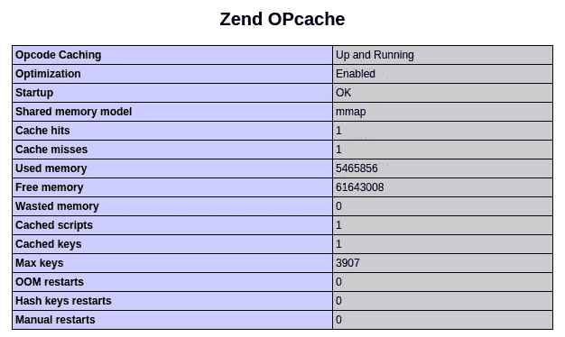
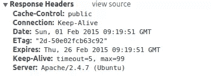
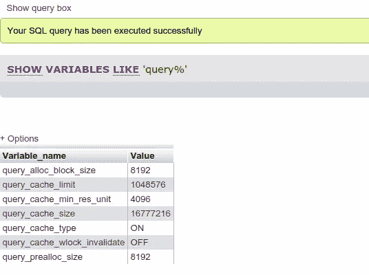
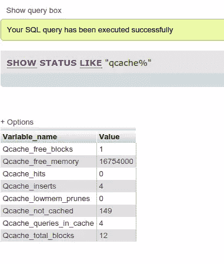

# 缓存帽子戏法:Zend Opcache、Etags 和查询缓存

> 原文：<https://www.sitepoint.com/caching-hat-trick-zend-opcache-etags-and-query-caching/>

在本文中，我们将探讨 PHP 中一些常见的缓存技术:Opcache、Expires 头和 MySQL 中的查询缓存。我们将在第 2 部分中研究其他方法。


## PHP 的请求生命周期

在我们继续之前，理解 PHP 的请求生命周期很重要。当你从浏览器访问一个 PHP 文件时，幕后发生了什么？

1.  从文件系统中获取一个文件—自上次请求以来，它是否发生了更改并不重要。
2.  词法分析——人类可读的代码被转换成解析器可以理解的东西(标记)。
3.  解析–对机器可读的字符串进行分析，找出潜在的错误。这就像语法检查一样。
4.  操作码创建——我们从步骤 2 中获得的令牌被转换成机器可执行代码。
5.  机器代码执行–机器代码被处理然后执行。

要获得更深入的解释，请查看这篇关于 PHP 如何回应 Hello World 的文章。

所有这些步骤都发生得非常快，但是在每个请求上都浪费了大量的时间和资源。这是因为对于服务器上每个 PHP 文件的每个请求，服务器都必须检查它们。

我们将在这两篇文章中讨论的缓存技术有助于绕过第 2、3 和 4 步。这意味着浪费的时间和资源更少，从而为用户带来更快的页面加载速度。

## Zend Opcache

我们要看的第一个缓存工具是 Zend Opcache。

它预装了 PHP 5.5 和更新版本。如果从您的终端运行`php --version`得到如下结果，您就可以开始了:

```
Zend Engine v2.5.0, Copyright (c) 1998-2014 Zend Technologies
    with Zend OPcache v7.0.3, Copyright (c) 1999-2014, by Zend Technologies
```

或者，您可以创建一个新的 PHP 文件，调用`phpinfo()`，然后从您的浏览器访问该文件。查找“Zend Opcache”。它应该会给你类似如下的东西:



### 激活

一旦你确认 Zend Opcache 已经安装，你就可以通过打开你的`php.ini`文件来启用它，然后搜索术语‘op cache’，取消注释`opcache.enable=0`并将其值设置为`1`:

```
[opcache]
; Determines if Zend OPCache is enabled
opcache.enable=1
```

不要忘记重启 PHP 来激活更改。

如果你使用的是低于 5.5 的 PHP 版本，你仍然可以通过 PECL 安装来利用 Zend Opcache。您可以通过执行以下命令来实现这一点:

```
pecl install zendopcache-beta
```

### 配置

您可以通过在基于 Debian 的发行版上编辑`/etc/php5/mods-available/`下的`opcache.ini`文件来配置 Zend Opcache。默认情况下，配置文件包含以下内容:

```
; configuration for php ZendOpcache module
; priority=05
zend_extension=opcache.so
```

以下是最重要的配置选项，您可以根据自己的喜好进行调整:

*   **op cache . memory _ consumption**–使用的共享内存存储的大小。这以兆字节表示，默认为 64。你可以更高，这取决于你的服务器有多强大，以及你认为你的应用程序需要多少内存。

*   **op cache . interned _ strings _ buffer**–用于存储被拘留字符串的内存量，也以兆字节为单位。内联字符串是一种在内存中仅存储每个唯一字符串的单个副本的方法。

*   **op cache . max _ accelerated _ files**–op cache 可以加速的最大文件数。只允许 200 到 100000 之间的数字。

*   **op cache . revidate _ freq**–检查 PHP 文件更改的秒数。给它一个值`1`意味着每秒钟检查一次变化，但是每个请求只检查一次。`0`表示它将始终检查更改。这是开发环境的最佳设置。

*   **op cache . max _ file _ size**–允许从缓存中排除大文件。默认情况下，它的值为`0`，这意味着所有文件都被缓存。该选项的值以字节表示。

*   **op cache . fast _ shut down**–启用时，解构器在每个请求结束时获得速度提升。这意味着后续请求变得更快。默认设置为`0`。将其设置为`1`将启用它。

这里有更多的配置选项: [OPCache 运行时配置](http://php.net/manual/en/opcache.configuration.php)。

要检查 opcache 是否正常工作，您可以通过从终端执行以下命令来安装 [opcache-gui](https://github.com/amnuts/opcache-gui)

```
composer require amnuts/opcache-gui
```

安装完成后，您可以将`index.php`文件从`vendor/amnuts/opcache-gui`目录复制到所需项目目录的根目录，并从您的浏览器访问它。然后，它会向您显示类似如下的内容:


它将向您显示内存使用情况、命中率以及您已经设置的配置选项。您也可以手动重置缓存或使文件无效。

## 过期标题

我们还可以使用 Apache 进行缓存(在本节的最后给出了 Nginx 的说明)。使用 Apache，我们主要可以缓存静态文件，如样式表、脚本文件、图像和其他媒体文件。

默认情况下，Apache 使用 etags。这些是在响应头中发送的文件的散列。如果 etag 相同，浏览器不会再次请求该文件，而是使用缓存的版本，直到 expires 头的默认值大于或等于客户端计算机上的时间。但是当您对文件进行更改时，etag 会发生变化，浏览器将不得不再次从 Apache 请求该文件。这一切都很好，但是我们可以通过指定到期时间来更进一步。这样，我们可以让浏览器在更长的时间内保存文件的缓存版本。

通过 Apache 指定一个 expires 头，告诉浏览器在一段特定的时间内缓存静态资源。

要启用该功能，您必须首先启用`expires`模块。您可以通过从终端执行以下命令来实现这一点:

```
sudo a2enmod expires
sudo service apache2 restart
```

第一行启用 expires 模块，第二行重启 Apache 以使更改生效。

完成后，你可以使用虚拟服务器配置文件中的 expires 头，通常位于`etc/apache/sites-available`或类似的地方——查看你的安装文档。

打开服务器配置文件，查找`Directory`指令，找到与您设置 etags 的项目相对应的目录。在那里，您可以开始使用 expires 模块:

```
&lt;IfModule mod_expires.c&gt;
ExpiresActive On
ExpiresDefault &quot;access plus 1 day&quot;
ExpiresByType image/png &quot;access plus 10 days&quot;
ExpiresByType text/css &quot;access plus 25 days&quot;
&lt;/IfModule&gt;
```

第一行和最后一行是一个包装器，我们在这里检查`mod_expires`模块是否已经启用。在第二行中，我们指定想要开始使用该模块。第三到第五行是我们定规则的地方。以下是每个选项的功能描述:

*   `ExpiresDefault`–允许您指定所有静态文件的默认过期规则。这将接受您希望浏览器保留文件的最大时间范围。

*   `ExpiresByType`–允许您根据文件类型指定过期时间。它接受 mime 类型作为第一个参数，过期时间作为第二个参数。

你现在可以使用 Chrome 开发者工具中的网络标签来检查它是否已经根据你指定的设置更改了 Expires 头的值。下面的截图是一个样式表。该页面是在 2015 年 2 月 1 日查看的，因此我们只需在此基础上增加 25 天，便可获得到期日期:



要为 Nginx 配置到期头，请看[这篇精彩的帖子](https://serversforhackers.com/nginx-caching/)。

## MySQL 查询缓存

对于主要从数据库读取数据的 web 应用程序，您可以利用查询缓存。这将 SQL 查询的解析版本及其相应的结果集放入缓存中，从而使使用相同查询集的后续页面请求更快地检索结果。这是因为您的应用程序不再需要去数据库解析查询并获取结果。

对于低于 5.6.8 的 MySQL 版本，默认情况下启用查询缓存。您可以通过从终端执行以下命令来检查您安装了哪个版本:

```
mysql --version

mysql  Ver 14.14 Distrib 5.5.41, for debian-linux-gnu (x86_64) using readline 6.3
```

### 配置查询缓存

在这种情况下，版本是 5.5.41，所以我知道查询缓存是启用的。如果您有版本 5.6.8 和更高版本，您需要启用它。您可以通过编辑配置文件来做到这一点。在 Ubuntu 上，在`/etc/mysql/my.cnf`里。

打开文件后，尝试找到字符串`# * Query Cache Configuration`。如果存在，将您的配置放在它下面。如果没有，则导航到文件的底部并添加它:

```
# * Query Cache Configuration
query_cache_type             = ON
query_cache_min_res_unit     = 4096
query_cache_limit            = 1M
query_cache_size             = 16M
query_cache_wlock_invalidate = OFF
```

请注意，上面示例中的值是 MySQL 版的默认配置，因此您必须根据您的需求和服务器的容量来更改它们。调整配置的一般规则是，如果数据库频繁更新，不要使用非常高的值，因为一旦更新，就需要花费更长的时间来使缓存中的项目无效。为了让你知道你能为每一项设置多少，下面是对每一项的简要描述。请注意，当使用整数值而不添加单位(如 M(表示 MB))时，它以字节表示:

*   `query_cache_type`–允许您指定是否启用查询缓存。您可以将该值设置为`ON`或`OFF`。
*   `query_cache_limit`–每个查询可以缓存的结果集的最大大小。请注意，当特定查询的结果集超过该选项中指定的值时，它根本不会包含在查询缓存中。
*   `query_cache_min_res_unit`–可分配用于存储查询的最小内存量。
*   `query_cache_size`–查询缓存的总大小。
*   `query_cache_wlock_invalidate`–允许您指定当特定表被锁定写入时，是否使查询缓存失效。您可以将该值设置为`ON`或`OFF`。

调整完查询缓存配置后，现在可以通过执行以下查询来检查它是否确实在工作:

```
show variables like 'query%';
```

这将返回类似如下的结果:



请注意，所有整数值返回的结果都以字节表示。

### 测试查询缓存

在您当前正在使用的机器上的一个数据库中执行一个`SELECT`查询。

接下来，执行以下查询:

```
SHOW STATUS LIKE  &quot;qcache%&quot;;
```

这将向您显示类似于以下内容的内容:



记下您获得的值，然后执行您之前执行的相同的`SELECT`查询。如果您使用的是 phpmyadmin，那么只需点击查询框下的刷新链接。

您也可以对`SHOW STATUS`查询做同样的事情。它现在应该已经增加了`Qcache_free_memory`、`Qcache_hits`、`Qcache_inserts`、`Qcache_not_cached`、`Qcache_queries_in_cache`和`Qcache_total_blocks`的值。如果这些值增加了，那么查询缓存正在工作。

### 查询缓存捕获

使用查询缓存时，需要记住以下几点:

*   它只适用于`SELECT`查询。`SHOW`查询不会被缓存，因为它们通常用于获取配置值或关于服务器本身的一般信息。

*   为了使缓存工作，查询应该完全相同。这意味着，如果您更新了同一个查询的一个字符，它将被认为是一个不同的查询，这意味着它不会命中缓存。

*   只有确定性查询可以利用缓存。这意味着像`RAND()`或`CONNECTION_ID()`这样的函数或任何其他在同一查询的每次后续执行中改变结果的函数都不能利用查询缓存。

*   表更新(如插入新行、更新表模式或更新行)会自动使查询缓存失效。

## 结论

在这一部分中，我们研究了 PHP 和 MySQL 中常用的一些缓存技术。在接下来的文章中，我们将看看其他一些可以进一步加速我们的应用程序的软件——Varnish、Memcached 和一些 PHP 缓存库。敬请期待！

## 分享这篇文章