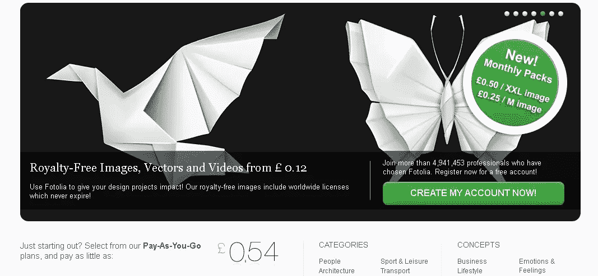
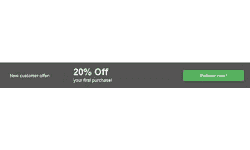
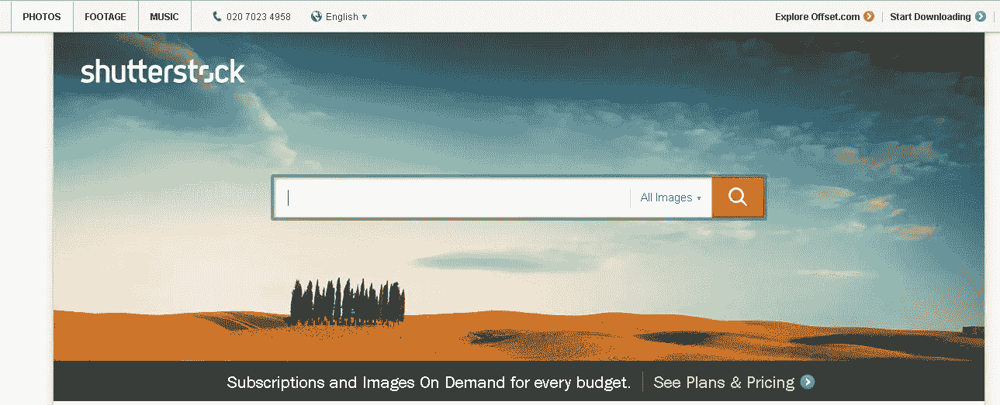
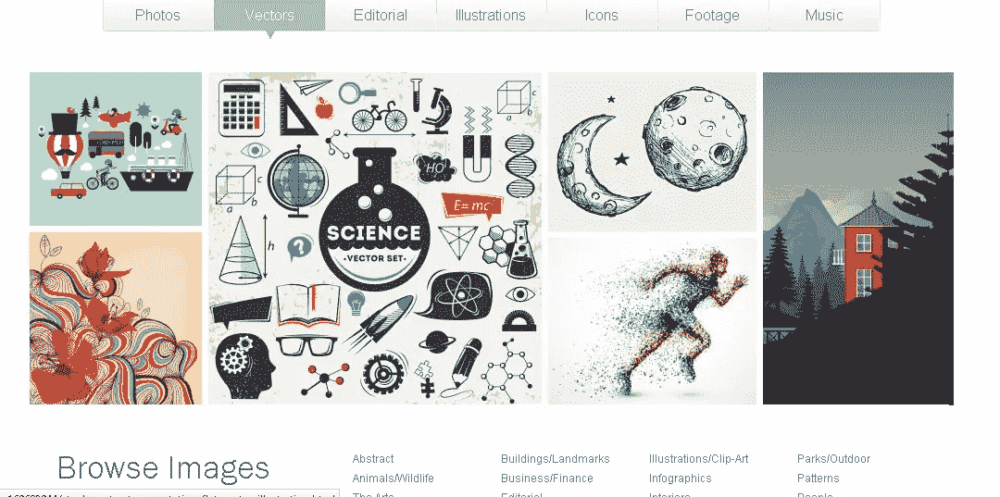

# 笼赛！股票摄影网站短兵相接:第二部分

> 原文：<https://www.sitepoint.com/cage-match-stock-photography-sites-go-head-head-part-2/>

在我们的股票摄影网站“笼子比赛”的第一部分中，我们仔细观察了“T2”istock photo 和“T4”123 RF，看看他们在比赛中是如何比赛的。

正如我们在第一部分中所做的那样，我们将从三个方面对每个站点进行评级:

*   可用性/用户界面设计
*   等值
*   可用范围

**快速回顾:**两个网站都表现良好，在最终得分方面几乎没有什么，iStock 得分为 4/5，123RF 以 4.5/5 的得分击败了旧网站。

关键时刻，123RF 绝对物有所值。这两个网站都提供了大量的图片，123RF 由于经常添加新图片而表现稍好。

总的来说，这是一场势均力敌的比赛，我确实倾向于认为这些网站质量都很好，其中许多网站在搜索、美学和股票方面都提供了类似的体验。

* * *

今天，我们将会关注另外两个网站:Fotolia 和 Shutterstock，这两个名字我相信你们很多人已经很熟悉了。同样，我们会根据每个网站的优势和劣势给每个网站打分，并且我们会将搜索范围限制在图片和插图上。

## 3 号站点:Fotolia

[Fotolia](http://en.fotolia.com/ "Fotolia") 成立于 2005 年，总部位于纽约，是一个基于社区的股票图片网站，拥有超过 2900 万张众包照片、矢量图片、插图和视频。

该网站声称“致力于”为其超过 400 万的庞大用户群提供负担得起的内容。

Fotolia 将其成功归功于由艺术家、摄影师、平面设计师组成的庞大社区，以及与其合作的知名机构的精选名单。上传到网站上的图片都是经过审核的，这确保了股票标准的连续性。在这个网站上可以找到大量的图片，而且你似乎很难在这里找到你想要的东西。

除了在价格上具有竞争力，Fotolia 还声称向其摄影师和艺术家支付市场上最高的佣金，该网站每年有数百万次下载。找到的图像都是免费提供的，因此可以用于任何设计或文件项目，对图像的使用没有时间限制。

该网站是世界上第一个在同一个网站上提供众包图片和专业图片的网站，它的成功是显而易见的，因为它现在是一个全球关注的 15 种语言和 23 个地区的网站。

### 定价

Fotolia 的定价结构与 iStock 相似，与 123RF 相比，似乎有点偏贵。有两种支付方式可供选择，您可以使用现收现付积分系统支付，也可以按月订购。无论哪种方式，你都必须先在网站上注册，然后才能购买任何图片。

#### 信用

最低购买额度为 10 个额度，这些额度可以在购买后的 365 天内使用。每个信用值大约不到一美元，但是当然你很可能需要至少几个信用值来购买一张图片。

目前，该网站为新客户提供 20%的折扣，所以如果你还没有帐户，那么出于这个原因，以折扣价获得一些像样的图片可能是值得加入的。也就是说，如果你是批量购买，这才是真正值得的。

#### 捐款

说到订阅，你可以选择每日或每月计划，这两种计划都允许你从可供订阅者使用的 2500 万个文件中下载最高分辨率的图像。订阅都是自动续费的，所以如果你考虑试用的话，这是你一定要知道的。

毕竟，我们都注册了一些东西，很少使用它，然后担心意外的现金会离开我们的账户。

Fotolia 还为一年内使用超过 10，000 张图片的公司提供定制计划。但是，您需要直接调用以便能够设置和访问它。

每日订阅可以让你每天下载 25 到 250 张图片，每张图片或矢量大约 0.20 美元。每月订阅更加灵活，允许你每天下载 5 到 5000 个文件，根据 Fotolia 的说法，这是它最受欢迎的定价方案。

每月计划中的高分辨率图像和向量每个文件的成本约为 0.70 美元，每个月中所有未使用的下载都将滚动到下个月，这样，如果你度过了一个平静的月份或正在度假，你就不会失去机会。

但是，这仅适用于您的帐户仍然有效并且您在下个月续订的情况。

订阅可以一次购买 1 个月、3 个月或 6 个月，也可以购买一整年，订阅时间越长，为图片支付的费用就越少。

对于每日订阅套餐，您可以选择您每天想要的下载量，从 25 到 500，选择您希望订阅运行多长时间(以月为单位),并相应地支付费用。一个月/25 张图片的基本计划的价格从 250 美元左右开始，一个月/500 张图片的价格高达 3，825 美元。

月套餐从每月 5 张 XXL 图片的 25 美元起，到每月 1000 张 XXL 图片的 875 美元左右。

你可以选择个人计划，这是孤独的自由职业者的理想选择，或者可以选择开设一个多用户账户，允许一家公司共享订阅。这是一个方便的补充，因为这意味着管理员可以将下载分配给不同的设计师，同时保持对购买内容的控制。

总而言之，定价似乎比 iStock 低一点，但不如 123RF 合理。然而，根据目前对新客户的报价，如果你想以折扣价下载一些股票，还是值得一试的。

#### 评分:4/5

### 搜索性能

使用相同的关键术语“商业”首先从网站返回的结果很快，他们是相关的术语和高质量的。有超过 300 万张图片、矢量和插图可供浏览。

同样，在页面左侧，您可以通过以下方式进一步优化结果:

*   概念
*   颜色
*   种类
*   近期(一周到两年)
*   集合(标准、无限、即时、订阅)
*   文件类型
*   人(有，没有)
*   方向
*   大小
*   最高价格
*   描述的

因此，细化选项相当全面，可以真正帮助你磨练你的搜索，而不是通过数千页的结果。同样，搜索结果会显示在平铺的页面上，悬停时会显示更大的图像，或者您可以单击以购买该图像。

还有一个通常的下拉菜单，允许你按相关性、最新等进行排序。

第二次搜索“平板电脑”也表现不错，返回了超过 109，000 个结果；这个网站当然也不缺少图片。

#### 评级 4.5/5

### 用户界面

这个网站在首页上与我们目前看到的其他网站有一点不同，虽然它在页面顶部有一个大图片，但在下半部分没有平铺效果。

这意味着它可能不像我们到目前为止看过的其他两个网站那样美观。首页以“类别”和“概念”作为文本链接，左侧是一些定价信息，还有一个显示三个小“每日图片”的方框，这些图片不是特别清晰。

这是一种耻辱，就好像你是这个社区的一员，并且以这种方式出现，那么你会希望图像以一种吸引人的方式显示出来，但事实并非如此。图像在悬停时显示得更大，但我觉得这对艺术家/摄影师和网站访问者来说都可以做得更好。

至于导航，这是简单易用的，顶部的下拉菜单可以带你到网站的各个部分，页脚区包含其他信息，如关于我们等。你也可以通过收藏来浏览，但是我个人不像前两个网站那样喜欢这里的布局。

#### 评分 3/5

### 图像的选择

从搜索返回的结果来看，该网站似乎比 iStock 拥有更多的图片，同时可能与 123RF 不相上下。图片的质量非常好，这无疑要归功于网站雇佣的全球版主。

同样，你在网站上寻找图片时不会吃亏，如果 Fotolia 确实在摄影师和艺术家方面比其他任何网站支付的都高，那么这可能足以说服我使用这个网站而不是 iStock，特别是因为 iStock 遭受的争议。

#### 评分 5/5

#### 总体评分:4/5

Fotolia 是一个很好的网站，可能不如其他两个漂亮，但它仍然很直观，有一个很好的图片选择，由社区经常更新。

就价格而言，它与 123RF 不相上下，比 iStock 便宜，因此绝对具有竞争力，值得考虑，特别是考虑到它给会员的报酬很高。

## 网站#4: Shutterstock

在谷歌上输入 Shutterstock，我看到了两个登陆页面，这还是第一次。我看到的第一个页面是一个非常干净的注册页面，如上图所示，它使用了《成长黑客》中的原则:一个漂亮干净的页面，有一个清晰的行动号召。

我来到的第二个页面是实际的网站，它同样干净，设计良好，美观。

Shutterstock 本身成立于 2003 年，这使它与 iStock 一起成为股票照片世界的先驱之一。它目前在全球 150 多个国家有网站，使用 20 种语言。同样，该网站寻求将创意专业人士与来自全球贡献者的最佳图像、插图、视频和矢量结合起来。

该网站是高度可视化的，严重依赖图像来为它说话，这确实是一个关于照片的网站应该做的。它的重点是摄影，而不是矢量和视频，它甚至在“关于我们”页面上展示了员工的照片，这是一个很好的接触，给网站带来了人性化的一面。

Shutterstock 有一个巨大的图片收藏，目前大约有 3500 万张，并且还在快速增长。总而言之，这个网站在设计和展示方面考虑得更多。

### 定价

Shutterstock 不使用信用系统，而是在“许可”的基础上工作。您可以从标准或增强许可证中进行选择，标准选项还提供“按需”功能，允许您一次购买 5、12、25 或 60 张图像。

这些照片的价格从 50 美元到 235 美元不等，有大图和小图可供选择。

标准许可证允许您在 25 天的订阅期内每天下载多达 25 张各种大小的图像，价格从每月 255 美元到全年 2600 美元不等。这是迄今为止我们看过的所有网站中最不容易混淆的价格选项，而且看起来也非常有竞争力。

总的来说，我喜欢这种干净简单的定价方法，对于那些不熟悉库存照片定价模型的人来说，信用模型非常令人困惑，经常导致人们为他们选择的图像支付比他们想象的更多的钱。

#### 总体评分 5/5

### 搜索性能

搜索又一次变得直观和快捷，返回了超过 400 万个搜索结果。首页返回的图像都是高度相关的，并再次以一个漂亮的平铺布局呈现，一个更大的图像出现在悬停上。

然而，该网站缺少的是现在页面左侧熟悉的“优化搜索”菜单。经过一番搜索后，我发现了顶部搜索框旁边的一个链接，当点击它时，会返回一个下拉菜单，其中提供了过滤选项。

不过这不是很清楚，我花了一两秒钟才找到。这对于一些用户来说可能是一个不利因素，因为我们真的不想太费力地去寻找一些应该很明显的东西。在这一点上，我相信其他网站是正确的。

过滤选项也不像其他网站那样全面，选项有:

*   图像类型
*   种类
*   方向
*   关键词
*   投稿人姓名(真的？我想那不会流行……)
*   人
*   编辑的
*   颜色

过滤菜单也在图片上方下拉，这并没有给我留下特别深刻的印象。

对平板电脑的搜索同样令人印象深刻，尽管可能不如 Fotolia，因为它返回了 80，000 多个结果。

#### 评分 4/5

### 用户界面

我真的很喜欢这个网站的外观和感觉。这个设计干净而现代，就像罐头上说的那样——这是一个摄影/图像网站，一登陆这个网站就能立刻看出来。

首页很大，包含了你需要的所有信息，但又不太显眼，并且包含了精心布置的图片以及带你去各种类别的文本链接等等。就其呈现方式而言，这是迄今为止我个人最喜欢的，唯一真正让它失望的是上面列出的过滤搜索结果的链接。

对我来说，这总的来说让 UI 失望了，因为它需要寻找用户应该被引导到哪里。

浏览网站也不会令人失望，所有的类别都有清晰的图片，价格信息也清晰地显示在网站上。

#### 评级 4.5/5

### 图像的选择

Shutterstock 拥有比其竞争对手更多的精彩图片选择，这从它返回的搜索结果中可以清楚地看出。这个网站比其他任何网站都有更多的图片，可能唯一不利于它的是，它的搜索细化功能以及难以找到的特点比其他网站稍微不太全面。

不过总的来说，你不会对选择感到失望，Shutterstock 现在也允许你搜索音乐，这很新颖，如果不是有点令人费解的话。

#### 评级 4.5/5

### 总体评分 4.75/5

我真的很喜欢 Shutterstock，它对我来说绝对是最好的，即使缺乏一个清晰的细化功能。我喜欢这个网站的外观和感觉，简单的定价模式和图片选择。

虽然我也喜欢大多数其他网站，但 Shutterstock 比它们稍逊一筹，在每个股票照片网站的外观上，它确实打破了常规。

尤其是定价模型，它消除了困惑，我经常觉得这几乎是为了让人们对信用体系感到困惑而设计的，因为许多人认为一个信用等同于一个图像——当然这永远不会发生。

所以，这就是我的想法，也是我对一些最著名的图片来源网站的总结。

如果你错过了我们的股票摄影网站笼子比赛的第一部分，你可以在这里阅读我们对 T2 和 T4 的想法。

请随时在评论区分享你的想法，如果你同意，或者有相对未被发现的照片网站可以与我们分享，请告诉我们！

## 分享这篇文章