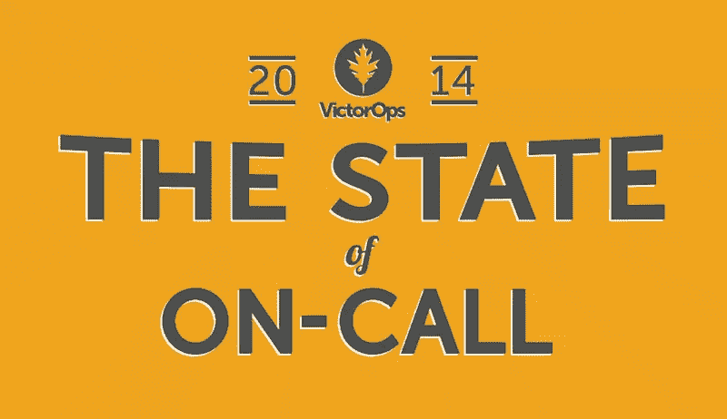

# 随叫随到糟透了:证据

> 原文：<https://www.sitepoint.com/call-sucks-proof/>

*本文由 [VictorOps](http://victorops.com/?utm_source=Online%20Advertising&utm_medium=SitePoint%203rd%20party%20content&utm_campaign=SitePoint) 赞助。感谢支持 SitePoint 的赞助商。*

在 devops 中工作有时意味着几个小时、几天以及整个周末随叫随到，以防您的应用程序在关键时期出现问题。虽然一些 devops 团队已经成功地适应了随叫随到的流程，但大多数团队发现随叫随到对他们的团队来说是一种压力。

VictorOps 的使命是解决软件团队面临的最严峻的挑战，这些团队要求其成员随叫随到。他们最近调查了 devops 世界中的 500 多人，询问他们如何处理随叫随到流程。

## 他们发现了什么

### 对于一些人来说，随叫随到是有压力的…

担心您的团队发现很难在待命时保持最高效率？你肯定不是一个人。事实上，VictorOps 调查中最常见的发现之一是，随叫随到是一个发展缓慢且通常效率低下的过程。一些参与者甚至说，与随叫随到相关的问题对他们来说并没有改善，反而变得更糟了。这些随叫随到的困难会导致什么？一些受访者提到了婚姻、家庭和其他与家庭生活相关的紧张关系，这说明了随叫随到的过程有多困难。

### 对其他人来说是小菜一碟

其他参与者在随叫随到的过程中似乎没有任何问题。对他们来说，帮助客户和这份工作的兴奋似乎让一切都值得。

### 自动化正在兴起

在接受调查的 500 多家公司中，超过一半正在使用基础设施自动化工具，许多人发现这些工具有助于减轻随叫随到的痛苦。

### 国产的可能不是最好的…

如果您发现您在整个电话呼叫过程中使用的工具和流程有问题，可能是时候让您的团队转向 SaaS 解决方案了。根据该报告，70%的人使用自主开发的工具来解决随叫随到的问题，几乎 50%的人不知道他们为当前的解决方案支付了多少费用。大多数受访者对随叫随到的自制系统不满意。虽然新的工具和解决方案正在出现，但大多数待命团队尚未转变。这可能是参与随叫随到流程的人员面临挑战的最大原因之一。

### 但是警惕疲劳更糟糕

我们大多数人都遇到过被监控警报淹没的情况，其中大多数都是假警报。事实上，在接受调查的人中，64%的人认为多达四分之一的警报是虚假的。除了令人讨厌的处理，假警报可能是昂贵的。你问有多贵？VictorOps 数据显示，仅在一年内，虚假警报就可能让您的组织损失超过 100，000 美元。

### 问题在聊天室解决

当真正的警报出现时，每个软件团队都有自己的解决方法。然而也有相似之处，大多数团队可能会通过 1-5 名参与者在聊天平台上交流来解决问题。

### 当烟雾散去

问题解决后会发生什么？根据 VictorOps 最近的调查:没有。遗憾的是，75%的被调查者只会在重大停机和其他严重错误后进行回顾。想要避免停机时间？VictorOps 的数据显示，在每一个问题之后都进行回顾的公司，不管问题有多么微不足道，都更有可能减少停机时间，也更少出现错误警报。

## 了解更多信息

从 VictorOps 的这份见解深刻的报告中可以学到很多东西，尤其是如果您目前正在为随叫随到的过程而苦恼的话。点击此处从 VictorOps 下载完整报告！

## 分享这篇文章