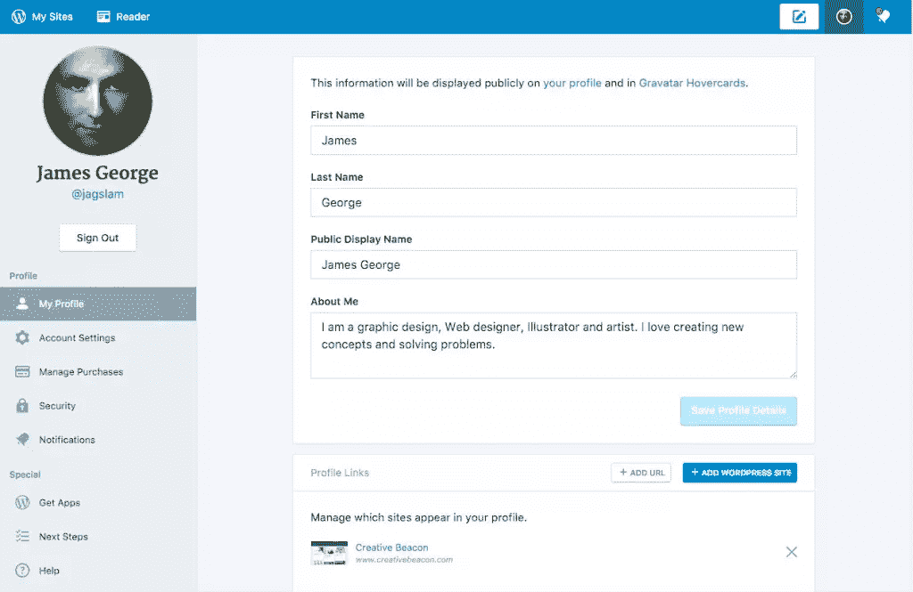
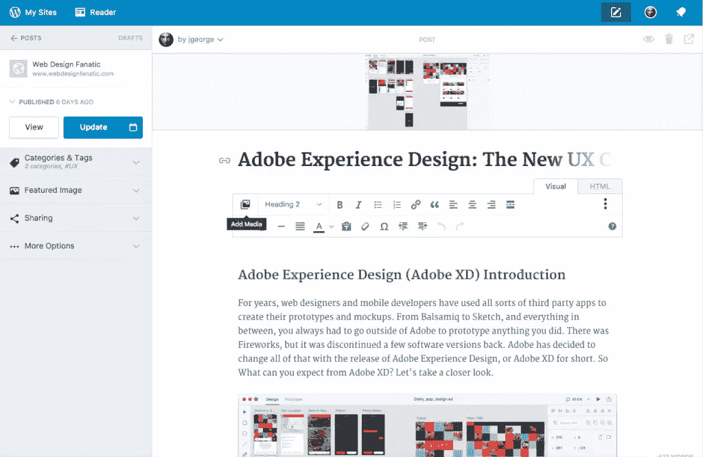
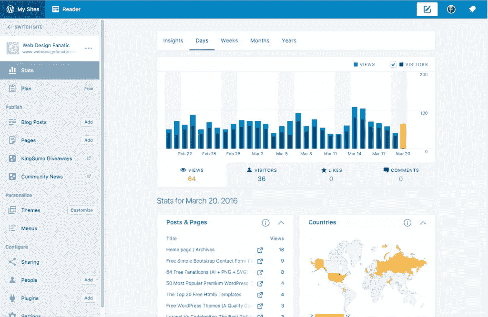
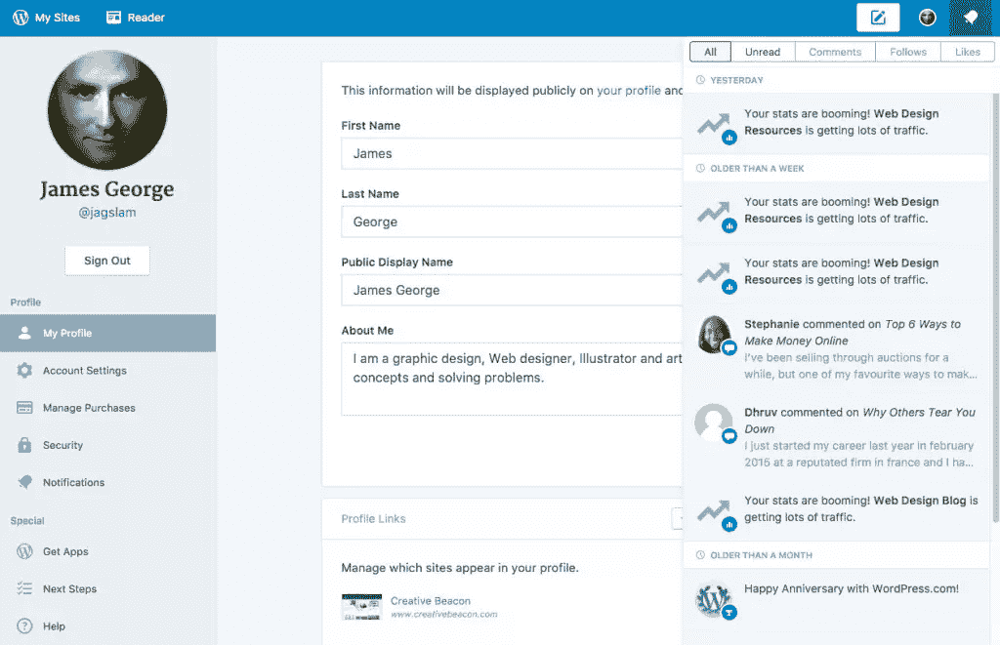
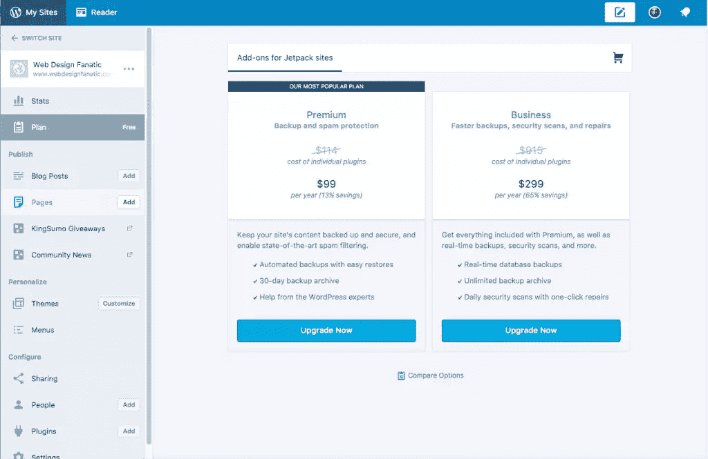

# calypso:WordPress 的桌面应用

> 原文：<https://www.sitepoint.com/calypso-desktop-app-wordpress/>

我大部分工作都用 WordPress。无论我是为客户建立 WordPress 网站，还是为自己的网站写博客和开发内容。我做的每件事都倾向于使用 WordPress。然而，我不喜欢总是在浏览器中做事情。相信我，我已经够忙的了。这就是为什么我对 Calypso 感到兴奋，这是 WordPress 的桌面应用程序，用于编写和编辑博客文章。我一直想要一个独立的桌面应用程序，所以我决定尝试一下。

## 你正在管理多个 WordPress 网站吗？

Calypso 非常适合你！你所需要做的就是[从 WordPress.com](https://developer.wordpress.com/calypso/)下载桌面应用程序，并从每个站点的仪表板上启用管理(或者 [Jetpack](https://www.sitepoint.com/a-guide-to-jetpack/) 用于自托管站点)。然后，您可以根据需要编辑帖子，用新内容更新它们。您也可以创建新帖子。你可以打开你的个人资料的图标，向下走到右下角，那里写着添加一个 WordPress 站点。想象一下，不用登录和退出你所有的 WordPress 网站。你可以简单地登录到 Calypso 界面，激活一个站点来添加或编辑文章。

## 在 Calypso 中使用多个帐户

输入所有网站的凭据后，您可以点击应用程序左上角的“我的网站”,您将看到最近选择的网站的统计页面。您将看到您收到的访问次数、他们来自哪里、他们的搜索词以及他们访问了哪些帖子和页面等信息。你还会看到把访问者送到你的网站的顶级推荐网站。

在条形图中，最近的一天以橙色突出显示，但您可以单击任何其他条形图来查看该日期的统计信息。如果您在某一天看到流量激增，并想调查其原因，这将非常方便。

要切换到不同的网站，请单击应用程序左上角标有“切换网站”的后退箭头。

## 在 Calypso 中使用帖子和页面

对于您管理的任何网站，您都可以查看、编辑和创建新的帖子和页面。在这个例子中，我点击了 blog posts 菜单，它显示了一个帖子列表和它们的特色图片。在这里，您可以单击编辑来编辑帖子，添加更多内容，或者您可以单击回收站图标来删除它们。我喜欢 Calypso 的一点是，它可以一个接一个地统计你的每篇文章的浏览量。

我喜欢的一个突出特点是，当你点击每篇文章下的统计数据时，它会按日细分该文章的浏览量。这是一个很好的方法来查看不同的帖子在你的网站上的表现。

当你在查看某个网站的整体统计数据时，它也会给你更多的详细信息。如果你点击 insights 标签，它会显示你最受欢迎的帖子的日期和时间，以及它的浏览量百分比。它还会显示谁在关注你的网站和最近的评论者。

## 状态更新

如果你的 WordPress 站点上发生了什么，你可以从一个界面看到并管理它。例如，如果你看到一个不寻常的流量高峰，它会说你的网站的统计数据正在激增。它还会提到你网站上最近留下的评论。这使得保持与多个站点和众多评论的同步变得容易。

## 限制

我可以看到 WordPress.com Calypso 应用程序的一个缺点是，你不能管理每个网站的插件，除非你安装了 Jetpack Manage。根据你的主题是如何构建的，有时 Jetpack 会导致与你的站点冲突。不过，这只是在个别情况下。然而，我仍然不喜欢在我的网站上添加另一个插件来管理桌面应用程序的功能。

## 临时演员

它没有内置到应用程序中，但是你可以以合理的价格添加一些附加功能，如站点备份、垃圾邮件防护和站点恢复。这对大多数网站所有者来说是一件大事，因为定期备份意味着如果出现问题，您的网站可以恢复。垃圾邮件防护意味着你不会与垃圾邮件评论作斗争，即使有了 Akismet，这看起来也是一场持久战。安全扫描将有助于保持您的网站清洁和清除恶意软件。我最近在一个客户的网站上工作，他的移动流量被重定向到恶意软件和垃圾网站。诊断和清理是一项繁重的工作，因此从长远来看，增加安全性对您来说是值得的。

## 结论

对于运行一个或多个 WordPress 网站的人来说，Calypso WordPress 桌面应用程序是一个很好的工具。这款应用运行良好，似乎比 WordPress 网站的实际后端运行得更快。我的想法是，这是因为它不是在浏览器中运行，而是在桌面上运行。如果你喜欢查看帖子的统计数据，深入分析每个 WordPress 站点的流量，Calypso 可能是你的一个好选择。你可以从一个网站跳到另一个网站，节省管理你的博客帝国的时间。

你用过 Calypso 应用吗？你有什么想法？

## 分享这篇文章