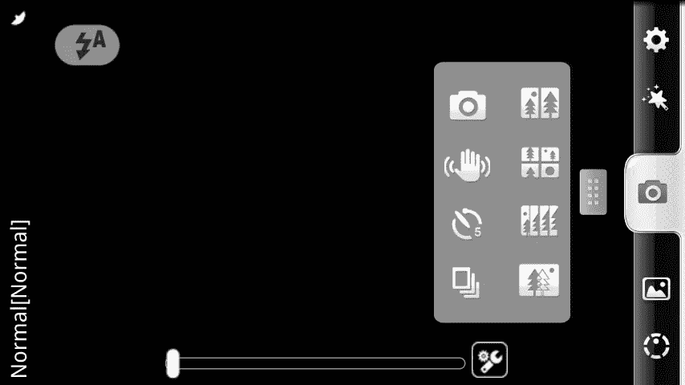
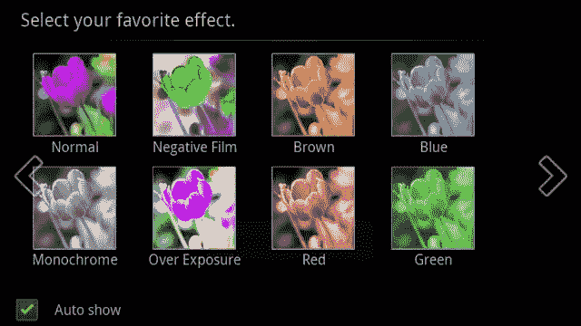
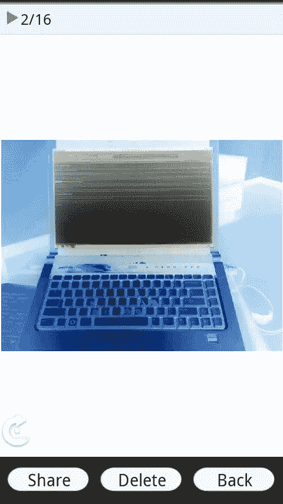

# 相机 360:满足您所有的摄影需求

> 原文：<https://www.sitepoint.com/camera360-fill-all-your-photography-needs/>

作为一个 Android power 用户，每当有人建议我下载一个应用程序到我的 droid 上时，我通常会以怀疑的态度回应，因为在一个过饱和的垃圾市场中，只有少数宝石被埋没。这种情况最好的例子之一是新奇的相机和视频应用程序；从照片模板和皮肤、效果到彩色/增强图像，以及具有全面编辑功能(如色调、饱和度、色阶等)的应用程序。)

在很大程度上，我从来没有为我的 Android 上的照片应用程序而烦恼，因为许多应用程序只是其他应用程序的克隆，这意味着许多用户可能会通过下载照片相关的应用程序来获得完整的编辑功能。幸运的是，有两个应用程序一起使用时，提供了移动新奇的灵活性，同时也有强大的数字暗房功能在你的手机上。对于需要在旅途中进行高级编辑的高级用户，Adobe Photoshop Express 一直是我的首选应用程序，因为它在一个包中包含了所有顶级功能，并由数字多媒体行业的领导者提供支持。

另一方面，继续这篇评论的主题，我最近很幸运地发现了免费应用程序 Camera360，这是一个功能相当完善的照片增强应用程序，它主要关注预设滤镜和叠加，加上一些愚蠢的模板，让你的记忆更幽默。虽然我最初认为我会在试用后很快删除该应用程序，但截至本文写作时，Camera360 仍在我的手机上，我没有计划在任何时候取代它作为我的主要拍摄应用程序，因为我还没有看到任何免费或付费的 Android 照片应用程序接近 Camera360 的质量和功能。

* * *

* * *

## 有趣包装中的重要功能

在深入了解 Camera360 的新颖功能之前，值得注意的是，在我的测试中，我发现这款应用对于希望能够调整手机照片拍摄过程而不仅仅是事后编辑照片的高级用户来说绰绰有余。连拍模式和多重拍摄计数是我发现最有用的两个功能，除此之外，还有一个整体简洁的界面，可以很容易地在拍摄之间切换设置，不会错过任何一个节拍。这一点对于任何照片应用程序来说都是至关重要的，因为照片应用程序通常与手机摄像头相连，如果应用程序不稳定并崩溃，它会关闭你的摄像头，直到重启完成。

另一个帮助移动摄影师的功能是稳定功能，可以在拍照时启用。本质上，它是一个类似靶心的二级图像(除了标准的焦点指示器之外),作为一个水平来指示你的手机的稳定性。当该功能被启用时，在按下“拍摄”后，直到相机相当稳定时，画面才会抓拍，或者在几秒钟的颠簸后放弃。虽然该功能并不简单，会严重限制您快速拍摄的能力，但对于夜间和弱光拍摄来说，稳定器功能是一个很有价值的工具。

## 全家人的乐趣

除了将众多功能打包到应用程序中，Camera360 还包括一套多样化的过滤器和模板，让用户在拍照时获得乐趣。此外，当使用新奇的效果时，Camera360 默认设置为在应用效果之前自动保存原始图像的副本，因此对于每个人半严肃的一面，您可以在保留原始记忆的同时享受乐趣。

加载 Camera360 后，用户会看到六种不同的相机类型，根据效果类型进行分组，因此导航到所需的效果总是轻而易举的。效果范围从常见的:鱼眼，线描，红外，黑白，HDR，和彩色；独特的功能，如倾斜移动，颜色移动，加上一个选择的“场景”，本质上是围绕你的图片的皮肤。

* * *

* * *

第一次使用 Camera360 时，您可能会注意到，第一次访问场景部分时，只有一个模板。添加更多模板很容易——只需进入 Android market 并搜索 Camera360，在 Camera360 应用程序的正下方，应该有一些可供下载的主题包。总的来说，安装相当简单，几乎不需要解释——只需点击安装，主题公园就会像普通应用程序一样安装，几乎不需要用户干预。

不幸的是，在撰写本文时，Camera360 似乎只有两个包可用，所以对于必须拥有大量场景的用户来说，使用另一个应用程序可能是一个好主意。

* * *

## 结束语

Camera360 是任何 Android 用户的必备应用。通过在照片的新颖性和强大功能之间取得平衡，该应用程序成功地成为几乎所有照片爱好者的一个伟大工具，从那些只是拍照的人到那些花大量时间专注于他们的工作的摄影师。此外，严格来说，它是一个拍摄应用，而不是照片编辑器，所以它是轻量级的，在我所有的测试中都很快。当与 Adobe Photoshop Express(Android 的免费应用程序)结合使用时，最终用户可以在手机上使用强大的编辑套件。

* * *

## 分享这篇文章