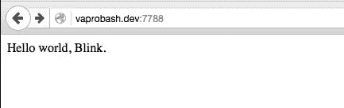
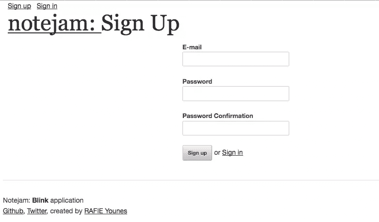
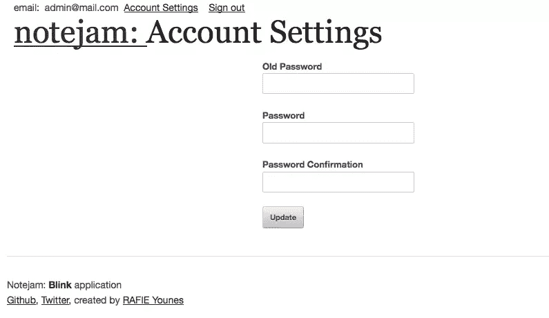
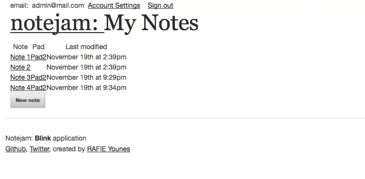
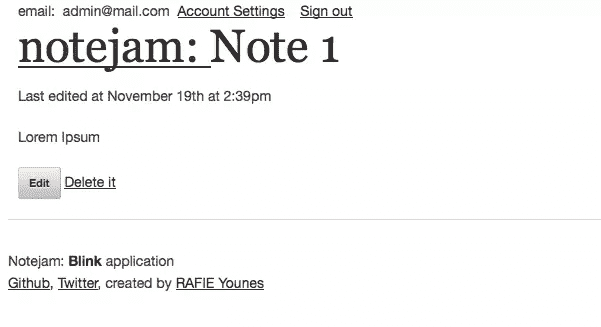
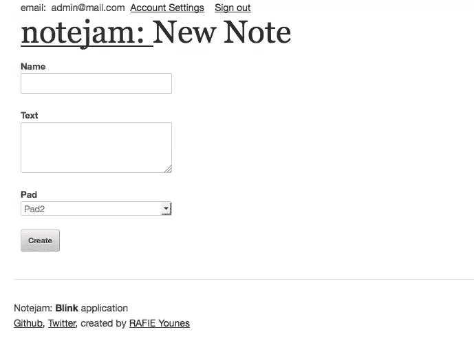

# PHP 还能更快吗？Blink 框架下的光速

> 原文：<https://www.sitepoint.com/can-php-be-even-faster-light-speed-with-the-blink-framework/>

Lumen、Silex、Slim 等。你听说过他们所有人。在本文中，我们将了解一个名为 [Blink](https://github.com/bixuehujin/blink) 的新人。


Blink 旨在改进消耗大量服务器资源的高性能应用程序，它使用 [Swoole](http://www.swoole.com) PHP 扩展来实现这一目标。作为一个例子，我们将为我们的演示制作一个闪烁驱动的 [notejam](http://notejam.net/) 。让我们开始吧。

## 安装 Swoole PHP 扩展

我们之前提到过，Blink 依靠 Swoole 扩展来获得更好的性能。

您可以在 [Github](https://github.com/swoole/swoole-src) 上安装 Swoole 扩展。如果你不知道如何去做，就跟随这篇[文章](https://www.sitepoint.com/install-php-extensions-source/)。

安装它的另一种方法是使用 PEAR 包管理器，这是我将采用的方法。我将在本文中使用 Ubuntu 14.04 的 LAMP 设置，通过 [Vaprobash](https://github.com/fideloper/Vaprobash) 进行配置——要获得准确的设置，请参考[项目最终报告](https://github.com/fideloper/Vaprobash)中的流浪者文件。我们本可以使用 [Homestead improved](https://www.sitepoint.com/quick-tip-get-homestead-vagrant-vm-running/) 来轻松设置环境，但是 Swoole 扩展目前只与 PHP 5 兼容，Homestead improved 默认使用 PHP 7。

```
# update repositories
sudo apt-get update 

# Install pear manager
sudo apt-get install php-pear

# PHP source to compile the extension
sudo apt-get install php5-dev

# Used to install package dependencies
sudo apt-get install libcurl3-openssl-dev

# Installing Swoole
sudo pecl install swoole 
```

目前的 Swoole 版本是`1.7.22-alpha`，它与 [PHP 7](https://www.sitepoint.com/learn-php-7-find-out-whats-new-and-more) 不兼容，但我们正在努力在下一个次要版本中实现这一点。

在上面的命令执行之后，我们被要求将`extension=swoole.so`行添加到`php.ini`中。您可以通过列出可用的 PHP 模块命令来确保加载了扩展。

```
php -m | grep 'swoole' 
```

## 安装闪烁

Packagist 上有 Blink，所以我们可以使用 Composer 创建一个新项目。

```
composer create-project --prefer-dist blink/seed 
```

加载完所有依赖项后，您可以从命令行运行服务器。

```
php blink server serve 
```

这个命令将为日志运行一个交互式 shell。但是，您可以使用`php blink server start/stop/restart`命令来管理服务器。

我们可以通过访问本地服务器的端口 7788 来确保一切正常:



## 配置

虽然 Blink 没有提供从命令行指定端口的选项，但我们可以使用`config/server.php`文件来更改它。

```
// src/config/server.php

<?php
return [
    'class' => '\blink\server\SwServer',
    'bootstrap' => require __DIR__ . '/../bootstrap.php',
    'host' => '0.0.0.0',
    'port' => 8080,
]; 
```

现在，重新启动服务器并使用新端口检查浏览器。`config`文件夹还保存了我们的应用和服务的配置。

## 构建 Notejam 应用程序

Notejam 应用程序没有包含很多功能。你可以在 [Github](https://github.com/Whyounes/notejam_blink) 上查看最终的应用。它提供:

*   带有忘记密码选项的登录页面。
*   注册页面。
*   帐户设置。(更改用户密码)
*   管理笔记。
*   管理 pad。

### 安装模板引擎

Blink 默认不提供模板引擎，我们需要自己选择并注入。我选择了使用 [Twig](http://twig.sensiolabs.org/) ，但是你可以很容易地切换到另一个引擎，比如 Blade、Smarty 等。`src/bootstrap.php`文件负责注册我们的路由、服务和执行我们的应用程序，我们将使用它将 Twig 引擎绑定到应用程序容器。

```
// src/bootstrap.php

// ...
$app = new blink\core\Application($config);

require __DIR__.'/bindings.php';

return $app; 
```

```
// src/bindings.php

<?php

/*
    Registering Twig
 */

$app->bind('twig.loader', function () {
    $view_paths = __DIR__.'/views';
    $loader = new \Twig_Loader_Filesystem($view_paths);

    return $loader;
});

$app->bind('twig', function () use($app) {
    $options = [
        'debug' => false,
        'cache' => __DIR__.'/../cache/views/compiled'
    ];

    $twig = new \Twig_Environment($app->get('twig.loader'), $options);

    // register Twig Extensions
    $twig->addExtension(new \Twig_Extension_Debug());

    // register Twig globals
    $twig->addGlobal('app', $app);

    return $twig;
}); 
```

Blink 使用 [Yii 容器](http://www.yiiframework.com/doc-2.0/guide-concept-di-container.html)进行依赖注入。它有构造函数和方法注入，自动解析依赖关系，等等。有关更多详细信息，请查看文档。

### 安装数据库管理器

Notejam 应用程序需要数据库访问来管理用户、笔记和便笺簿。我们将为此使用雄辩的软件包，因此我们需要使用 Composer 来要求它。

```
composer require illuminate/database 5.1.*
composer require illuminate/console 5.1.*
composer require illuminate/filesystem 5.1.* 
```

我们还要求控制台和文件系统包使用数据库迁移来构建我们的数据库。

```
// src/bindings.php

// ...

/*
    Registering Eloquent DB Manager
*/

use Illuminate\Database\Capsule\Manager as Capsule;

$capsule = new Capsule;
$capsule->addConnection(require __DIR__.'/config/database.php');

$app->bind('capsule', $capsule);
$capsule->setAsGlobal();
$capsule->bootEloquent(); 
```

```
// src/console/MigrateCommand.php

class MigrateCommand extends Command
{

    public $name = 'migrate';

    public $description = 'Migrate Database.';

    protected function execute(InputInterface $input, OutputInterface $output)
    {
        $capsule = app('capsule');
        $connectionResolver = $capsule->getDatabaseManager();
        $repository = new DatabaseMigrationRepository($connectionResolver, 'migrations');
        if( !$repository->repositoryExists() )
        {
            $repository->createRepository();
        }

        $migrator = new Migrator($repository, $connectionResolver, new Filesystem);

        return $migrator->run(__DIR__.'/../database/migrations');
    }
} 
```

```
// src/config/app.php

<?php
return [
    // ...

    'commands' => [
        'App\Console\MigrateCommand',
    ]
]; 
```

注册我们的命令后，我们可以运行`php blink migrate`来创建我们的数据库。

```
// src/database/migrations/2015_11_14_00_create_users_table.php

class CreateUsersTable extends Migration {
    public function up()
    {
       Capsule::schema()->create('users', function(Blueprint $table) {
            $table->increments('id');
            $table->string('email');
            $table->string('password', 60);
            $table->string('remember_token', 100)->nullable();
            $table->timestamps();
        });
    }

    public function down()
    {
        Capsule::schema()->drop('users');
    }
} 
```

```
// src/database/migrations/2015_11_14_00_create_notes_table.php

class CreateNotesTable extends Migration {
    public function up()
    {
        Capsule::schema()->create('notes', function(Blueprint $table) {
            $table->increments('id');
            $table->string('name', 255);
            $table->text('text');
            $table->integer('user_id');
            $table->integer('pad_id')->nullable();
            $table->timestamps();
        });
    }

    public function down()
    {
        Capsule::schema()->drop('notes');
    }
} 
```

```
// src/database/migrations/2015_11_14_00_create_pads_table.php

class CreatePadsTable extends Migration {
    public function up()
    {
        Capsule::schema()->create('pads', function(Blueprint $table) {
            $table->increments('id');
            $table->string('name', 255);
            $table->integer('user_id');
            $table->timestamps();
        });
    }

    public function down()
    {
        Capsule::schema()->drop('pads');
    }
} 
```

### 路线

应用程序路由注册在`http/routes.php`中，应该返回一个包含我们的路由定义的数组。

```
// src/http/routes.php

return [
    ['GET', '/signin', '\\App\\Http\\Controllers\\UserController@signin']
]; 
```

数组中的第一项应该定义请求方法。这可以是单个项目，也可以是处理多个请求方法的数组。第二项定义了请求 URL，并且可以包含参数规则。

```
// src/http/routes.php

return [
    ['GET', '/notes/{id}', '\\App\\Http\\Controllers\\NoteController@show']
];

// You can also use regex to filter parameters.

return [
    ['GET', '/notes/{id:\d+}', '\\App\\Http\\Controllers\\NoteController@show']
]; 
```

第三项指定请求处理程序。这可能是一个闭包或类名，就像上面的例子一样。查看[路线文档](https://github.com/bixuehujin/blink/blob/master/docs/en/2-1-routing-and-controllers.md)了解更多详情。我们的完整路由文件如下所示。

```
// src/http/routes.php

return [
    ['GET', '/', function(blink\http\Response $response){
        return $response->redirect('/signin');
    }],

    // authentication
    ['GET', '/signin', 'UserController@signin'],
    ['POST', '/signin', 'UserController@processSignin'],

    ['GET', '/signup', 'UserController@signup'],
    ['POST', '/signup', 'UserController@store'],

    ['GET', '/logout', 'UserController@logout'],

    ['GET', '/settings', 'UserController@settings'],
    ['POST', '/settings', 'UserController@updateSettings'],

    //pads
    ['GET', '/pads', 'PadController@index'],
    ['GET', '/pads/{id:\d+}', 'PadController@show'],

    ['GET', '/pads/create', 'PadController@create'],
    ['POST', '/pads/create', 'PadController@store'],

    ['GET', '/pads/{id:\d+}/update', 'PadController@edit'],
    ['POST', '/pads/{id:\d+}/update', 'PadController@update'],

    ['GET', '/pads/{id:\d+}/delete', 'PadController@delete'],

    // Notes
    ['GET', '/notes', 'NoteController@index'],
    ['GET', '/notes/{id:\d+}', 'NoteController@show'],

    ['GET', '/notes/create', 'NoteController@create'],
    ['POST', '/notes/create', 'NoteController@store'],

    ['GET', '/notes/{id:\d+}/update', 'NoteController@edit'],
    ['POST', '/notes/{id:\d+}/update', 'NoteController@update'],

    ['GET', '/notes/{id:\d+}/delete', 'NoteController@delete'],
]; 
```

### 控制器

控制器存储在`src/http/controllers`中，如果将它们存储在那里，可以避免使用类的完全限定名称空间。但是，您可以使用另一个路径，并在`src/config/app.php`文件中更改它。

```
// src/config/app.php

<?php
return [
    // ...
    'controllerNamespace' => '\app\http\controllers',
]; 
```

```
// src/http/routes.php

return [
    ['GET', '/notes/{id}', 'NoteController@show'] // without a namespace
]; 
```

#### 签约雇用

Notejam 应用程序提供了要使用的 HTML 模板，我们将把它们转换成 Twig 模板。

```
// src/views/user/signup.htm



Sign Up


    <form action="/signup" method="POST" class="offset-by-six">
        <label for="email">E-mail</label>
        <input type="email" id="email" name="email" value="{{ oldInputs.email }}" />

        <label for="password">Password</label>
        <input type="password" id="password" name="password" value="" />

        <label for="password_confirmation">Password Confirmation</label>
        <input type="password" id="password_confirmation" name="password_confirmation" value="" />

        <input type="submit" value="Sign up" /> or <a href="/signin">Sign in</a>
    </form>
 
```

我们正在扩展定义公共页面结构的主布局，包括我们的页眉和部分错误。

```
// src/views/partials/errors.htm




    <div class="alert-area">
        
            <div class="alert alert-success">{{ session.get('success') }}</div>
        
        
            <div class="alert alert-error">
                
                    <ul class="errorlist">
                        <li>{{ error }}</li>
                    </ul>
                
            </div>
        
    </div>
 
```

我们可以访问`app`容器实例，因为我们在 Twig 实例中将它注册为一个全局变量。

我们的注册表单包含电子邮件、密码和密码确认字段。现在我们需要渲染我们的页面。

```
// src/http/controllers/UserController.php

class UserController extends Object
{
    // ...

    public function signup()
    {
        return app()->twig->render('user/signup.htm');
    }
} 
```



我们在`UserController@store`方法中处理表单提交，因为我们需要一些验证逻辑，所以我们可以使用`Illuminate/Validation`组件。因此，让我们使用我们的`src/bindings.php`文件将它绑定到容器。

```
// src/bindings.php

// ...
/*
    Registering Validator
 */

use Illuminate\Container\Container;
use Illuminate\Filesystem\Filesystem;
use Illuminate\Translation\FileLoader;
use Illuminate\Translation\Translator;
use Illuminate\Validation\Factory;
use Illuminate\Validation\DatabasePresenceVerifier;

$loader = new FileLoader(new Filesystem, __DIR__.'/lang');
$translator = new Translator($loader, 'en');
$validation = new Factory($translator, new Container);
$validation->setPresenceVerifier(new DatabasePresenceVerifier(app('capsule')->getDatabaseManager()));
$app->bind('validation', $validation); 
```

在这种情况下，`setPresenceVerifier`方法很有用，因为我们将使用`unique`验证规则，它测试数据库中元素的存在。

```
// src/http/controllers/UserController.php

class UserController extends Object
{
    // ...
    public function store(Request $request, Hash $hash)
    {
        $rules = [
            'email'     => 'required|email|unique:users',
            'password'  => 'required|confirmed|min:8'
        ];

        $validator = app('validation')->make($request->all(), $rules);
        if ( $validator->fails() )
        {
            $request->session->add([
                'errors' => $validator->errors()->all(),
            ]);

            return app('twig')->render('user/signup.htm', [
                'oldInputs'     => $request->all()
            ]);
        }

        $user = new \App\Models\User;
        $user->email = $request->body->get('email');
        $user->password = $hash->make($request->body->get('password'));
        $user->save();

        $request->session->add(['success' => "Welcome to Notejam, you can now log in."]);

        return $response->redirect('/signin');
    }
} 
```

Blink 支持方法注入，所以我们可以将类作为参数传递，它们会自动为我们解析。在构建了验证规则之后，如果有任何失败，我们将返回旧的输入。`$request->session`对象保存我们当前的会话实例，这是我们存储由 errors 部分显示的成功和错误消息的地方。

#### 会话&Amp;cookie

使用 PHP 会话，cookies 和 header 函数不起作用，但是我们可以从请求对象(`$request->getSession()`)访问它们。请注意，对于您可能想要安装到项目中的其他包，这可能是一个问题。

#### 签到

在用户登录之前，我们需要配置我们的授权组件。

```
// src/config/services.php

// ...
'auth' => [
        'class' => 'blink\auth\Auth',
        'model' => 'App\Models\User',
    ],
// ... 
```

下一步是更新我们的用户模型并填充`Authenticatable`接口方法。

```
// src/models/User.php

class User extends Model implements Authenticatable
{
    protected $table = 'users';

    public static function findIdentity($id)
    {
        if (is_numeric($id) || (is_array($id) && isset($id['id']))) {
            return static::where('id', $id)->first();
        } else if (is_string($id) || (is_array($id) && isset($id['email'])) ) {
            return static::where('email', $id)->first();
        } else {
            throw new \InvalidParamException("The param: id is invalid.");
        }
    }

    public function getAuthId()
    {
        return $this->id;
    }

    public function validatePassword($password)
    {
        return (new Hash)->check($password, $this->password);
    }
} 
```

`findIdentity`方法将用于使用主键或电子邮件对用户进行身份验证，而`validatePassword`将针对当前用户实例测试登录密码。

```
// src/views/user/signin.htm



Sign In


    <form action="/signin" method="POST" class="offset-by-six">
        <label for="email">E-mail</label>
        <input type="email" value="{{ oldInputs.email }}" name="email" id="email" />

        <label for="email">Password</label>
        <input type="password" value="" name="password" id="password" />

        <input type="submit" value="Sign in" /> or <a href="/signup">Sign up</a>
        <hr />
        <p><a class="small-red" href="/forgot_password">Forgot Password?</a></p>
    </form>
 
```


```
// src/controllers/UserController.php

class UserController extends Object
{
    // ...
    public function processSignin(Request $request, Hash $hash)
    {
        $rules = [
            'email'     => 'required|email',
            'password'  => 'required|min:8'
        ];
        $validator = app('validation')->make($request->all(), $rules);
        if ( $validator->fails() )
        {
            $request->session->add([
                'errors' => $validator->errors()->all(),
            ]);

            return app('twig')->render('user/signin.htm', [
                'oldInputs'     => $request->all()
            ]);
        }

        $user = auth()->attempt($request->only(['email', 'password']));

        if ( !$user )
        {
            $request->session->add([
                'errors' => ['Login error.'],
            ]);

            return app('twig')->render('user/signin.htm', [
                'oldInputs'     => $request->all()
            ]);
        }

        $cookies = $response->getCookies()->add( new \blink\http\Cookie([
            'name' => 'SESSIONID', 
            'value' => $request->session->id
        ]) );

        return $response->redirect('/settings');
    }
} 
```

我们以同样的方式验证输入，并在失败时显示错误。`auth()`助手将从容器中解析`blink/auth/Auth`实例，我们尝试用请求凭证让用户登录。如果登录凭证正确，我们会将用户重定向到设置页面。Blink 不会自动管理我们的会话，所以我们需要在登录时设置会话 cookie，并在页面加载请求时设置它。Blink 允许我们使用配置数组将服务绑定到容器。

```
// src/config/services.php

return [
    'request' => [
        'class' => \blink\http\Request::class,
        'middleware' => [\App\Http\Middleware\AuthMiddleware::class],
        'sessionKey' => function (\blink\http\Request $request) {
                $cookie = $request->cookies->get('SESSIONID');
                if ($cookie) {
                    return $cookie->value;
                }
        }
    ],
    // ...
]; 
```

Blink 使用 [Yii 的配置概念](https://github.com/yiisoft/yii2/blob/master/docs/guide/concept-configurations.md)来初始化类属性。如果 cookie 变量存在的话，我们使用一个闭包函数来初始化`sessionKey`。

在一次成功的登录尝试之后，我们可以使用`$request->user()`和`$request->guest()`从请求对象访问登录的用户。查看[文档](https://github.com/bixuehujin/blink/blob/master/docs/en/3-3-authentication.md)了解更多关于认证的细节。

#### 帐户设置

登录的用户能够更改他的密码。他必须输入旧密码、新密码和确认密码。我们遵循和以前一样的步骤。

```
// src/http/controllers/UserController.php

class UserController extends Object
{
    public function updateSettings(Request $request, Hash $hash)
    {
        $user = $request->user();
        $rules = [
            'old_password'   => 'required|min:8',
            'password'      => 'required|confirmed|min:8'
        ];

        $validator = app('validation')->make($request->all(), $rules);
        if ( $validator->fails() )
        {
            $request->session->add([
                'errors' => $validator->errors()->all(),
            ]);

            return app('twig')->render('user/settings.htm', [
                'oldInputs'     => $request->all()
            ]);
        }

        if( !$hash->check($request->input('old_password'), $user->password) )
        {
            $request->session->add([
                'errors' => ['Old password incorrect.'],
            ]);

            return app('twig')->render('user/settings.htm', [
                'oldInputs'     => $request->all()
            ]);
        }

        $user->password = $hash->make($request->input('old_password'));
        $user->save();

        $request->session->add([
                'success' => 'settings updated successfuly.',
        ]);

        return app('twig')->render('user/settings.htm');
    }
} 
```

`$hash->check`方法将一个值与一个散列版本进行比较。更新用户设置后，我们返回一条成功消息。这里的问题是我们正在直接访问返回当前登录用户的`$request->user()`方法，但是如果用户还没有登录并试图访问设置页面呢？



### 中间件

为了保护我们的路由，我们可以为请求对象定义一个中间件列表。我们可以在我们的`services.php`配置文件中这样做。

```
// config/services.php

return [
    'request' => [
        'class' => \blink\http\Request::class,
        'middleware' => [\App\Http\Middleware\AuthMiddleware::class],
        'sessionKey' => function (\blink\http\Request $request) {
                $cookie = $request->cookies->get('SESSIONID');
                if ($cookie) {
                    return $cookie->value;
                }
        }
    ],
    // ...
]; 
```

现在我们需要在`src/http/middleware`文件夹中创建我们的`AuthMiddleware`。中间件将拦截所有请求，我们应该将当前请求与我们的保护路由进行比较。

```
// src/http/middleware/AuthMiddleware.php

class AuthMiddleWare implements MiddlewareContract
{
    public function handle($request)
    {
        $guardedRoutes = [
            '/\/settings/',
            '/\/logout/',
            '/\/notes?\/*.*/',
            '/\/pads?\/*.*/',
        ];

        if ( !$request->user() )
        {
            foreach ($guardedRoutes as $route)
            {
                if ( $request->match($route) )
                {
                    return response()->redirect('/signin');
                }
            }
        }

        if ( $request->user() && in_array($request->path, ['/signin', '/signup']))
        {
            return response()->redirect('/settings');
        }

    }
} 
```

`Request@match`方法根据正则表达式测试当前请求路径。它使用 PHP [preg_match](http://php.net/manual/en/function.preg-match.php) 函数，所以我们需要将我们的保护路由定义为正则表达式。
如果用户没有登录并试图访问某个受保护的路由，我们会将他们重定向到登录页面。我们还想防止用户登录后访问`signin`和`signup`页面。

您也可以在控制器内部使用`before`和`after`方法来达到相同的结果。

```
// src/http/controllers/UserController.php

class UserController extends Object
{
    public function before($action, $request)
    {
        // do something
    }

    public function after($action, $request, $response)
    {
        // do something
    }
} 
```

如果您注意到，在服务文件中，响应对象也有中间件。它可用于截取响应对象并向响应添加一些信息，或者充当响应格式化程序。

#### 列出笔记

`NoteController`类负责处理我们的 notes 的 CRUD 操作。

```
// src/http/controllers/NoteController.php

class NoteController extends Object
{
    public function index(Request $request, Note $noteModel)
    {
        $notes = $noteModel
                    ->where('user_id', $request->user()->id)
                    ->with('pad')
                    ->get();

        return app('twig')->render('notes/index.htm', [
            'notes' => $notes
        ]);
    }
} 
```

因为 Blink 支持方法注入，所以我们传递`Request`和`Note`对象并查询用户注释。

```
// src/views/notes/index.htm



My Notes


    
        <table class="notes">
            <tr>
                <th class="note">Note</th>
                <th>Pad</th>
                <th class="date">Last modified</th>
            </tr>
            
                <tr>
                    <td><a href="/notes/{{ note.id }}">{{ note.name }}</a></td>
                    <td class="pad">
                        
                            <a href="/pads/{{ note.pad.id }}">{{ note.pad.name }}</a>
                        
                            No pad
                        
                    </td>
                    <td class="hidden-text date">{{ note.updated_at|date("F jS \\a\\t g:ia") }}</td>
                </tr>
            
        </table>
    
        <p class="empty">Create your first note.</p>
    
    <a href="/notes/create" class="button">New note</a>
 
```



#### 查看注释

登录的用户只能查看和管理自己的笔记。因为我们需要经常检查这个条件，我们将把它放在一个单独的方法中。

```
// src/http/controllers/NoteController.php

class NoteController extends Object
{

    protected function noteExists( $noteId )
    {
        $request = request();
        $note = Note::with('pad')
                    ->where('user_id', $request->user()->id)
                    ->where('id', $noteId)
                    ->first();
        if( !$note )
        {
            $request->session->add([
                'errors' => ["Note not found."],
            ]);

            return false;
        }

        return $note;
    }
    // ...
} 
```

```
// src/http/controllers/NoteController.php

class NoteController extends Object
{
    public function show($id, Request $request, Response $response, Note $noteModel)
    {
        $note = $this->noteExists($id);

        if( !$note )
        {
            return $response->redirect('/notes');
        }

        return app()->twig->render('notes/view.htm', [
            'note' => $note
        ]);
    }
} 
```

```
// src/views/notes/view.htm



{{ note.name }}


    <p class="hidden-text">Last edited at {{ note.updated_at|date("F jS \\a\\t g:ia") }}</p>
    <div class="note">
        <p>
            {{ note.text }}
        </p>
    </div>
    <a href="/notes/{{ note.id }}/update" class="button">Edit</a>
    <a href="/notes/{{ note.id }}/delete" class="delete-note">Delete it</a>
 
```



#### 新便笺

新的笔记视图有一个名称、一个文本和一个 pad 输入。

```
// src/views/notes/create.htm



New Note


    <form action="/notes/create" method="POST">
        <label for="name">Name</label>
        <input type="text" id="name" name="name" value="{{ oldInputs.name }}"/>

        <label for="text">Text</label>
        <textarea id="text" name="text" value="{{ oldInputs.text }}"></textarea>

        <label for="pad">Pad</label>
        <select id="pad" name="pad">
            
                <option value="{{ pad.id }}">{{ pad.name }}</option>
            
        </select>

        <input type="submit" value="Create" />
    </form>
 
```

```
// src/http/controllers/NoteController.php

class NoteController extends Object
{
    public function create(Request $request, Pad $padModel)
    {
        $pads = $padModel->where('user_id', $request->user()->id)->get();

        return app('twig')->render('notes/create.htm', [
            'pads' => $pads
        ]);
    }
} 
```



因为我们已经建立了我们的模型关系，我们也可以做一些类似于`$request->user()->pads`的事情。`store`方法处理表单提交。

```
// src/http/controllers/NoteController.php

class NoteController extends Object
{
    public function store(Request $request, Response $response)
    {
        $rules = [
            'name'  => 'required',
            'text'  => 'required',
            'pad'   => 'required|exists:pads,id'
        ];
        $validator = app('validation')->make($request->all(), $rules);

        if ( $validator->fails() )
        {
            $request->session->add([
                'errors' => $validator->errors()->all(),
            ]);

            return app('twig')->render('notes/create.htm', [
                'oldInputs' => $request->all()
            ]);
        }

        $note = new Note;
        $note->name = $request->input('name');
        $note->text = $request->input('text');
        $note->user_id = $request->user()->id;
        $note->pad_id = $request->input('pad');
        $note->save();

        $request->session->add([
            'success' => 'Note saved successfully.',
        ]);

        return $response->redirect("/notes/{$note->id}/update");
    }
} 
```

我们遵循相同的过程来验证数据并在出现消息时返回错误。为了避免粘贴更新、删除和查看笔记的重复任务，您可以在 [Github](https://github.com/Whyounes/notejam_blink) 上查看最终结果。该存储库还包含安装步骤。

## 最终注释

尽管 Swoole 和 Blink 试图通过在应用程序的整个生命周期中保持应用程序资源的活力来节约服务器资源，但是请求和响应对象总是在每次请求时被刷新。Blink 提供了一个`ShouldBeRefreshed`接口，您可以实现它来指示类实例应该在每次请求时刷新。

## 结论

Blink 是一个新来者，仍处于早期开发阶段。您可以通过编写不同组件的文档来进行协作，并发送新功能的请求。如果您有任何问题或意见，可以在下面发表，让我们知道您对这个新框架的看法！

## 分享这篇文章