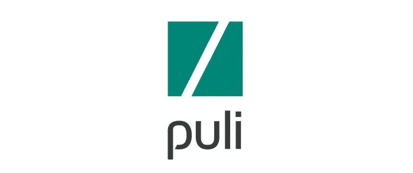
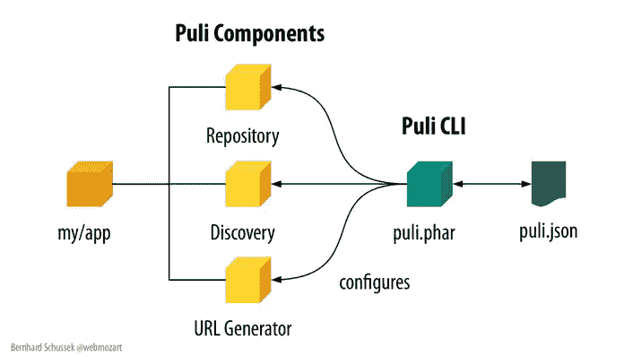
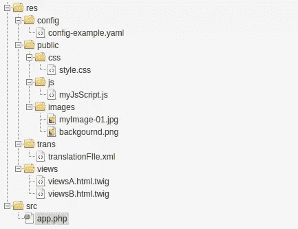
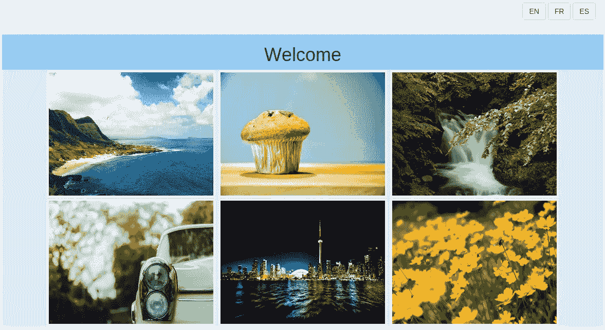

# PuliPHP 能否对 PHP 包开发进行再革命？

> 原文：<https://www.sitepoint.com/can-puliphp-re-revolutionize-php-package-development/>

Puli 是一个新的工具包，建立在 T2 作曲家 T3 的基础上，帮助管理和交换资源，如配置文件、图像、CSS 文件、翻译目录等。您会同意，这些通常很难维护和跨项目共享。



Puli 为这个问题提供了一个框架无关的解决方案，跟踪每个资源位置，避免在不同系统中使用绝对或相对路径的问题。

## 它是如何工作的

*   您可以通过 CLI 映射资源。
*   一个`puli.json`文件记录着它们。
*   您使用一个`ResourceRepository`实例来处理资源。

Puli 项目还为其他功能提供了库，如 URL 生成或 Twig 支持。



## 安装 Puli CLI

要使用 Puli，首先需要安装 Puli CLI。建议安装成 phar，可以从 GitHub 下载[最新发布。](https://github.com/puli/cli/releases)

它可以放在`/usr/local/bin`目录中进行全局访问。

下面是在类 Unix 系统中快速安装 1.0.0-beta7 预发行版的命令行步骤:

```
wget https://github.com/puli/cli/releases/download/1.0.0-beta7/puli.phar
chmod 755 puli.phar
sudo mv puli.phar /usr/local/bin
```

您也可以将 Puli 作为 Composer 依赖项安装在项目文件夹中:

```
composer require --dev puli/cli:^1.0 
```

或者作为一个*全局* Composer 包，包含:

```
composer global require puli/cli:^1.0` 
```

一旦安装了 CLI，就可以在 Symfony 项目、PHP 应用程序或 Composer 包中使用 Puli。您可以在[入门指南](http://docs.puli.io/en/latest/repository/getting-started.html)中找到关于您的特定项目类型的更多信息。

## 项目布局

总是建议有一个整洁的目录项目结构。Puli 文档强化了这个建议，在 PHP 代码和其他非 PHP 资源之间添加了一个清晰的分离。下面是一个推荐的目录布局示例:



## 映射资源

可以使用 Puli `map`命令来映射单个文件或整个目录。例如，要使用`myapp`作为资源名(Puli 路径)来映射`res`目录的内容，可以运行:

```
puli.phar map /myapp res 
```

您会注意到地图存储在项目文件夹中生成的`puli.json`文件中。

现在可以使用 Puli 路径`/myapp`从 PHP 访问所有映射的资源。

Puli CLI 提供了其他有用的命令来管理映射。一些最常用的是:

*   `ls`，列出所有资源。
*   `tree`，打印资源列表树。
*   `find`，查找具有某种过滤标准的资源，(即`puli find --name *.css`将查找所有的`.css`文件)。
*   `map`带`-u`或`-d`参数，更新/删除一张地图(即:`puli map -u myapp --add /new/folder`)。

另一个重要特性是能够映射 Composer 包中的资源。例如，要将`/view`目录映射到`/vendor/author/packagename`目录中，您可以使用:

```
puli map /somepulipath @author/packagename:view
```

## 实际例子

为了展示普利的工作，我用 Symfony 创建了一个示例项目:一个图像库。该演示显示存储在`images_resource`文件夹中的所有图像。

## 资产管理

在继续之前，有必要指出一些关于资产管理的事情:

*   Symfony 使用`web`文件夹来存储所有的前端控制器文件和网络资源(CSS，JS，images，other)。默认情况下，`web`文件夹是 web 应用程序的公共访问点。换句话说，直接 URL 访问其他项目目录是不可能的。
*   演示项目包含一个`AppBundle`，它的 CSS 和视图存储在`src/AppBundle/Resources`中。
*   Symfony 资产管理会自动将每个捆绑包的资源复制到公共`web`文件夹中。

您将看到 Puli 的资产管理如何更加灵活，并提供额外的配置选项。

## 演示的安装

查看第一个版本:

```
git clone -b 1.0 https://github.com/niklongstone/symfony-gallery-demo.git 
```

然后进入项目根目录，运行:`composer install`。

Symfony 控制台会要求您配置一些参数，但您可以按 enter 键接受默认值。

两个重要的参数是:

*   `images_resource`:图像文件夹
*   `images_url`:公共图片网址

最后，在项目根目录下，可以运行`app/console server:start`运行服务器，在浏览器中看到 app。



## 映射项目

要映射演示项目包中的所有资源，您可以运行:

```
puli.phar map /myapp/ src/AppBundle/Resources 
```

使用`puli.phar tree`,您将看到如下内容:


## 控制器

要使用控制器中的映射视图，您可以按如下方式更改`DefaultController`:

```
 //old value: $this->template->render('AppBundle:Default:index.html.twig', $this->template->render('/myapp/views/Default/index.html.twig',
```

你可以重新打开项目的页面，看到没有任何改变，因为 Puli 完美地调用了映射视图。

## 景色

下一个目标是使用 CSS 的 Puli 路径重构视图。

您可以将`/myapp/public`的资源发布到演示项目的公共文件夹中，即`web`目录。发布本质上是复制或符号链接资源。

让我们一步一步来:

*   创建一个服务器，并通过以下方式将公共文件夹链接到该服务器:

    ```
    puli.phar server --add localhost web 
    ```

*   注册 Puli 公共路径:

    ```
    puli.phar publish /myapp/public localhost /app 
    ```

*   安装资源，包括:

    ```
    puli.phar publish --install 
    ```

该命令将创建`/myapp/public`元素到`/web/app`路径的符号链接。

现在，是时候改变`index.html.twig`中的 CSS 路径如下:

```
 <link  href="{{ resource_url('/myapp/public/css/style.css') }}"  rel="stylesheet">
```

此时，您可以在演示项目的 2.0 版本中找到到目前为止您所取得的所有进展:

```
git clone -b 2.0 https://github.com/niklongstone/symfony-gallery-demo.git 
```

或者

```
git checkout 2.0 
```

如果你已经有了演示。

不要忘记运行项目文件夹中的`composer install`，然后运行`puli.phar publish --install`。

## URL 生成

Puli 的优势之一是支持不同的服务器资源位置。例如，如果您想将您的资源移动到不同的服务器上，比如`https://www.sitepoint.com/res/`,您可以运行:

```
puli.phar server -u localhost --url-format https://www.sitepoint.com/res/%s 
```

每个映射的 URL 都会自动更新。

另一个用例可以是创建一个简单的缓存失效系统，向查询字符串追加类似于`%s?v1`的内容。

## 资源发现

演示项目非常灵活，允许我们改变图像文件夹和网址。Puli 提供了一个发现组件，可以增加更多的灵活性，例如过滤特定的资源。

发现组件管理资源提供者和资源使用者之间的连接。换句话说，它可以将资源与使用它们的服务连接起来。

在该示例中，控制器可以是资源消费者，图像文件夹可以是资源提供者。要使用发现组件处理资源，首先要定义资源类型，然后将其链接到资源路径。

在本例中，我们将创建一个链接到`web/images`文件夹的`app/image`资源类型，并使用过滤器只获取 JPEG 图像。

首先，我们需要将`web/images`文件夹映射为:

```
puli.phar map /myapp/images /web/images 
```

然后，创建一个资源类型:

```
puli.phar type --define mygallery/image 
```

最后，您可以用`jpg`查询绑定映射的文件夹:

```
puli.phar bind /myaimg/*.jpg mygallery/image 
```

现在，您可以如下重构`DefaultController`:

```
 // The constructor needs the puli Discovery component instead of the images folder  public  function __construct(EngineInterface $template,  KeyValueStoreDiscovery $puliDiscovery)  { $this->template  = $template; $this->puliDiscovery = $puliDiscovery;  }  // [...]  private  function getImages()  { $images = array();  //the discovery component will find the bind type with the filter $bindings = $this->puliDiscovery->findByType('mygallery/image');  //the loop gets the resources image names  foreach  ($bindings as $binding)  {  foreach  ($binding->getResources()  as $resource)  { $images[]  = $resource->getName();  }  }  return $images;  }
```

`AppBundle/Resource/config/service.xml`可能是:

```
services: app.default_controller:  class:  AppBundle\Controller\DefaultController
        arguments:  -  @templating  -  @puli.discovery
```

如果你重新打开主页，你应该会注意到只有`.png`图片不见了，和预期的一样。

要查看演示项目的最终版本，请检查版本 3.0 并运行`composer install`和`puli publish --install`来查看正确的结果。

Discovery 组件主要用于连接 Composer 包，使集成变得容易。您可以在[发现组件官方页面](http://docs.puli.io/en/latest/discovery/introduction.html)上找到更多信息。

## 最后的想法

普利解决了一个关于资源管理的现实问题。CLI 易于使用，Composer 连接是该项目的优势之一。感谢作者和所有贡献者，很快会有稳定的发布；虽然测试版运行得很好。

你可以在[官方文档](http://www.puli.io)中找到更多关于普利的信息，并在下面的评论中分享你的个人想法。

## 分享这篇文章