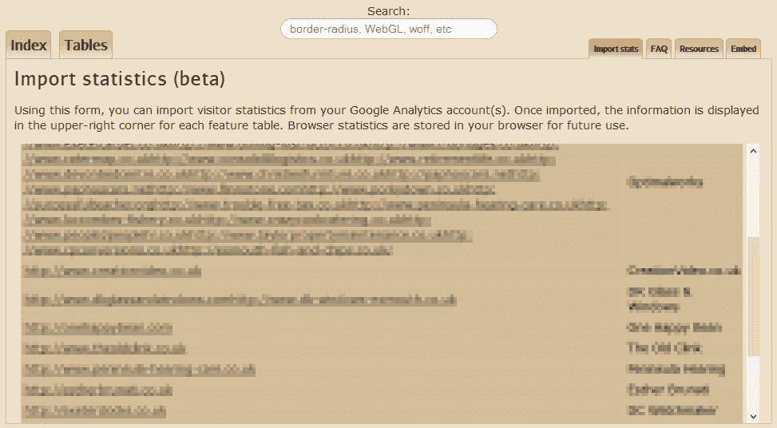
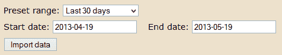
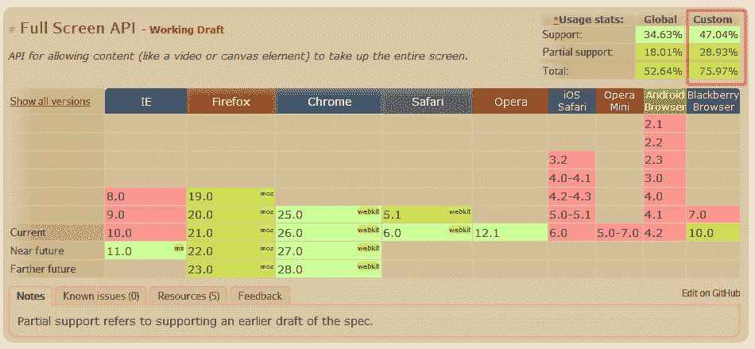

# 如何在 caniuse.com 使用你自己的网站统计数据

> 原文：<https://www.sitepoint.com/caniuse-com-your-website-statistics/>

没有 caniuse.com，生活会困难得多。我每天都用它来检查浏览器对新 HTML5 技术的支持程度。

该网站在功能描述的右上角提供了一个有用的表格，表明可以使用该技术的人的大致比例。统计数据基于 [StatCounter](https://gs.statcounter.com/) 评估的上个月全球浏览器使用情况。

StatCounter 是一个伟大的资源，它分析了全球 300 万个网站的流量——我在我每月的[浏览器趋势](/browser-trends-may-2013/)文章中引用了这些统计数据。但是它不能代替你自己网站的流量分析。

例如，在撰写本文时，CSS3 `border-radius`属性拥有 84.73%的全局支持，并且主要在 IE8 中缺失。然而，如果你的网站命名为 IE8isgreat.com 呢？*(如果您希望创建该域名，则该域名可用！)*你可能会认为 IE8 用户的比例高于正常水平——支持边界半径的比例会低得多。

幸运的是，[caniuse.com](http://caniuse.com/)现在允许你从自己的网站导入谷歌分析统计数据，以验证用户支持的真实水平，并将它们与全球平均水平进行比较。

## 步骤 1:实施谷歌分析

你需要一个[谷歌分析](http://www.google.com/analytics/)账户，但是，说真的，我还没有看到一个网站不使用它。

## 第二步:登录 caniuse.com

打开[caniuse.com](http://caniuse.com/)，点击 [**导入统计**](http://caniuse.com/#stats_import) 标签。在弹出窗口中输入您的 Google Analytics 帐户 ID 和密码:

## 步骤 3:选择配置文件

现在选择您要导入的网站配置文件:

## 第四步:设定日期范围

选择日期范围—过去 30 天应该足够了—并点击**导入数据**:

## 步骤 5:查看特征

搜索或浏览任何技术，你会注意到一个**自定义**支持栏，它反映了你自己网站的统计数据。在下面的例子中，47.04%的 SitePoint 访问者能够使用 [HTML5 全屏 API](/html5-full-screen-api/) ，相比之下平均只有 34.63%:

这是我见过的最好的分析 API 应用，也是对 caniuse.com 的有益补充。它易于使用，将帮助您评估 HTML5 功能何时在您的网站上变得可行。

## 分享这篇文章