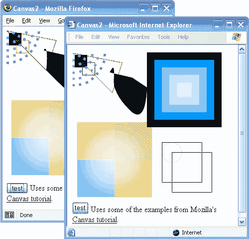

# VML 的 IE 画布

> 原文：<https://www.sitepoint.com/canvas-for-ie-with-vml/>

<ins datetime="2006-01-04T23:57:36+00:00">**更新了**，澄清了火狐中`<canvas>`和 SVG 的关系。</ins>

苹果的 Safari 浏览器，随后是 Firefox 1.5 和即将到来的 [Opera 9](http://snapshot.opera.com/windows/w90p1.html) ，都实现了对`<canvas>`标签的支持，由 [Web 应用 1.0](http://www.whatwg.org/specs/web-apps/current-work/#scs-dynamic) 草案规范(又名 HTML 5)描述。该标签允许您创建一个区域，用于使用 JavaScript 代码绘制 2D 图形。

虽然充满了潜力，但是`<canvas>`还没有在主流 Web 开发中看到太多的用途，主要是因为它仍然完全不受 Internet Explorer 的支持。

~~使用`<canvas>` *的地方*一直在实现对~~ <ins datetime="2006-01-04T23:57:36+00:00">的支持，在 Web 矢量图形领域也受到关注的是火狐 1.5 中的</ins> [可缩放矢量图形(SVG)。SVG 是 2D 图形的 W3C 标准，范围类似于`<canvas>`，但是能够访问先前绘制的图形并使用 JavaScript 修改它们。Firefox 1.5 对 SVG 的支持建立在与支持 `<canvas>`相同的](https://www.sitepoint.com/the-future-is-svg-so-very-good/)[图形子系统](http://cairographics.org/)之上。

事实证明，类似的技巧可以用来为 Internet Explorer 带来对`<canvas>`(也许有一天，还有 SVG)的支持。经过几个晚上的试验，Emil Eklund 已经能够使用[矢量标记语言](http://msdn.microsoft.com/workshop/author/vml/) (VML)，一种类似于 SVG 的专有语言，由 Internet Explorer 5 或更高版本的 Windows 支持，作为向 Internet Explorer 添加对`<canvas>`的基本支持的基础。

尽管无畏的开发者们仍有许多工作要做，以使微软的浏览器完全支持`<canvas>`,但基础已经具备并正在工作，当然也可以完成渲染任务，比如说，图表、图形和其他简单的矢量插图。

## 分享这篇文章