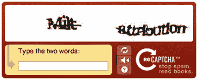
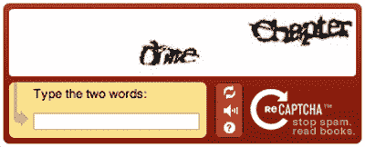
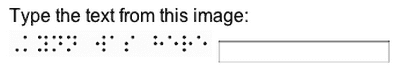
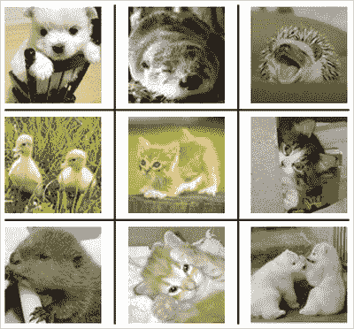
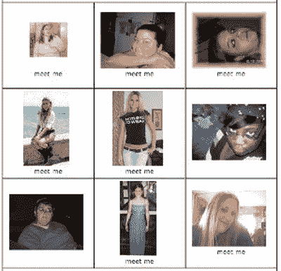
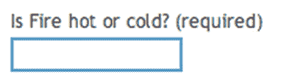
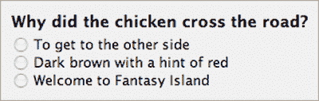
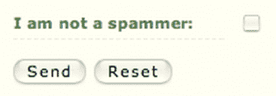
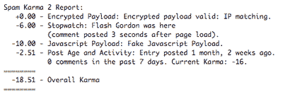

# 超越验证码:不允许机器人！

> 原文：<https://www.sitepoint.com/captcha-problems-alternatives/>

我相信你已经见过它们很多次了——在你可以在线购买音乐会门票或访问评论表格之前，那些需要被破译并输入到文本框中的狂乱的曲线。

验证码通常是一两个单词，以图形的形式呈现，覆盖着某种扭曲，它们的功能是测试你的人类识别能力。CAPTCHA 代表“区分计算机和人类的完全自动化的公共图灵测试”这是一个用词不当的说法，因为验证码*不是*是[图灵测试](http://en.wikipedia.org/wiki/Turing_test)——但我们稍后会回到这一点！

验证码创新是由卡内基梅隆大学的开发者首创的。其背后的想法是开发一种区分人和网络机器人的方法，以便网站可以向个人提供资源，而不会被机器人利用。

##### 对验证码(或其他东西)的需求

网站所有者在保护他们的资源免受自动采集方面面临许多独特的挑战。其中包括:

*   资源的提供可能很昂贵，机器消耗数据的速度也比人类快得多。因此，机器可访问的服务维护起来可能会非常昂贵。
*   允许机器人发布评论和用户生成的内容为垃圾邮件发送者打开了闸门，这不可避免地导致大量垃圾邮件——往往到了某项服务变得不可用的地步。
*   数据可能是高度敏感的，如个人医疗或财务信息，需要得到充分保护以防止来自数据挖掘机器人的攻击。
*   与一个系统的互动可能会对整个社会产生根本性的影响；考虑在电子投票的情况下会出现的问题。

##### 验证码的问题是

验证码系统造成了严重的可访问性障碍，因为它们要求用户能够看到和理解可能非常扭曲和难以阅读的形状。因此，对于失明或部分失明或有认知障碍(如阅读障碍)的人来说，CAPTCHA 很难或不可能翻译成纯文本框。

当然，对于这样的图像不可能有纯文本的等价物，因为这种替代品可以被机器读取，因此破坏了最初的目的。

由于患有这些残疾的用户无法执行关键任务，如创建帐户或进行购买，验证码系统显然不能满足这一群体。

这样的系统也是非常容易被破解的。验证码可以通过适当复杂的扫描和字符识别软件来理解，例如世界各地的邮政系统用来识别手写邮政编码的软件。或者，可以将图像汇总并提供给人类，人类可以在一天内手动处理数千张这样的图像，以创建一个已知图像的数据库，然后可以轻松识别这些图像。

最近备受关注的僵尸程序破解 Windows Live Hotmail 和 Gmail 验证码系统的案例凸显了这一问题，因为垃圾邮件发送者创建了数千个虚假帐户，并向系统中注入了大量垃圾邮件。最近，安全公司 [Websense 安全实验室报告](http://arstechnica.com/news.ars/post/20080415-gone-in-60-seconds-spambot-cracks-livehotmail-captcha.html)Windows Live 验证码可以在短短 60 秒内被破解。

一个名为 [PWNtcha](http://libcaca.zoy.org/wiki/PWNtcha) 的破解验证码的项目(“假装我们不是图灵计算机，而是人类的对手”)报告称，破解一些最流行的系统的成功率在 49%到 100%之间，包括 LiveJournal 使用的系统的 99%，PayPal 使用的系统的 88%。

因此，验证码系统的增长和扩散不应被视为其成功的证据，而应被视为人类倾向于从提供虚假安全感的事物中获得安慰的证据。

具有讽刺意味的是，验证码可以被那些有足够动机的人击败，而他们正是这个测试旨在防范的人。就像 DRM 一样，验证码系统最终无法抵御原始威胁，同时给普通用户带来不便。

见鬼，我发现它们很难阅读，而且我有完美的 20/20 视力。当我注册脸书账户时，我不得不尝试五种不同的图片和两种不同的浏览器，直到我的申请通过。乏味至极。

试试这个例子。

第一个词是什么意思？一。“一角”？我不知道。为了更进一步，看看马特·梅的演示中的这幅插图【T2 逃离验证码，看看你能处理得有多好！

这个问题可以从更哲学的角度来看，作为一个“机器如何识别人类”的问题因此，在这个意义上，验证码更像是一个反向图灵测试，因为图灵测试是关于计算机愚弄人类，而不是人类愚弄计算机。但真正的图灵测试是关于机器智能的，而所有的验证码测试都是感性理解(一个真正的人可能会失败，就像一台机器可能会通过一样)；真的，验证码根本不是图灵测试。

##### 验证码的替代方案

验证码系统的目的是保护资源免受机器人攻击，同时允许人类访问，但他们没有做到这两点。

另一方面，任何在高流量网站上使用过这种系统的人都知道，他们确实有所作为。放弃它们会增加不必要的流量，有时会达到无法控制的程度。

显然，我们需要*一些*的东西。那么验证码的替代品有哪些呢？

***非语言视觉测试***

使用图像而不是文字的测试通常对用户来说更容易，因为他们所要做的就是理解一幅没有失真的图片，而不是解码失真的语言。这方面一个突出的(我认为是开创性的)例子是:

系统向你展示了一组九张图片，其中三张是小猫。你必须识别三只小猫才能通过认证。

尽管普通人的失败率可能更低，并且认知障碍者的理解能力可能更好，但他们仍然会让失明或部分失明的用户失望。它们还需要基本的知识——你必须知道小猫长什么样。人们很容易认为这是理所当然的，但这仍然是一个高度文化化的假设；你可能知道，但是你能绝对肯定你的所有用户都知道吗？

这个想法也被带到了更无聊的地方，比如一个基于有点可疑的“热或不热”测试的系统，如图所示。

有些人可能觉得这个版本很有趣，有些人可能觉得它很无礼。无论哪种方式，作为一个真正的认证系统都没有用。答案是任意的，在任何情况下，它们都可以通过编程从热门或不热门的网站中挖掘出来！
 ***音频测试***

视觉验证码测试的替代方法是音频测试，其中一系列单词或字母被大声读出并作为音频文件提供给用户；这种音频也覆盖了某种失真，同样是为了防止编程解码。

然而，这种测试与视觉验证码有着完全相同的问题。当然，它们解决了视觉问题，但它们这样做是通过引入另一个同样有问题的障碍。聋哑人、盲人、在嘈杂的环境中工作的人、缺少声音输出的必要硬件的人、或者由于认知障碍甚至语言障碍而无法理解声音的人，都不会比传统的视觉测试得到更好的支持。

此外，音频测试和视觉测试一样容易被有适当动机的机器人程序员破解。
 ***逻辑或语义谜题***

埃里克·迈耶为 WordPress 开发的[看门人插件的工作原理是问一个简单的问题，这个问题的设计方式让机器极难理解，但对人类来说却显而易见。你能拿这个吗？](http://meyerweb.com/eric/tools/wordpress/wp-gatekeeper.html)

其他问题可能是“桔子是什么颜色？”或者“三角形有几条边？”

这个系统的致命弱点是它的范围。它的问题和答案数量有限，因此容易受到暴力攻击。使用洪水控制(防止单个用户在某个时间范围内进行多次尝试)并确保问题的选择范围大且经常变化，可以减少(但不能完全解决)这个问题。

但是这个系统也是由知识假设支撑的。理想情况下，问题应该简单到孩子可以轻松回答——正如这个例子中的情况。但对于每一个问题，我们仍然必须假设任何人类都可以回答它，这可能不是真的，尤其是当你将认知障碍或语言障碍纳入等式时。

随着这样一个系统的扩散，想出好的问题可能会变得越来越困难。我们最终可能会诉诸笑话！

不幸的是，像这样基于多种选择的系统会非常脆弱，因为简单的猜测会产生 33%的破解率。然而，如果我们允许对这样的问题给出自由形式的答案，就会有太多的假设知识开销——用户必须认识到这个笑话，然后给出一个系统可以理解为正确的答案。

***个人认证***

为了实现最高级别的安全性，始终需要个人授权。为了登录网上银行、支付信用卡账单或投票，系统不仅需要知道你是一个人，还需要知道你是一个特定的人。

这种身份验证可以用来在更一般的应用程序中提供较低级别的确定性，例如系统的身份验证不需要您的特定身份，只需要您是一个人。

这里最简单的方法是要求用户在评论、发布或添加内容之前注册。这当然减少了系统可能收到的偶然垃圾邮件的数量，但是对于准备花时间创建帐户的坚定的垃圾邮件发送者来说，这并没有起到任何作用。

考虑到全球经济生活成本的巨大差异，不难发现有很多人愿意几乎不拿任何报酬做这种工作。对于一个富裕国家的垃圾邮件制造者来说，付钱给贫穷国家的人让他们整天做这种工作是非常便宜的。

***集中单点登录***

集中式登录系统可以通过将所有动力放在单个系统上对用户进行一次身份验证，然后让他们自由行动，从而减少滥用的可能性。

像微软 Passport 这样的系统提供了这种集中化；然而，它们也产生了严重的隐私问题，因为你必须准备将你的个人数据委托给一个单一的商业实体(除了 Passport 使用 CAPTCHA 认证的事实之外！).

然而，一个最有希望的替代方案最近开始受到关注，它就是 OpenID。OpenID 系统避免了隐私问题，因为它不局限于单个身份验证提供商，您可以选择并随时更改您信任的保存您的身份验证信息的人。反过来，这些信息也不会透露给你正在访问的网站；因此，它提供了一种方便的集中式身份验证方法，而没有随之而来的隐私问题。

该系统的弱点是首先如何获得 OpenID，因为在那里需要某种形式的认证。仅仅拥有一个 OpenID 并不足以证明你是一个合法用户，因此监管 OpenID 使用的责任最终将落在个人网站或 OpenID 提供商身上；例如，禁止已知是垃圾邮件制造者的 OpenIDs。这本身就可能成为争议的雷区。

OpenID 是一个好主意，肯定会流行起来，但是它本身并没有比个人身份验证更好地解决眼前的问题。

##### 非交互式解决方案

我们现在已经查看了许多交互式解决方案，并看到它们都不是完全完美的，无论是针对机器人攻击的保护，还是在不引入无障碍障碍的情况下可靠地识别人类。

也许解决方案在于非交互式解决方案。这些系统会在数据提交时对其进行分析，而不是依赖用户进行身份验证。

***美人计***

这里的想法是包含一个用 CSS 隐藏的表单字段，并给它一个鼓励垃圾邮件机器人填写的名称，比如“email2”人类用户永远不会填写它，因为他们不知道它在那里，但机器人将无法区分。因此，如果提交表单时该字段包含任何值，提交将被拒绝。

问题是，辅助技术可能也无法区分，所以他们的用户可能不知道不要填写。这种可能性可以通过描述性文本来降低，例如“不要填写这个字段”，但这样做可能会非常混乱，而且会被机器人识别。

另一种变体是一个简单的陷阱，要求人类用户确认他们不是机器人。这可以采取复选框的形式，就像这样。

然而，在这两个例子中，机器人可以学会识别陷阱，从而绕过它。这是那些只有在没有很多人使用它的情况下才有效的事情之一——一旦它在像 Digg 或脸书这样的高流量网站上流行起来，垃圾邮件发送者就会简单地适应。

***会话密钥***

表单提交的部分解决方案是在构建原始表单时动态生成一个会话密钥，然后在提交表单时检查该会话密钥。这将防止僵尸程序绕过表单直接向其目标发送邮件，但它无法阻止通过常规 web 表单的僵尸程序。

***垃圾邮件过滤和启发式***

接受用户生成内容(如博客评论)的系统可以根据特定关键字(如“伟哥”)过滤内容，或者使用贝叶斯过滤器来识别可能指示垃圾邮件的模式。这种系统已经被绝大多数电子邮件系统所使用，并且在减少垃圾邮件方面非常有效。

更复杂的系统使用过滤和试探法的组合，通过其他因素来识别垃圾邮件，如评论发布的速度。一个流行的系统是 Spam Karma，它可以生成这样的报告。

该报告显示了许多因素如何影响整体“因果报应”分数:分数足够低的帖子会被自动拒绝(管理员会收到一封类似上面的电子邮件)。

认为因果报应可以适用于个人，这是对因果报应本质的误解。撇开哲学意义不谈，这是一个非常有效的系统，它可以极大地减少网站管理员必须处理的垃圾邮件开销。

还有一个名为 [Akismet](http://akismet.com/) 的第三方服务，其工作原理与使用关键词和试探法的内容过滤相同。由于该系统是集中管理的，它有一个更大的数据基础来工作，这应该使其评估更加可靠——垃圾邮件通过或“误报”的可能性更低(将合法的东西识别为垃圾邮件)。

***限定用途账户***

免费电子邮件等系统限制机器人滥用的一种方法是，在一段时间内故意限制新账户；例如，在第一个月每天只允许发送十封电子邮件。

然而，这种方法可能最终没有帮助。它可能会减少每个账户的滥用发生率，但它不能完全防止滥用。也没有什么可以阻止垃圾邮件发送者简单地注册成千上万个帐户，并从每个帐户发送十封垃圾邮件。当然，这样的限制也可能影响合法用户，但是合法用户不会倾向于注册多个账户。

##### 结论

结论呢？不要让用户为我们的问题承担责任。

机器人，以及它们造成的损害，不是个人用户的过错或责任，期望他们承担责任是完全不公平的。它们也不是网站所有者的错，但不管喜欢与否，它们是我们的责任——是我们遭受了它们，我们从根除它们中受益，因此我们应该承担责任。使用交互式认证系统，如验证码，有效地将责任从我们身上转移到我们的用户身上。

此外，所有交互备选方案的共同主题是，它们让有认知障碍的用户失望，或者无法理解与作者相同的文化暗示，或者使用辅助技术。系统越严格，门槛就越高，因此无法识别或接纳真人的可能性就越大。

在我看来，解决这个问题的正确方法是使用普通用户甚至不需要知道的非交互式解决方案。垃圾邮件 Karma 和 Akismet 等系统在减少网站管理员必须处理的垃圾邮件数量方面非常有效。事实上，我们在 SitePoint 这里使用了垃圾邮件 Karma，它确实产生了显著的差异。

***未来***

很明显，在可预见的未来，网站所有者将继续使用交互式和非交互式测试。开发人员将试图提出新的更好的测试，垃圾邮件发送者将继续寻找破解它们的方法；这是一个恶性循环。

也许，在未来的某个时候，有人会想出一个真正可靠且不可破解的测试——以一种无法伪造的方式识别人类。也许指纹或视网膜扫描等生物特征数据可以在某个地方考虑到这一点；也许我们会有直接的神经接口来识别大脑活动的存在。

就个人而言，我仍然希望有心灵感应的 XML！

## 分享这篇文章